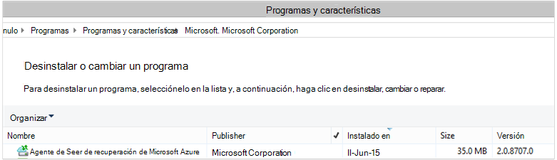

<properties
    pageTitle="Implementar y administrar la copia de seguridad de Windows de servidor y cliente con PowerShell | Microsoft Azure"
    description="Aprenda a implementar y administrar la copia de seguridad de Azure con PowerShell"
    services="backup"
    documentationCenter=""
    authors="saurabhsensharma"
    manager="shivamg"
    editor=""/>

<tags
    ms.service="backup"
    ms.workload="storage-backup-recovery"
    ms.tgt_pltfrm="na"
    ms.devlang="na"
    ms.topic="article"
    ms.date="09/01/2016"
    ms.author="saurabhsensharma;markgal;jimpark;nkolli;trinadhk"/>


# <a name="deploy-and-manage-backup-to-azure-for-windows-serverwindows-client-using-powershell"></a>Implementar y administrar la copia de seguridad de cliente Server o Windows Azure para Windows con PowerShell

> [AZURE.SELECTOR]
- [ARM](backup-client-automation.md)
- [Clásico](backup-client-automation-classic.md)

Este artículo le muestra cómo usar PowerShell para configurar Azure copia de seguridad en Windows Server o un cliente de Windows y administrar la copia de seguridad y recuperación.

## <a name="install-azure-powershell"></a>Instale PowerShell Azure

[AZURE.INCLUDE [learn-about-deployment-models](../../includes/learn-about-deployment-models-include.md)]

En octubre de 2015, se publicó Azure PowerShell 1.0. Esta versión se realizó correctamente la 0.9.8 suelte y poner sobre algunos cambios significativos, especialmente en el patrón de nomenclatura de los cmdlets. cmdlets de 1,0 siga el patrón de nomenclatura {verbo}-AzureRm {sustantivo;} mientras que la 0.9.8 nombres no incluyen **Rm** (por ejemplo, New-AzureRmResourceGroup en lugar de nuevo AzureResourceGroup). Cuando se usa PowerShell Azure 0.9.8, primero debe habilitar el modo de administrador de recursos, ejecute el comando **Cambiar AzureMode AzureResourceManager** . Este comando no es necesario en 1.0 o posterior.

Si desea utilizar secuencias de comandos escritas para la 0.9.8 entorno, en el entorno 1.0 o posterior, debe probarlo detenidamente las secuencias de comandos en un entorno de producción preliminar antes de utilizar en producción para evitar el impacto inesperado.

[Descargue la última versión de PowerShell](https://github.com/Azure/azure-powershell/releases) (es la versión mínima requerida: 1.0.0)


[AZURE.INCLUDE [arm-getting-setup-powershell](../../includes/arm-getting-setup-powershell.md)]


## <a name="create-a-backup-vault"></a>Crear un depósito de copia de seguridad

> [AZURE.WARNING] Los clientes con copia de seguridad de Azure por primera vez, debe registrar el proveedor de copia de seguridad de Azure para usarlo con su suscripción. Para ello, ejecute el siguiente comando: registrar AzureProvider - ProviderNamespace "Microsoft.Backup"

Puede crear un nuevo depósito de copia de seguridad mediante el cmdlet **AzureRMBackupVault de nuevo** . La copia de seguridad depósito es un recurso ARM, por lo que es necesario colocar dentro de un grupo de recursos. En una consola elevada de Azure PowerShell, ejecute los comandos siguientes:

```
PS C:\> New-AzureResourceGroup –Name “test-rg” -Region “West US”
PS C:\> $backupvault = New-AzureRMBackupVault –ResourceGroupName “test-rg” –Name “test-vault” –Region “West US” –Storage GeoRedundant
```

Use el cmdlet **Get-AzureRMBackupVault** para los depósitos en una suscripción de copia de seguridad de la lista.


## <a name="installing-the-azure-backup-agent"></a>Instalar al agente de copia de seguridad de Azure
Antes de instalar al agente de copia de seguridad de Azure, debe tener el instalador descargado y presente en el servidor de Windows. Puede obtener la última versión del instalador desde el [Centro de descarga de Microsoft](http://aka.ms/azurebackup_agent) o desde la página de panel del depósito de copia de seguridad. Guardar el instalador en una ubicación fácilmente accesible como * C:\Downloads\*.

Para instalar al agente, ejecute el comando siguiente en una consola de PowerShell con privilegios elevados:

```
PS C:\> MARSAgentInstaller.exe /q
```

El agente se instala con todas las opciones predeterminadas. La instalación tardará unos minutos en segundo plano. Si no especifica la opción */nu* se abrirá la ventana de **Windows Update** al final de la instalación para comprobar si hay actualizaciones. Una vez instalado, el agente se mostrará en la lista de programas instalados.

Para ver la lista de programas instalados, vaya a **Panel de Control** > **programas** > **programas y características**.



### <a name="installation-options"></a>Opciones de instalación

Para ver todas las opciones disponibles a través de la línea de comandos, use el siguiente comando:

```
PS C:\> MARSAgentInstaller.exe /?
```

Las opciones disponibles son:

| Opción | Detalles | Predeterminado |
| ---- | ----- | ----- |
| / q | Instalación silencioso | - |
| / p: "ubicación" | Ruta de acceso a la carpeta de instalación para el agente de copia de seguridad de Azure. | Agente de servicios de C:\Program Files\Microsoft recuperación de Azure |
| / s: "ubicación" | Ruta de acceso a la carpeta de caché para el agente de copia de seguridad de Azure. | C:\Program Files\Microsoft recuperación Azure servicios Agent\Scratch |
| /m | Participar en Microsoft Update | - |
| /Nu | No busque actualizaciones una vez completada la instalación | - |
| / d | Desinstala el agente de servicios de recuperación de Microsoft Azure | - |
| /pH | Dirección del proxy | - |
| pD | Número de puerto de Host de proxy | - |
| / pu | Nombre de usuario de Host de proxy | - |
| /pw | Contraseña de proxy | - |


## <a name="registering-with-the-azure-backup-service"></a>Registro con el servicio de copia de seguridad de Azure
Para poder registrar con el servicio de copia de seguridad de Azure, debe asegurarse de que se cumplen los [requisitos previos](backup-configure-vault.md) . Debe:

- Tiene una suscripción válida de Azure
- Tener un depósito de copia de seguridad

Para descargar las credenciales de la cámara, ejecute el cmdlet **Get-AzureRMBackupVaultCredentials** en una consola de PowerShell de Azure y guardarlo en una ubicación adecuada como * C:\Downloads\*.

```
PS C:\> $credspath = "C:\"
PS C:\> $credsfilename = Get-AzureRMBackupVaultCredentials -Vault $backupvault -TargetLocation $credspath
PS C:\> $credsfilename
f5303a0b-fae4-4cdb-b44d-0e4c032dde26_backuprg_backuprn_2015-08-11--06-22-35.VaultCredentials
```

Registrar el equipo con la cámara se realiza mediante el cmdlet [OBRegistration de inicio](https://technet.microsoft.com/library/hh770398%28v=wps.630%29.aspx) :

```
PS C:\> $cred = $credspath + $credsfilename
PS C:\> Start-OBRegistration -VaultCredentials $cred -Confirm:$false

CertThumbprint      : 7a2ef2caa2e74b6ed1222a5e89288ddad438df2
SubscriptionID      : ef4ab577-c2c0-43e4-af80-af49f485f3d1
ServiceResourceName : test-vault
Region              : West US

Machine registration succeeded.
```

> [AZURE.IMPORTANT] No use rutas de acceso relativas para especificar el archivo de credenciales de la cámara. Proporcione una ruta absoluta como entrada al cmdlet.

## <a name="networking-settings"></a>Configuración de red
Cuando la conectividad del equipo de Windows a internet es a través de un servidor proxy, la configuración de proxy también puede proporcionarse al agente. En este ejemplo, no hay ningún servidor proxy, por lo que estamos borrar explícitamente cualquier información relacionada con el servidor proxy.

También se puede controlar el uso de ancho de banda con las opciones de ```work hour bandwidth``` y ```non-work hour bandwidth``` para un conjunto determinado de días de la semana.

Definir los detalles del proxy y ancho de banda se realiza mediante el cmdlet [Set-OBMachineSetting](https://technet.microsoft.com/library/hh770409%28v=wps.630%29.aspx) :

```
PS C:\> Set-OBMachineSetting -NoProxy
Server properties updated successfully.

PS C:\> Set-OBMachineSetting -NoThrottle
Server properties updated successfully.
```

## <a name="encryption-settings"></a>Configuración de cifrado
Los datos de copia de seguridad enviados a copia de seguridad de Azure está cifrados para proteger la confidencialidad de los datos. La frase de contraseña de cifrado es la contraseña de"" descifrar los datos en el momento de restaurar.

```
PS C:\> ConvertTo-SecureString -String "Complex!123_STRING" -AsPlainText -Force | Set-OBMachineSetting
Server properties updated successfully
```

> [AZURE.IMPORTANT] Mantener la información de la frase de contraseña segura una vez que se establece. No podrá restaurar los datos de Azure sin esta frase de contraseña.

## <a name="back-up-files-and-folders"></a>Realizar copias de seguridad de los archivos y carpetas
Todas las copias de seguridad de los servidores de Windows y los clientes para copia de seguridad de Azure se rigen por una directiva. La Directiva comprende tres partes:

1. **Programación de copia de seguridad** que especifique cuándo copias de seguridad que ser tomadas y sincronizar con el servicio.
2. **Programación de retención** que especifica cuánto tiempo para conservar los puntos de recuperación de Azure.
3. **Especificación de inclusión o exclusión de archivo** que determina qué debe hacer copia.

En este documento, ya que nos estamos automatización de copia de seguridad, daremos hecho que nada se ha configurado. Crear una nueva directiva de copia de seguridad con el cmdlet [New-OBPolicy](https://technet.microsoft.com/library/hh770416.aspx) y su uso.

```
PS C:\> $newpolicy = New-OBPolicy
```

En este momento está vacía la directiva y otros cmdlets son necesitan para definir qué elementos serán incluida o excluida, cuando las copias de seguridad se ejecutará y dónde se almacenan las copias de seguridad.

### <a name="configuring-the-backup-schedule"></a>Configuración de la programación de copia de seguridad
La primera de las 3 partes de una directiva es la programación de copia de seguridad, que se crea mediante el cmdlet [OBSchedule de nuevo](https://technet.microsoft.com/library/hh770401) . La programación de copia de seguridad define cuando es necesario realizar copias de seguridad. Al crear una programación debe especificar los parámetros de entrada 2:

- **Días de la semana** que se debe ejecutar la copia de seguridad. Puede ejecutar el trabajo de copia de seguridad en un solo día o todos los días de la semana o cualquier combinación de entre.
- **Horas del día** cuándo se debe ejecutar la copia de seguridad. Puede definir hasta 3 horas diferentes del día cuando se activará la copia de seguridad.

Por ejemplo, puede configurar una directiva de copia de seguridad que se ejecute en 4 P.M. cada el sábado y el domingo.

```
PS C:\> $sched = New-OBSchedule -DaysofWeek Saturday, Sunday -TimesofDay 16:00
```

La programación de copia de seguridad debe estar asociados a una directiva y, a continuación, esto se puede lograr mediante el cmdlet [Set-OBSchedule](https://technet.microsoft.com/library/hh770407) .

```
PS C:> Set-OBSchedule -Policy $newpolicy -Schedule $sched
BackupSchedule : 4:00 PM Saturday, Sunday, Every 1 week(s) DsList : PolicyName : RetentionPolicy : State : New PolicyState : Valid
```
### <a name="configuring-a-retention-policy"></a>Configuración de una directiva de retención
La directiva de retención define cuánto tiempo se conservan los puntos de recuperación creados a partir de los trabajos de copia de seguridad. Al crear una nueva directiva de retención mediante el cmdlet [New-OBRetentionPolicy](https://technet.microsoft.com/library/hh770425) , puede especificar el número de días que deben conservarse con copia de seguridad de Azure los puntos de recuperación de copia de seguridad. El ejemplo siguiente establece una directiva de retención de 7 días.

```
PS C:\> $retentionpolicy = New-OBRetentionPolicy -RetentionDays 7
```

La directiva de retención debe estar asociada con la directiva principal mediante el cmdlet [Set-OBRetentionPolicy](https://technet.microsoft.com/library/hh770405):

```
PS C:\> Set-OBRetentionPolicy -Policy $newpolicy -RetentionPolicy $retentionpolicy

BackupSchedule  : 4:00 PM
                  Saturday, Sunday,
                  Every 1 week(s)
DsList          :
PolicyName      :
RetentionPolicy : Retention Days : 7

                  WeeklyLTRSchedule :
                  Weekly schedule is not set

                  MonthlyLTRSchedule :
                  Monthly schedule is not set

                  YearlyLTRSchedule :
                  Yearly schedule is not set

State           : New
PolicyState     : Valid
```
### <a name="including-and-excluding-files-to-be-backed-up"></a>Incluir y excluir los archivos de copia de seguridad
Un ```OBFileSpec``` objeto define los archivos para que desea incluir y excluir en una copia de seguridad. Se trata de un conjunto de reglas de ámbito de los archivos protegidos y carpetas en un equipo. Puede tener como muchos archivos de reglas de inclusión o exclusión según sea necesario y asociarlos con una directiva. Al crear un nuevo objeto OBFileSpec, puede:

- Especificar los archivos y carpetas que se incluirán
- Especificar los archivos y carpetas que se deben excluir
- Especificar recursiva copia de seguridad de datos en una carpeta, o bien si se deben copiar únicamente los archivos de nivel superior en la carpeta especificada.

Este último se logra mediante el indicador de no - recursivo en el comando OBFileSpec de nuevo.

En el ejemplo siguiente, se deberá realizar una copia de volumen C: y D: y excluir los archivos binarios de sistema operativo en la carpeta de Windows y las carpetas temporales. Para ello, vamos a crear dos especificaciones mediante el cmdlet [New-OBFileSpec](https://technet.microsoft.com/library/hh770408) - uno para su inclusión de archivos y otro para exclusiones. Una vez que se han creado las especificaciones de archivo, se asocian con la directiva mediante el cmdlet [Add-OBFileSpec](https://technet.microsoft.com/library/hh770424) .

```
PS C:\> $inclusions = New-OBFileSpec -FileSpec @("C:\", "D:\")

PS C:\> $exclusions = New-OBFileSpec -FileSpec @("C:\windows", "C:\temp") -Exclude

PS C:\> Add-OBFileSpec -Policy $newpolicy -FileSpec $inclusions

BackupSchedule  : 4:00 PM
                  Saturday, Sunday,
                  Every 1 week(s)
DsList          : {DataSource
                  DatasourceId:0
                  Name:C:\
                  FileSpec:FileSpec
                  FileSpec:C:\
                  IsExclude:False
                  IsRecursive:True

                  , DataSource
                  DatasourceId:0
                  Name:D:\
                  FileSpec:FileSpec
                  FileSpec:D:\
                  IsExclude:False
                  IsRecursive:True

                  }
PolicyName      :
RetentionPolicy : Retention Days : 7

                  WeeklyLTRSchedule :
                  Weekly schedule is not set

                  MonthlyLTRSchedule :
                  Monthly schedule is not set

                  YearlyLTRSchedule :
                  Yearly schedule is not set

State           : New
PolicyState     : Valid


PS C:\> Add-OBFileSpec -Policy $newpolicy -FileSpec $exclusions

BackupSchedule  : 4:00 PM
                  Saturday, Sunday,
                  Every 1 week(s)
DsList          : {DataSource
                  DatasourceId:0
                  Name:C:\
                  FileSpec:FileSpec
                  FileSpec:C:\
                  IsExclude:False
                  IsRecursive:True
                  ,FileSpec
                  FileSpec:C:\windows
                  IsExclude:True
                  IsRecursive:True
                  ,FileSpec
                  FileSpec:C:\temp
                  IsExclude:True
                  IsRecursive:True

                  , DataSource
                  DatasourceId:0
                  Name:D:\
                  FileSpec:FileSpec
                  FileSpec:D:\
                  IsExclude:False
                  IsRecursive:True

                  }
PolicyName      :
RetentionPolicy : Retention Days : 7

                  WeeklyLTRSchedule :
                  Weekly schedule is not set

                  MonthlyLTRSchedule :
                  Monthly schedule is not set

                  YearlyLTRSchedule :
                  Yearly schedule is not set

State           : New
PolicyState     : Valid
```

### <a name="applying-the-policy"></a>Aplicar la directiva
Ahora el objeto de directiva está finalizado y tiene una programación de copia de seguridad asociada, directiva de retención y una lista de inclusión o exclusión de archivos. Ahora se puede confirmar de copia de seguridad de Azure Utilice esta directiva. Antes de aplicar la directiva recién creada Asegúrese de que no hay ninguna directiva de copia de seguridad existente asociada con el servidor mediante el cmdlet [OBPolicy quitar](https://technet.microsoft.com/library/hh770415) . Quitar la directiva se mostrará un mensaje de confirmación. Omitir el uso de confirmación la ```-Confirm:$false``` marca con el cmdlet.

```
PS C:> Get-OBPolicy | Remove-OBPolicy
Microsoft Azure Backup Are you sure you want to remove this backup policy? This will delete all the backed up data. [Y] Yes [A] Yes to All [N] No [L] No to All [S] Suspend [?] Help (default is "Y"):
```

Confirmar el objeto de directiva se realiza mediante el cmdlet [Set-OBPolicy](https://technet.microsoft.com/library/hh770421) . Esto le pide confirmación. Omitir el uso de confirmación la ```-Confirm:$false``` marca con el cmdlet.

```
PS C:> Set-OBPolicy -Policy $newpolicy
Microsoft Azure Backup Do you want to save this backup policy ? [Y] Yes [A] Yes to All [N] No [L] No to All [S] Suspend [?] Help (default is "Y"):
BackupSchedule : 4:00 PM Saturday, Sunday, Every 1 week(s)
DsList : {DataSource
         DatasourceId:4508156004108672185
         Name:C:\
         FileSpec:FileSpec
         FileSpec:C:\
         IsExclude:False
         IsRecursive:True,

         FileSpec
         FileSpec:C:\windows
         IsExclude:True
         IsRecursive:True,

         FileSpec
         FileSpec:C:\temp
         IsExclude:True
         IsRecursive:True,

         DataSource
         DatasourceId:4508156005178868542
         Name:D:\
         FileSpec:FileSpec
         FileSpec:D:\
         IsExclude:False
         IsRecursive:True
    }
PolicyName : c2eb6568-8a06-49f4-a20e-3019ae411bac
RetentionPolicy : Retention Days : 7
              WeeklyLTRSchedule :
              Weekly schedule is not set

              MonthlyLTRSchedule :
              Monthly schedule is not set

              YearlyLTRSchedule :
              Yearly schedule is not set
State : Existing PolicyState : Valid
```

Puede ver los detalles de la directiva de copia de seguridad existente mediante el cmdlet [Get-OBPolicy](https://technet.microsoft.com/library/hh770406) . Puede explorar en profundidad con aún más el cmdlet [Get-OBSchedule](https://technet.microsoft.com/library/hh770423) para la programación de copia de seguridad y el cmdlet [Get-OBRetentionPolicy](https://technet.microsoft.com/library/hh770427) para las directivas de retención

```
PS C:> Get-OBPolicy | Get-OBSchedule
SchedulePolicyName : 71944081-9950-4f7e-841d-32f0a0a1359a
ScheduleRunDays : {Saturday, Sunday}
ScheduleRunTimes : {16:00:00}
State : Existing

PS C:> Get-OBPolicy | Get-OBRetentionPolicy
RetentionDays : 7
RetentionPolicyName : ca3574ec-8331-46fd-a605-c01743a5265e
State : Existing

PS C:> Get-OBPolicy | Get-OBFileSpec
FileName : *
FilePath : \?\Volume{b835d359-a1dd-11e2-be72-2016d8d89f0f}\
FileSpec : D:\
IsExclude : False
IsRecursive : True

FileName : *
FilePath : \?\Volume{cdd41007-a22f-11e2-be6c-806e6f6e6963}\
FileSpec : C:\
IsExclude : False
IsRecursive : True

FileName : *
FilePath : \?\Volume{cdd41007-a22f-11e2-be6c-806e6f6e6963}\windows
FileSpec : C:\windows
IsExclude : True
IsRecursive : True

FileName : *
FilePath : \?\Volume{cdd41007-a22f-11e2-be6c-806e6f6e6963}\temp
FileSpec : C:\temp
IsExclude : True
IsRecursive : True
```

### <a name="performing-an-ad-hoc-backup"></a>Realizar una copia de seguridad de ad hoc
Una vez establecida una directiva de copia de seguridad las copias de seguridad se producirán por la programación. Desencadenar una copia de seguridad de ad hoc también es posible mediante el cmdlet [OBBackup de inicio](https://technet.microsoft.com/library/hh770426) :

```
PS C:> Get-OBPolicy | Start-OBBackup
Taking snapshot of volumes...
Preparing storage...
Estimating size of backup items...
Estimating size of backup items...
Transferring data...
Verifying backup...
Job completed.
The backup operation completed successfully.
```

## <a name="restore-data-from-azure-backup"></a>Restaurar los datos de copia de seguridad de Azure
Esta sección le guiará por los pasos necesarios para automatizar la recuperación de datos de copia de seguridad de Azure. Hacerlo implica los siguientes pasos:

1. Seleccione el volumen de origen
2. Elija un punto para restaurar una copia de seguridad
3. Elija un elemento para restaurar
4. Desencadenar el proceso de restauración

### <a name="picking-the-source-volume"></a>Elegir el volumen de origen
Para restaurar un elemento de la copia de seguridad de Azure, debe identificar el origen del elemento. Puesto que los comandos se ejecuta en el contexto de un servidor de Windows o un cliente de Windows, ya se identifica el equipo. El siguiente paso para identificar el origen es identificar el volumen que lo contiene. Una lista de orígenes de copia de seguridad de este equipo o volúmenes se puede recuperar, ejecute el cmdlet [Get-OBRecoverableSource](https://technet.microsoft.com/library/hh770410) . Este comando devuelve una matriz de todos los orígenes de copia de seguridad de este servidor y cliente.

```
PS C:> $source = Get-OBRecoverableSource
PS C:> $source
FriendlyName : C:\
RecoverySourceName : C:\
ServerName : myserver.microsoft.com

FriendlyName : D:\
RecoverySourceName : D:\
ServerName : myserver.microsoft.com
```

### <a name="choosing-a-backup-point-to-restore"></a>Elegir un punto de copia de seguridad para restaurar
La lista de puntos de copia de seguridad se puede recuperar, ejecute el cmdlet [Get-OBRecoverableItem](https://technet.microsoft.com/library/hh770399.aspx) con parámetros adecuados. En nuestro ejemplo, hemos deberá elegir el punto de copia de seguridad más reciente para el volumen de origen *D:* y usarlo para recuperar archivos específicos.

```
PS C:> $rps = Get-OBRecoverableItem -Source $source[1]
IsDir : False
ItemNameFriendly : D:\
ItemNameGuid : \?\Volume{b835d359-a1dd-11e2-be72-2016d8d89f0f}\
LocalMountPoint : D:\
MountPointName : D:\
Name : D:\
PointInTime : 18-Jun-15 6:41:52 AM
ServerName : myserver.microsoft.com
ItemSize :
ItemLastModifiedTime :

IsDir : False
ItemNameFriendly : D:\
ItemNameGuid : \?\Volume{b835d359-a1dd-11e2-be72-2016d8d89f0f}\
LocalMountPoint : D:\
MountPointName : D:\
Name : D:\
PointInTime : 17-Jun-15 6:31:31 AM
ServerName : myserver.microsoft.com
ItemSize :
ItemLastModifiedTime :
```
El objeto ```$rps``` es una matriz de puntos de copia de seguridad. El primer elemento es el último punto y elemento n es el punto más antiguo. Para elegir el punto más reciente, usaremos ```$rps[0]```.

### <a name="choosing-an-item-to-restore"></a>Elección de un elemento para restaurar
Para identificar el exacto del archivo o carpeta que desea restaurar, recursiva use el cmdlet [Get-OBRecoverableItem](https://technet.microsoft.com/library/hh770399.aspx) . De esta forma puede explorar la jerarquía de carpetas únicamente con los ```Get-OBRecoverableItem```.

En este ejemplo, si desea restaurar el archivo *finances.xls* se pueda hacer referencia que mediante el objeto ```$filesFolders[1]```.

```
PS C:> $filesFolders = Get-OBRecoverableItem $rps[0]
PS C:> $filesFolders
IsDir : True
ItemNameFriendly : D:\MyData\
ItemNameGuid : \?\Volume{b835d359-a1dd-11e2-be72-2016d8d89f0f}\MyData\
LocalMountPoint : D:\
MountPointName : D:\
Name : MyData
PointInTime : 18-Jun-15 6:41:52 AM
ServerName : myserver.microsoft.com
ItemSize :
ItemLastModifiedTime : 15-Jun-15 8:49:29 AM

PS C:> $filesFolders = Get-OBRecoverableItem $filesFolders[0]
PS C:> $filesFolders
IsDir : False
ItemNameFriendly : D:\MyData\screenshot.oxps
ItemNameGuid : \?\Volume{b835d359-a1dd-11e2-be72-2016d8d89f0f}\MyData\screenshot.oxps
LocalMountPoint : D:\
MountPointName : D:\
Name : screenshot.oxps
PointInTime : 18-Jun-15 6:41:52 AM
ServerName : myserver.microsoft.com
ItemSize : 228313
ItemLastModifiedTime : 21-Jun-14 6:45:09 AM

IsDir : False
ItemNameFriendly : D:\MyData\finances.xls
ItemNameGuid : \?\Volume{b835d359-a1dd-11e2-be72-2016d8d89f0f}\MyData\finances.xls
LocalMountPoint : D:\
MountPointName : D:\
Name : finances.xls
PointInTime : 18-Jun-15 6:41:52 AM
ServerName : myserver.microsoft.com
ItemSize : 96256
ItemLastModifiedTime : 21-Jun-14 6:43:02 AM
```

También puede buscar elementos que desea restaurar el uso de la ```Get-OBRecoverableItem``` cmdlet. En nuestro ejemplo, para buscar *finances.xls* podríamos obtenemos un controlador en el archivo al ejecutar este comando:

```
PS C:\> $item = Get-OBRecoverableItem -RecoveryPoint $rps[0] -Location "D:\MyData" -SearchString "finance*"
```

### <a name="triggering-the-restore-process"></a>Activar el proceso de restauración
Para desencadenar el proceso de restauración, debemos especificar las opciones de recuperación. Esto puede hacerse mediante el cmdlet [OBRecoveryOption de nuevo](https://technet.microsoft.com/library/hh770417.aspx) . En este ejemplo, supongamos que desea restaurar los archivos a *C:\temp*. Supongamos también que deseamos omitir archivos que ya existen en la carpeta de destino *C:\temp*. Para crear una opción de recuperación, utilice el siguiente comando:

```
PS C:\> $recovery_option = New-OBRecoveryOption -DestinationPath "C:\temp" -OverwriteType Skip
```

Ahora desencadenar restaurar mediante el comando de [Inicio OBRecovery](https://technet.microsoft.com/library/hh770402.aspx) en seleccionado ```$item``` de los resultados de la ```Get-OBRecoverableItem``` cmdlet:

```
PS C:\> Start-OBRecovery -RecoverableItem $item -RecoveryOption $recover_option
Estimating size of backup items...
Estimating size of backup items...
Estimating size of backup items...
Estimating size of backup items...
Job completed.
The recovery operation completed successfully.
```


## <a name="uninstalling-the-azure-backup-agent"></a>Desinstalar al agente de copia de seguridad de Azure
Desinstalar al agente de copia de seguridad de Azure puede hacerse mediante el comando siguiente:

```
PS C:\> .\MARSAgentInstaller.exe /d /q
```

Desinstalación de los archivos binarios de agente desde el equipo tiene algunas consecuencias para tener en cuenta:

- Se quita el filtro de archivos desde el equipo y, a continuación, se detiene el seguimiento de cambios.
- Toda la información de directiva se quita de la máquina, pero la información de directiva continuará estando almacenado en el servicio.
- Se quitan todos los planes de copia de seguridad y, a continuación, no se toman más copias de seguridad.

Sin embargo, los datos almacenan en Azure permanece y se mantienen según la configuración de directiva de retención por usted. Puntos antiguos automáticamente vencen.

## <a name="remote-management"></a>Administración remota
Toda la administración con el agente de copia de seguridad de Azure, directivas y orígenes de datos puede realizarse de forma remota a través de PowerShell. El equipo que se administrará de forma remota debe estar preparado correctamente.

De forma predeterminada, el servicio WinRM está configurado para el inicio manual. Debe establecerse el tipo de inicio a *automático* y se debe iniciar el servicio. Para comprobar que se está ejecutando el servicio WinRM, el valor de la propiedad Status debe ser *ejecutando*.

```
PS C:\> Get-Service WinRM

Status   Name               DisplayName
------   ----               -----------
Running  winrm              Windows Remote Management (WS-Manag...
```

PowerShell debe estar configurado para acceso remoto.

```
PS C:\> Enable-PSRemoting -force
WinRM is already set up to receive requests on this computer.
WinRM has been updated for remote management.
WinRM firewall exception enabled.

PS C:\> Set-ExecutionPolicy unrestricted -force
```

El equipo ahora se puede administrar de forma remota - empezando desde la instalación del agente. Por ejemplo, la siguiente secuencia de comandos copiará al agente en el equipo remoto y lo instala.

```
PS C:\> $dloc = "\\REMOTESERVER01\c$\Windows\Temp"
PS C:\> $agent = "\\REMOTESERVER01\c$\Windows\Temp\MARSAgentInstaller.exe"
PS C:\> $args = "/q"
PS C:\> Copy-Item "C:\Downloads\MARSAgentInstaller.exe" -Destination $dloc - force

PS C:\> $s = New-PSSession -ComputerName REMOTESERVER01
PS C:\> Invoke-Command -Session $s -Script { param($d, $a) Start-Process -FilePath $d $a -Wait } -ArgumentList $agent $args
```

## <a name="next-steps"></a>Pasos siguientes
Para obtener más información acerca de, consulte Azure copia de seguridad de Windows de servidor y cliente

- [Introducción a la copia de seguridad de Azure](backup-introduction-to-azure-backup.md)
- [Realizar copias de seguridad de los servidores de Windows](backup-configure-vault.md)
