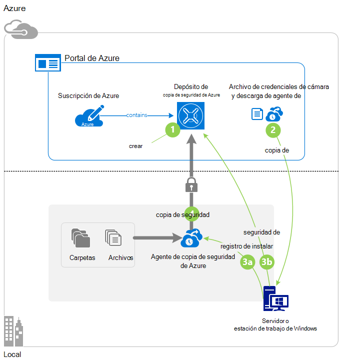
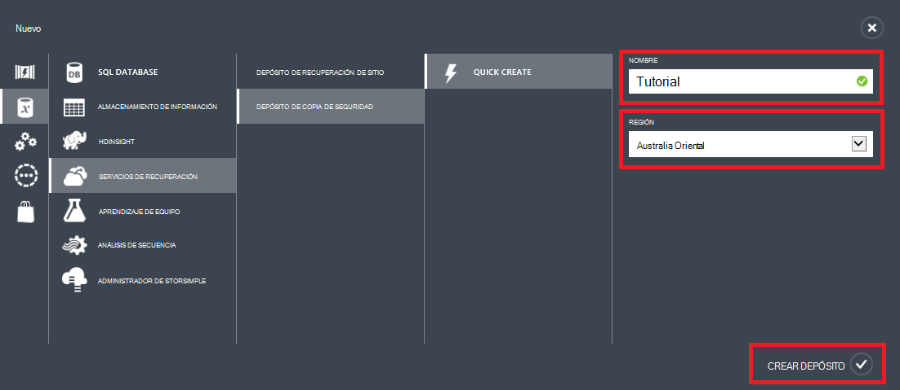
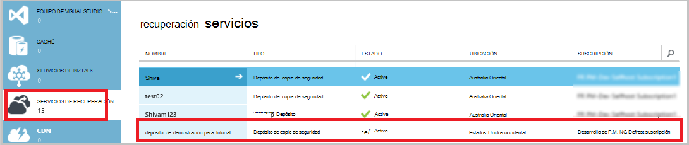
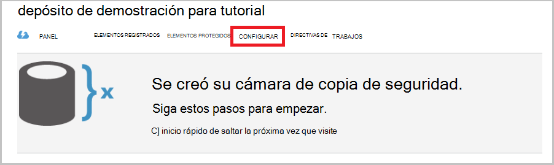
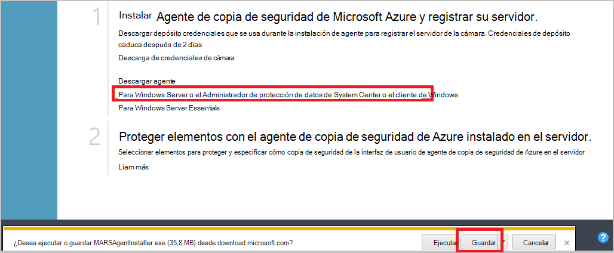
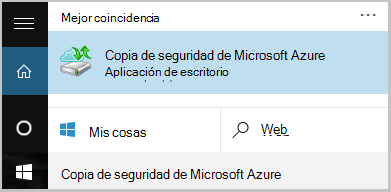
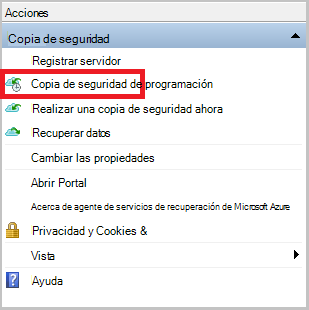
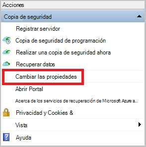
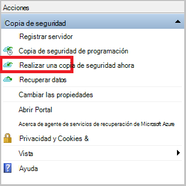
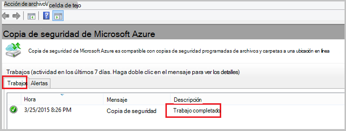

<properties
    pageTitle="Copia de seguridad de Windows server o cliente que utiliza el modelo de implementación clásico de Azure | Microsoft Azure"
    description="Copia de seguridad de los servidores de Windows o clientes a Azure por crear un depósito de copia de seguridad, descargando credenciales, instalar al agente de copia de seguridad y realizar una copia de seguridad inicial de los archivos y carpetas."
    services="backup"
    documentationCenter=""
    authors="markgalioto"
    manager="cfreeman"
    editor=""
    keywords="copia de seguridad depósito; realizar copias de seguridad de Windows server; copia de seguridad windows;"/>

<tags
    ms.service="backup"
    ms.workload="storage-backup-recovery"
    ms.tgt_pltfrm="na"
    ms.devlang="na"
    ms.topic="article"
    ms.date="08/08/2016"
    ms.author="jimpark; trinadhk; markgal"/>

# Copia de seguridad de Windows server o cliente en Azure utiliza el modelo de implementación clásica

> [AZURE.SELECTOR]
- [Portal clásica](backup-configure-vault-classic.md)
- [Portal de Azure](backup-configure-vault.md)

En este artículo se trata los procedimientos que debe seguir para preparar el entorno y realizar copias de seguridad de Windows server (o cliente) a Azure. También se tratan consideraciones para implementar la solución de copia de seguridad. Si está interesado en probar la copia de seguridad de Azure por primera vez, este artículo le guiará rápidamente por el proceso.

>[AZURE.IMPORTANT] Azure tiene dos diferentes modelos de implementación para crear y trabajar con recursos: Administrador de recursos y clásica. En este artículo trata sobre utiliza el modelo de implementación clásico. Microsoft recomienda que más nuevas implementaciones de usar el modelo de administrador de recursos.

## Antes de empezar
Para hacer una copia de un servidor o cliente Azure, necesita una cuenta de Azure. Si no tiene una, puede crear una [cuenta gratuita](https://azure.microsoft.com/free/) de dos minutos.

## Paso 1: Crear un depósito de copia de seguridad
Para la copia de seguridad de los archivos y carpetas de un servidor o cliente, debe crear un depósito de copia de seguridad en la región geográfica donde desee almacenar los datos.

### Para crear un depósito de copia de seguridad

1. Inicie sesión en [el portal de clásico](https://manage.windowsazure.com/).

2. Haga clic en **nuevo** > **Data Services** > **Servicios de recuperación** > **Depósito de copia de seguridad**y, a continuación, elija **Crear rápido**.

3. Para el parámetro **nombre** , escriba un nombre descriptivo para el depósito de copia de seguridad. Escriba un nombre que contenga entre 2 y 50 caracteres. Debe comenzar con una letra y puede contener sólo letras, números y guiones. Este nombre debe ser único para cada suscripción.

4. Para el parámetro de **región** , seleccione la región geográfica para el depósito de copia de seguridad. Esta opción determina la región geográfica donde se envían los datos de copia de seguridad. Seleccionando una región geográfica que está cerca de su ubicación, puede reducir la latencia de red cuando una copia de seguridad en Azure.

5. Haga clic en **Crear depósito**.

    

    Puede pasar un tiempo para la copia de seguridad depósito que debe crearse. Para comprobar el estado, supervisar las notificaciones en la parte inferior del portal clásico.

    Una vez creado el depósito de copia de seguridad, verá un mensaje que indica que la cámara se ha creado correctamente. También aparece como **activo** en la lista de recursos de **Servicios de recuperación** .

    

4. Seleccione la opción de redundancia de almacenamiento siguiendo los pasos que se describen aquí.

    >[AZURE.IMPORTANT] El mejor momento para identificar su opción de redundancia de almacenamiento es justo después de la creación de cámara y antes de que los equipos están registrados para la cámara. Después de que se ha registrado un elemento a la cámara, la opción de redundancia de almacenamiento está bloqueada y no se puede modificar.

    Si está utilizando Azure como un extremo de almacenamiento de copia de seguridad principal (por ejemplo, copia de seguridad en Azure desde un servidor de Windows), considere la posibilidad de opción de [almacenamiento geo redundantes](../storage/storage-redundancy.md#geo-redundant-storage) de selección (opción predeterminada).

    Si está utilizando Azure como un extremo de almacenamiento de copia de seguridad de tercer (por ejemplo, se usa Administrador de protección de datos de System Center para almacenar una copia de seguridad local local y uso de Azure para necesidades de retención a largo plazo), considere la posibilidad de elegir [almacenamiento redundante local](../storage/storage-redundancy.md#locally-redundant-storage). Esto incorpora el coste de almacenar los datos en Azure, al tiempo que proporciona un nivel inferior de duración para los datos que podrían ser aceptables para el tercer copias.

    **Para seleccionar la opción de redundancia de almacenamiento:**

    una. Haga clic en la cámara que acaba de crear.

    b. En la página de inicio rápido, seleccione **Configurar**.

    

    c. Elija la opción de redundancia de almacenamiento apropiado.

    Si selecciona **Redundante local**, debe (porque **Geo redundantes** es la opción predeterminada), haga clic en **Guardar** .

    d. En el panel de navegación izquierdo, haga clic en **Servicios de recuperación** para volver a la lista de recursos para los servicios de recuperación.

## Paso 2: Descargar el archivo de credenciales de cámara
El equipo local debe ser autenticado con un depósito de copia de seguridad antes de que puede copiar los datos en Azure. La autenticación se logra mediante *las credenciales de la cámara*. El archivo de credenciales de la cámara se descargará a través de un canal seguro desde el portal de clásico. La clave privada no se conserva en el portal o el servicio.

Más información sobre el [uso de depósito credenciales para autenticar con el servicio de copia de seguridad](backup-introduction-to-azure-backup.md#what-is-the-vault-credential-file).

### Para descargar el archivo de credenciales de la cámara en un equipo local

1. En el panel de navegación izquierdo, haga clic en **Servicios de recuperación**y, a continuación, seleccione el depósito de copia de seguridad que ha creado.

    

2.  En la página de inicio rápido, haga clic en **credenciales de descarga depósito**.

    El portal clásico genera una credencial de cámara mediante una combinación de nombre de la cámara y la fecha actual. El archivo de credenciales de la cámara se utiliza solo durante el flujo de trabajo de registro y caduca después de 48 horas.

    El archivo de credenciales de cámara puede descargarse desde el portal.

3. Haga clic en **Guardar** para descargar el archivo de credenciales de la cámara a la carpeta de descargas de la cuenta local. También puede seleccionar **Guardar como** en el menú **Guardar** para especificar una ubicación para el archivo de credenciales de la cámara.

    >[AZURE.NOTE] Asegúrese de que el archivo de credenciales de la cámara se guarda en una ubicación que se puede acceder desde su equipo. Si está almacenado en un bloque de mensaje de servidor o recurso compartido de archivos, compruebe que tiene los permisos para tener acceso a él.

## Paso 3: Descargar, instalar y registrar al agente de copia de seguridad
Después de crear el depósito de copia de seguridad y descargar el archivo de credenciales de cámara, debe estar instalado un agente en cada uno de los equipos de Windows.

### Para descargar, instalar y registrar el agente

1. Haga clic en **Servicios de recuperación**y, a continuación, seleccione el almacén de copia de seguridad que desea registrar con un servidor.

2. En la página de inicio rápido, haga clic en el agente de **agente de Windows Server o el Administrador de protección de datos de System Center o el cliente de Windows**. A continuación, haga clic en **Guardar**.

    

3. Una vez que haya descargado el archivo MARSagentinstaller.exe, haga clic en **Ejecutar** (o haga doble clic en **MARSAgentInstaller.exe** desde la ubicación guardada).

4. Elija la carpeta de instalación y la carpeta de caché necesarios para el agente de y, a continuación, haga clic en **siguiente**. La ubicación en caché que especifique debe tener espacio libre al menos un 5 por ciento de los datos de copia de seguridad.

5. Puede continuar para conectarse a Internet a través de la configuración de proxy de forma predeterminada.          Si usa un servidor proxy para conectarse a Internet, en la página Configuración de Proxy, active la casilla de verificación **Usar configuración de proxy personalizada** y, a continuación, escriba los detalles del servidor proxy. Si utiliza a un proxy autenticado, escriba los detalles de nombre y contraseña de usuario y, a continuación, haga clic en **siguiente**.

7. Haga clic en **instalar** para comenzar la instalación de agente. El agente de copia de seguridad instala .NET Framework 4.5 y Windows PowerShell (si aún no está instalado) para completar la instalación.

8. Una vez instalado el agente, haga clic en **Continuar para el registro** para continuar con el flujo de trabajo.

9. En la página de identificación de cámara, busque y seleccione el archivo de credenciales de la cámara que ha descargado anteriormente.

    El archivo de credenciales de depósito es válido sólo 48 horas después de descargarlo desde el portal. Si se produce un error en esta página (por ejemplo, "depósito credenciales archivo proporcionado ha expirado"), inicie sesión en el portal y descargar de nuevo el archivo de credenciales de la cámara.

    Asegúrese de que el archivo de credenciales de la cámara está disponible en una ubicación que puede tener acceso a la aplicación de configuración. Si se producen errores relacionados con el acceso, copie el archivo de credenciales de la cámara a una ubicación temporal en el mismo equipo y vuelva a intentar la operación.

    Si se produce un error de credenciales de depósito como "no válidos depósito credenciales proporcionadas", el archivo está dañado o no tienen las últimas credenciales asociadas con el servicio de recuperación. Reintentar la operación después de descargar un nuevo archivo de credenciales de depósito desde el portal. Este error también puede ocurrir si el usuario hace clic en la opción de **credenciales de descarga depósito** varias veces seguidas rápido. En este caso, solo el último archivo de credenciales de depósito es válido.

9. En la página Configuración de cifrado, puede generar una frase de contraseña o proporcione una frase de contraseña (con un mínimo de 16 caracteres). Recuerde guardar la frase de contraseña en una ubicación segura.

10. Haga clic en **Finalizar**. El Asistente para registrar servidor registra el servidor con copia de seguridad.

    >[AZURE.WARNING] Si olvida o pierde la contraseña, Microsoft no puede ayudarle a recuperar los datos de copia de seguridad. Usted es propietario de la frase de contraseña de cifrado y Microsoft no tiene visibilidad en la frase de contraseña que usa. Guarde el archivo en una ubicación segura porque será necesario durante una operación de recuperación.

11. Después de establece la clave de cifrado, deje activada la casilla de verificación **Agente de servicios de recuperación de inicio Microsoft Azure** y, a continuación, haga clic en **Cerrar**.

## Paso 4: Completar la copia de seguridad inicial

La copia de seguridad inicial incluye dos tareas clave:

- Crear la programación de copia de seguridad
- Copia de seguridad de los archivos y carpetas por primera vez

Después de la directiva de copia de seguridad Complete la copia de seguridad inicial, crea una copia de seguridad de destino que puede usar si necesita recuperar los datos. La directiva de copia de seguridad para ello en función de la programación que defina.

### Para programar la copia de seguridad

1. Abra al agente de copia de seguridad de Microsoft Azure. (Se abrirá automáticamente si deja la casilla de verificación **Agente de servicios de recuperación de inicio Microsoft Azure** seleccionada cuando se cierra el Asistente para registrar servidor.) Puede encontrarlo buscando en el equipo de **Copia de seguridad de Microsoft Azure**.

    

2. En el agente de copia de seguridad, haga clic en **Programar copia de seguridad**.

    

3. En la página de introducción del Asistente para programación de copia de seguridad, haga clic en **siguiente**.

4. En la seleccionar elementos a la página de copia de seguridad, haga clic en **Agregar elementos**.

5. Seleccione los archivos y carpetas que desea hacer copia de seguridad y, a continuación, haga clic en **Aceptar**.

6. Haga clic en **siguiente**.

7. En la página **Especificar programación de copia de seguridad** , especifique la **programación de copia de seguridad** y haga clic en **siguiente**.

    Puede programar diaria (a una velocidad máxima de tres veces por día) o copias de seguridad semanales.

    

    >[AZURE.NOTE] Para obtener más información sobre cómo especificar la programación de copia de seguridad, vea el artículo [Usar Azure una copia de seguridad para reemplazar la infraestructura de la cinta](backup-azure-backup-cloud-as-tape.md).

8. En la página **Seleccionar directiva de retención** , seleccione la **Directiva de retención** para la copia de seguridad.

    La directiva de retención especifica la duración que se almacenará la copia de seguridad. En lugar de especificar simplemente "directiva plana" para todos los puntos de copia de seguridad, puede especificar distintas directivas de retención en función de cuándo se produce la copia de seguridad. Puede modificar las directivas de retención diaria, semanal, mensual y anual para satisfacer sus necesidades.

9. En la página Elegir tipo de copia de seguridad inicial, elija el tipo de copia de seguridad inicial. Deje la opción **automáticamente a través de la red** seleccionada y, a continuación, haga clic en **siguiente**.

    Puede hacer una copia automáticamente en la red o puede realizar una copia sin conexión. El resto de este artículo describe el proceso de copia de seguridad automáticamente. Si prefiere hacer una copia de seguridad sin conexión, revise el artículo de [flujo de trabajo de copia de seguridad sin conexión de copia de seguridad de Azure](backup-azure-backup-import-export.md) para obtener información adicional.

10. En la página de confirmación, revise la información y, a continuación, haga clic en **Finalizar**.

11. Cuando finalice el Asistente para crear la programación de copia de seguridad, haga clic en **Cerrar**.

### Habilitar el límite de red (opcional)

El agente de copia de seguridad proporciona el límite de red. Límite de controles de cómo se usa el ancho de banda durante la transferencia de datos. Este control puede ser útil si necesita hacer una copia de los datos durante horas de trabajo pero no desea que el proceso de copia de seguridad para interferir con otro tráfico de Internet. Limitación se aplica para realizar copias de seguridad y restaurar las actividades.

**Habilitar el límite de red**

1. En el agente de copia de seguridad, haga clic en **Cambiar las propiedades**.

    

2. En la pestaña **regulación** , active la casilla de verificación **Habilitar límite para operaciones de copia de seguridad de uso de ancho de banda de internet** .

    

3. Después de habilitar la limitación, especifique el ancho de banda permitido para transferir datos de copia de seguridad durante el **horario de trabajo** y las **horas de trabajo no**.

    Los valores de ancho de banda empiezan a 512 kilobits por segundo y pueden ir hasta 1.023 megabytes por segundo (MBps). También puede designar el inicio y fin de **jornada laboral**y qué días de la semana son días de trabajo considerado. Horas fuera del trabajo designado horas se consideran no-trabajo horas.

4. Haga clic en **Aceptar**.

### Realizar una copia de seguridad ahora

1. En el agente de copia de seguridad, haga clic en **Copia de seguridad ahora** para completar la inicialización inicial a través de la red.

    

2. En la página de confirmación, revise la configuración que usará el vuelva ahora Asistente para hacer copia de seguridad del equipo. A continuación, haga clic en **Copia de seguridad**.

3. Haga clic en **Cerrar** para cerrar al asistente. Si hace esto antes de que finalice el proceso de copia de seguridad, el asistente continúa funcionando en segundo plano.

Una vez completada la copia de seguridad inicial, aparecerá el estado de **trabajo completado** en la consola de copia de seguridad.

## Pasos siguientes
- Suscríbase a una [cuenta gratuita de Azure](https://azure.microsoft.com/free/).

Para obtener información acerca de la copia de seguridad de máquinas virtuales u otras cargas de trabajo, consulte:

- [Realizar copias de seguridad IaaS VM](backup-azure-vms-prepare.md)
- [Copia de seguridad de las cargas de trabajo en Azure con el servidor de copia de seguridad de Microsoft Azure](backup-azure-microsoft-azure-backup.md)
- [Copia de seguridad de las cargas de trabajo en Azure con DPM](backup-azure-dpm-introduction.md)
