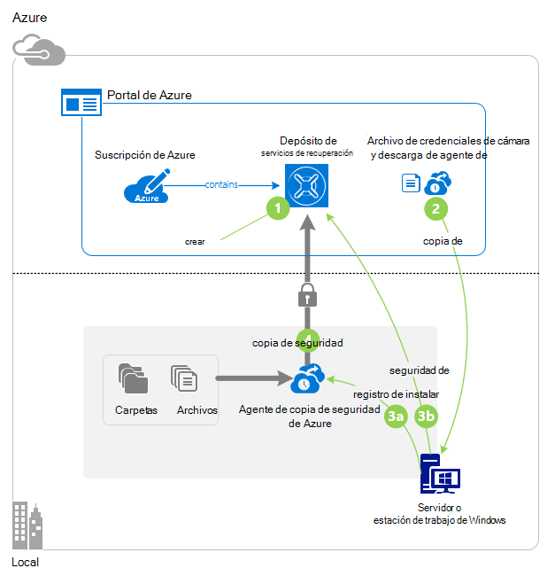
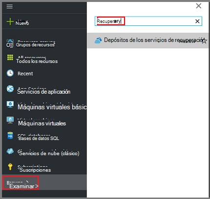
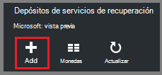
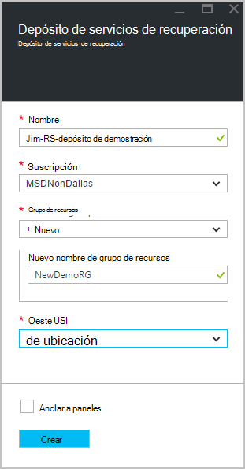
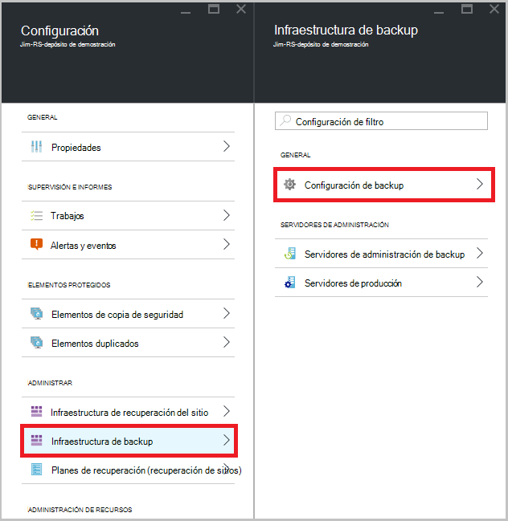
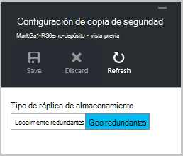
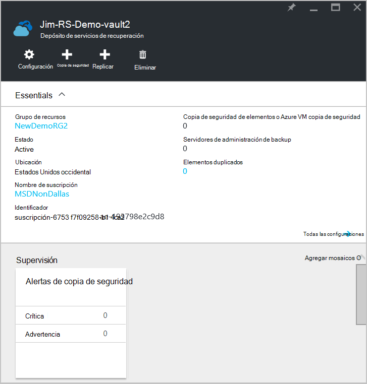
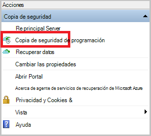
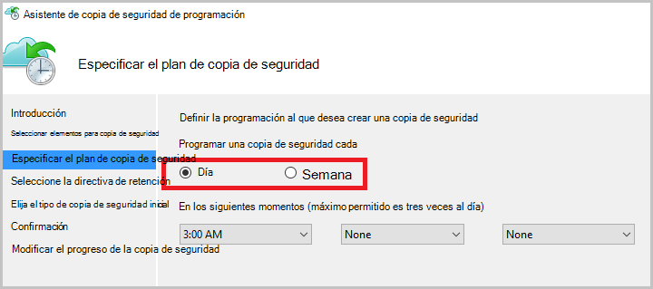

<properties
    pageTitle="Copia de seguridad de Windows Server o cliente a Azure con copia de seguridad de Azure mediante el modelo de implementación de administrador de recursos | Microsoft Azure"
    description="Copia de seguridad de los servidores de Windows o clientes a Azure por crear un depósito de copia de seguridad, descargando credenciales, instalar al agente de copia de seguridad y realizar una copia de seguridad inicial de los archivos y carpetas."
    services="backup"
    documentationCenter=""
    authors="markgalioto"
    manager="cfreeman"
    editor=""
    keywords="copia de seguridad depósito; realizar copias de seguridad de Windows server; copia de seguridad windows;"/>

<tags
    ms.service="backup"
    ms.workload="storage-backup-recovery"
    ms.tgt_pltfrm="na"
    ms.devlang="na"
    ms.topic="article"
    ms.date="08/10/2016"
    ms.author="jimpark; trinadhk; markgal"/>

# Copia de seguridad de Windows Server o cliente en Azure utiliza el modelo de implementación de administrador de recursos

> [AZURE.SELECTOR]
- [Portal de Azure](backup-configure-vault.md)
- [Portal clásica](backup-configure-vault-classic.md)

En este artículo se explica cómo hacer copia de seguridad de su servidor de Windows (o el cliente de Windows) archivos y carpetas en Azure con copia de seguridad de Azure mediante el modelo de implementación de administrador de recursos.

[AZURE.INCLUDE [learn-about-deployment-models](../../includes/backup-deployment-models.md)]

## Antes de empezar
Para hacer una copia de un servidor o cliente Azure, necesita una cuenta de Azure. Si no tiene una, puede crear una [cuenta gratuita](https://azure.microsoft.com/free/) de dos minutos.

## Paso 1: Crear un depósito de servicios de recuperación

Un depósito de servicios de recuperación es una entidad que almacena todas las copias de seguridad y crear el tiempo de puntos de recuperación. El depósito de servicios de recuperación también contiene la directiva de copia de seguridad que se aplica a las carpetas y archivos protegidos. Cuando se crea un depósito de servicios de recuperación, también debe seleccionar la opción de redundancia de almacenamiento apropiado.

### Para crear un depósito de servicios de recuperación

1. Si aún no lo ha hecho, inicie sesión en el [Portal de Azure](https://portal.azure.com/) con su suscripción de Azure.

2. En el menú de concentrador, haga clic en **Examinar** y en la lista de recursos, escriba **Servicios de recuperación**. Cuando comience a escribir, filtrará la lista basada en la entrada. Haga clic en **Servicios de recuperación de depósitos**.

      

    Se muestra la lista de servicios de recuperación depósitos.

3. En el menú de **Servicios de recuperación de depósitos** , haga clic en **Agregar**.

    

    Se abre el módulo de cámara de servicios de recuperación, que le pide que proporcione un **nombre**, la **suscripción**, el **grupo de recursos**y la **ubicación**.

    

4. En **nombre**, escriba un nombre descriptivo para identificar la cámara. El nombre debe ser único para la suscripción de Azure. Escriba un nombre que contenga entre 2 y 50 caracteres. Debe comenzar con una letra y puede contener sólo letras, números y guiones.

5. Haga clic en la **suscripción** para ver la lista de suscripciones disponibles. Si no está seguro de qué suscripción a usar, use el valor predeterminado (o sugeridos) suscripción. Habrá varias opciones solo si su cuenta profesional está asociado con varias suscripciones de Azure.

6. Haga clic en el **grupo de recursos** para ver la lista de grupos de recursos disponibles o haga clic en **nuevo** para crear un nuevo grupo de recursos. Para obtener información completa sobre los grupos de recursos, consulte [información general del Administrador de recursos de Azure](../azure-resource-manager/resource-group-overview.md)

7. Haga clic en **ubicación** para seleccionar la región geográfica de la cámara. Esta opción determina la región geográfica donde se envían los datos de copia de seguridad. Seleccionando una región geográfica que está cerca de su ubicación, puede reducir la latencia de red cuando una copia de seguridad en Azure.

8. Haga clic en **crear**. Puede pasar un tiempo para el depósito de servicios de recuperación que debe crearse. Supervisar las notificaciones de estado en el área superior derecha en el portal. Una vez creada la cámara, se abrirá en el portal. Si no ve la cámara aparece después de que se ha completado, haga clic en **Actualizar**. Cuando se actualiza la lista, haga clic en el nombre de la cámara.

### Para determinar la redundancia de almacenamiento
Cuando crea por primera vez un depósito de servicios de recuperación determina cómo se duplica almacenamiento.

1. En el módulo de **configuración** , que se abre automáticamente con el panel de la cámara, haga clic en **La infraestructura de copia de seguridad**.

2. En el módulo de infraestructura de copia de seguridad, haga clic en **Configuración de copia de seguridad** para ver el **tipo de réplica de almacenamiento**.

    

3. Elija la opción de replicación de almacenamiento de la cámara.

    

    De forma predeterminada, el depósito tiene almacenamiento geo redundantes. Si está utilizando Azure como un extremo de almacenamiento de copia de seguridad principal, continúe utilizando almacenamiento geo redundantes. Si está utilizando Azure como un extremo de almacenamiento de copia de seguridad no principal, a continuación, elija almacenamiento redundante local, lo que reduce el costo de almacenamiento de datos de Azure. Leer más sobre [geo redundantes](../storage/storage-redundancy.md#geo-redundant-storage) y opciones de almacenamiento [redundante local](../storage/storage-redundancy.md#locally-redundant-storage) en esta [información general](../storage/storage-redundancy.md).

    Después de elegir la opción de almacenamiento de la cámara, ya está listo para asociar los archivos y carpetas con la cámara.

Ahora que ha creado un depósito, prepare su infraestructura para realizar una copia de archivos y carpetas descargar instalar al agente de servicios de recuperación de Microsoft Azure Descargando credenciales de cámara y, a continuación, utilizar estas credenciales para registrar al agente con la cámara.

## Paso 2: descargar archivos

>[AZURE.NOTE] Habilitar copia de seguridad a través del portal de Azure estará disponible próximamente. En este momento, utilice el agente de servicios de recuperación de Microsoft Azure local para realizar copias de seguridad de tus archivos y carpetas.

1. Haga clic en **configuración** en el panel de la cámara de servicios de recuperación.

    

2. Haga clic en **Introducción > copia de seguridad** en el módulo de la configuración.

    

3. Haga clic en **el objetivo de copia de seguridad** en el módulo de copia de seguridad.

    

4. ¿Seleccione **local** desde dónde está la carga de trabajo? menú.

5. ¿Seleccione **archivos y carpetas** de la especifique qué desea hacer una copia de seguridad? menú, haga clic en **Aceptar**.

#### Descargue al agente de servicios de recuperación

1. Haga clic en **Descargar agente de Windows Server o cliente de Windows** en el módulo de **infraestructura de preparar** .

    

2. En la ventana emergente de descarga, haga clic en **Guardar** . De forma predeterminada, se guarda el archivo **MARSagentinstaller.exe** a su carpeta de descargas.

#### Descarga de credenciales de cámara

1. Haga clic en **Descargar > Guardar** en el módulo de infraestructura de preparar.

    

## Paso 3: instalar y registrar el agente

1. Busque y haga doble clic en la **MARSagentinstaller.exe** desde la carpeta descargas (u otra ubicación guardado).

2. Completar al Asistente de configuración de agente de servicios de Microsoft Azure recuperación. Para completar al asistente, necesita:

    - Elija una ubicación para la instalación y la carpeta de caché.
    - Proporcione a su servidor proxy de información del servidor si usa un servidor proxy para conectarse a internet.
    - Proporcionar al usuario detalles de nombre y la contraseña si usa a un proxy autenticado.
    - Proporcionar las credenciales de depósito descargados
    - Guardar la contraseña de cifrado en una ubicación segura.

    >[AZURE.NOTE] Si olvida o pierde la contraseña, Microsoft no puede ayudar a recuperar los datos de copia de seguridad. Guarde el archivo en una ubicación segura. Es necesario para restaurar una copia de seguridad.

Ahora está instalado el agente y su equipo está registrado en la cámara. Está listo para configurar y programar la copia de seguridad.

### Confirmar la instalación

Para confirmar que el agente se ha instalado y registrado correctamente, puede comprobar si los elementos que se copia en la sección **Servidor de producción** del portal de administración. Para hacer esto:

1. Inicie sesión en el [Portal de Azure](https://portal.azure.com/) con su suscripción de Azure.

2. En el menú de concentrador, haga clic en **Examinar** y en la lista de recursos, escriba **Servicios de recuperación**. Cuando comience a escribir, filtrará la lista basada en la entrada. Haga clic en **Servicios de recuperación de depósitos**.

      

    Se muestra la lista de servicios de recuperación depósitos.

2. Seleccione el nombre de la cámara que creó.

    Se abre el módulo de paneles de depósito de servicios de recuperación.

      

3. Haga clic en el botón **configuración** en la parte superior de la página.

4. Haga clic en **infraestructura de copia de seguridad > servidores de producción**.

    

Si ve los servidores de la lista, tiene la confirmación de que el agente se ha instalado y registrado correctamente.

## Paso 4: Completar la copia de seguridad inicial

La copia de seguridad inicial incluye dos tareas clave:

- Programar la copia de seguridad
- Copia de seguridad de los archivos y carpetas por primera vez

Para completar la copia de seguridad inicial, use el agente de copia de seguridad de Microsoft Azure.

### Para programar la copia de seguridad

1. Abra al agente de copia de seguridad de Microsoft Azure. Puede encontrarlo buscando en el equipo de **Copia de seguridad de Microsoft Azure**.

    

2. En el agente de copia de seguridad, haga clic en **Programar copia de seguridad**.

    

3. En la página de introducción del Asistente para programación de copia de seguridad, haga clic en **siguiente**.

4. En la seleccionar elementos a la página de copia de seguridad, haga clic en **Agregar elementos**.

5. Seleccione los archivos y carpetas que desea hacer copia de seguridad y, a continuación, haga clic en **Aceptar**.

6. Haga clic en **siguiente**.

7. En la página **Especificar programación de copia de seguridad** , especifique la **programación de copia de seguridad** y haga clic en **siguiente**.

    Puede programar diaria (a una velocidad máxima de tres veces por día) o copias de seguridad semanales.

    

    >[AZURE.NOTE] Para obtener más información sobre cómo especificar la programación de copia de seguridad, vea el artículo [Usar Azure una copia de seguridad para reemplazar la infraestructura de la cinta](backup-azure-backup-cloud-as-tape.md).

8. En la página **Seleccionar directiva de retención** , seleccione la **Directiva de retención** para la copia de seguridad.

    La directiva de retención especifica la duración que se almacenará la copia de seguridad. En lugar de especificar simplemente "directiva plana" para todos los puntos de copia de seguridad, puede especificar distintas directivas de retención en función de cuándo se produce la copia de seguridad. Puede modificar las directivas de retención diaria, semanal, mensual y anual para satisfacer sus necesidades.

9. En la página Elegir tipo de copia de seguridad inicial, elija el tipo de copia de seguridad inicial. Deje la opción **automáticamente a través de la red** seleccionada y, a continuación, haga clic en **siguiente**.

    Puede hacer una copia automáticamente en la red o puede realizar una copia sin conexión. El resto de este artículo describe el proceso de copia de seguridad automáticamente. Si prefiere hacer una copia de seguridad sin conexión, revise el artículo de [flujo de trabajo de copia de seguridad sin conexión de copia de seguridad de Azure](backup-azure-backup-import-export.md) para obtener información adicional.

10. En la página de confirmación, revise la información y, a continuación, haga clic en **Finalizar**.

11. Cuando finalice el Asistente para crear la programación de copia de seguridad, haga clic en **Cerrar**.

### Habilitar el límite de red (opcional)

El agente de copia de seguridad proporciona el límite de red. Límite de controles de cómo se usa el ancho de banda durante la transferencia de datos. Este control puede ser útil si necesita hacer una copia de los datos durante horas de trabajo pero no desea que el proceso de copia de seguridad para interferir con otro tráfico de Internet. Limitación se aplica para realizar copias de seguridad y restaurar las actividades.

>[AZURE.NOTE] Límite de red no está disponible en Windows Server 2008 R2 SP1, Windows Server 2008 SP2 o Windows 7 (con los service packs). La característica de límite de la red de copia de seguridad de Azure implica la calidad de servicio (QoS) en el sistema operativo local. Aunque la copia de seguridad de Azure puede proteger estos sistemas operativos, la versión disponible en estas plataformas de calidad de no funciona con el límite de la red en la copia de seguridad de Azure. Límite de red puede utilizarse en todos los otros [sistemas operativos compatibles](backup-azure-backup-faq.md#installation-amp-configuration).

**Habilitar el límite de red**

1. En el agente de copia de seguridad, haga clic en **Cambiar las propiedades**.

    

2. En la pestaña **regulación** , active la casilla de verificación **Habilitar límite para operaciones de copia de seguridad de uso de ancho de banda de internet** .

    

3. Después de habilitar la limitación, especifique el ancho de banda permitido para transferir datos de copia de seguridad durante el **horario de trabajo** y las **horas de trabajo no**.

    Los valores de ancho de banda empiezan a 512 kilobits por segundo y pueden ir hasta 1.023 megabytes por segundo (MBps). También puede designar el inicio y fin de **jornada laboral**y qué días de la semana son días de trabajo considerado. Horas fuera del trabajo designado horas se consideran no-trabajo horas.

4. Haga clic en **Aceptar**.

### Copia de seguridad de los archivos y carpetas por primera vez

1. En el agente de copia de seguridad, haga clic en **Copia de seguridad ahora** para completar la inicialización inicial a través de la red.

    

2. En la página de confirmación, revise la configuración que usará el vuelva ahora Asistente para hacer copia de seguridad del equipo. A continuación, haga clic en **Copia de seguridad**.

3. Haga clic en **Cerrar** para cerrar al asistente. Si hace esto antes de que finalice el proceso de copia de seguridad, el asistente continúa funcionando en segundo plano.

Una vez completada la copia de seguridad inicial, aparecerá el estado de **trabajo completado** en la consola de copia de seguridad.

## ¿Preguntas?
Si tiene preguntas, o si no hay ninguna característica que le gustaría ver incluyen, [envíenos sus comentarios](http://aka.ms/azurebackup_feedback).

## Pasos siguientes
Para obtener información acerca de la copia de seguridad de máquinas virtuales u otras cargas de trabajo, consulte:

- Ahora que ha realizado una copia los archivos y carpetas, puede [administrar los depósitos y servidores](backup-azure-manage-windows-server.md).
- Si necesita restaurar una copia de seguridad, use este artículo para [Restaurar archivos en un equipo Windows](backup-azure-restore-windows-server.md).
