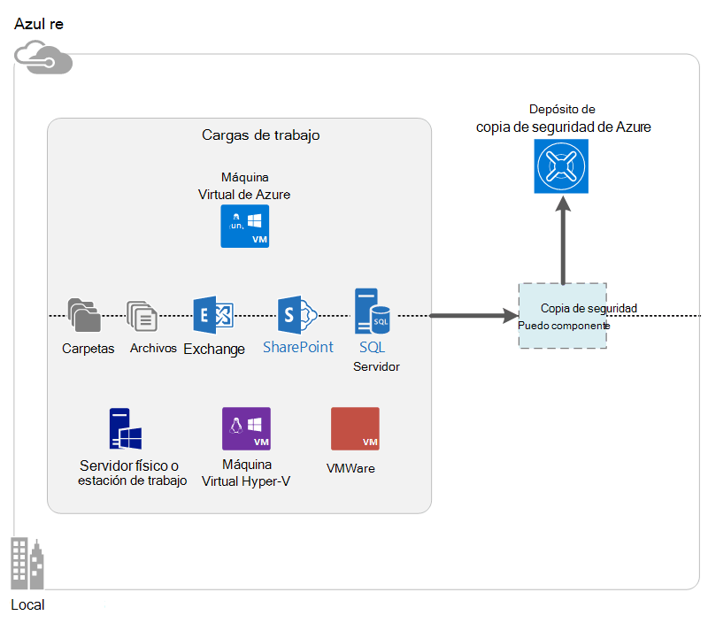

<properties
    pageTitle="¿Qué es la copia de seguridad de Azure? | Microsoft Azure"
    description="Con copia de seguridad de Azure y servicios de recuperación, puede realizar copias de seguridad y restaurar los datos y las aplicaciones de servidores de Windows, equipos cliente con Windows, servidores de System Center DPM y máquinas virtuales de Windows Azure."
    services="backup"
    documentationCenter=""
    authors="markgalioto"
    manager="cfreeman"
    editor="tysonn"
    keywords="copia de seguridad y restauración; Servicios de recuperación. soluciones de copia de seguridad"/>

<tags
    ms.service="backup"
    ms.workload="storage-backup-recovery"
    ms.tgt_pltfrm="na"
    ms.devlang="na"
    ms.topic="get-started-article"
    ms.date="10/19/2016"
    ms.author="jimpark; trinadhk"/>

# ¿Qué es la copia de seguridad de Azure?
Copia de seguridad de Azure es el servicio que usar para realizar copias de seguridad y restaurar los datos en la nube de Microsoft. Reemplaza el local existente o solución de copia de seguridad fuera del sitio con una solución basada en nube confiable, segura y costo competitivo. También le ayuda a proteger los activos que se ejecutan en la nube. Copia de seguridad de Azure proporciona servicios de recuperación basados en una infraestructura de nivel internacional scalable, resistentes y altamente disponible.

[Ver un vídeo de introducción de copia de seguridad de Azure](https://azure.microsoft.com/documentation/videos/what-is-azure-backup/)

## ¿Por qué usar copia de seguridad de Azure?
Han desarrollado a partir de las soluciones de copia de seguridad tradicionales para tratar la nube como un extremo similar a discos o cinta. Aunque este enfoque es simple, también está limitado. No aprovechar al máximo de una plataforma de nube subyacente y se convierte en una solución ineficaz y cara.
En cambio, copia de seguridad de Azure ofrece todas las ventajas de una solución de copia de seguridad de la nube eficaz y asequible. Estas son algunas de las principales ventajas que ofrece la copia de seguridad de Azure.

| Característica | Beneficio |
| ------- | ------- |
| Administración de almacenamiento automático | Gastos de capital no es necesaria para los dispositivos de almacenamiento local. Copia de seguridad de Azure automáticamente asigna y administra el almacenamiento de copia de seguridad, y usa un modelo de consumo de pago como--uso. |
| Escala ilimitada | Aproveche las ventajas de garantías de alta disponibilidad sin la sobrecarga de mantenimiento y supervisión. Copia de seguridad de Azure utiliza la escala de la nube de Azure y power subyacente con sus capacidades de ajuste automático no intrusivo. |
| Varias opciones de almacenamiento | Elija el almacenamiento de copia de seguridad según la necesidad de:<li>Un blob de bloque de almacenamiento redundante local es ideal para clientes de económico y aún le ayuda a proteger los datos de errores de hardware local. <li>Un blob de bloque de almacenamiento de replicación geo ofrece tres más copias en un centro de datos pareja. Estas copias adicionales ayudan a garantizar que los datos de copia de seguridad están altamente disponibles incluso si se produce un desastre Azure de nivel de sitio. |
| Transferencia de datos ilimitado | No hay ningún cargo para cualquier transferencia de datos (saliente) de salida durante una operación de restauración de la cámara de copia de seguridad. Datos entrantes a Azure también es gratuita. Funciona con el servicio de importación que está disponible. |
| Cifrado de datos | Cifrado de datos permite transmisión segura y el almacenamiento de datos de clientes en la nube pública. La frase de contraseña de cifrado se almacena en el origen y nunca se transmite o almacenado en Azure. La clave de cifrado es necesario para restaurarlos datos y solo cliente tiene acceso completo a los datos en el servicio. |  
| Copia de seguridad de aplicación coherente | Copias de seguridad consistente con las aplicaciones en Windows ayudan a garantizar que las soluciones no son necesarios en el momento de la restauración, lo que reduce el objetivo de tiempo de recuperación. Esto permite a los clientes volver a un estado de ejecución más rápidamente. |
| Retención a largo plazo | En lugar de pago para soluciones de copia de seguridad de cinta fuera del sitio, los clientes pueden hacer copia de seguridad Azure, que ofrece una solución de cinta como atractiva a bajo costo. |

## Componentes de copia de seguridad de Azure
Dado que la copia de seguridad es una solución de copia de seguridad de híbridos, consta de varios componentes que funcionan conjuntamente para habilitar llevar a cabo copias de seguridad y restaurar los flujos de trabajo.

### Escenarios de implementación

| Componente | ¿Se puede implementar en Azure? | ¿Puede ser implementado en local? | Almacenamiento de destino compatible|
| --- | --- | --- | --- |
| Agente de copia de seguridad de Azure | 
**Sí**
 
El agente de copia de seguridad de Azure se puede instalar en cualquier máquina virtual de servidor de Windows que se ejecuta en Azure.
 | 
**Sí**
 
El agente de copia de seguridad se puede implementar en cualquier máquina virtual de Windows Server o una máquina física.
 | 
Depósito de copia de seguridad de Azure
 |
| Administrador de protección de datos (DPM) de System Center | 
**Sí**

Más información sobre [cómo proteger cargas de trabajo en Azure usando System Center DPM](http://blogs.technet.com/b/dpm/archive/2014/09/02/azure-iaas-workload-protection-using-data-protection-manager.aspx).
 | 
**Sí**
 
Más información sobre [cómo proteger cargas de trabajo y máquinas virtuales en su centro de datos](https://technet.microsoft.com/library/hh758173.aspx).
 | 
Disco conectado localmente,
 
Azure depósito de copia de seguridad,
 
cinta (local solamente)
 |
| Servidor de copia de seguridad de Azure | 
**Sí**

Más información sobre [cómo proteger cargas de trabajo en Azure mediante servidor de copia de seguridad de Azure](backup-azure-microsoft-azure-backup.md).
 | 
**Sí**
 
Más información sobre [cómo proteger cargas de trabajo en Azure mediante servidor de copia de seguridad de Azure](backup-azure-microsoft-azure-backup.md).
 | 
Disco conectado localmente,
 
Depósito de copia de seguridad de Azure
 |
| Copia de seguridad de Azure (extensión VM) | 
**Sí**

Parte de la estructura de Azure

Especializadas para [copia de seguridad de infraestructura de Azure como un máquinas virtuales de servicio (IaaS)](backup-azure-vms-introduction.md).
 | 
**No**
 
Use System Center DPM para realizar copias de seguridad máquinas virtuales de su centro de datos.
 | 
Depósito de copia de seguridad de Azure
 |

### Limitaciones y las ventajas de nivel de componente

| Componente | Ventajas | Limitaciones | Recuperación detallada |
| --- | --- | --- | --- |
| Azure agente de copia de seguridad (MARS) | <li>Puede hacer copia de seguridad archivos y carpetas en un equipo con el sistema operativo Windows, ya sea físico o virtual (máquinas virtuales pueden estar en cualquier lugar en local o Azure)<li>Requerido ningún servidor de copia de seguridad independiente<li>Usa depósito de copia de seguridad de Azure | <li>Restaurar tres veces un archivo de copia de seguridad o nivel day<li>Restauración de nivel de archivo o carpeta o volumen únicamente, no de la aplicación tener en cuenta<li>No es compatible con Linux | archivos, carpetas o volúmenes |
| Administrador de protección de datos de System Center | <li>Tenga en cuenta instantáneas de aplicación (VSS)<li>Flexibilidad completa para el momento de realizar copias de seguridad<li>Detalle de recuperación (todas)<li>Puede utilizar depósito de copia de seguridad de Azure<li>Soporte de Linux (si está hospedado en Hyper-V) | <li>Falta de soporte heterogéneo (VMware VM copias de seguridad, carga de trabajo de Oracle copia de seguridad).  | archivos, carpetas o volúmenes / VM/aplicaciones |
| Servidor de copia de seguridad de Microsoft Azure | <li>Tenga en cuenta instantáneas de aplicación (VSS)<li>Flexibilidad completa para el momento de realizar copias de seguridad<li>Detalle de recuperación (todas)<li>Puede utilizar depósito de copia de seguridad de Azure<li>Soporte de Linux (si está hospedado en Hyper-V)<li>No requiere una licencia de System Center | <li>Falta de soporte heterogéneo (VMware VM copias de seguridad, carga de trabajo de Oracle copia de seguridad).<li>Siempre requiere suscripción Azure directo<li>No compatible de copia de seguridad de cinta | archivos, carpetas o volúmenes / VM/aplicaciones |
| Copia de seguridad de Azure VM IaaS | <li>Nativos copias de seguridad de Windows o Linux.<li>No se requiere instalación agente específico<li>Copia de seguridad de nivel de tela sin infraestructura de copia de seguridad es necesario | <li>Una vez al día Atrás arriba o disco restaurar nivel<li>No puede hacer copia de seguridad local | Máquinas virtuales Todos los discos (con PowerShell) |

## ¿Pueden hacer una copia de seguridad de las aplicaciones y cargas de trabajo?

| Carga de trabajo | Equipo de origen | Solución de copia de seguridad de Azure |
| --- | --- |---|
| Archivos y carpetas | Windows Server | 
[Agente de copia de seguridad de azure](backup-configure-vault.md),
 
[System Center DPM](backup-azure-dpm-introduction.md) (+ el agente de copia de seguridad de Azure)
 
[Servidor de copia de seguridad de Azure](backup-azure-microsoft-azure-backup.md) (incluye al agente de copia de seguridad de Azure)
  |
| Archivos y carpetas | Cliente de Windows | 
[Agente de copia de seguridad de azure](backup-configure-vault.md),
 
[System Center DPM](backup-azure-dpm-introduction.md) (+ el agente de copia de seguridad de Azure)
 
[Servidor de copia de seguridad de Azure](backup-azure-microsoft-azure-backup.md) (incluye al agente de copia de seguridad de Azure)
  |
| Máquina virtual de Hyper-V (Windows) | Windows Server | 
[System Center DPM](backup-azure-backup-sql.md) (+ el agente de copia de seguridad de Azure)
 
[Servidor de copia de seguridad de Azure](backup-azure-microsoft-azure-backup.md) (incluye al agente de copia de seguridad de Azure)
 |
| Máquina virtual de Hyper-V (Linux) | Windows Server | 
[System Center DPM](backup-azure-backup-sql.md) (+ el agente de copia de seguridad de Azure)
 
[Servidor de copia de seguridad de Azure](backup-azure-microsoft-azure-backup.md) (incluye al agente de copia de seguridad de Azure)
  |
| Microsoft SQL Server | Windows Server | 
[System Center DPM](backup-azure-backup-sql.md) (+ el agente de copia de seguridad de Azure)
 
[Servidor de copia de seguridad de Azure](backup-azure-microsoft-azure-backup.md) (incluye al agente de copia de seguridad de Azure)
  |
| Microsoft SharePoint | Windows Server | 
[System Center DPM](backup-azure-backup-sql.md) (+ el agente de copia de seguridad de Azure)
 
[Servidor de copia de seguridad de Azure](backup-azure-microsoft-azure-backup.md) (incluye al agente de copia de seguridad de Azure)
   |
| Microsoft Exchange |  Windows Server | 
[System Center DPM](backup-azure-backup-sql.md) (+ el agente de copia de seguridad de Azure)
 
[Servidor de copia de seguridad de Azure](backup-azure-microsoft-azure-backup.md) (incluye al agente de copia de seguridad de Azure)
   |
| Máquinas virtuales de Azure IaaS (Windows) | - | [Copia de seguridad de Azure (extensión VM)](backup-azure-vms-introduction.md) |
| Máquinas virtuales de Azure IaaS (Linux) | - | [Copia de seguridad de Azure (extensión VM)](backup-azure-vms-introduction.md) |

## Compatibilidad con BRAZO y Linux

| Componente | Compatibilidad con BRAZO | Linux (Azure apoyo) soporte técnico |
| --- | --- | --- |
| Azure agente de copia de seguridad (MARS) | Sí | No (sólo agente basado en Windows) |
| Administrador de protección de datos de System Center | Sí (agente de invitado) | Es posible solo Hyper-V (no Azure VM) solo coherente archivo copia de seguridad |
| Servidor de copia de seguridad de Azure (MABS) | Sí (agente de invitado) | Solo es posible copia de seguridad solo coherente archivo Hyper-V (no Azure VM) (igual que DPM) |
| Copia de seguridad de Azure VM IaaS | Sí | Sí |

[AZURE.INCLUDE [learn-about-deployment-models](../../includes/learn-about-deployment-models-include.md)]

## Realizar copias de seguridad y restaurar máquinas virtuales de almacenamiento Premium

Ahora, el servicio de copia de seguridad de Azure protege máquinas virtuales de almacenamiento Premium.

### Realizar copias de seguridad máquinas virtuales de almacenamiento Premium

Durante la copia de seguridad de máquinas virtuales de almacenamiento Premium, el servicio de copia de seguridad crea una ubicación de ensayo temporal en la cuenta de almacenamiento Premium. La ubicación de ensayo, con el nombre "AzureBackup", es igual que el tamaño total de los datos de los discos de premium conectados a la máquina virtual.

>[AZURE.NOTE] No modifique ni modificar la ubicación de ensayo.

Una vez que finalice el trabajo de copia de seguridad, se elimina la ubicación provisional. El precio de almacenamiento utilizado para la ubicación de ensayo es coherente con todos los [precios de almacenamiento Premium](../storage/storage-premium-storage.md#pricing-and-billing).

### Restaurar máquinas virtuales de almacenamiento Premium

Premium almacenamiento VM pueden restaurarse para cualquier almacenamiento Premium o almacenamiento normal. Restaurar un punto de recuperación Premium almacenamiento VM a almacenamiento de Premium es el proceso típico de restauración. Sin embargo, puede ser rentable para restaurar un punto de recuperación Premium almacenamiento VM almacenamiento estándar. Este tipo de restauración puede usarse si necesita un subconjunto de los archivos de la máquina virtual.

## Funcionalidad
Estas cinco tablas resumen funcionalidad de copia de seguridad cómo se administran en cada componente.

### Almacenamiento de información

| Característica | Agente de copia de seguridad de Azure | System Center DPM | Servidor de copia de seguridad de Azure | Copia de seguridad de Azure (extensión VM) |
| ------- | --- | --- | --- | ---- |
| Depósito de copia de seguridad de Azure | ![Sí][green] | ![Sí][green] | ![Sí][green] | ![Sí][green] |
| Almacenamiento en disco | | ![Sí][green] | ![Sí][green] |  |
| Almacenamiento de la cinta | | ![Sí][green] |  | |
| Compresión (en depósito de copia de seguridad) | ![Sí][green] | ![Sí][green]| ![Sí][green] | |
| Copia de seguridad incremental | ![Sí][green] | ![Sí][green] | ![Sí][green] | ![Sí][green] |
| Desduplicación de disco | | ![Parcialmente][yellow] | ![Parcialmente][yellow]| | |

Depósito de copia de seguridad es el destino de almacenamiento preferido en todos los componentes. System Center DPM y el servidor de copia de seguridad también proporcionan la opción de hacer una copia de disco local. Sin embargo, solo System Center DPM proporciona la opción para escribir datos en un dispositivo de almacenamiento de la cinta.

#### Copia de seguridad incremental
Todos los componentes es compatible con la copia de seguridad incremental independientemente del almacenamiento de destino (disco, cinta, depósito de copia de seguridad). Copia de seguridad incremental garantiza que las copias de seguridad se almacenamiento y tiempo eficaz, puede transferir sólo los cambios realizados desde la última copia.

#### Compresión
Realizar copias de seguridad se comprimen para reducir el espacio de almacenamiento necesario. El único componente que no utilice la compresión es la extensión de máquina virtual. Con la extensión VM, todos los datos de copia de seguridad se copia desde la cuenta de almacenamiento de información del cliente a la cámara de copia de seguridad de la misma región sin comprimir. Mientras va sin compresión ligeramente aumenta el almacenamiento utilizado, almacenar los datos sin compresión permite tiempos de restauración.

#### Desduplicación
Desduplicación es compatible con System Center DPM y el servidor de copia de seguridad cuando se [implementa en una máquina virtual de Hyper-V](http://blogs.technet.com/b/dpm/archive/2015/01/06/deduplication-of-dpm-storage-reduce-dpm-storage-consumption.aspx). Desduplicación se realiza en el nivel de host mediante desduplicación de Windows Server en el disco duro virtual (VHD) que se han adjuntado a la máquina virtual como almacenamiento de copia de seguridad.

>[AZURE.WARNING] Deduplicación no está disponible en Azure por cualquiera de los componentes de copia de seguridad. Cuando System Center DPM y el servidor de copia de seguridad se implementan en Azure, no pueden ser desduplicados los discos de almacenamiento asociados a la máquina virtual.

### Seguridad

| Característica | Agente de copia de seguridad de Azure | System Center DPM | Servidor de copia de seguridad de Azure | Copia de seguridad de Azure (extensión VM) |
| ------- | --- | --- | --- | ---- |
| Seguridad de la red (a Azure) | ![Sí][green] |![Sí][green] | ![Sí][green] | ![Parcialmente][yellow]|
| Seguridad de los datos (en Azure) | ![Sí][green] |![Sí][green] | ![Sí][green] | ![Parcialmente][yellow]|

Todo el tráfico copia de seguridad de los servidores en depósito de copia de seguridad se cifra mediante 256 estándar cifrado avanzado. Los datos se envían a través de un vínculo HTTPS seguro. Los datos de copia de seguridad también se almacenan en la cámara de copia de seguridad en un formato cifrado. Solo el cliente contiene la frase de contraseña para desbloquear estos datos. Microsoft no puede descifrar los datos de copia de seguridad en cualquier momento.

>[AZURE.WARNING] La clave utilizada para cifrar los datos de copia de seguridad está presente sólo con el cliente. Microsoft no mantener una copia en Azure y no tiene acceso a la clave. Si se ha perdido la clave, Microsoft no puede recuperar los datos de copia de seguridad.

La copia de seguridad de Azure VM requiere la configuración de cifrado *dentro de* la máquina virtual. Usar BitLocker en máquinas virtuales de Windows y **cifrado dm** en máquinas virtuales de Linux. Copia de seguridad de Azure no cifra automáticamente los datos de copia de seguridad que llegue a través de esta ruta de acceso.

### Cargas de trabajo admitidos

| Característica | Agente de copia de seguridad de Azure | System Center DPM | Servidor de copia de seguridad de Azure | Copia de seguridad de Azure (extensión VM) |
| ------- | --- | --- | --- | ---- |
| Equipo de Windows Server, archivos y carpetas | ![Sí][green] | ![Sí][green] | ![Sí][green] | |
| Equipo cliente de Windows, archivos y carpetas | ![Sí][green] | ![Sí][green] | ![Sí][green] | |
| Máquina virtual de Hyper-V (Windows) | | ![Sí][green] | ![Sí][green] | |
| Máquina virtual de Hyper-V (Linux) | | ![Sí][green] | ![Sí][green] | |
| Microsoft SQL Server | | ![Sí][green] | ![Sí][green] | |
| Microsoft SharePoint | | ![Sí][green] | ![Sí][green] | |
| Microsoft Exchange  | | ![Sí][green] | ![Sí][green] | |
| Máquina virtual de Azure (Windows) | | | | ![Sí][green] |
| Máquina virtual de Azure (Linux) | | | | ![Sí][green] |

### Red

| Característica | Agente de copia de seguridad de Azure | System Center DPM | Servidor de copia de seguridad de Azure | Copia de seguridad de Azure (extensión VM) |
| ------- | --- | --- | --- | ---- |
| Compresión de red (en el servidor de copia de seguridad) | | ![Sí][green] | ![Sí][green] | |
| Compresión de red (en el depósito de copia de seguridad) | ![Sí][green] | ![Sí][green] | ![Sí][green] | |
| Protocolo de red (para el servidor de copia de seguridad) | | TCP | TCP | |
| Protocolo de red (para la copia de seguridad depósito) | HTTPS | HTTPS | HTTPS | HTTPS |

Dado que la extensión VM lee los datos directamente desde la cuenta de almacenamiento de Azure en la red de almacenamiento, no es necesario optimizar este tráfico. El tráfico es a través de la red de almacenamiento local en el centro de datos de Azure, lo que no hay poca necesidad de compresión debido a consideraciones de ancho de banda.

Si copia los datos en un servidor de copia de seguridad (DPM o servidor de copia de seguridad), el tráfico desde el servidor principal en el servidor de copia de seguridad se puede comprimir para guardar en ancho de banda.

#### Límite de red
El agente de copia de seguridad de Azure proporciona la capacidad de aceleración, que le permite controlar cómo se usa el ancho de banda durante la transferencia de datos. Límite puede ser útil si necesita hacer una copia de los datos durante horas de trabajo pero no desea que el proceso de copia de seguridad para interferir con otro tráfico de internet. Limitación de datos se aplica transferencia para realizar copias de seguridad y restaurar las actividades.

### Copia de seguridad y retención

|  | Agente de copia de seguridad de Azure | System Center DPM | Servidor de copia de seguridad de Azure | Copia de seguridad de Azure (extensión VM) |
| --- | --- | --- | --- | --- |
| Frecuencia de copia de seguridad (en el depósito de copia de seguridad) | Tres copias de seguridad por día | Dos copias de seguridad por día |Dos copias de seguridad por día | Una copia de seguridad por día |
| Frecuencia de copia de seguridad (en disco) | No aplicable | 
Cada 15 minutos para SQL Server
 
Cada hora para otras cargas de trabajo
 | 
Cada 15 minutos para SQL Server
 
Cada hora para otras cargas de trabajo
 |No aplicable |
| Opciones de retención | Diariamente, semanalmente, mensualmente, anualmente | Diariamente, semanalmente, mensualmente, anualmente | Diariamente, semanalmente, mensualmente, anualmente |Diariamente, semanalmente, mensualmente, anualmente |
| Período de retención | Hasta 99 años | Hasta 99 años | Hasta 99 años | Hasta 99 años |
| Puntos de recuperación en depósito de copia de seguridad | Ilimitado | Ilimitado | Ilimitado | Ilimitado |
| Puntos de recuperación en disco local | No aplicable | 64 para servidores de archivos  448 para servidores de aplicaciones | 64 para servidores de archivos  448 para servidores de aplicaciones |No aplicable |
| Puntos de recuperación en cinta | No aplicable | Ilimitado | No aplicable | No aplicable |

## ¿Qué es el archivo de credenciales de la cámara?

El archivo de credenciales de depósito es un certificado generado por el portal para cada depósito de copia de seguridad. El portal de carga, a continuación, la clave pública para el servicio de Control de acceso (ACS). La clave privada se proporciona al usuario al descargar las credenciales y, a continuación, introducida durante el registro del equipo. La clave privada autentica el equipo para enviar los datos de copia de seguridad a un depósito identificado en el servicio de copia de seguridad de Azure.

Se utiliza la credencial de cámara solo durante el flujo de trabajo de registro. Es su responsabilidad asegurarse de que el archivo de credenciales de la cámara no está comprometido. Si se encuentra en manos de cualquier usuario malintencionado, el archivo de credenciales de cámara puede usarse para registrar otros equipos con el mismo depósito. Sin embargo, dado que los datos de copia de seguridad se cifran con una contraseña que pertenecen sólo al cliente, los datos de copia de seguridad existentes no pueden ser confidencial. Para mitigar este problema, se establecen las credenciales de la cámara para que expire en 48 horas. Aunque puede descargar las credenciales de la cámara de una copia de seguridad depósito cualquier número de veces, solo el archivo más reciente es aplicable durante el flujo de trabajo de registro.

## ¿Copia de seguridad de Azure diferencias de recuperación de sitios de Azure?
Muchos clientes confunden recuperación de copia de seguridad y recuperación. Ambos capturan datos y proporcionar semántica restaurar, pero sus propuestas de valor principales son diferentes.

Copia de seguridad de Azure realiza una copia de seguridad de datos local y en la nube. Recuperación de sitio de Azure coordenadas replicación de equipos virtuales y servidores físicos, migración tras error y recuperación. Ambos servicios son importantes porque su solución de recuperación de desastres debe mantener sus datos seguros y recuperable (copia de seguridad) *y* mantener las cargas de trabajo disponibles (sitio recuperación) cuando se produzcan interrupciones.

Los siguientes conceptos ayudarle a tomar decisiones importantes alrededor de copia de seguridad y recuperación de desastres.

| Concepto | Detalles | Copia de seguridad | Recuperación (DR) |
| ------- | ------- | ------ | ----------------- |
| Objetivo de punto de recuperación (RPO) | La cantidad aceptable de pérdida de datos si debe realizar una recuperación. | Las soluciones de copia de seguridad tienen variable en su RPO aceptable. Realizar copias de seguridad de la máquina virtual normalmente cuentan con un RPO de un día, mientras que las copias de seguridad de base de datos tienen RPOs tan sólo 15 minutos. | Soluciones de recuperación de desastres tienen RPOs bajos. La copia de DR puede ser detrás por unos segundos o unos minutos. |
| Objetivo de tiempo de recuperación (RTO) | La cantidad de tiempo que se tarda en completar una recuperación o restaurar. | Debido a la mayor RPO, la cantidad de datos que necesite una solución de copia de seguridad para procesar es normalmente mucho mayor, lo que lleva a RTOs más larga. Por ejemplo, puede tardar días para restaurar los datos de las cintas, dependiendo del tiempo que se tarda en la cinta desde una ubicación externa de transporte. | Soluciones de recuperación de desastres tienen más pequeños RTOs porque son más sincronizadas con el origen. Menos cambios deben procesarse. |
| Retención | ¿Cuánto tiempo deben almacenarse datos | Escenarios que requieren recuperación operativa (daños en los datos, la eliminación de archivos accidental, error de sistema operativo), datos de copia de seguridad normalmente se conservan durante 30 días o menos. Desde la perspectiva de cumplimiento, datos que necesite almacenarse para meses e incluso años. Datos de copia de seguridad es ideal para archivado en estos casos. | Recuperación necesita sólo datos de recuperación de las operaciones, que normalmente toma algunas horas o hasta un día. Debido a la captura los datos usada en soluciones de DR, no se recomienda el uso de datos de DR para retención a largo plazo. |

## Pasos siguientes

Pruebe una copia de seguridad de Azure simple. Para obtener instrucciones, consulte uno de estos tutoriales:

- [Pruebe la copia de seguridad de Azure](backup-try-azure-backup-in-10-mins.md)
- [Pruebe la copia de seguridad de Azure VM](backup-azure-vms-first-look.md)

Dado que estos tutoriales agilizar copia de seguridad, se muestra solo la ruta de acceso más directa para la copia de seguridad de los datos. Para obtener información adicional sobre el tipo de copia de seguridad desee, consulte:

- [Hacer copia de seguridad automática de Windows](backup-configure-vault.md)
- [Realizar copias de seguridad de las cargas de trabajo de la aplicación](backup-azure-microsoft-azure-backup.md)
- [Máquinas virtuales de copia de seguridad IaaS Azure](backup-azure-vms-prepare.md)

[green]: ./media/backup-introduction-to-azure-backup/green.png
[yellow]: ./media/backup-introduction-to-azure-backup/yellow.png
[red]: ./media/backup-introduction-to-azure-backup/red.png
