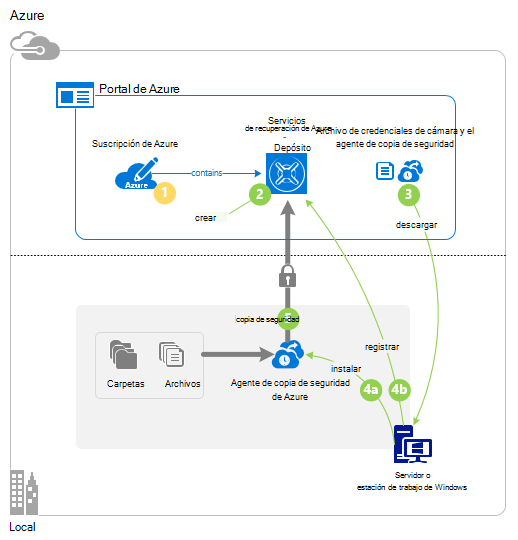
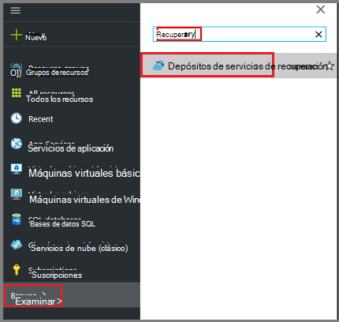
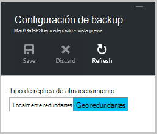
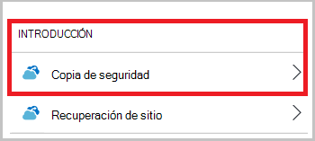
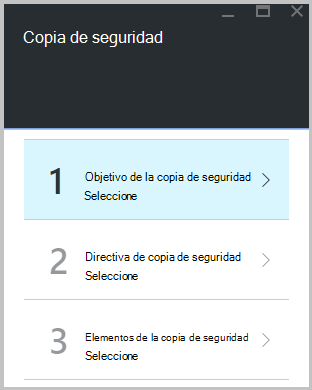
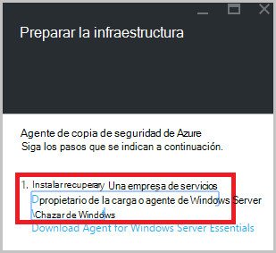
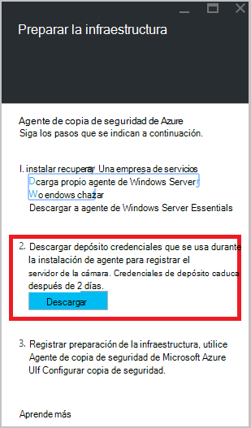
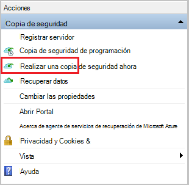
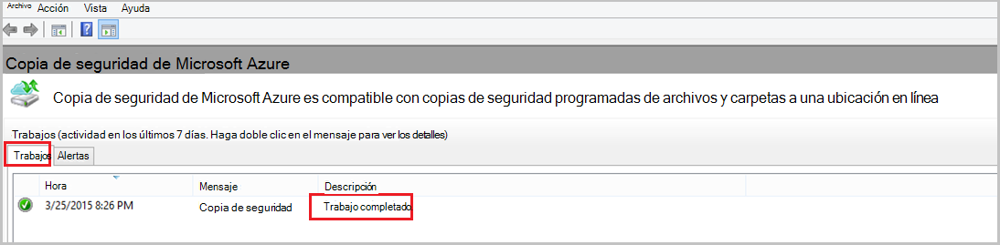

<properties
   pageTitle="Más información sobre cómo realizar copias de seguridad de los archivos y carpetas de Windows a Azure con copia de seguridad de Azure mediante el modelo de implementación de administrador de recursos | Microsoft Azure"
   description="Aprenda a copia de seguridad de datos de Windows Server creando un depósito, instalar al agente de servicios de recuperación y copia de seguridad de los archivos y carpetas en Azure."
   services="backup"
   documentationCenter=""
   authors="markgalioto"
   manager="cfreeman"
   editor=""
   keywords="Cómo copia de seguridad; Cómo hacer copia de seguridad"/>

<tags
   ms.service="backup"
   ms.workload="storage-backup-recovery"
   ms.tgt_pltfrm="na"
   ms.devlang="na"
   ms.topic="hero-article"
   ms.date="09/27/2016"
   ms.author="markgal;"/>

# Buscar primero: copia de seguridad de archivos y carpetas con copia de seguridad de Azure mediante el modelo de implementación de administrador de recursos

En este artículo se explica cómo hacer copia de seguridad de su servidor de Windows (o el cliente de Windows) archivos y carpetas en Azure con copia de seguridad de Azure con el Administrador de recursos. Es un tutorial para mostrarle los conceptos básicos. Si desea empezar a usar la copia de seguridad de Azure, está en el lugar correcto.

Si desea obtener más información sobre la copia de seguridad de Azure, lea esta [información general](backup-introduction-to-azure-backup.md).

Copia de seguridad de los archivos y carpetas en Azure requiere estas actividades:

 obtener una suscripción de Azure (si todavía no tiene uno). 
 crear un depósito de servicios de recuperación. 
 descargar los archivos necesarios. 
 instalar y registrar el agente de servicios de recuperación. 
 copia de seguridad de tus archivos y carpetas.

## Paso 1: Obtener una suscripción de Azure

Si no tiene una suscripción de Azure, cree una [cuenta gratuita](https://azure.microsoft.com/free/) que permite el acceso a cualquier servicio de Azure.

## Paso 2: Crear un depósito de servicios de recuperación

Para la copia de seguridad de tus archivos y carpetas, debe crear un depósito de servicios de recuperación de la región donde desee almacenar los datos. También debe determinar cómo desea que el almacenamiento replicar.

### Para crear un depósito de servicios de recuperación

1. Si aún no lo ha hecho, inicie sesión en el [Portal de Azure](https://portal.azure.com/) con su suscripción de Azure.

2. En el menú de concentrador, haga clic en **Examinar** y, en la lista de recursos, escriba **Servicios de recuperación** y haga clic en **Servicios de recuperación de depósitos**.

      

3. En el menú de **Servicios de recuperación de depósitos** , haga clic en **Agregar**.

    

    Se abre el módulo de cámara de servicios de recuperación, que le pide que proporcione un **nombre**, la **suscripción**, el **grupo de recursos**y la **ubicación**.

    

4. En **nombre**, escriba un nombre descriptivo para identificar la cámara.

5. Haga clic en la **suscripción** para ver la lista de suscripciones disponibles.

6. Haga clic en el **grupo de recursos** para ver la lista de grupos de recursos disponibles o haga clic en **nuevo** para crear un nuevo grupo de recursos.

7. Haga clic en **ubicación** para seleccionar la región geográfica de la cámara. Esta opción determina la región geográfica donde se envían los datos de copia de seguridad.

8. Haga clic en **crear**.

    Si no ve la cámara aparece después de que se ha completado, haga clic en **Actualizar**. Cuando se actualiza la lista, haga clic en el nombre de la cámara.

### Para determinar la redundancia de almacenamiento
Cuando crea por primera vez un depósito de servicios de recuperación determina cómo se duplica almacenamiento.

1. Haga clic en el nuevo depósito para abrir el panel.

2. En el módulo de **configuración** , que se abre automáticamente con el panel de la cámara, haga clic en **La infraestructura de copia de seguridad**.

3. En el módulo de infraestructura de copia de seguridad, haga clic en **Configuración de copia de seguridad** para ver el **tipo de réplica de almacenamiento**.

    

4. Elija la opción de replicación de almacenamiento adecuada para su depósito.

    

    De forma predeterminada, el depósito tiene almacenamiento geo redundantes. Si está utilizando Azure como un extremo de almacenamiento de copia de seguridad principal, continúe utilizando almacenamiento geo redundantes. Si está utilizando Azure como un extremo de almacenamiento de copia de seguridad no principal, a continuación, elija almacenamiento redundante local, lo que reduce el costo de almacenamiento de datos de Azure. Leer más sobre [geo redundantes](../storage/storage-redundancy.md#geo-redundant-storage) y opciones de almacenamiento [redundante local](../storage/storage-redundancy.md#locally-redundant-storage) en esta [información general](../storage/storage-redundancy.md).

Ahora que ha creado un depósito, prepare su infraestructura de copia de seguridad de los archivos y carpetas descargando las credenciales de agente y depósito de servicios de recuperación de Microsoft Azure.

## Paso 3: descargar archivos

1. Haga clic en **configuración** en el panel de la cámara de servicios de recuperación.

    

2. Haga clic en **Introducción > copia de seguridad** en el módulo de la configuración.

    

3. Haga clic en **el objetivo de copia de seguridad** en el módulo de copia de seguridad.

    

4. ¿Seleccione **local** desde dónde está la carga de trabajo? menú.

5. ¿Seleccione **archivos y carpetas** de la especifique qué desea hacer una copia de seguridad? menú, haga clic en **Aceptar**.

### Descargue al agente de servicios de recuperación

1. Haga clic en **Descargar agente de Windows Server o cliente de Windows** en el módulo de **infraestructura de preparar** .

    

2. En la ventana emergente de descarga, haga clic en **Guardar** . De forma predeterminada, se guarda el archivo **MARSagentinstaller.exe** a su carpeta de descargas.

### Descarga de credenciales de cámara

1. Haga clic en **Descargar > Guardar** en el módulo de infraestructura de preparar.

    

## Paso 4: instalar y registrar el agente

>[AZURE.NOTE] Habilitar copia de seguridad a través del portal de Azure estará disponible próximamente. En este momento, utilice el agente de servicios de recuperación de Microsoft Azure local para realizar copias de seguridad de tus archivos y carpetas.

1. Busque y haga doble clic en la **MARSagentinstaller.exe** desde la carpeta descargas (u otra ubicación guardado).

2. Completar al Asistente de configuración de agente de servicios de Microsoft Azure recuperación. Para completar al asistente, necesita:

    - Elija una ubicación para la instalación y la carpeta de caché.
    - Proporcione a su servidor proxy de información del servidor si usa un servidor proxy para conectarse a internet.
    - Proporcionar al usuario detalles de nombre y la contraseña si usa a un proxy autenticado.
    - Proporcionar las credenciales de depósito descargados
    - Guardar la contraseña de cifrado en una ubicación segura.

    >[AZURE.NOTE] Si olvida o pierde la contraseña, Microsoft no puede ayudar a recuperar los datos de copia de seguridad. Guarde el archivo en una ubicación segura. Es necesario para restaurar una copia de seguridad.

Ahora está instalado el agente y su equipo está registrado en la cámara. Está listo para configurar y programar la copia de seguridad.

## Paso 5: Realizar una copia de los archivos y carpetas

La copia de seguridad inicial incluye dos tareas clave:

- Programar la copia de seguridad
- Copia de seguridad de los archivos y carpetas por primera vez

Para completar la copia de seguridad inicial, use el agente de servicios de recuperación de Microsoft Azure.

### Para programar la copia de seguridad

1. Abra al agente de servicios de recuperación de Microsoft Azure. Puede encontrarlo buscando en el equipo de **Copia de seguridad de Microsoft Azure**.

    

2. En el agente de servicios de recuperación, haga clic en **Programar copia de seguridad**.

    

3. En la página de introducción del Asistente para programación de copia de seguridad, haga clic en **siguiente**.

4. En la seleccionar elementos a la página de copia de seguridad, haga clic en **Agregar elementos**.

5. Seleccione los archivos y carpetas que desea hacer copia de seguridad y, a continuación, haga clic en **Aceptar**.

6. Haga clic en **siguiente**.

7. En la página **Especificar programación de copia de seguridad** , especifique la **programación de copia de seguridad** y haga clic en **siguiente**.

    Puede programar diaria (a una velocidad máxima de tres veces por día) o copias de seguridad semanales.

    

    >[AZURE.NOTE] Para obtener más información sobre cómo especificar la programación de copia de seguridad, vea el artículo [Usar Azure una copia de seguridad para reemplazar la infraestructura de la cinta](backup-azure-backup-cloud-as-tape.md).

8. En la página **Seleccionar directiva de retención** , seleccione la **Directiva de retención** para la copia de seguridad.

    La directiva de retención especifica la duración que se almacenará la copia de seguridad. En lugar de especificar simplemente "directiva plana" para todos los puntos de copia de seguridad, puede especificar distintas directivas de retención en función de cuándo se produce la copia de seguridad. Puede modificar las directivas de retención diaria, semanal, mensual y anual para satisfacer sus necesidades.

9. En la página Elegir tipo de copia de seguridad inicial, elija el tipo de copia de seguridad inicial. Deje la opción **automáticamente a través de la red** seleccionada y, a continuación, haga clic en **siguiente**.

    Puede hacer una copia automáticamente en la red o puede realizar una copia sin conexión. El resto de este artículo describe el proceso de copia de seguridad automáticamente. Si prefiere hacer una copia de seguridad sin conexión, revise el artículo de [flujo de trabajo de copia de seguridad sin conexión de copia de seguridad de Azure](backup-azure-backup-import-export.md) para obtener información adicional.

10. En la página de confirmación, revise la información y, a continuación, haga clic en **Finalizar**.

11. Cuando finalice el Asistente para crear la programación de copia de seguridad, haga clic en **Cerrar**.

### Copia de seguridad de los archivos y carpetas por primera vez

1. En el agente de servicios de recuperación, haga clic en **Copia de seguridad ahora** para completar la inicialización inicial a través de la red.

    

2. En la página de confirmación, revise la configuración que usará el vuelva ahora Asistente para hacer copia de seguridad del equipo. A continuación, haga clic en **Copia de seguridad**.

3. Haga clic en **Cerrar** para cerrar al asistente. Si hace esto antes de que finalice el proceso de copia de seguridad, el asistente continúa funcionando en segundo plano.

Una vez completada la copia de seguridad inicial, aparecerá el estado de **trabajo completado** en la consola de copia de seguridad.

## ¿Preguntas?
Si tiene preguntas, o si no hay ninguna característica que le gustaría ver incluyen, [envíenos sus comentarios](http://aka.ms/azurebackup_feedback).

## Pasos siguientes
- Obtener más detalles acerca de [la copia de seguridad de los equipos de Windows](backup-configure-vault.md).
- Ahora que ha realizado una copia los archivos y carpetas, puede [administrar los depósitos y servidores](backup-azure-manage-windows-server.md).
- Si necesita restaurar una copia de seguridad, use este artículo para [Restaurar archivos en un equipo Windows](backup-azure-restore-windows-server.md).
