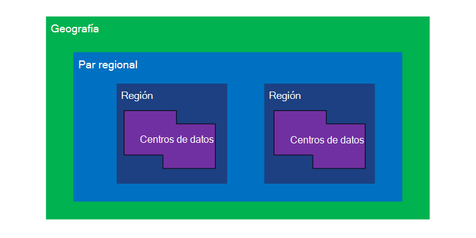
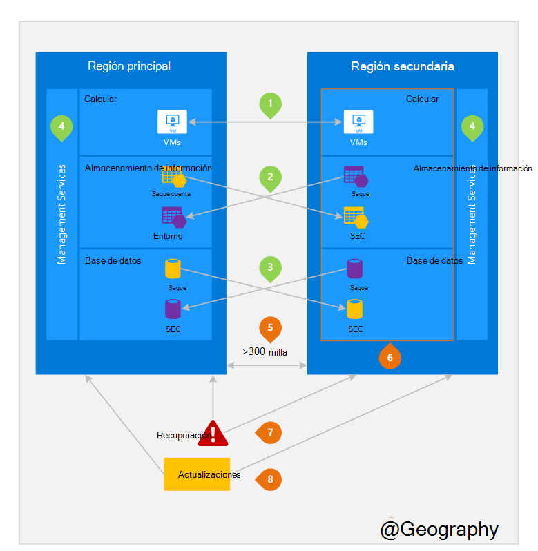

<properties
    pageTitle="Recuperación ante desastres y continuidad empresarial (BCDR): regiones de Azure emparejadas | Microsoft Azure"
    description="Azure pares regionales asegurarse de que las aplicaciones son resistentes durante los errores del centro de datos."
    services="site-recovery"
    documentationCenter=""
    authors="rayne-wiselman"
    manager="jwhit"
    editor=""/>

<tags
    ms.service="site-recovery"
    ms.workload="storage-backup-recovery"
    ms.tgt_pltfrm="na"
    ms.devlang="na"
    ms.topic="article"
    ms.date="08/23/2016"
    ms.author="raynew"/>

# Recuperación ante desastres y continuidad empresarial (BCDR): regiones sincronizado de Azure

## ¿Qué están emparejadas regiones?

Azure funciona en varias ubicaciones geográficas todo el mundo. Una geografía Azure es un área definida del mundo que contiene al menos una región de Azure. Un área de Azure es un área de una ubicación geográfica que contiene una o más centros de datos.

Cada región Azure se corresponde con otra región dentro de la misma geografía, juntos que hace un par de regional. La excepción es sur de Brasil que se corresponde con un área de fuera de su región geográfica.

Figura 1: diagrama de par regional Azure

| Geografía     |  Regiones parejas  |                     |
| :-------------| :-------------   | :-------------      |
| América del Norte | Norte Central de EE. | Sur Central de EE.    |
| América del Norte | Estados Unidos oriental          | Estados Unidos occidental             |
| América del Norte | Estados Unidos oriental 2        | Central de EE.          |
| América del Norte | Estados Unidos oeste 2        | Oeste Central de EE.     |
| Europa        | Europa del Norte     | Europa occidental         |
| Asia          | Sudeste asiático  | Asia oriental           |
| China         | China oriental       | Norte de China         |
| Japón         | Japón oriental       | Japón oeste          |
| Brasil        | Brasil Sur (1) | Sur Central de EE.    |
| Australia     | Australia Oriental   | Australia sureste |
| Gobierno | Estados Unidos Gov Iowa      | Estados Unidos Gov Virginia     |
| India         | India central    | India sur         |
| Canadá        | Canadá Central   | Canadá oriental         |
| REINO UNIDO            | Reino Unido oeste          | Sur Reino Unido            |

Tabla 1 - asignación de azure pares regionales

> (1) sur de Brasil es único porque está asociada a una región fuera de su propio geografía. Región secundaria del sur de Brasil es Sur Central de EE pero secundaria región del sur Central de EE no sur de Brasil.

Se recomienda replicar las cargas de trabajo en pares regionales para aprovechar las directivas de aislamiento y la disponibilidad de Azure. Por ejemplo, las actualizaciones de sistema previsto de Azure se implementan secuencialmente (no al mismo tiempo) entre regiones parejas. Esto significa que incluso en el caso poco comunes de una actualización defectuoso, ambas regiones no se verán afectados al mismo tiempo. Además, en caso de una interrupción amplia, recuperación de al menos una región de cada par tiene prioridad.

## Un ejemplo de regiones parejas
Figura 2 muestra una aplicación hipotética que usa el par regional de recuperación. Los números de color verdes resaltan las actividades entre región de tres servicios de Azure (calcular Azure, almacenamiento y base de datos) y cómo se configuran para replicar a través de las regiones. Se resaltan los beneficios únicos de la implementación de regiones parejas por los números de naranja.

Ilustración 2: hipotética par regional de Azure

## Actividades de la región de cruz
Que se refiere en la figura 2.

 **Azure calcular (PaaS)** – debe aprovisionar recursos de cálculo adicionales con antelación para garantizar que los recursos están disponibles en otra región durante un desastre. Para obtener más información, vea [Guía técnica de la resistencia de Azure](./resiliency/resiliency-technical-guidance.md).

 **Almacenamiento de Azure** - almacenamiento Geo redundantes (GRS) está configurado de forma predeterminada cuando se crea una cuenta de almacenamiento de Azure. Con GRS, los datos se replican automáticamente tres veces dentro de la región principal y tres veces en la región pareja. Para obtener más información, consulte [Opciones de redundancia de almacenamiento de Azure](storage/storage-redundancy.md).

 **Bases de datos de SQL Azure** – con Azure estándar Geo replicación de SQL, puede configurar la replicación asincrónica de transacciones a una región pareja. Con la replicación de Geo Premium, puede configurar la replicación a cualquier región del mundo; Sin embargo, se recomienda que implementar estos recursos en una región pareja para la mayoría de los escenarios de recuperación de desastres. Para obtener más información, vea [Geo replicación de base de datos de SQL Azure](./sql-database/sql-database-geo-replication-overview.md).

 **Azure Resource Manager (ARM)** - ARM inherente proporciona aislamiento lógico de componentes de administración de servicios en todas las regiones. Esto significa errores lógicos en una región se reduce la probabilidad de afectar al otro.

## Ventajas de las regiones parejas
Que se refiere en la figura 2.  

**aislamiento físico** : cuando sea posible, Azure prefiere al menos 300 millas de separación entre los centros de datos en un par de regional, aunque esto no es práctico o posible en todo el mundo. Centro de datos físico separación reduce la probabilidad de catástrofes, disturbios civiles, cortes de energía o interrupciones de red física que afectan a ambas regiones a la vez. Aislamiento está sujeto a las restricciones en la geografía (tamaño geografía, disponibilidad de la infraestructura de red o power, regulaciones, etcetera).  

**proporcionado por la plataforma replicación** - algunos servicios como almacenamiento Geo redundante proporcionan replicación automática en la región pareja.

**orden de recuperación de región** : en caso de una interrupción amplia, la recuperación de una región tiene prioridad de cada par. Aplicaciones que se implementan en regiones parejas se garantiza que tener una de las regiones recuperadas con prioridad. Si una aplicación se implementa en todas las regiones que no están emparejadas, podría retrasarse recuperación: en el peor caso que las regiones elegidas pueden ser los dos últimos recuperarse.

**actualiza secuencial** : sistema de Azure planeado actualizaciones se despliegan las en regiones parejas secuencialmente (no al mismo tiempo) para minimizar el tiempo de inactividad, el efecto de los errores y errores lógicos raro de una actualización incorrecta.

**residencia de datos** : una región reside dentro de la misma geografía como su par (con la excepción de Brasil sur) para satisfacer requisitos de residencia datos fines del impuesto y legislación cumplimiento competencia.

