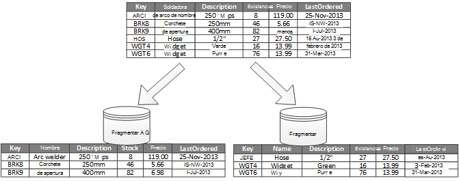
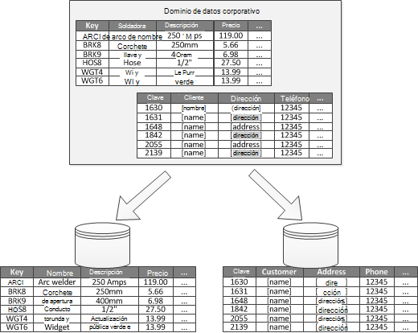

<properties
   pageTitle="Guía de particiones de datos | Microsoft Azure"
   description="Orientación sobre cómo separar las particiones para gestionar y acceder de forma independiente."
   services=""
   documentationCenter="na"
   authors="dragon119"
   manager="christb"
   editor=""
   tags=""/>

<tags
   ms.service="best-practice"
   ms.devlang="na"
   ms.topic="article"
   ms.tgt_pltfrm="na"
   ms.workload="na"
   ms.date="07/14/2016"
   ms.author="masashin"/>

# Guía de particiones de datos

[AZURE.INCLUDE [pnp-header](../includes/guidance-pnp-header-include.md)]

## Información general

En muchas soluciones a gran escala, los datos se dividen en particiones separadas que pueden administrar y acceso por separado. La estrategia de partición se debe elegir cuidadosamente para maximizar los beneficios y minimizar los efectos negativos. Partición puede ayudar a mejorar la escalabilidad, reducir los conflictos y optimizar el rendimiento. Otra ventaja de las particiones es que puede proporcionar un mecanismo para dividir datos por el patrón de uso. Por ejemplo, puede archivar menos activos (frías) los datos más antiguos en el almacenamiento de datos más económico.

## ¿Por qué dividir datos?

La mayoría de los servicios y aplicaciones de nube almacenan y recuperar datos como parte de sus operaciones. El diseño de la almacena datos que utiliza una aplicación puede tener una incidencia significativa en el rendimiento, rendimiento y escalabilidad de un sistema. Una técnica que normalmente se aplican en los sistemas de gran escala es dividir los datos en particiones independientes.

> El término _partición_ que se utiliza en esta guía se refiere al proceso de física dividir datos en almacena datos independiente. Esto no es igual a partición de tablas de SQL Server, que es un concepto diferente.

Partición de datos puede ofrecen varias ventajas. Por ejemplo, se puede aplicar a en:

- **Escalabilidad de mejorar**. Al cambiar la escala de un sistema de base de datos única, finalmente alcanzar un límite de hardware físico. Si divide los datos en varias particiones, cada una de las cuales se hospeda en un servidor independiente, puede escalar el sistema casi indefinidamente.
- **Mejorar el rendimiento**. Operaciones de acceso a datos en cada partición tienen lugar con un volumen más pequeño de datos. Siempre que los datos se dividen de manera adecuada, particiones para hacer el sistema más eficaz. Las operaciones que afectan a más de una partición se pueden ejecutar en paralelo. Cada partición puede estar cerca de la aplicación que utiliza para minimizar la latencia de red.
- **Mejorar la disponibilidad**. Separar los datos en varios servidores evita un punto único de error. Si se produce un error en un servidor, o está realizando mantenimiento planeado, solo los datos en que partición no está disponible. Las operaciones en otras particiones pueden continuar. Aumentar el número de particiones, reduce el impacto relativo de falla reduciendo el porcentaje de datos que va a estar disponibles. Replicar cada partición puede reducir aún más la posibilidad de un error de una única partición que afectan a las operaciones. También hace posible separar los datos importantes que deben estar continuamente y altamente disponibles en los datos de valor tiene pocos requisitos de disponibilidad (por ejemplo, archivos de registro).
- **Seguridad de mejorar**. Según la naturaleza de los datos y cómo se con particiones, es posible separar datos confidenciales y no confidenciales en diferentes particiones y, por tanto, se almacena en diferentes servidores o datos. Seguridad, a continuación, se puede optimizar específicamente para la información confidencial.
- **Proporcionar flexibilidad de funcionamiento**. Partición ofrece muchas oportunidades para ajustar las operaciones, maximizar la eficacia administrativa y minimizar el costo. Por ejemplo, puede definir diferentes estrategias para la administración, supervisión, copia de seguridad y restauración y otras tareas administrativas en función de la importancia de los datos de cada partición.
- **Coincidir el almacén de datos al modelo de uso**. Partición permite cada partición que se implementará en un tipo de almacén de datos, en función de costo y las características integradas que ofertas de almacén de datos diferente. Por ejemplo, datos binarios grandes pueden almacenarse en un almacén de datos blob, mientras más datos estructurados pueden mantenerse en una base de datos del documento. Para obtener más información, consulte [crear una solución polyglot] en la Guía de patrones y prácticas y [de acceso datos para soluciones ampliables muy: mediante SQL, NoSQL y persistencia polyglot] en el sitio Web de Microsoft.

Algunos sistemas de implementar la partición porque se considera un costo en lugar de una ventaja. Razones más comunes para este razonamiento son:

- Muchos de los sistemas de almacenamiento de datos no admiten combinaciones en todas las particiones y, a continuación, puede ser difícil mantener la integridad referencial en un sistema con particiones. A menudo es necesario implementar combinaciones y comprueba la integridad de código de la aplicación (en la capa particiones), esto puede ocasionar adicionales i/OS y complejidad de la aplicación.
- Mantener particiones no siempre es una tarea sencilla. En un sistema donde los datos son volátiles, necesitará equilibrar particiones periódicamente para reducir el conflicto y zonas activas.
- Algunas herramientas comunes no funcionan naturalmente con datos divididos.

## Diseñar particiones

Se pueden dividir datos de diferentes maneras: horizontal, vertical o funcionalidad. La estrategia que elija depende de la causa de los datos y los requisitos de las aplicaciones y servicios que usarán los datos.

> [AZURE.NOTE] Los esquemas de particiones descritos en esta guía se explican de forma independiente de la tecnología de almacenamiento de datos subyacente. Se puede aplicar a muchos tipos de bases de datos de NoSQL y almacena datos, incluidos relacional.

### Estrategias de partición

Las tres estrategias típicas para partición de datos son:

- **Partición horizontal** (a menudo denominadas _sharding_). En esta estrategia, cada partición es un almacén de datos en su propia derecha, pero todas las particiones tienen el mismo esquema. Cada partición se conoce como una _fragmentar_ y contiene un subconjunto específico de los datos, como todos los pedidos de un conjunto de clientes en una aplicación de comercio electrónico específico.
- **Partición vertical**. En esta estrategia, cada partición contiene un subconjunto de los campos para los elementos del almacén de datos. Los campos se dividen según su patrón de uso. Por ejemplo, campos frecuente pueden colocarse en una partición vertical y menos campos frecuente en otro.
- **Partición funcional**. En esta estrategia, los datos se agregan según cómo se utiliza por cada contexto limitada en el sistema. Por ejemplo, un sistema de comercio electrónico que implementa separar las funciones de negocio para la facturación y administración de inventario de productos podría almacenar datos de la factura en una partición y producto inventario datos en otro.

Es importante que tenga en cuenta que se pueden combinar las tres estrategias que se describen aquí. No aún se excluyen mutuamente y se recomienda que considere todos ellos al diseñar un esquema de particiones. Por ejemplo, puede dividir datos en shards y usar las particiones verticales a más subdividen los datos de cada fragmentar. Asimismo, los datos de una partición funcional se pueden dividir en shards (que también se pueden verticalmente dividir).

Sin embargo, los diferentes requisitos de cada estrategia pueden elevar un número de problemas en conflicto. Debe evaluar y saldo todas estas al diseñar un esquema de partición que cumpla los objetivos de rendimiento general de procesamiento de datos para su sistema. Las siguientes secciones exploración cada una de las estrategias con más detalle.

### Horizontal partición (sharding)

Figura 1 se muestra una descripción general de las particiones horizontales o sharding. En este ejemplo, los datos de inventario de productos se dividen en shards en función de la clave de producto. Cada fragmentar contiene los datos para un intervalo contiguo de claves fragmentar (A-G y H Z), organizados por orden alfabético.

_Figura 1. Partición horizontal de datos (sharding) basados en una clave de partición_

Sharding le ayuda a distribuir la carga entre varios equipos, lo que reduce el conflicto y mejora el rendimiento. Puede cambiar la escala del sistema agregando más shards que se ejecutan en servidores adicionales.

El factor más importante al implementar esta estrategia de partición es la opción de clave de sharding. Puede ser difícil cambiar la clave después de que el sistema esté en funcionamiento. La clave debe asegurarse de que se dividen los datos para que la carga de trabajo incluso como sea posible a través de la shards.

Tenga en cuenta que no es necesario shards diferentes que contienen similar volúmenes de datos. En su lugar, la consideración más importante es el número de solicitudes de saldo. Algunos shards pueden ser muy grandes, pero cada elemento es el asunto de un número bajo de operaciones de access. Otros shards podrían ser menores, pero se tiene acceso a cada elemento con más frecuencia. También es importante para asegurarse de que un único fragmentar no supere los límites de escala (en términos de capacidad y recursos de procesamiento) del almacén de datos que se utiliza para hospedar ese fragmentar.

Si utiliza una combinación de sharding, evite crear zonas activas (o particiones caliente) que puede afectar al rendimiento y la disponibilidad. Por ejemplo, si utiliza un hash de un identificador de cliente en lugar de la primera letra del nombre de un cliente, impedir la distribución equilibrada que resulta de letras iniciales comunes y menos comunes. Esta es una técnica típica que ayuda a distribuir datos de manera más uniforme en todas las particiones.

Elija una clave de sharding que minimiza cualquier requisito futuro para dividir shards grandes en partes más pequeñas, shards pequeñas de unión en particiones más grandes o cambiar el esquema que describe los datos almacenados en un conjunto de particiones. Estas operaciones pueden llevar mucho tiempo y que podría requerir desconectar uno o más shards mientras se realizan.

Si se duplican shards, es posible que algunas de las réplicas en línea mientras otras personas se dividen, combinar o volver a configurar. Sin embargo, el sistema necesite limitar las operaciones que se pueden realizar en los datos en estos shards mientras produce la nueva configuración. Por ejemplo, los datos de las réplicas pueden marcarse como de solo lectura para limitar el ámbito de incoherencias que pueden producirse mientras se está reestructurar shards.

> Para obtener más información e instrucciones sobre muchos de estos consideraciones y técnicas de buena práctica para diseñar almacena datos que implementa una partición horizontal, vea [Sharding de patrón].

### Las particiones verticales

El uso más común de particiones verticales es reducir las i/OS y costos de rendimiento asociados con la recopilación de los elementos que se tiene acceso con más frecuencia. Figura 2 muestra un ejemplo de particiones verticales. En este ejemplo, propiedades diferentes para cada elemento de datos se mantienen en particiones diferentes. Una partición contiene los datos que se tiene acceso con más frecuencia, incluido el nombre, la descripción y la información de precios de productos. Otra contiene el volumen en existencias y la última fecha pedida.

_Figura 2. Datos de particiones verticalmente por su patrón de uso_

En este ejemplo, la aplicación con regularidad consulta el nombre del producto, la descripción y el precio cuando se muestran los detalles del producto a clientes. El nivel de existencias y la fecha cuando el producto se ha encargado última del fabricante se encuentran en una partición independiente porque estos dos elementos son usados juntas.

Este esquema de partición tiene la ventaja que los datos relativamente movimiento lento (nombre de producto, descripción y precio) está separados de los datos más dinámicos (nivel de existencias y última fecha pedido). Una aplicación podría ser útil en caché los datos de movimiento lento en memoria si con frecuencia se tiene acceso a.

Otro escenario típico para esta estrategia de partición es maximizar la seguridad de la información confidencial. Por ejemplo, puede hacerlo almacenar números de tarjeta de crédito y los números de comprobación de seguridad de tarjeta correspondiente en particiones independientes.

Partición vertical, también puede reducir la cantidad de simultánea acceso que necesita a los datos.

> Partición vertical funciona en el nivel de entidad dentro de un almacén de datos, parcialmente normalizar una entidad para dividir hacia abajo desde un elemento _amplia_ a un conjunto de _restringir_ elementos. Es ideal para almacena datos orientada a columnas, como HBase y Casandra. Si los datos de una colección de columnas están probable que cambie, también puede utilizar la columna almacena en SQL Server.

### Partición funcional

Para sistemas cuando sea posible identificar un contexto limitado para cada área de negocio diferente o un servicio en la aplicación, partición funcional proporciona una técnica para mejorar el rendimiento de aislamiento y datos de access. Otro uso común de las particiones funcionales es separar los datos de lectura y escritura de datos de sólo lectura que se usan para generar informes. Figura 3 muestra una descripción general de las particiones funcionales donde se separan los datos de inventario de los datos del cliente.

_Figura 3. Funcionalidad de partición datos por contexto limitado o subdominio_

Esta estrategia de partición puede ayudar a reducir los conflictos de acceso de datos a través de distintas partes de un sistema.

## Diseñar particiones para escalabilidad

Es fundamental para tener en cuenta el tamaño y la carga de trabajo para cada partición y equilibrar ellos para que los datos se distribuyen para conseguir una máxima escalabilidad. Sin embargo, también debe dividir los datos para que no supere los límites de escala de un almacén de una única partición.

Cuando diseñe las particiones para escalabilidad, siga estos pasos:

1. Analizar la aplicación para comprender los patrones de acceso a datos, como el tamaño del conjunto de resultados devuelto por cada consulta, la frecuencia de acceso, la latencia inherente y el servidor calcular los requisitos de procesamiento. En muchos casos, unas entidades principales solicitará la mayoría de los recursos de procesamiento.
2. Use este análisis para determinar los objetivos de escalabilidad actuales y futuros, como el tamaño de datos y la carga de trabajo. A continuación, distribuir los datos en todas las particiones para cumplir con el objetivo de escalabilidad. En la estrategia de partición horizontal, elegir la clave adecuada fragmentar es importante para asegurarse de que la distribución es par. Para obtener más información, vea la [trama de Sharding].
3. Asegúrese de que los recursos disponibles para cada partición son suficientes para controlar los requisitos de escalabilidad en términos de rendimiento y tamaño de datos. Por ejemplo, el nodo que aloja una partición impone un límite de la cantidad de espacio de almacenamiento, procesamiento power o ancho de banda de red que proporciona. Si los requisitos de almacenamiento y tratamiento de datos están probable que supere estos límites, podría ser necesario refinar la estrategia de partición o dividir datos aún más. Por ejemplo, un enfoque de escalabilidad posible separar los datos de registro de las características principales de la aplicación. Para ello, usando almacena datos independiente para evitar que los requisitos de almacenamiento de datos total exceda el límite de escala del nodo. Si el número total de almacenamiento de datos supera el límite de nodo, podría ser necesario utilizar nodos de almacenamiento independiente.
4. Supervisar el sistema en uso para verificar que los datos se distribuyen como se esperaba y que las particiones pueden controlar la carga que se les imponen. Es posible que el uso no coincide con el uso anticipado por el análisis. En ese caso, es posible equilibrar las particiones. En su defecto, podría ser necesario volver a diseñar algunas partes del sistema para obtener el saldo necesario.

Tenga en cuenta que algunos entornos de nube asignación recursos en términos de los límites de infraestructura. Asegúrese de que los límites del límite seleccionado proporcionan espacio suficiente para cualquier crecimiento previsto en el volumen de datos, en términos de almacenamiento de datos, la potencia de procesamiento y ancho de banda.

Por ejemplo, si utiliza el almacenamiento de tablas de Azure, un fragmentar ocupado podría requerir más recursos que están disponibles para una sola partición para controlar las solicitudes. (Hay un límite para el volumen de solicitudes que se puede controlar con una sola partición durante un período de tiempo determinado. Consulte la página [destinos de rendimiento y escalabilidad de almacenamiento de Azure] en el sitio Web de Microsoft para obtener más detalles).

 Si este es el caso, la fragmentar posible que tenga que crear de nuevo particiones para distribuir la carga. Si el tamaño total o el rendimiento de estas tablas supera la capacidad de una cuenta de almacenamiento, podría ser necesario crear cuentas de almacenamiento adicional y extender las tablas a estas cuentas. Si el número de cuentas de almacenamiento supera el número de cuentas que están disponibles para una suscripción, podría ser necesario utilizar varias suscripciones.

## Diseñar particiones para el rendimiento de la consulta

Rendimiento de la consulta a menudo puede ampliarse mediante conjuntos de datos más pequeños y ejecución de consultas en paralelo. Cada partición debe contener una pequeña parte de todo el conjunto de datos. Esta reducción de volumen puede mejorar el rendimiento de las consultas. Sin embargo, la partición no es una alternativa para diseñar y configurar una base de datos de forma adecuada. Por ejemplo, asegúrese de que tiene los índices necesarios en su lugar, si está utilizando una base de datos relacional.

Cuando diseñe las particiones para el rendimiento de la consulta, siga estos pasos:

1. Examine los requisitos de la aplicación y el rendimiento:
    - Use los requisitos empresariales para determinar las consultas críticas que siempre se deben realizar rápidamente.
    - Supervisar el sistema para identificar las consultas que realizan lentamente.
    - Establecer las consultas que se realizan con más frecuencia. Una sola instancia de cada consulta podría tener un coste mínimo, pero el consumo acumulado de recursos podría ser significativo. Puede ser conveniente separar los datos que se recuperen por estas consultas en una partición distinta o incluso una caché.
2. Partición de los datos que está causando un rendimiento lento:
    - Limitar el tamaño de cada partición para que el tiempo de respuesta de consulta está dentro de destino.
    - Diseñar la tecla fragmentar para que la aplicación pueda encontrar fácilmente la partición si implementa partición horizontal. Impide que la consulta tener que examinar todas las particiones.
    - Tenga en cuenta la ubicación de una partición. Si es posible, intente mantener datos en particiones geográfico cerca de las aplicaciones y los usuarios que tienen acceso a ella.
3. Si una entidad tiene requisitos de rendimiento de rendimiento y la consulta, use partición funcional basado en esa entidad. Si sigue este no cumple los requisitos, se aplican también partición horizontal. En la mayoría de los casos basta con una sola estrategia de división, pero en algunos casos es más eficaz para combinar ambas estrategias.
4. Considere la posibilidad de usar consultas asíncronas que se ejecutan en paralelo en todas las particiones para mejorar el rendimiento.

## Diseñar particiones para disponibilidad

Partición de datos puede mejorar la disponibilidad de aplicaciones al asegurarse de que todo el conjunto de datos no constituye un punto único de error y que se pueden administrar subconjuntos individuales del conjunto de datos por separado. Replicación de particiones que contienen datos críticos también puede mejorar la disponibilidad.

Al diseñar e implementar particiones, tenga en cuenta los siguientes factores que afectan a la disponibilidad:

- **La importancia de los datos están para operaciones de negocios**. Algunos datos pueden incluir información empresarial crítica como detalles de factura o transacciones bancarias. Otros datos pueden incluir datos operativos menos críticos, como archivos de registro y trazas de rendimiento. Después de identificar cada tipo de datos, considere la posibilidad de:
    - Almacenamiento de datos críticos en particiones altamente disponibles con un plan de copia de seguridad adecuado.
    - Establecer independiente administración y supervisión mecanismos o procedimientos para la criticalities diferentes de cada conjunto de datos. Coloque los datos que tiene el mismo nivel de importancia en la misma partición para que se puede hacer copia juntos en una frecuencia adecuada. Por ejemplo, las particiones que contienen datos de transacciones bancarias posible que tenga que se realizan copias de seguridad con más frecuencia de particiones que contienen información de seguimiento o de registro.
- **Cómo se pueden administrar particiones individuales**. Diseñar particiones para admitir mantenimiento y administración independiente proporciona varias ventajas. Por ejemplo:
    - Si se produce un error en una partición, puede recuperar por separado sin que ello afecte instancias de aplicaciones que tienen acceso a datos en otras particiones.
    - Partición de los datos por zonas geográficas permite que las tareas de mantenimiento programado se producen en horas para cada ubicación. Asegúrese de que las particiones no son demasiado grandes para impedir que el mantenimiento previsto que se completan durante este período.
- **Si desea replicar datos críticos en todas las particiones**. Esta estrategia puede mejorar la disponibilidad y el rendimiento, aunque también puede introducir problemas de coherencia. Tiempo de los cambios realizados a los datos de una partición para sincronizarse con cada réplica. Durante este período, diferentes particiones contendrá distintos valores de datos.

## Descripción de cómo partición afecta al diseño y desarrollo

Utilizar las particiones agrega complejidad al diseño y desarrollo del sistema. Considere la posibilidad de división como una parte fundamental de incluso si de diseño de sistema del sistema inicialmente contiene solo una sola partición. Si bien tratar partición como una idea posterior, cuando se inicia el sistema sufra problemas de rendimiento y escalabilidad, la complejidad aumenta porque ya tiene un sistema directo para mantener.

Si actualiza el sistema para incorporar particiones en este entorno, necesita modificar la lógica de acceso a datos. También puede implicar migrar grandes cantidades de datos existentes para distribuirlo en todas las particiones, a menudo mientras esperan los usuarios puedan seguir utilizando el sistema.

En algunos casos, la partición no se considera importante porque el conjunto de datos inicial es pequeño y puede corregirse fácilmente por un solo servidor. Esto puede suceder en un sistema que no se espera escalar más allá de su tamaño inicial, pero muchos sistemas comerciales tenga que expandir como el número de usuarios aumenta. Esta expansión normalmente se acompaña un crecimiento del volumen de datos.

También es importante conocer que partición no siempre es una función de almacenamiento de datos de gran tamaño. Por ejemplo, un almacén de datos pequeña podría tener mucho acceso a cientos de clientes simultáneos. Particiones los datos en esta situación pueden ayudar a reducir los conflictos y mejorar el rendimiento.

Cuando diseñe un esquema de partición de datos, tenga en cuenta los siguientes puntos:

- **Cuando sea posible, mantener juntos de datos para las operaciones de base de datos más comunes de cada partición para minimizar las operaciones de acceso a datos entre partición**. Consulta en todas las particiones puede ser más tiempo que consultar únicamente dentro de una sola partición, pero optimizar particiones para un conjunto de consultas negativo puede afectar a otros conjuntos de consultas. Cuando no se puede evitar consultas a través de particiones, minimizar el tiempo de consulta ejecutar consultas en paralelo y agregando los resultados de la aplicación. Este enfoque no sea posible en algunos casos, como cuando es necesario obtener un resultado de una consulta y usarla en la consulta siguiente.
- **Si las consultas Asegúrese de usar relativamente estática de datos de referencia, como tablas de código postal o listas de productos, considere la posibilidad de replicar estos datos en todas las particiones para reducir el requisito de las operaciones de búsqueda independiente en diferentes particiones**. Este enfoque también puede reducir la probabilidad de que los datos de referencia convertirse en un conjunto de datos "activo" que está sujeta a mucho tráfico de en todo el sistema. Sin embargo, hay un coste adicional asociado con la sincronización de los cambios que pueden producirse en estos datos de referencia.
- **Cuando sea posible, minimizar los requisitos de la integridad referencial en todas las particiones verticales y funcionales**. En estos esquemas, la aplicación es responsable de mantener la integridad referencial en todas las particiones cuando se actualiza y consume datos. Consultas que deben combinar los datos en varias particiones se ejecutan más despacio que las consultas que combinan datos solo en la misma partición porque la aplicación normalmente necesita realizar consultas consecutivas basadas en una clave y, a continuación, en una clave externa. En su lugar, considere la posibilidad de replicar o anule la normalizar los datos pertinentes. Para reducir el tiempo de la consulta que sean necesarias combinaciones cruzadas partición, ejecutar consultas en paralelo a través de las particiones y unirse a los datos dentro de la aplicación.
- **Tenga en cuenta el efecto que podría tener el esquema de particiones en la coherencia de los datos en todas las particiones.** Evaluar si coherencia fuerte es realmente necesario. En su lugar, un enfoque común en la nube es implementar la coherencia. Se actualizan los datos de cada partición por separado y la lógica de la aplicación se asegura de que las actualizaciones se han completado todas correctamente. También trata las incoherencias que pueden surgir de consultar datos mientras se está ejecutando una operación finalmente coherente. Para obtener más información sobre cómo implementar la coherencia, consulte el [manual de la coherencia de datos].
- **Tenga en cuenta cómo consultas localizan la partición correcta**. Si una consulta debe buscar todas las particiones para ubicar los datos necesarios, hay un impacto significativo en el rendimiento, incluso cuando se están ejecutando varias consultas en paralelo. Consultas que se usan con estrategias de partición verticales y funcionales naturalmente pueden especificar las particiones. Sin embargo, partición horizontal (sharding) puede ser localizar un elemento difícil porque cada fragmentar tiene el mismo esquema. Una solución típica para sharding es mantener un mapa que se pueden usar para buscar la ubicación de partes de los elementos específicos de datos. Esta asignación puede ha implementado en la lógica de sharding de la aplicación, o se mantienen el almacén de datos si admite sharding transparente.
- **Cuando se usa una estrategia de división horizontal, considere la posibilidad de volver a equilibrar la shards periódicamente**. Esto le permite distribuir uniformemente los datos por tamaño y por la carga de trabajo para minimizar los puntos de conexión, maximizar el rendimiento de la consulta y eludir las limitaciones de almacenamiento físico. Sin embargo, esta es una tarea compleja que a menudo requiere el uso de una herramienta personalizada o un proceso.
- **Si replicar cada partición proporciona protección adicional contra errores**. Si se produce un error en una única réplica, las consultas se pueden dirigir hacia una copia de trabajo.
- **Si alcanza los límites físicos de una estrategia de división, necesite ampliar la escalabilidad a un nivel diferente**. Por ejemplo, si la partición es en el nivel de base de datos, debe buscar o replicar particiones en varias bases de datos. Si la partición ya está en el nivel de base de datos y limitaciones físicas son un problema, puede indicar que necesita localizar o replicar particiones en varias cuentas de hospedaje.
- **Evitar las transacciones que tener acceso a datos en varias particiones**. Algunos coherencia transacciones de implementación almacena los datos y la integridad de las operaciones que modificar los datos, pero solo cuando los datos se encuentran en una sola partición. Si necesita compatibilidad con transacciones entre varias particiones, probablemente necesite implementar como parte de la lógica de la aplicación porque no ofrecen compatibilidad con sistemas más particiones.

Todos los almacena datos requiere algunos administración operativa y supervisar la actividad. Las tareas pueden ser cargar datos, una copia de seguridad y restauración de datos, reorganizar los datos y garantizar que el sistema lleva a cabo correctamente y eficaz.

Tenga en cuenta los siguientes factores que afectan a la administración de las operaciones:

- **Cómo implementar apropiado tareas operativas y cuando los datos se dividen**. Estas tareas pueden incluir copia de seguridad y restauración, archivado de datos, supervisar el sistema y otras tareas administrativas. Por ejemplo, manteniendo la coherencia lógica durante las operaciones de copia de seguridad y restauración puede ser un reto.
- **Cómo cargar los datos en varias particiones y agregar nuevos datos que se llegan desde otros orígenes**. Algunas herramientas y utilidades podrían no admitir operaciones de datos sharded como cargar datos en la partición correcta. Esto significa que es posible que tenga que cree u obtenga nuevas herramientas y utilidades.
- **Cómo archivar y eliminar los datos de forma regular**. Para evitar que el crecimiento excesivo de las particiones, debe archivar y eliminar los datos de una forma regular (quizás mensual). Podría ser necesario transformar los datos para que coincidan con un esquema de otro archivo.
- **Cómo localizar problemas de integridad de datos**. Considere la posibilidad de ejecutar un proceso periódico para localizar los problemas de integridad de datos, como los datos en una partición que hace referencia a la información que falta en otro. El proceso puede intentar solucionar estos problemas de forma automática o subir una alerta para un operador para corregir los problemas manualmente. Por ejemplo, en una aplicación de comercio electrónico, información de pedidos puede mantenerse en una partición pero los elementos de línea que constituyen cada pedido podría mantenerse en otro. El proceso de un pedido debe agregar datos a otras particiones. Si este proceso falla, hay podrían elementos de línea almacenarse para que no aparezca ninguna orden correspondiente.

Tecnologías de almacenamiento de datos distintos suelen proporcionan sus propias características para admitir particiones. Las secciones siguientes resumen las opciones que se implementan por almacena datos que se usan normalmente con aplicaciones de Azure. También se describen consideraciones de diseño de aplicaciones que mejor pueden aprovechar las ventajas de estas características.

## Estrategias de partición de base de datos de SQL Azure

Base de datos de SQL Azure es un relacional base de datos como-servicio que se ejecuta en la nube. Se basa en Microsoft SQL Server. Una base de datos relacional divide la información en tablas y cada tabla contiene información sobre las entidades como una serie de filas. Cada fila contiene columnas que contienen los datos de los campos individuales de una entidad. La página [¿Qué es la base de datos de SQL Azure?] en Microsoft sitio Web proporciona documentación detallada sobre la creación y uso de las bases de datos SQL.

## Partición horizontal con elásticos de la base de datos

Una sola base de datos SQL tiene un límite para el volumen de datos que puede contener. El rendimiento está limitado por factores arquitectónicas y el número de conexiones simultáneas que admite. La característica de base de datos elástico de base de datos de SQL es compatible con escala horizontal para una base de datos SQL. Utilizar elásticos de la base de datos, puede dividir los datos en shards que se extienden a través de varias bases de datos SQL. También puede agregar o quitar shards que el volumen de datos que necesite controlen crece y se reducirá. Utilizar elásticos de la base de datos también puede ayudar a reducir los conflictos al distribuir la carga entre las bases de datos.

> [AZURE.NOTE] Base de datos elástico es reemplaza la característica de federaciones de base de datos de SQL Azure. Existente instalaciones se pueden migrar a elásticos de la base de datos mediante la herramienta de migración de federaciones la federación de base de datos de SQL. Como alternativa, puede implementar su propio mecanismo de sharding si su caso no es un naturalmente a las características que se proporcionan en base de datos elástico.

Cada fragmentar se implementa como una base de datos SQL. Un fragmentar puede contener más de un conjunto de datos (como un _shardlet_). Cada base de datos mantiene metadatos que describe el shardlets que contiene. Un shardlet puede ser un solo elemento de datos, o puede ser un grupo de elementos que comparten la misma clave shardlet. Por ejemplo, si está sharding los datos en una aplicación multiempresa, la clave de shardlet puede ser el identificador del inquilino y se pueden almacenar todos los datos de un determinado inquilino como parte de la misma shardlet. Datos de otros inquilinos debería mantenerse en shardlets diferentes.

Es responsabilidad del programador para asociar un conjunto de datos con una clave de shardlet. Una base de datos SQL independiente actúa como un administrador de mapa fragmentar global. Esta base de datos contiene una lista de todos los shards y shardlets en el sistema. Una aplicación de cliente que tiene acceso a datos se conecta primero la fragmentar global mapa manager base de datos para obtener una copia de la equivalencia de fragmentar (anuncio shards y shardlets), que almacena en caché localmente.

A continuación, la aplicación usa esta información para enrutar las solicitudes de datos a las partes adecuado. Esta funcionalidad está oculta detrás de una serie de API que figuran en la Azure base de datos elástico base de datos cliente biblioteca SQL, que está disponible como un paquete de NuGet. La página [Introducción a las características elásticos de la base de datos] en el sitio Web de Microsoft proporciona una introducción más completa a elásticos de la base de datos.

> [AZURE.NOTE] Puede replicar la base de datos del administrador del mapa fragmentar global para reducir la latencia y mejorar la disponibilidad. Si implementa la base de datos mediante uno de los niveles de precios Premium, puede configurar la replicación de active geo para continuamente copiar datos en bases de datos de diferentes regiones. Crear una copia de la base de datos de cada región en la que se basan los usuarios. A continuación, configure la aplicación para conectarse a esta copia para obtener el mapa fragmentar.

> Un enfoque alternativo es usar la sincronización de datos de SQL Azure o una canalización del generador de datos de Azure replicar la base de datos de administrador de mapa fragmentar a través de las regiones. Este formulario de replicación se ejecuta periódicamente y es más adecuado si el mapa de partes no cambia con frecuencia. Además, la base de datos del Administrador de mapa de partes no tiene que debe crearse usando un nivel de precios de Premium.

Base de datos elástico proporciona dos combinaciones para la asignación de datos para shardlets y almacenarlos en shards:

- Un **mapa de lista fragmentar** describe una asociación entre una única clave y un shardlet. Por ejemplo, en un sistema multiempresa, los datos de cada inquilino pueden asociados a una clave única y almacenados en su propio shardlet. Para garantizar la privacidad y aislamiento (es decir, para evitar que se agote los recursos de almacenamiento de datos disponibles a otras personas un inquilino), cada shardlet puede mantenerse dentro de su propia fragmentar.

_Figura 4. Utilizando un mapa de partes de la lista para almacenar los datos del inquilino en shards independientes_

- Un **mapa de rango fragmentar** describe una asociación entre un conjunto de valores claves contiguos y un shardlet. En el ejemplo multiempresa descrito anteriormente, como una alternativa a implementar shardlets dedicado, puede agrupar los datos de un conjunto de inquilinos (cada una con su propia clave) dentro de la misma shardlet. Esta combinación es menor que la primera (porque los inquilinos compartan recursos de almacenamiento de datos), pero también se crea un riesgo de privacidad de los datos reducida y aislamiento.

_Figura 5. Utilizando un mapa de partes de rango para almacenar los datos de un rango de inquilinos en una de las partes_

Tenga en cuenta que un único fragmentar puede contener los datos de varios shardlets. Por ejemplo, puede usar lista shardlets para almacenar datos para diferentes inquilinos no contiguos en el mismo fragmentar. También se pueden mezclar rango shardlets y shardlets de lista en la misma fragmentar, aunque se solucionará mediante mapas diferentes en la base de datos de administrador de mapa fragmentar global. (La base de datos de administrador de mapa fragmentar globales puede contener mapas de varias partes). Figura 6 muestra este enfoque.

_Figura 6. Implementación de varias partes de mapas_

Implementar el esquema de particiones puede tener una incidencia significativa en el rendimiento del sistema. También puede afectar a la velocidad a la que shards tiene que agregar o quitar o la tasa a la que se deben dividir datos a través de shards. Cuando utiliza elásticos de la base de datos para dividir los datos, tenga en cuenta los siguientes puntos:

- Agrupar los datos que se utilizan juntos en la misma fragmentar y evitar las operaciones que necesitan tener acceso a los datos que se almacenan en varios shards. Tenga en cuenta que con la base de datos elástico, un fragmentar es una base de datos SQL en su propia derecha y base de datos de SQL Azure no admite las combinaciones entre bases de datos (que deben realizarse en el cliente). Recuerde también que en la base de datos de SQL Azure, restricciones de integridad referencial, desencadenadores y procedimientos almacenados en una base de datos no se pueden hacer referencia a objetos en otro. Por lo tanto, no diseñar un sistema que tiene las dependencias entre shards. Una base de datos SQL sin embargo, puede contener tablas que contienen copias de los datos de referencia usados por las consultas y otras operaciones. Estas tablas no tienen que pertenezcan a cualquier shardlet específica. Replicación de datos a través de shards puede ayudar a quitar la necesidad de combinar los datos que se extiende por las bases de datos. Lo ideal es que, estos datos debería estática o movimiento lento para minimizar el esfuerzo de replicación y reducir las posibilidades de que se está volviendo obsoletos.

    > [AZURE.NOTE] Aunque la base de datos SQL no admite las combinaciones entre bases de datos, puede realizar consultas partes cruzado con la API de base de datos elástico. Estas consultas transparente pueden recorrer los datos mantenidos en todos los shardlets que hace referencia a un mapa de partes. Lo saltos elástico API de base de datos entre-fragmentar consulta hacia abajo en una serie de consultas individuales (uno para cada base de datos) y, a continuación, combina los resultados. Para obtener más información, consulte la página [fragmentar múltiples consultas] en el sitio Web de Microsoft.

- Los datos almacenados en shardlets que pertenecen a la misma básica fragmentar deberían tener el mismo esquema. Por ejemplo, no crear un mapa de partes de lista que apunta a algunas shardlets que contiene los datos del inquilino y otras shardlets que contiene la información de producto. No se aplica esta regla elásticos de la base de datos, pero la administración de datos y consultas se convierte en muy complejo si cada shardlet tiene un esquema diferente. En el ejemplo simplemente citado, un buen es la solución consiste en crear dos mapas de partes de la lista: uno que hace referencia a datos del inquilino y otro que señala a información de producto. Recuerde que los datos que pertenecen a diferentes shardlets pueden almacenarse en la misma fragmentar.

    > [AZURE.NOTE] La funcionalidad de consulta entre partes de la API de base de datos elástico depende de cada shardlet en el mapa de partes que contiene el mismo esquema.

- Solo se admiten operaciones de transacciones de datos que se mantienen dentro de la misma fragmentar y no a través de shards. Las transacciones pueden abarcar shardlets siempre que forman parte de la misma fragmentar. Por lo tanto, si la lógica empresarial debe realizar transacciones, almacenar los datos afectados en la misma fragmentar o implementar la coherencia. Para obtener más información, consulte el [manual de la coherencia de datos].
- Colocar shards cerca de los usuarios que tienen acceso a los datos en esos shards (en otras palabras, geo-localice la shards). Esta estrategia ayuda a reducir la latencia.
- Evitar tener una mezcla de muy activo (puntos de conexión) y shards relativamente inactivos. Pruebe a distribuir la carga uniformemente entre shards. Esto podría requerir hash las teclas shardlet.
- Si está shards localizar geo, asegúrese de que las claves hash asignan a shardlets mantenidos en shards almacenados cerca de los usuarios que tienen acceso a datos.
- Actualmente, solo un conjunto limitado de como claves shardlet; se admiten los tipos de datos SQL _int, bigint, varbinary_ y _uniqueidentifier_. Los tipos de _entero_ y _bigint_ SQL corresponden a los tipos de datos _int_ y _long_ en C# y tienen los mismos intervalos. El tipo de _varbinary_ SQL puede corregirse mediante el uso de una matriz de _bytes_ en C#, y el tipo de _uniqueidentier_ SQL corresponde a la clase _Guid_ en .NET Framework.

Como se indica el nombre, elásticos de la base de datos hace posible para un sistema agregar y quitar shards como el volumen de datos disminuye y crece. Las API de la biblioteca de cliente de base de datos de elásticos de base de datos de SQL de Azure habilitar una aplicación crear y eliminar shards dinámicamente (y transparente actualizar el Administrador de mapa fragmentar). Sin embargo, quitar una fragmentar es destructivo que también requiere la eliminación de todos los datos de ese fragmentar.

Si una aplicación debe dividir un fragmentar en dos shards independientes o combinar shards, elásticos de la base de datos ofrece un servicio de combinación de división independiente. Este servicio se ejecuta en un servicio hospedado de nube (que debe crearse por el programador) y migra datos de forma segura entre shards. Para obtener más información, vea el tema de la [escala con la herramienta de combinación de la división de elásticos de la base de datos] en el sitio Web de Microsoft.

## Estrategias de partición para el almacenamiento de Azure

Almacenamiento de Azure ofrece tres abstracciones para administrar datos:

- Almacenamiento de tablas, que implementa almacenamiento scalable estructura. Una tabla contiene una colección de entidades, cada una de las cuales puede incluir un conjunto de valores y las propiedades.
- Almacenamiento de blobs, que proporciona almacenamiento de archivos y objetos de gran tamaño.
- Colas de almacenamiento, que admiten la mensajería asincrónica confiable entre aplicaciones.

Almacenamiento de tablas y almacenamiento de blobs son stores esencialmente del valor de clave que están optimizados para almacenar datos estructurados y respectivamente. Colas de almacenamiento proporcionan un mecanismo para generar aplicaciones de acoplamiento flexible, scalable. Colas de almacenamiento, almacenamiento de blobs y almacenamiento de tablas se crean en el contexto de una cuenta de almacenamiento de Azure. Tres formas de redundancia es compatible con cuentas de almacenamiento:

- **Almacenamiento redundante local**, que mantiene tres copias de datos dentro de un único centro de datos. Este formulario de redundancia protege contra fallos de hardware, pero no contra desastres que abarque el centro de datos completo.
- Almacenamiento redundante **zone**, que mantiene tres copias de los datos que se extienden a través de los centros de datos distintos en la misma región (o a través de dos regiones geográfico cerrar). Este formulario de redundancia de protección contra desastres que se producen en un único centro de datos, pero no pueden protegerse de desconexión de la red a gran escala que afectan a toda una región. Tenga en cuenta que redundantes de zona de almacenamiento está actualmente solo están disponible para blobs de bloque.
- **Almacenamiento Geo redundante**, que mantiene seis copias de datos: tres copias en una región (su región local) y otro tres en una región remota. Este formulario de redundancia proporciona el máximo nivel de protección ante desastres.

Microsoft ha publicado destinos escalabilidad para el almacenamiento de Azure. Para obtener más información, consulte la página [destinos de rendimiento y escalabilidad de almacenamiento de Azure] en el sitio Web de Microsoft. Actualmente, la capacidad de la cuenta de almacenamiento total no puede exceder 500 TB. (Esto incluye el tamaño de los datos que se almacenan en el almacenamiento de tablas y el almacenamiento de blobs, así como mensajes pendientes que se encuentran en la cola de almacenamiento).

La tasa de solicitud máximo (suponiendo que una entidad de 1 KB, blob o tamaño del mensaje) es 20 KBps. Si el sistema es probable que supere estos límites, considere la posibilidad de partición de la carga entre varias cuentas de almacenamiento. Una sola suscripción Azure puede crear hasta 100 cuentas de almacenamiento. Sin embargo, tenga en cuenta que estos límites se pueden cambiar con el tiempo.

## Partición de almacenamiento de tablas de Azure

Almacenamiento de tablas Azure es un almacén de valor de clave que está diseñado para particiones. Todas las entidades se almacenan en una partición y almacenamiento de tablas Azure administra internamente particiones. Cada entidad que se almacena en una tabla debe proporcionar una clave de dos partes que incluye:

- **La clave de partición**. Este es un valor de cadena que determina en qué partición de almacenamiento de tablas Azure colocará la entidad. Todas las entidades con la misma clave de partición se almacenarán en la misma partición.
- **La clave de la fila**. Esto es otro valor de cadena que identifica la entidad dentro de la partición. Todas las entidades dentro de una partición se ordenan instrucción, en orden ascendente, con esta clave. La combinación de teclas de fila o clave de partición debe ser única para cada entidad y no puede superar 1 KB de longitud.

El resto de los datos de una entidad consta de los campos definidos por la aplicación. No se aplican esquemas específicos, y cada fila puede contener un conjunto diferente de campos definidos por la aplicación. La única limitación es que el tamaño máximo de una entidad (incluidas las teclas partición y fila) está actualmente 1 MB. El tamaño máximo de una tabla es 200 TB, aunque estas cifras podrían cambiar en el futuro. (Consulte la página [destinos de rendimiento y escalabilidad de almacenamiento de Azure] en el sitio Web de Microsoft para obtener la información más reciente acerca de estos límites).

Si está intentando almacenar entidades que superan esta capacidad, considere la posibilidad de división de ellos en varias tablas. Use las particiones verticales para dividir los campos en los grupos que están más probable que puede tener acceso a juntas.

Figura 7 muestra la estructura lógica de una cuenta de almacenamiento de ejemplo (datos de Contoso) para una aplicación de comercio electrónico ficticio. La cuenta de almacenamiento contiene tres tablas: información del cliente, información de producto y orden de información. Cada tabla tiene varias particiones.

En la tabla de información del cliente, los datos se dividen según la ciudad en la que está ubicado el cliente y la clave de la fila contiene el identificador de cliente. En la tabla de información del producto, se dividen los productos por categoría de producto y la clave de la fila contiene el número de producto. En la tabla de información del pedido, los pedidos se dividen por la fecha en que han colocado y la clave de fila especifica el tiempo que se ha recibido el pedido. Tenga en cuenta que todos los datos se ordenan por la clave de la fila de cada partición.

_Figura 7. Las tablas y las particiones en una cuenta de almacenamiento de ejemplo_

> [AZURE.NOTE] Almacenamiento de tablas Azure también agrega un campo de marca de tiempo para cada entidad. El campo de marca de tiempo se mantiene al almacenamiento de la tabla y se actualiza cada vez que se modifica y se vuelve a escribir en una partición de la entidad. El servicio de almacenamiento de la tabla, utiliza este campo para implementar simultaneidad optimista. (Cada vez que una aplicación de una entidad vuelve a escribe el almacenamiento de tablas, el servicio de almacenamiento de la tabla compara el valor de la marca de tiempo en la entidad que se escribe con el valor que se guarda en el almacenamiento de tablas. Si los valores son diferentes, significa que otra aplicación debe ha modificado la entidad desde la última ha recuperado y, a continuación, se produce un error en la operación de escritura. No modifique este campo en su propio código y no se especifica un valor para este campo cuando se crea una nueva entidad.

Almacenamiento de tablas Azure usa la clave de partición para determinar cómo almacenar los datos. Si una entidad se agrega a una tabla con una clave de partición previamente sin usar, almacenamiento de tablas Azure crea una nueva partición para esta entidad. Otras entidades con la misma clave de partición se almacenarán en la misma partición.

Este mecanismo eficaz implementa una estrategia de escalado automático. Cada partición se almacena en un único servidor en un centro de datos de Azure para ayudar a garantizar que las consultas que recuperan datos de una sola partición ejecutan rápidamente. Sin embargo, pueden distribuirse diferentes particiones entre varios servidores. Además, un único servidor puede alojar varias particiones si estas particiones están limitadas en tamaño.

Cuando diseñe las entidades para el almacenamiento de tablas de Azure, tenga en cuenta los siguientes puntos:

- La selección de valores clave de partición clave y fila debería controlada a la forma en que se accede a los datos. Elija una combinación de teclas partición o una fila de clave que admite la mayoría de las consultas. Las consultas más eficaces recuperan datos especificando la clave de partición y la fila. Consultas que especifican una clave de partición y un intervalo de claves de fila pueden realizarse mediante el análisis de una sola partición. Esto es relativamente rápido porque los datos están guardados en el orden de la fila. Si las consultas no especifican qué partición de análisis, la clave de partición necesite almacenamiento de tablas de Azure para analizar todas las particiones para sus datos.

    > [AZURE.TIP] Si una entidad tiene una clave natural, como la clave de partición y especifique una cadena vacía como la clave de la fila. Si una entidad tiene una clave compuesta que incluye dos propiedades, seleccione la propiedad que cambia más despacio como la clave de partición y el otro como la clave de la fila. Si una entidad tiene más de dos propiedades clave, utilice una concatenación de propiedades para proporcionar las teclas partición y fila.

- Si realiza consultas de buscar datos utilizando los campos que no sean las teclas partición y fila con regularidad, considere la posibilidad de implementar el [Diseño de la tabla de índice].
- Si generar claves de partición a través de un aumento monotónico o disminuir la secuencia (por ejemplo, "0001", "0002", "0003" y así sucesivamente) y cada partición contiene solo una cantidad limitada de datos, almacenamiento de tablas Azure física puede agrupar estas particiones juntos en el mismo servidor. Este mecanismo supone que la aplicación suele realizar consultas a través de un intervalo contiguo de particiones (consultas de rango) y está optimizada para este caso. Sin embargo, este enfoque puede producir puntos de conexión centrados en un único servidor en todas las inserciones de las nuevas entidades es probable que sean concentrado en uno u otro de los rangos contiguos. También puede reducir escalabilidad. Para distribuir la carga de manera más uniforme entre servidores, considere la posibilidad de la clave de partición para hacer que la secuencia más aleatoria hash.
- Almacenamiento de tablas Azure es compatible con las operaciones de transacciones para entidades que pertenecen a la misma partición. Esto significa que una aplicación puede realizar varias Insertar, actualizar, eliminar, reemplazar o las operaciones de combinación como una unidad atómica (siempre y cuando la transacción no incluye más de 100 entidades y la carga de la solicitud no supere 4 MB). Operaciones que abarcan varias particiones no son transacciones y podría ser necesario implementar la coherencia a como se describe en el [manual de la coherencia de datos]. Para obtener más información sobre el almacenamiento de tablas y las transacciones, vaya a la página [transacciones de grupo de la entidad de realizar] en el sitio Web de Microsoft.
- Prestar atención cuidado el nivel de detalle de la clave de partición por los siguientes motivos:
    - Con la misma clave de partición para cada entidad hace que el servicio de almacenamiento de la tabla crear una sola partición grande que se almacena en un servidor. Esto impide que el escalado y concentra en su lugar la carga en un solo servidor. Como resultado, este método solo es adecuado para sistemas que administran un pequeño número de entidades. Sin embargo, este enfoque garantiza que todas las entidades pueden participar en transacciones de grupo de la entidad.
    - Con una clave de partición único para cada entidad hace que el servicio de almacenamiento de la tabla crear una partición independiente para cada entidad, lo que puede que un gran número de particiones pequeñas (dependiendo del tamaño de las entidades). Este enfoque es más scalable que con una clave de una sola partición, pero no son posibles transacciones de grupo de la entidad. Además, las consultas que capturar más de una entidad pueden implicar lectura desde más de un servidor. Sin embargo, si la aplicación realiza consultas de rango, eligiendo una secuencia monotónica para generar las claves de partición puede ayudarle a optimizar estas consultas.
    - Compartir la clave de partición a través de un subconjunto de entidades permite agrupar entidades en la misma partición relacionadas. Pueden realizar las operaciones que implican entidades relacionadas mediante transacciones de grupo de la entidad y pueden satisfacer consultas que recuperar un conjunto de entidades relacionadas mediante el acceso a un solo servidor.

Para obtener información adicional sobre particiones datos en el almacenamiento de tablas de Azure, vea el artículo [Guía de diseño de tabla de almacenamiento de Azure] en el sitio Web de Microsoft.

## Partición de almacenamiento de blobs de Windows Azure

Almacenamiento de blobs de Windows Azure hace posible contener objetos binarios grandes--actualmente hasta 200 GB de tamaño para blobs de bloque o 1 TB para blobs de página. (Para obtener la información más reciente, vaya a la página [destinos de rendimiento y escalabilidad de almacenamiento de Azure] en el sitio Web de Microsoft.) Usar bloque BLOB en escenarios como transmisión donde se necesita para cargar o descargar grandes volúmenes de datos rápidamente. Use blobs de página para las aplicaciones que requieren aleatorios en lugar de acceso de serie a partes de los datos.

Cada blob (bloque o página) se almacena en un contenedor de una cuenta de almacenamiento de Azure. Puede utilizar los contenedores para agrupar BLOB relacionada que tiene los mismos requisitos de seguridad, aunque esta agrupación es más lógico que físico. Dentro de un contenedor, cada blob tiene un nombre único.

Almacenamiento de blobs se divide automáticamente en función del nombre de blobs de Windows. Cada blob se guarda en su propia partición. BLOB en el mismo contenedor no compartir una partición. Esta arquitectura ayuda almacenamiento de blobs de Windows Azure para equilibrar la carga entre servidores transparente como BLOB diferentes en el mismo contenedor puede distribuirse en diferentes servidores.

Las acciones de escritura de un único bloque (blob bloque) o una página (blob de página) son atómicas, pero no operaciones que abarcan bloques, páginas o BLOB. Si necesita garantizar la coherencia al realizar operaciones de escritura en bloques, páginas y BLOB, extraer un bloqueo de escritura utilizando una concesión de blobs de Windows.

Almacenamiento de blobs de Windows Azure es compatible con tasas de transferencia de hasta 60 MB por segunda o 500 solicitudes por segundo para cada blob. Si prevé que va a anula estos límites y los datos blob están relativamente estáticos, considere la posibilidad de replicar BLOB mediante el uso de la red de entrega de contenido de Azure. Para obtener más información, consulte la página [usando contenido red de entrega de Azure] en el sitio Web de Microsoft. Para obtener orientación adicional y consideraciones, vea [usando contenido red de entrega de Azure].

## Partición colas de almacenamiento de Azure

Colas de almacenamiento de Azure le permiten implementar mensajería asincrónica entre procesos. Una cuenta de almacenamiento de Azure puede contener cualquier número de colas y cada cola puede contener cualquier número de mensajes. La única limitación es el espacio disponible en la cuenta de almacenamiento. El tamaño máximo de un mensaje individual es 64 KB. Si necesita mensajes mayores de esto, considere la posibilidad de usar colas de Bus de servicio de Azure en su lugar.

Cada cola de almacenamiento tiene un nombre único dentro de la cuenta de almacenamiento que lo contiene. Azure particiones colas basadas en el nombre. Todos los mensajes de la misma cola se almacenan en la misma partición, que está controlada por un solo servidor. Distintos servidores para ayudar a equilibrar la carga, se pueden administrar colas diferentes. La asignación de colas a servidores es transparente para las aplicaciones y los usuarios.

 En una aplicación a gran escala, no use la misma cola de almacenamiento para todas las instancias de la aplicación porque este enfoque puede provocar que el servidor que hospeda la cola para convertirse en una zona activa. En su lugar, use colas diferentes para las distintas áreas funcionales de la aplicación. Colas de almacenamiento de Azure no admiten transacciones, para dirigir mensajes a diferentes colas debería tener poca influencia sobre mensajería coherencia.

Puede controlar una cola de almacenamiento de Azure hasta 2.000 mensajes por segundo.  Si necesita procesar los mensajes a una velocidad mayor que esto, considere la posibilidad de crear varias colas. Por ejemplo, en una aplicación global, crear colas de almacenamiento independiente en cuentas de almacenamiento independientes para controlar las instancias de la aplicación que se ejecutan en cada región.

## Estrategias de partición para Bus de servicio de Azure

Bus de servicios de Azure usa a un agente de mensaje para controlar los mensajes que se envían a una cola de Bus de servicio o un tema. De forma predeterminada, todos los mensajes que se envían a una cola o tema se administran por el mismo proceso de agente de mensaje. Esta arquitectura puede colocar una limitación en el rendimiento general de la cola de mensajes. Sin embargo, también puede dividir una cola o tema cuando se crea. Para ello, estableciendo la propiedad _EnablePartitioning_ de la descripción de la cola o tema en _true_.

Una cola dividida o tema está dividido en varios fragmentos, cada una de las cuales se guarda en un almacén de mensajes independiente y el agente de mensaje. Bus de servicio asume la responsabilidad para crear y administrar estos fragmentos. Cuando una aplicación envía un mensaje a una cola con particiones o un tema, Bus de servicio asigna el mensaje a un fragmento de esa cola o tema. Cuando una aplicación recibe un mensaje de una cola o suscripción, Bus de servicio comprueba cada fragmento para el siguiente mensaje disponible y, a continuación, se pasa a la aplicación para el procesamiento.

Esta estructura le ayuda a distribuir la carga en agentes de mensaje y mensaje stores, aumentando escalabilidad y mejorar la disponibilidad. Si el almacén de mensajes o agente de mensajes para un fragmento de no está disponible temporalmente, Bus de servicio puede recuperar mensajes de uno de los fragmentos disponibles restantes.

Bus de servicio asigna un mensaje a un fragmento de la siguiente manera:

- Si el mensaje pertenece a una sesión, todos los mensajes con el mismo valor de la propiedad _ID_ se envían al mismo fragmento.
- Si el mensaje no pertenece a una sesión, pero el remitente ha especificado un valor de la propiedad _PartitionKey_ , todos los mensajes con el mismo valor de _PartitionKey_ se envían al mismo fragmento.

    > [AZURE.NOTE] Si las propiedades _ID_ y _PartitionKey_ especifican, a continuación, se deben configurar en el mismo valor o el mensaje será rechazado.
- Si no se especifican las propiedades de _ID_ y _PartitionKey_ para un mensaje, pero se habilita la detección duplicada, se utilizará la propiedad _identificador del mensaje_ . Todos los mensajes con el mismo _Id. de mensaje_ se dirigirá al mismo fragmento.
- Si los mensajes no incluyen una propiedad _Id, PartitionKey,_ o el _identificador del mensaje_ , a continuación, Bus de servicio asigna los mensajes a fragmentos secuencialmente. Si no está disponible un fragmento, Bus de servicio pasará a la siguiente. Esto significa que un error temporal de la infraestructura de mensajería no impedirá que la operación de envío de mensaje no se realice correctamente.

Tenga en cuenta los siguientes puntos al decidir si o cómo dividir una cola de mensajes de Bus de servicio o un tema:

- Temas y colas de Bus de servicio se crean en el ámbito de un espacio de nombres de Bus de servicio. Bus de servicio permite actualmente hasta 100 colas divididas o temas por espacio de nombres.
- Cada espacio de nombres de Bus de servicio impone cuotas en los recursos disponibles, como el número de suscripciones por tema, el número de simultánea enviar y recibir solicitudes por segundo y el número máximo de conexiones simultáneas que se pueden establecer. Estas cuotas se describen en el sitio Web de Microsoft en la página [cuotas de Bus de servicio]. Si espera supere estos valores, crear espacios de nombres adicionales con sus propias colas y temas y extender el trabajo a estos espacios de nombres. Por ejemplo, en una aplicación global, crear espacios de nombres independientes en cada región y configurar instancias de la aplicación para usar las colas y los temas en el espacio de nombres más cercano.
- Los mensajes que se envían como parte de una transacción deben especificar una clave de partición. Puede ser una propiedad _ID_, _PartitionKey_o _identificador del mensaje_ . Todos los mensajes que se envían como parte de la misma transacción deben especificar la misma clave de partición porque deben ser controlados por el mismo proceso de agente de mensaje. No puede enviar mensajes a colas diferentes o temas en la misma transacción.
- Temas y colas divididas no se puede configurar para que se eliminarán automáticamente cuando se convierten en inactivos.
- Temas y colas divididas no actualmente pueden usarse con el protocolo de cola de mensaje de avanzadas (AMQP) si va a crear soluciones híbrido o entre plataformas.

## Estrategias de partición de bases de datos de Azure DocumentDB

DocumentDB Azure es una base de datos NoSQL puede almacenar los documentos. Un documento en una base de datos de DocumentDB es una representación JSON número de serie de un objeto u otro elemento de datos. Esquemas fijos no se aplican a excepción de que cada documento debe contener un identificador único.

Documentos se organizan en colecciones. Puede agrupar documentos relacionados juntos en una colección. Por ejemplo, en el sistema que mantiene las entradas de blog, puede almacenar el contenido de cada entrada de blog como un documento en una colección. También puede crear colecciones para cada tipo de asunto. Como alternativa, en una aplicación multiempresa, como un sistema donde distintos autores controlan y administración sus propias entradas de blog, puede dividir blogs por autor y crear colecciones independientes para cada autor. El espacio de almacenamiento se asigna a las colecciones es elástico y puede reducir o aumentar según sea necesario.

Colecciones de documento proporcionan un mecanismo natural para partición de datos dentro de una base de datos. Internamente, una base de datos de DocumentDB puede abarcar varios servidores y puede intentar distribuir la carga mediante la distribución de colecciones entre servidores. La manera más sencilla de implementar sharding es crear una colección para cada fragmentar.

> [AZURE.NOTE] Cada base de datos de DocumentDB tiene un _nivel de rendimiento_ que determina la cantidad de recursos que se obtiene. Un nivel de rendimiento está asociado con un límite de velocidad de la _unidad de solicitud_ (RU). El límite de tasa RU especifica el volumen de recursos exclusivo reservado y está disponible para que use en esa colección. El costo de una colección depende en el nivel de rendimiento que se ha seleccionado para esa colección. Cuanto mayor sea el rendimiento nivel (y límite de velocidad RU) cuanto mayor sea el cargo. Puede ajustar el nivel de rendimiento de una colección a través del portal de Azure. Para obtener más información, consulte la página [niveles de rendimiento en DocumentDB] en el sitio Web de Microsoft.

Todas las bases de datos se crean en el contexto de una cuenta de DocumentDB. Una sola cuenta de DocumentDB puede contener varias bases de datos y especifica en qué región se crean las bases de datos. Cada cuenta DocumentDB también exige su propio control de acceso. Puede usar cuentas DocumentDB geo-busque shards (colecciones de bases de datos) cerca de los usuarios que necesitan tener acceso a ellos y a continuación, aplicar restricciones para que los usuarios pueden conectarse a ellos.

Cada cuenta DocumentDB tiene una cuota que limita el número de bases de datos y colecciones que puede contener y la cantidad de almacenamiento de documentos que está disponible. Estos límites están sujetos a cambios, pero se describen en la página [cuotas y límites de DocumentDB] en el sitio Web de Microsoft. Teóricamente es posible que, si implementa un sistema donde todos los shards pertenecen a la misma base de datos, podría alcanzar el límite de capacidad de almacenamiento de la cuenta.

En este caso, necesitará crear bases de datos y cuentas de DocumentDB adicionales y distribuir el shards en estas bases de datos. Sin embargo, aunque es probable que no alcance la capacidad de almacenamiento de una base de datos, es aconsejable usar varias bases de datos. Eso es porque cada base de datos tiene su propio conjunto de usuarios y permisos y, a continuación, puede usar este mecanismo para aislar el acceso a las colecciones de bases de datos.

Figura 8 se muestra la estructura de alto nivel de la arquitectura de DocumentDB.

_Figura 8.  La estructura de la arquitectura de DocumentDB_

Es la tarea de la aplicación cliente dirigir solicitudes las partes adecuado, normalmente al implementar su propio mecanismo de asignación en función de algunos atributos de los datos que definen la clave fragmentar. Figura 9 muestra dos bases de datos de DocumentDB, que contiene dos colecciones que se insertan como shards. Los datos está sharded por un identificador de inquilino y contiene los datos de un inquilino específico. Las bases de datos se crean en cuentas de DocumentDB independientes. Estas cuentas se encuentran en la misma región como los inquilinos que contienen datos. La lógica de enrutamiento en la aplicación cliente, utiliza el identificador del inquilino como clave fragmentar.

_Figura 9. Implementar sharding con una base de datos de Azure DocumentDB_

Al decidir cómo dividir datos con una base de datos DocumentDB, tenga en cuenta los siguientes puntos:

- **Los recursos disponibles para una base de datos de DocumentDB están sujetos a las limitaciones de cuota de la cuenta DocumentDB**. Cada base de datos puede contener un número de colecciones (de nuevo, hay un límite), y cada colección está asociada con un nivel de rendimiento que rige el límite de tasa RU (rendimiento reservado) para esa colección. Para obtener más información, vaya a la página [cuotas y límites de DocumentDB] en el sitio Web de Microsoft.
- **Cada documento debe tener un atributo que se puede utilizar para identificar dicho documento dentro de la colección en la que se mantiene**. Este atributo es diferente de la clave de partes que define la colección que contiene el documento. Una colección puede contener un gran número de documentos. En teoría, está limitado sólo por la longitud máxima del Id. El identificador de documento puede ser un máximo de 255 caracteres.
- **Todas las operaciones en un documento se realizan en el contexto de una transacción. Transacciones de bases de datos de DocumentDB se aplican a la colección que contiene el documento.** Si se produce un error en una operación, se deshace el trabajo que ha realizado. Mientras un documento está sujeto a una operación, los cambios realizados están sujetos a aislamiento de nivel de instantánea. Este mecanismo garantiza que si, por ejemplo, una solicitud para crear un nuevo documento se produce un error, que es consultar la base de datos simultáneamente otro usuario no verá un documento parcial que se quita.
- **Consultas de base de datos de DocumentDB también están orientadas al nivel de colección**. Una sola consulta puede recuperar datos de solo una colección. Si necesita para recuperar datos de varias colecciones, debe consultar individualmente a cada colección y combinar los resultados en el código de la aplicación.
- **Bases de datos de DocumentDB admite programables elementos que puede almacenar en una colección junto a documentos**. Incluyen procedimientos almacenados, funciones definidas por el usuario y desencadenadores (escritos en JavaScript). Estos elementos pueden tener acceso a cualquier documento en la misma colección. Además, estos elementos ejecutan dentro del ámbito de la transacción de ambiente (en el caso de un desencadenador que se activa como el resultado de crear, eliminar o reemplazar la operación realizada en un documento), o iniciando una nueva transacción (en el caso de un procedimiento almacenado que se ejecuta como resultado de una solicitud de cliente explícita). Si el código de un elemento programable inicia una excepción, se deshace la transacción. Puede usar procedimientos almacenados y desencadenadores para mantener la integridad y coherencia entre documentos, pero todos estos documentos deben formar parte de la misma colección.
- **Las colecciones que desea mantener en las bases de datos en una cuenta de DocumentDB deben ser probable que superen los límites de rendimiento definidos por los niveles de rendimiento de las colecciones**. En la página [Administrar DocumentDB capacidad necesita] en el sitio Web de Microsoft, se describen estos límites. Si prevé alcanzar estos límites, considere la posibilidad de división colecciones en bases de datos de cuentas diferentes de DocumentDB para reducir la carga por colección.

## Estrategias de partición para la búsqueda de Azure

La capacidad de buscar datos con frecuencia es el método principal de navegación y la exploración proporcionada por muchas aplicaciones web. Ayuda a los usuarios buscar recursos rápidamente (por ejemplo, productos en una aplicación de comercio electrónico) basados en combinaciones de criterios de búsqueda. El servicio de búsqueda de Azure ofrece capacidades de búsqueda de texto sobre el contenido web e incluye características como consultas con escritura anticipada, sugeridas en función de cerca coincidencias y la navegación por facetas. Una descripción completa de estas capacidades está disponible en la página [¿Qué es la búsqueda de Azure?] en el sitio Web de Microsoft.

Búsqueda de Azure almacena contenido de búsqueda como documentos JSON en una base de datos. Definir índices que especifican los campos de búsqueda en estos documentos y proporcionan estas definiciones en búsqueda de Azure. Cuando un usuario envía una solicitud de búsqueda, búsqueda de Azure usa los índices adecuados para buscar elementos coincidentes.

Para reducir el conflicto, el almacenamiento de información que se utiliza por la búsqueda de Azure puede dividirse en 1, 2, 3, 4, 6 o 12 particiones y cada partición se pueden replicar hasta 6 horas. El producto del número de particiones multiplicado por el número de réplicas se denomina la _unidad de búsqueda_ (SU). Una sola instancia de Azure búsqueda puede contener un máximo de 36 SUs (una base de datos con 12 particiones solo es compatible con un máximo de 3 réplicas).

Se cargarán para cada SU asignado a su servicio. A medida que crece el volumen de búsqueda aumenta contenido o la tasa de solicitudes de búsqueda, puede agregar SUs a una instancia existente de búsqueda de Azure para controlar la carga adicional. Búsqueda en Azure sí distribuye los documentos de manera uniforme en todas las particiones. Actualmente no se admite ninguna estrategia de partición manual.

Cada partición puede contener un máximo de 15 millones de documentos u ocupar 300 GB de espacio de almacenamiento (lo que sea menor). Puede crear índices hasta 50. El rendimiento del servicio varía y depende de la complejidad de los documentos, los índices disponibles y los efectos de latencia de red. En promedio, una única réplica (1 SU) debería poder manejar 15 consultas por segundo (QPS), aunque se recomienda realizar pruebas con sus propios datos para obtener una medida más precisa del rendimiento. Para obtener más información, consulte la página [límites de servicio de búsqueda de Azure] en el sitio Web de Microsoft.

> [AZURE.NOTE] Puede almacenar un conjunto limitado de tipos de datos en los documentos que permiten búsquedos, incluidas las cadenas, booleanos, datos numéricos, datos de fecha y hora y algunos datos geográficos. Para obtener más detalles, consulte la página [tipos de datos compatibles (búsqueda de Azure)] en el sitio Web de Microsoft.

Tienen limitada control sobre cómo particiones de datos de cada instancia del servicio de búsqueda de Azure. Sin embargo, en un entorno global es posible que pueda mejorar el rendimiento y reducir la latencia y conflictos más dividiendo el servicio con cualquiera de las siguientes estrategias:

- Crear una instancia de búsqueda de Azure en cada región geográfica y asegúrese de que las aplicaciones cliente se dirigen hacia el más próximo de instancia disponible. Esta estrategia requiere que las actualizaciones de contenido de búsqueda se duplican de forma oportuna en todas las instancias del servicio.

- Crear dos niveles de búsqueda de Azure:
    - Un servicio local en cada región que contiene los datos que se tiene acceso a los usuarios de esa región con más frecuencia. Los usuarios pueden dirigir solicitudes aquí para obtener resultados rápidas pero limitados.
    - Un servicio global que incluya todos los datos. Los usuarios pueden dirigir solicitudes aquí para obtener los resultados más lento pero más completas.

Este enfoque es más adecuado cuando hay una variación regional significativa en los datos que se está buscando.

## Estrategias de partición para Azure Redis caché

Caché de Redis Azure proporciona un servicio de caché compartido en la nube que se basa en el almacén de datos de valor de clave Redis. Como su nombre implica, Azure Redis caché está pensada como una solución de almacenamiento en caché. Utilícelo sólo para retener datos transitorias y no como un almacén de datos permanente. Aplicaciones que utilizan la caché de Azure Redis debería poder continuar funcionando si la caché no está disponible. Caché de Azure Redis admite la replicación de principal y secundario para proporcionar alta disponibilidad, pero actualmente limita el tamaño máximo de caché a 53 GB. Si necesita más espacio de esto, debe crear caché adicionales. Para obtener más información, vaya a la página [Azure Redis caché] en el sitio Web de Microsoft.

Partición de un almacén de datos Redis implica dividir los datos en varias instancias del servicio Redis. Cada instancia constituye una sola partición. Caché de Azure Redis resume los servicios Redis detrás de un frontal y no exponen ellos directamente. La manera más sencilla de implementar una partición es crear varias instancias de Azure Redis caché y separe los datos a través de ellos.

Puede asociar cada elemento de datos con un identificador (una clave de partición) que especifica qué caché almacena el elemento de datos. La lógica de la aplicación de cliente, a continuación, puede usar este identificador enrutar solicitudes a la partición apropiada. Esta combinación es muy sencilla, pero si el esquema de particiones cambia (por ejemplo, si se crean instancias de Azure Redis caché adicionales), aplicaciones cliente posible que tenga que volver a configurar.

Redis nativa (no Azure Redis caché) es compatible con servidor partición basándose en Redis clústeres. En este enfoque, puede dividir los datos uniformemente entre servidores mediante un mecanismo hash. Cada servidor Redis almacena los metadatos que describe el intervalo de claves de hash que contiene la partición, y también contiene información sobre qué hash claves se encuentran en las particiones en otros servidores.

Aplicaciones cliente simplemente envían solicitudes a cualquiera de los servidores implicados Redis (probablemente lo más cercano). El servidor Redis examina la solicitud del cliente. Si se puede resolver localmente, realiza la operación. En caso contrario, reenvía la solicitud en el servidor correspondiente.

Este modelo se implementa utilizando Redis clústeres y se describe en más detalle en la página [Redis tutorial de clúster] en el sitio Web Redis. Redis clústeres es transparente a las aplicaciones cliente. Servidores adicionales Redis pueden agregarse al clúster (y los datos se pueden volver a crear particiones) sin necesidad de volver a configurar a los clientes.

> [AZURE.IMPORTANT] Caché de Azure Redis no admite actualmente Redis clústeres. Si desea implementar este enfoque con Azure, debe implementar sus propios servidores Redis instalando Redis en un conjunto de máquinas virtuales de Windows Azure y configurarla manualmente. Un ejemplo que muestra cómo crear y configurar un nodo Redis ejecuta como una máquina virtual de Azure se recorre de la página que se [Ejecuta Redis en una máquina virtual Linux de CentOS en Azure] en el sitio Web de Microsoft.

La página [particiones: cómo dividir datos entre varias instancias Redis] en la Redis sitio Web proporciona más información sobre cómo implementar las particiones con Redis. El resto de esta sección se da por hecho que está implementando particiones del cliente o asistido proxy.

Al decidir cómo dividir datos con Azure Redis caché, tenga en cuenta los siguientes puntos:

- Caché Redis Azure no está pensado para que actúe como un almacén de datos permanente, por lo que el esquema de particiones implementar, el código de la aplicación puedan recuperar datos desde una ubicación que no es la memoria caché.
- Datos que se accede con frecuencia juntos se mantendrán en la misma partición. Redis es un almacén de clave valor eficaces que proporciona varios mecanismos optimizados para estructurar los datos. Estos mecanismos pueden ser uno de estos procedimientos:
    - Cadenas simples (datos binarios de longitud hasta 512 MB)
    - Tipos de agregado, como listas (que pueden actuar como colas y pilas)
    - Establece (ordenada y desordenados)
    - Hash (que pueden agrupar campos relacionados, como los elementos que representan los campos de un objeto)

- Los tipos agregados permiten asociar muchos valores relacionados con la misma clave. Una clave Redis identifica una lista, conjunto, o hash en lugar de los elementos de datos que contiene. Estos tipos están disponibles con Azure Redis caché y se describen en la página [tipos de datos] en el sitio Web Redis. Por ejemplo, en la parte de un sistema de comercio electrónico que realiza un seguimiento de los pedidos realizados por los clientes, los detalles de cada cliente pueden almacenarse en un hash Redis clave utilizando el identificador de cliente. Cada hash puede contener una colección de ID de pedidos para el cliente. Un conjunto diferente de Redis puede contener los pedidos, nuevo estructurados como hash y clave utilizando el Id. Figura 10 muestra la estructura. Tenga en cuenta que Redis no implementa cualquier forma de la integridad referencial, por lo que es responsabilidad del programador para mantener las relaciones entre los clientes y pedidos.

_Figura 10. Estructura sugerida en Redis almacenamiento para registrar los pedidos de clientes y sus detalles_

> [AZURE.NOTE] En Redis, todas las claves son valores de datos binarios (como cadenas Redis) y pueden contener un máximo de 512 MB de datos. En teoría, una clave puede contener casi cualquier información. Sin embargo, se recomienda adoptar una convención de nomenclatura coherente para las teclas que sea descriptivo del tipo de datos y que identifica la entidad, pero no es demasiado larga. Un enfoque común es usar las teclas del formulario "entity_type:ID". Por ejemplo, puede usar "cliente: 99" para indicar la clave para un cliente con los 99 ID.

- Puede implementar las particiones verticales almacenando información relacionada en diferentes agregaciones en la misma base de datos. Por ejemplo, en una aplicación de comercio electrónico, puede almacenar información acceso común sobre los productos en un hash Redis y menos utilizados con frecuencia información detallada en otro.
Ambos hash pueden utilizar el mismo identificador de producto como parte de la clave. Por ejemplo, puede usar "producto: _nn_" (donde _nn_ es el identificador de producto) para obtener la información de producto y "product_details: _nn_" para los datos detallados. Esta estrategia puede ayudar a reducir el volumen de datos que es probable que recuperar la mayoría de las consultas.
- Puede crear particiones Redis almacenan datos, pero tenga en cuenta que es una tarea compleja y lenta. Redis clústeres pueden crear particiones datos automáticamente, pero esta función no está disponible con Azure Redis caché. Por lo tanto, al diseñar su esquema de partición, intente dejar suficiente espacio libre en cada partición para permitir el crecimiento de datos que se esperaban lo largo del tiempo. Sin embargo, recuerde que Azure Redis caché está pensado para almacenar datos temporalmente, y que los datos se almacenan en la caché puede tener una duración limitada especificada como valor time to live (TTL). Datos relativamente volátiles, el valor TTL puede ser breve, pero para datos estáticos TTL puede ser mucho más. Evite almacenar grandes cantidades de datos de larga duración en la memoria caché si el volumen de datos es probable que la memoria caché de relleno. Puede especificar una directiva de expulsión que hace Azure Redis caché quitar datos si el espacio es un premium.

    > [AZURE.NOTE] Cuando se utiliza la caché de Azure Redis, especifique el tamaño máximo de la memoria caché (250 MB GB 53), seleccione el nivel de precio adecuado. Sin embargo, una vez se ha creado una caché de Azure Redis, no puede aumentar (o disminuir) su tamaño.

- Redis lotes y las transacciones no pueden abarcar varias conexiones, por lo que todos los datos que se ve afectados por un lote o transacción deben permanecer en la misma base de datos (fragmentar).

    > [AZURE.NOTE] Una secuencia de las operaciones en una transacción Redis no es necesariamente atómica. Los comandos que forman una transacción se revisarán y en cola antes de que se ejecutan. Si se produce un error durante esta fase, se descarta toda la cola. Sin embargo, después de la transacción se ha enviado correctamente, ejecutan los comandos en cola en secuencia. Si se produce un error en cualquier comando, sólo ese comando dejará de ejecutarse. Se realizan todos los comandos anteriores y posteriores en la cola. Para obtener más información, vaya a la página de [transacciones] en el sitio Web Redis.

- Redis es compatible con un número limitado de operaciones atómicas. Las operaciones de este tipo sola que admiten varios valores y claves son MGET y MSET. Operaciones MGET devuelven un conjunto de valores de una lista especificada de claves y operaciones MSET almacenan una colección de valores de una lista de claves especificada. Si necesita usar estas operaciones, los pares de valor de clave que hace referencia a los comandos MSET y MGET deben estar almacenados en la misma base de datos.

## Volver a equilibrar las particiones

Cuando venza un sistema y comprender mejor los patrones de uso, es posible que tenga que ajustar el esquema de particiones. Por ejemplo, particiones individuales pueden iniciar atraer un volumen desproporcionado de tráfico y se convierten en caliente, lo que lleva a excesivo conflictos. Además, se podría han subestimar el volumen de datos en algunas particiones causa que afrontar los límites de la capacidad de almacenamiento en estas particiones. Independientemente de la causa, a veces es necesario volver a equilibrar las particiones para distribuir la carga de manera más uniforme.

En algunos casos, los sistemas de almacenamiento de datos que no exponen públicamente cómo los datos se asignación a los servidores pueden equilibrar automáticamente particiones dentro de los límites de los recursos disponibles. En otras situaciones, volver a equilibrar es una tarea administrativa que consta de dos fases:

1. Determinar la estrategia de partición nueva confirmar:
    - Qué particiones posible que tenga que desea dividir (o posiblemente combinados).
    - Cómo asignar datos a estas nuevas particiones al diseñar nuevas claves de partición.
2. Migrar los datos afectados desde el esquema de partición antiguo al nuevo conjunto de particiones.

> [AZURE.NOTE] La asignación de las colecciones de base de datos de DocumentDB a los servidores es transparente, pero aún puede llegar a la capacidad de almacenamiento y los límites de rendimiento de una cuenta de DocumentDB. Si esto sucede, debe volver a diseñar su esquema de particiones y migrar los datos.

Dependiendo de la tecnología de almacenamiento de datos y el diseño de su sistema de almacenamiento de datos, es posible que pueda migrar datos entre particiones mientras se encuentran en uso (migración en línea). Si no es posible, debe realizar las particiones afectadas disponible temporalmente mientras los datos están reubicada (migración sin conexión).

## Migración sin conexión

Migración offline posiblemente es el enfoque más sencillo porque reduce las probabilidades de conflictos que se producen. No realiza cambios en los datos mientras se está movido y reestructurar.

Conceptualmente, este proceso incluye los pasos siguientes:

1. Marcar las partes sin conexión.
2. Combinación de división y mover los datos a la nuevas shards.
3. Comprobar los datos.
4. Visualice el nuevos shards en línea.
5. Quitar el antiguo fragmentar.

Para conservar algunas disponibilidad, puede marcar las partes original como de solo lectura en el paso 1, en lugar de que no esté disponible. Esto permite aplicaciones para leer los datos mientras se mueve pero no para cambiarlo.

## Migración en línea

Migración en línea es más compleja para realizar pero menos problemáticas para los usuarios porque los datos siguen estando disponibles durante todo el procedimiento. El proceso es similar a la utilizada por migración sin conexión, salvo que las partes original no se marcan sin conexión (paso 1). Según el nivel de detalle del proceso de migración (por ejemplo, si se ha realizado de los elementos o partes por partes), el código de acceso a datos en las aplicaciones cliente que deba controlar la lectura y escritura de datos que se almacenan en dos ubicaciones (el fragmentar original y la nueva fragmentar).

Para obtener un ejemplo de una solución que admite la migración en línea, vea el artículo de la [escala con la herramienta de combinación de la división de elásticos de la base de datos] en el sitio Web de Microsoft.

## Orientación y patrones relacionados

Cuando se plantee estrategias para implementar la coherencia de los datos, los patrones siguientes pueden ser relevantes a su caso:

- La página de [información básica de coherencia de datos] en el sitio Web de Microsoft describe estrategias para mantener la coherencia en un entorno distribuido como la nube.
- La página de la [Guía de particiones de datos] en el sitio Web de Microsoft proporciona una descripción general de cómo diseñar particiones que cumplen varios criterios en una solución distribuida.
- [Trama de sharding] como se describe en el sitio Web de Microsoft resume algunas estrategias comunes para datos sharding.
- [Diseño de la tabla de índice] como se describe en el sitio Web de Microsoft se muestra cómo crear índices secundarios sobre los datos. Una aplicación puede recuperar rápidamente los datos con este método, mediante el uso de consultas que hacen referencia a la clave principal de una colección.
- La [materializar trama de vista] tal como se describe en el sitio Web de Microsoft describe cómo generar vistas rellenarán que resumen datos para admitir operaciones de consulta fast. Este enfoque puede ser útil en un almacén de datos divididos si las particiones que contienen los datos que se está resumidos se distribuyen en varios sitios.
- El artículo de [Uso de red de entrega de contenido de Azure] en el sitio Web de Microsoft proporciona instrucciones adicionales sobre cómo configurar y usar la red de entrega de contenido con Azure.

## Más información

- La página [¿Qué es la base de datos de SQL Azure?] en Microsoft sitio Web proporciona documentación detallada que describe cómo crear y usar las bases de datos SQL.
- La página [Introducción a las características elásticos de la base de datos] en el sitio Web de Microsoft proporciona una introducción exhaustiva a elásticos de la base de datos.
- La [escala con la herramienta de combinación de la división de elásticos de la base de datos] de página en el sitio Web de Microsoft contiene información sobre cómo usar el servicio de combinación de división para administrar shards elásticos base de datos.
- La página [destinos de rendimiento y escalabilidad de almacenamiento de Azure](https://msdn.microsoft.com/library/azure/dn249410.aspx) en el sitio Web de Microsoft documenta los límites de tamaño y rendimiento actuales de almacenamiento de Azure.
- La página [transacciones de grupo de la entidad de realizar] en el sitio Web de Microsoft proporciona información detallada sobre cómo implementar operaciones transacciones sobre las entidades que se almacenan en el almacenamiento de tablas de Azure.
- El artículo de la [Guía de diseño de tabla de almacenamiento de Azure] en el sitio Web de Microsoft contiene información detallada sobre particiones datos en el almacenamiento de tablas de Azure.
- La página [Uso de red de entrega de contenido de Azure] en el sitio Web de Microsoft describe cómo replicar los datos que se almacenan en el almacenamiento de blobs de Windows Azure mediante el uso de la red de entrega de contenido de Azure.
- La página [Administrar DocumentDB capacidad necesita] en el sitio Web de Microsoft contiene información sobre cómo las bases de datos de Azure DocumentDB asignan recursos.
- La página [¿Qué es la búsqueda de Azure?] en Microsoft sitio Web ofrece una descripción completa de las funciones que están disponibles en la búsqueda de Azure.
- La página [límites de servicio de búsqueda de Azure] en el sitio Web de Microsoft contiene información sobre la capacidad de cada instancia de búsqueda de Azure.
- La página [tipos de datos compatibles (búsqueda de Azure)] en el sitio Web de Microsoft resume los tipos de datos que puede utilizar en índices y documentos que permiten búsquedas.
- La página de la [Memoria caché Redis de Azure] en el sitio Web de Microsoft proporciona una introducción a Azure Redis caché.
- La [particiones: cómo dividir datos entre varias instancias Redis] página del sitio Web Redis proporciona información sobre cómo implementar una partición con Redis.
- Un ejemplo que muestra cómo crear y configurar un nodo Redis ejecuta como una máquina virtual de Azure se recorre de la página que se [Ejecuta Redis en una máquina virtual Linux de CentOS en Azure] en el sitio Web de Microsoft.
- La página [tipos de datos] en el sitio Web Redis describe los tipos de datos que están disponibles con Redis y Azure Redis caché.

[Caché de Azure Redis]: http://azure.microsoft.com/services/cache/
[Objetivos de rendimiento y escalabilidad de almacenamiento de Azure]: storage/storage-scalability-targets.md
[Guía de diseño de tabla de almacenamiento de Azure]: storage/storage-table-design-guide.md
[Crear una solución Polyglot]: https://msdn.microsoft.com/library/dn313279.aspx
[Acceso a datos para soluciones ampliables muy: mediante SQL, NoSQL y persistencia Polyglot]: https://msdn.microsoft.com/library/dn271399.aspx
[Manual de coherencia de datos]: http://aka.ms/Data-Consistency-Primer
[Guía de particiones de datos]: https://msdn.microsoft.com/library/dn589795.aspx
[Tipos de datos]: http://redis.io/topics/data-types
[Las cuotas y límites de DocumentDB]: documentdb/documentdb-limits.md
[Elástico información general de las características de base de datos]: sql-database/sql-database-elastic-scale-introduction.md
[Federations Migration Utility]: https://code.msdn.microsoft.com/vstudio/Federations-Migration-ce61e9c1
[Diseño de la tabla de índice]: http://aka.ms/Index-Table-Pattern
[Administrar las necesidades de capacidad de DocumentDB]: documentdb/documentdb-manage.md
[Vista materializada patrón]: http://aka.ms/Materialized-View-Pattern
[Consulta de varias partes]: sql-database/sql-database-elastic-scale-multishard-querying.md
[Partición: cómo dividir datos entre varias instancias Redis]: http://redis.io/topics/partitioning
[Niveles de rendimiento en DocumentDB]: documentdb/documentdb-performance-levels.md
[Realizar transacciones de grupo de la entidad]: https://msdn.microsoft.com/library/azure/dd894038.aspx
[Redis tutorial de clúster]: http://redis.io/topics/cluster-tutorial
[Ejecutar Redis en una máquina virtual Linux de CentOS en Azure]: http://blogs.msdn.com/b/tconte/archive/2012/06/08/running-redis-on-a-centos-linux-vm-in-windows-azure.aspx
[Cambiar la escala con la herramienta de combinación de división elástico base de datos]: sql-database/sql-database-elastic-scale-overview-split-and-merge.md
[Uso de la red de entrega de contenido de Azure]: cdn/cdn-create-new-endpoint.md
[Cuotas de Bus de servicio]: service-bus/service-bus-quotas.md
[Límites de servicio de búsqueda de Azure]:  search/search-limits-quotas-capacity.md
[Trama de sharding]: http://aka.ms/Sharding-Pattern
[Tipos de datos compatibles (búsqueda Azure)]:  https://msdn.microsoft.com/library/azure/dn798938.aspx
[Transacciones]: http://redis.io/topics/transactions
[¿Qué es la búsqueda de Azure?]: search/search-what-is-azure-search.md
[¿Qué es la base de datos de SQL Azure?]: sql-database/sql-database-technical-overview.md
