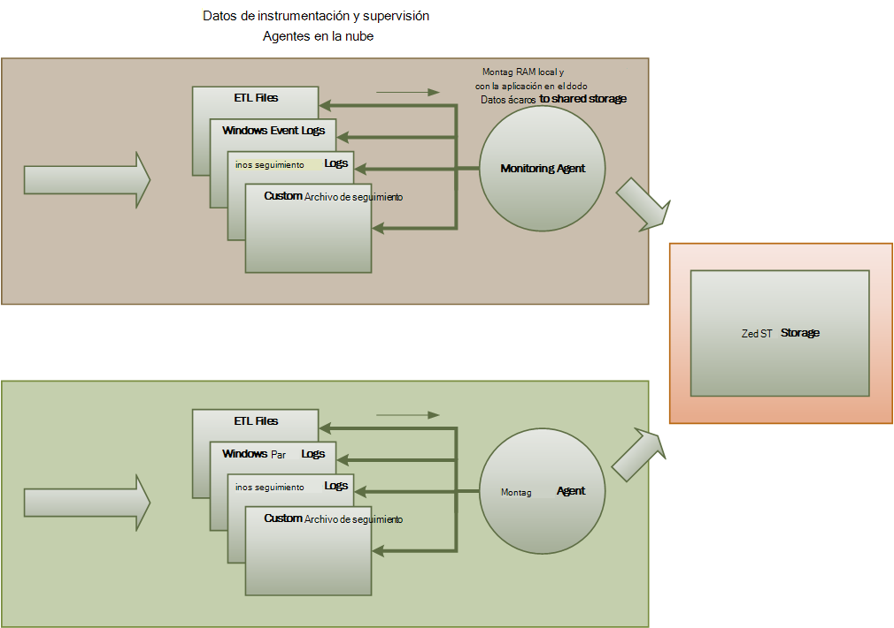
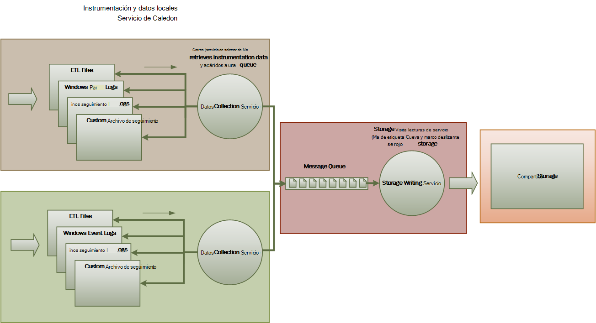
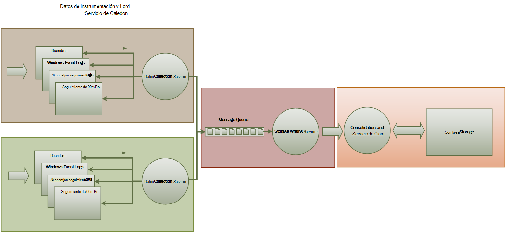

<properties
   pageTitle="Guía de supervisión y diagnóstico | Microsoft Azure"
   description="Procedimientos recomendados para supervisar aplicaciones distribuidas en la nube."
   services=""
   documentationCenter="na"
   authors="dragon119"
   manager="christb"
   editor=""
   tags=""/>

<tags
   ms.service="best-practice"
   ms.devlang="na"
   ms.topic="article"
   ms.tgt_pltfrm="na"
   ms.workload="na"
   ms.date="07/13/2016"
   ms.author="masashin"/>

# <a name="monitoring-and-diagnostics-guidance"></a>Guía de supervisión y diagnóstico

[AZURE.INCLUDE [pnp-header](../includes/guidance-pnp-header-include.md)]

## <a name="overview"></a>Información general
Aplicaciones distribuidas y servicios que se ejecutan en la nube son, por su naturaleza, complejos partes del software que componen muchas partes móviles. En un entorno de producción, es importante poder realizar un seguimiento de la manera en que los usuarios utilizan el sistema, el uso de recursos de seguimiento y, en general, supervisar el mantenimiento y el rendimiento del sistema. Puede usar esta información como ayuda para el diagnóstico para detectar y corregir problemas y para ayudar a detectar problemas potenciales y evitar que se produzca.

## <a name="monitoring-and-diagnostics-scenarios"></a>Escenarios de supervisión y diagnóstico
Puede usar la supervisión para conocer cómo funciona un sistema. Supervisión es una parte esencial de mantener los objetivos de calidad de servicio. Escenarios comunes para recopilar datos de supervisión son:

- Garantizar que el sistema sigue siendo correcto.
- Seguimiento de la disponibilidad del sistema y sus elementos de componente.
- Mantener el rendimiento para asegurarse de que el rendimiento del sistema no degradar inesperadamente como el volumen de trabajo aumenta.
- Garantizar que el sistema cumple los contratos de nivel de servicio (SLA) establecidos con los clientes.
- Proteger la privacidad y seguridad del sistema, los usuarios y sus datos.
- Seguimiento de las operaciones que se realicen con fines de auditoría o reglamentarios.
- Supervisar el uso del sistema y detectar tendencias que podrían provocar problemas si no está tratadas día a día.
- Seguimiento de problemas que se producen, desde informe inicial a través de análisis de implementación, actualizaciones de software consecutivas, corrección y posibles causas.
- Operaciones de seguimiento y depuración de versiones de software.

> [AZURE.NOTE] Esta lista no está pensada para ser completa. Este documento se centra en estos escenarios como las situaciones más comunes para realizar la supervisión. Puede que haya otros usuarios que son menos comunes o específicas de su entorno.

Las siguientes secciones describen estos escenarios con más detalle. La información de cada escenario se describe en el siguiente formato:

1. Una breve introducción del escenario
2. Los requisitos de este escenario típicos
3. Los datos sin formato instrumentación necesario para admitir el escenario y posibles orígenes de esta información
4. ¿Cómo pueden analizar y combinar para generar la información de diagnóstico significativo estos datos sin formato

## <a name="health-monitoring"></a>Seguimiento de estado
Un sistema es correcto si está ejecutando y capaz de procesar solicitudes. El propósito de supervisión de estado es generar una instantánea del estado actual del sistema para que pueda comprobar que todos los componentes del sistema funcionan como se esperaba.

### <a name="requirements-for-health-monitoring"></a>Requisitos para la supervisión de estado
Un operador debe recibir una alerta rápidamente (en unos segundos) si cualquier parte del sistema se considera en mal estado. El operador debería poder determinar qué partes del sistema funciona con normalidad y qué partes tienen problemas. Mantenimiento del sistema pueden resaltarse en un sistema de semáforo:

- Rojo para negativa (el sistema ha dejado)
- Amarillo para parcialmente correcto (el sistema se está ejecutando con funcionalidad reducida)
- Verde para completamente correcto

Un sistema de supervisión de estado completo permite un operador para explorar en profundidad a través del sistema para ver el estado de salud de subsistemas y componentes. Por ejemplo, si el sistema general se muestra como parcialmente correcto, el operador debería poder acercar y determinar qué funcionalidad está disponible actualmente.

### <a name="data-sources-instrumentation-and-data-collection-requirements"></a>Orígenes de datos, instrumentación y requisitos de recopilación de datos
Los datos sin formato necesario para admitir la supervisión de estado se pueden generar como resultado de:

- Seguimiento de ejecución de solicitudes de usuario. Esta información puede utilizarse para determinar qué solicitudes se han realizado correctamente, que han fallado y cuánto tiempo tarda de cada solicitud.
- Usuario síntesis supervisión. Este proceso simula los pasos realizados por un usuario y sigue una serie de pasos predefinida. Se deben capturar los resultados de cada paso.
- Registro de excepciones, errores y advertencias. Esta información se puede capturar como resultado de las instrucciones de seguimiento incrustados en el código de la aplicación, así como para recuperar información de los registros de eventos de los servicios que hace referencia el sistema.
- Supervisar el estado de los servicios de terceros que usa el sistema. Esta supervisión podría requerir recuperar y analizar los datos de estado que proporcione estos servicios. Esta información podría tardar una variedad de formatos.
- Supervisión de extremo. Este mecanismo se describe con más detalle en la sección "Supervisión de disponibilidad".
- Recopilar información de rendimiento ambiente, como fondo de la CPU o la actividad de i/OS (incluida la red).

### <a name="analyzing-health-data"></a>Analizar los datos de estado
El enfoque principal de supervisión de estado es rápidamente indicar si el sistema se está ejecutando. Análisis de acceso rápido de los datos inmediatos puede desencadenar una alerta si un componente crítico se detecta como mal estado. (No se ejecutará responder a una serie consecutiva de ping, por ejemplo). El operador, a continuación, puede tomar las medidas correctivas adecuadas.

Un sistema más avanzado puede incluir un elemento predictivo que realiza un análisis frío de cargas de trabajo actuales y recientes. Un análisis frío puede detectar tendencias y determinar si el sistema es probable que permanezca correcto o si el sistema necesita recursos adicionales. Este elemento predictiva debe basado en las medidas de rendimiento crítico, como:

- Tasa de solicitudes dirigidas a cada servicio o subsistema.
- Los tiempos de respuesta de estas solicitudes.
- El volumen de datos que fluyen dentro y fuera de cada servicio.

Si el valor de cualquier métrica supera un umbral definido, el sistema puede generar una alerta para habilitar un operador o ajuste automático (si está disponible) para realizar las acciones preventivas necesarios para mantener el mantenimiento del sistema. Estas acciones pueden implicar agregar recursos, reiniciar uno o varios de los servicios que tengan errores o Aplicar límite a las solicitudes de menor prioridad.

## <a name="availability-monitoring"></a>Supervisión de disponibilidad
Sistema en buen estado verdaderamente requiere que los componentes y subsistema que componen el sistema está disponible. Supervisión de disponibilidad está estrechamente relacionado con la supervisión de estado. Pero, mientras que la supervisión de estado, proporciona una vista inmediata del estado actual del sistema, supervisión de la disponibilidad se ocupa de seguimiento de la disponibilidad del sistema y sus componentes para generar estadísticas sobre el tiempo de actividad del sistema.

En muchos sistemas, algunos componentes (por ejemplo, una base de datos) están configurados con redundancia integrada para permitir una rápida migración tras error en el caso de un error grave o la pérdida de conectividad. Lo ideal es que, los usuarios no deben tener en cuenta que se ha producido un error de este tipo. Pero desde una perspectiva de supervisión de disponibilidad, es necesario recopilar toda la información acerca de este tipo de errores para determinar la causa y tomar medidas correctivas para impedir que sea periódica como sea posible.

Los datos que se necesita para realizar un seguimiento de disponibilidad podrían depender de varios factores de nivel inferior. Muchos de estos factores podrían ser específicas de la aplicación, sistema y entorno. Un sistema de supervisión eficaz captura los datos de disponibilidad que corresponde a estos factores de bajo nivel y, a continuación, agrupa para dar una visión general del sistema. Por ejemplo, en un sistema de comercio electrónico, la funcionalidad de empresa que permite a un cliente realizar pedidos podría dependen del repositorio donde se almacenan los detalles de pedido y el sistema de pago que controla las transacciones monetarias de pagar por estos pedidos. La disponibilidad de la parte de colocación de orden del sistema, por tanto, es una función de la disponibilidad de repositorio y el subsistema de pago.

### <a name="requirements-for-availability-monitoring"></a>Requisitos para la supervisión de disponibilidad
Un operador también debería poder ver la disponibilidad de cada sistema y subsistema histórica y usar esta información para detectar cualquier tendencias que podrían provocar uno o varios subsistemas periódicamente un error. (¿Servicios que se produzcan errores en un momento determinado del día que corresponde a las horas de procesamiento?)

Una solución de supervisión debe proporcionar una vista histórica e inmediata de la disponibilidad o no disponibilidad de cada subsistema. También debe ser capaces de alertar rápidamente un operador cuando uno o más servicios de éxito o cuando los usuarios no pueden conectarse a servicios. Se trata de una cuestión de no solo la supervisión de cada servicio, sino también examinar las acciones que realiza cada usuario si estas acciones se producirá un error al intentar comunicarse con un servicio. Hasta cierto punto, un grado de falla de conectividad es normal y puede ser debido a errores transitorios. Pero podría ser muy útil para permitir que el sistema generar una alerta para el número de errores de conectividad a un subsistema especificado que se producen durante un período específico.

### <a name="data-sources-instrumentation-and-data-collection-requirements"></a>Orígenes de datos, instrumentación y requisitos de recopilación de datos
Como ocurre con la supervisión de estado, se pueden generar los datos sin formato necesario para admitir la supervisión de disponibilidad como resultado de usuario síntesis supervisión y registro cualquier excepciones, errores y advertencias que pueden producirse. Además, pueden obtener datos de disponibilidad de efectuar la supervisión de extremo. La aplicación puede exponer uno o más extremos de estado, cada prueba acceso a un área funcional dentro del sistema. El sistema de supervisión puede hacer ping a cada extremo siguiendo una programación definida y recopilar los resultados (éxito o error).

Se registrará todos los tiempos de espera, errores de conectividad de red y reintentos de conexión. Todos los datos deben marca horaria.

<a name="analyzing-availability-data"></a>
### <a name="analyzing-availability-data"></a>Analizar los datos de disponibilidad
Los datos de instrumentación deben ser agregados y correlación para admitir los siguientes tipos de análisis:

- Disponibilidad de inmediata del sistema y subsistemas.
- Tasas de error de disponibilidad del sistema y subsistemas. Lo ideal es un operador debería poder relacionar errores con actividades específicas: ¿qué ocurre cuando el sistema no pudo?
- Una vista histórica de tasas de errores del sistema o cualquier subsistema a través de cualquier especificado período y la carga en el sistema (número de solicitudes de usuario, por ejemplo) cuando se produjo un error.
- Razones de no disponibilidad del sistema o cualquier subsistema. Por ejemplo, podrían ser los motivos conectado de servicio, conectividad perdido, pero el tiempo de espera y conectados pero devolver errores.

Puede calcular el porcentaje de disponibilidad de un servicio durante un período de tiempo mediante la siguiente fórmula:

```
%Availability =  ((Total Time – Total Downtime) / Total Time ) * 100
```

Esto es útil para fines de SLA. ([Supervisión SLA](#SLA-monitoring) se describe con más detalle más adelante en esta guía) La definición del tiempo de _inactividad_ depende del servicio. Por ejemplo, el servicio para generar servicios de Visual Studio Team define el tiempo de inactividad como el período (total acumulados minutos) durante el cual generar servicio no está disponible. Un valor de minuto se considera disponible si todas las solicitudes HTTP continuas al servicio de compilación para realizar operaciones de iniciado por el cliente en todo el minuto como resultado un código de error o no devuelven una respuesta.

## <a name="performance-monitoring"></a>Supervisar el rendimiento
Medida que el sistema se encuentra bajo más presión (aumentando el volumen de los usuarios), el tamaño de los conjuntos de datos que crecen estos usuarios tengan acceso y la posibilidad de error de uno o varios componentes más probable. Con frecuencia, errores del componente precedida de una disminución del rendimiento. Si puede detectar un descenso así, puede seguir los pasos proactivas para resolver la situación.

Rendimiento del sistema depende de varios factores. Cada factor se mide normalmente a través de los indicadores clave de rendimiento (KPI), como el número de transacciones de la base de datos por segundo o el volumen de solicitudes de red que se procesan correctamente en un período de tiempo especificado. Algunos de estos KPI podrían estar disponible como las medidas de rendimiento específicos, mientras que otros usuarios pueden derivarse de una combinación de mediciones.

> [AZURE.NOTE] Determinar una mala o buen rendimiento requiere que comprende el nivel de rendimiento en el que el sistema debe ser capaz de funcionar. Esto requiere observando el sistema mientras funciona en una carga típica y captura los datos de cada KPI durante un período de tiempo. Esto puede implicar ejecuta el sistema en una carga simulada en un entorno de prueba y recopilar los datos adecuados antes de implementar el sistema en un entorno de producción.

> También debe asegurarse de que la supervisión para mejorar el rendimiento no sea una carga en el sistema. Es posible que pueda ajustar dinámicamente el nivel de detalle de los datos que recopila el proceso de supervisión de rendimiento.

### <a name="requirements-for-performance-monitoring"></a>Requisitos para supervisar el rendimiento
Para examinar el rendimiento del sistema, un operador normalmente necesita ver la información que incluye:

- Las tasas de respuesta para las solicitudes de usuario.
- El número de solicitudes de usuario simultáneas.
- El volumen de tráfico de red.
- Tasas de en qué business se completan transacciones.
- Tiempo de procesamiento promedio para las solicitudes de.

También puede ser útil proporcionar herramientas que permiten a un operador ayudar a correlación lugar exacto, como por ejemplo:

- El número de usuarios y latencia de solicitud veces (cuánto tiempo tarda para iniciar una solicitud de procesamiento después de que el usuario lo ha enviado).
- El número de usuarios en comparación con el tiempo de respuesta promedio (cuánto se tarda en completar una solicitud después de haberse iniciado procesamiento).
- El volumen de solicitudes en comparación con el número de errores de procesamiento.

Junto con esta información funcional de alto nivel, un operador podrá obtener una vista detallada del rendimiento para cada componente del sistema. Estos datos normalmente se proporcionan a través de contadores de rendimiento de bajo nivel que realizar el seguimiento de información como:

- Uso de la memoria.
- Número de subprocesos.
- Tiempo de procesamiento de la CPU.
- Solicitar la longitud de la cola.
- Tasas de i/OS de disco o de red y errores.
- Número de bytes escritos o leídos.
- Indicadores de software intermedio, como la longitud de cola.

Todas las visualizaciones deben permitir un operador especificar un período de tiempo. Los datos mostrados pueden ser una instantánea de la situación actual o una vista histórica del rendimiento.

Un operador debería poder generar una alerta basada en cualquier medida de rendimiento para cualquier valor especificado durante un intervalo de tiempo especificado.

### <a name="data-sources-instrumentation-and-data-collection-requirements"></a>Orígenes de datos, instrumentación y requisitos de recopilación de datos
Puede recopilar datos de rendimiento de alto nivel (rendimiento, número de usuarios, el número de transacciones de la empresa, tasas de error y así sucesivamente) por supervisar el progreso de las solicitudes de usuarios que lleguen y pasar a través del sistema. Para ello, incorporación de instrucciones de seguimiento en los puntos clave en el código de la aplicación, junto con la información de intervalos. Todos los errores, excepciones y advertencias se deben capturar con datos suficientes para correlación de las solicitudes que causaron ellos. El registro de Internet Information Services (IIS) es otra fuente útil.

Si es posible, también debe capturar los datos de rendimiento de los sistemas externos que usa la aplicación. Estos sistemas externos pueden proporcionar sus propios contadores de rendimiento u otras características de solicitud de datos de rendimiento. Si no es posible, registrar información como la hora de inicio y hora de finalización de cada solicitud realizada a un sistema externo, junto con el estado (éxito, error o advertencia) de la operación. Por ejemplo, puede usar un enfoque de cronómetro para las solicitudes de tiempo: iniciar un temporizador cuando se inicia la solicitud y, a continuación, detenga el temporizador cuando finalice la solicitud.

Datos de rendimiento de bajo nivel de los componentes individuales en un sistema pueden estar disponibles a través de las características y servicios como contadores de rendimiento de Windows y diagnósticos de Azure.

### <a name="analyzing-performance-data"></a>Analizar los datos de rendimiento
Gran parte de la tarea de análisis consiste en Agregar datos de rendimiento por tipo de solicitud de usuario o el subsistema o a la que se envía cada solicitud de servicio. Un ejemplo de una solicitud de usuario es agregar un elemento al carro de la compra o realizar el proceso de compra de un sistema de comercio electrónico.

Otro requisito comunes está resumiendo los datos de rendimiento en percentiles seleccionados. Por ejemplo, un operador puede determinar los tiempos de respuesta para 99% de las solicitudes, 95% de las solicitudes y 70% de las solicitudes. Puede haber objetivos de SLA o establecen otras objetivos para cada percentil. Los resultados en curso se deben notificar en casi en tiempo real para ayudar a detectar problemas de inmediatos. Los resultados también deben agregarse sobre el tiempo con fines estadísticos.

En el caso de problemas de latencia afectar al rendimiento, un operador debería poder identificar rápidamente la causa de la botella examinando la latencia de cada paso que realiza cada solicitud. Los datos de rendimiento, por tanto, deben proporcionar un medio de correlación de las medidas de rendimiento de cada paso para vincularlas a una solicitud específica.

Dependiendo de los requisitos de visualización, puede ser útil generar y almacenar un cubo de datos que contiene vistas de los datos sin formato. Este cubo de datos puede permitir consultas ad hoc complejo y análisis de la información de rendimiento.

## <a name="security-monitoring"></a>Supervisión de seguridad
Todos los sistemas comerciales que incluyen datos confidenciales deben implementar una estructura de seguridad. La complejidad de mecanismo de seguridad suele ser una función de la sensibilidad de los datos. En el sistema que requiere que los usuarios puede autenticar, debe registrar:

- Todos los intentos de inicio de sesión, ya sea de un error o de éxito.
- Todas las operaciones realizadas por--y tener acceso los detalles de todos los recursos por--un usuario autenticado.
- Cuando un usuario termina una sesión y cierra una sesión.

Supervisión posible que pueda detectar ataques en el sistema de ayuda. Por ejemplo, un gran número de intentos de inicio de sesión puede indicar un ataque de fuerza bruta. Un sobrevoltaje inesperado en solicitudes puede ser el resultado de ataque denegación de servicio (DDoS) distribuido. Debe estar preparado para supervisar todas las solicitudes de todos los recursos independientemente del origen de estas solicitudes. Un sistema que tiene una vulnerabilidad sesión accidentalmente puede exponer recursos al exterior sin necesidad de un usuario realmente iniciar sesión.

### <a name="requirements-for-security-monitoring"></a>Requisitos de seguridad
Los aspectos más importantes de supervisión de seguridad deberían habilitar rápidamente un operador:

- Detectar intentos de intrusión por una entidad no autenticada.
- Identificar intentos de entidades para realizar operaciones de datos para el que se les no haya concedido acceso.
- Determinar si el sistema o alguna parte del sistema, bajo ataque desde fuera o dentro. (Por ejemplo, un usuario autenticado malintencionado podría estar intentando traer el sistema hacia abajo.)

Para admitir estos requisitos, se debe notificar un operador:

- Si realiza repetidamente una cuenta intentos de inicio de sesión dentro de un período especificado.
- Si una cuenta autenticada repetidamente intenta obtener acceso a un recurso prohibido durante un período especificado.
- Si se produce un gran número de solicitudes no autenticados o no autorizados durante un período especificado.

La información que se proporciona a un operador debe incluir la dirección de host del origen de para cada solicitud. Si con regularidad surgen violaciones de seguridad de un intervalo concreto de direcciones, pueden estar bloqueados estos hosts.

Un elemento clave para mantener la seguridad de un sistema es poder detectar rápidamente acciones que se apartan del patrón habitual. Se pueden mostrar visualmente información como el número de éxito o error solicitudes de inicio de sesión para ayudar a detectar si hay un aumento en la actividad en un momento inusual. (Un ejemplo de esta actividad es usuarios inicio de sesión a 3:00 A.M. y realizar una gran cantidad de operaciones cuando se inicia el día de su trabajo a 9:00 A.M.). Esta información también se usa para ayudar a configurar el ajuste automático de escala de tiempo. Por ejemplo, si un operador observa que un gran número de usuarios con regularidad inicio de sesión en un momento determinado del día, puede organizar el operador iniciar servicios de autenticación adicionales para controlar el volumen de trabajo y, a continuación, cierre estos servicios adicionales cuando ha pasado el máximo.

### <a name="data-sources-instrumentation-and-data-collection-requirements"></a>Orígenes de datos, instrumentación y requisitos de recopilación de datos
La seguridad es un aspecto global de sistemas más distribuidos. Los datos pertinentes están probable que se genere en varios puntos a lo largo de un sistema. Considere la posibilidad de adopción de un enfoque de administración de eventos (SIEM) e información de seguridad para recopilar la información relacionada con la seguridad que resulta de eventos generados por la aplicación, equipos de red, servidores, firewalls, software antivirus y otros elementos de prevención de intrusiones.

Supervisión de seguridad puede incorporar datos de las herramientas que no forman parte de la aplicación. Estas herramientas pueden incluir utilidades que identifiquen las actividades de exploración de puertos por organismos externos o filtros de red que detectan intentos de acceso no autenticado a sus datos y aplicaciones.

En todos los casos, los datos recopilados deben habilitar un administrador determinar la naturaleza de cualquier ataque y tomar las medidas que corresponda.

### <a name="analyzing-security-data"></a>Analizar los datos de seguridad
Una característica de seguridad es la variedad de orígenes desde el que se produce los datos. El nivel de detalle y diferentes formatos a menudo requieren análisis complejos de los datos capturados para unir en un subproceso coherente de la información. Aparte de la forma más sencilla de casos (por ejemplo, detectar una gran cantidad de errores de inicio de sesión complementos o varios intentos para obtener acceso no autorizado a los recursos críticos), no sería posible realizar cualquier procesamiento automatizado compleja de datos de seguridad. En su lugar, podría ser preferible escribir estos datos, pero lo contrario en su forma original, a un repositorio seguro para permitir un análisis manual experto marcado de tiempo.

<a name="SLA-monitoring"></a>

## <a name="sla-monitoring"></a>Supervisión de SLA
Muchos sistemas comerciales que son compatibles con los clientes que pagan realice garantías sobre el rendimiento del sistema en el formulario de SLA. Básicamente, SLA indique que el sistema puede administrar un volumen de trabajo dentro de un período de tiempo acordado y sin perder información importante. Supervisión de SLA se refiere a garantizar que el sistema puede cumplen SLA mensurables.

> [AZURE.NOTE] Supervisión SLA está estrechamente relacionado con la supervisión de rendimiento. Pero, mientras que la supervisión de rendimiento se encarga de garantizar el sistema funciones _óptima_, supervisión SLA se rige por una obligación contractual que define de qué _manera óptima_ realmente significa.

SLA con qué frecuencia se definen en términos de:

- Disponibilidad general del sistema. Por ejemplo, una organización puede garantizar que el sistema estará disponible para 99,9 por ciento del tiempo. Esto equivale a no más de 9 horas de tiempo de inactividad por año o 10 minutos aproximadamente una semana.
- Rendimiento de operaciones. Este aspecto con qué frecuencia se expresa como uno o más alto – marcas de agua, como garantizar que el sistema puede admitir hasta 100000 peticiones de usuario simultáneas o manejar los 10.000 transacciones de negocio simultáneas.
- Tiempo de respuesta operativas. El sistema también puede realizar garantías de la tasa a la que se procesan las convocatorias. Un ejemplo es que finalizará 99% de todas las transacciones de la empresa en dos segundos y sola transacción no llevará más de 10 segundos.

> [AZURE.NOTE] Algunos contratos para sistemas comerciales también pueden incluir SLA asistencia al cliente. Un ejemplo es que todas las solicitudes de asistencia provocan una respuesta dentro de cinco minutos y 99% de todos los problemas se dirigirá totalmente dentro de 1 día laborable. Eficaces de [seguimiento de problemas](#issue-tracking) (se describe más adelante en esta sección) es clave para satisfacer los SLA como estos.

### <a name="requirements-for-sla-monitoring"></a>Requisitos para la supervisión de SLA
En el nivel superior, un operador debería poder determinar de un vistazo si el sistema cumple los contratos SLA o no. Si no, el operador debería poder explorar hacia abajo y examinar los factores para determinar las razones de rendimiento incorrecto subyacentes.

Indicadores de alto nivel típicos que se pueden representar visualmente se incluyen:

- El porcentaje de tiempo de actividad de servicio.
- El rendimiento de la aplicación (medido en términos de transacciones correcta u operaciones por segundo).
- El número de solicitudes de aplicación de éxito o error.
- El número de excepciones y advertencias de los errores de aplicación y del sistema.

Todos estos indicadores deben ser capaces de filtrando por un período de tiempo especificado.

Una aplicación de nube es probable que incluyen un número de subsistemas y componentes. Un operador debería poder seleccionar un indicador de alto nivel y ver cómo se compone el estado de los elementos subyacentes. Por ejemplo, si el tiempo de actividad del sistema global está por debajo de un valor aceptable, un operador debería poder acercar y determinar los elementos que contribuyen a este error.

> [AZURE.NOTE] El rendimiento del sistema debe definirse con cuidado. En el sistema que utiliza redundancia para garantizar la máxima disponibilidad, pueden producir un error en las instancias de elementos individuales, pero el sistema puede permanecer funcional. Debe indicar el tiempo de actividad de sistema como realizada por la supervisión de estado de la actividad de cada elemento agregado y no necesariamente si realmente se detuvo el sistema. Además, los errores podrían ser aislados. Así que incluso si no está disponible un sistema específico, el resto del sistema podría siguen estando disponible, aunque con la funcionalidad de reducción. (En un sistema de comercio electrónico, un error en el sistema puede impedir que un cliente pedidos, pero el cliente aún podrá examinar el catálogo de productos.)

Para las alertas con fines, el sistema debería poder provocar un evento si cualquiera de los indicadores de alto nivel superan un umbral especificado. Los detalles de nivel inferior de los diferentes elementos que componen el indicador de alto nivel deben estar disponibles como datos contextuales para el sistema de alertas.

### <a name="data-sources-instrumentation-and-data-collection-requirements"></a>Orígenes de datos, instrumentación y requisitos de recopilación de datos
Los datos sin formato necesario para admitir SLA supervisión están similares a los datos sin formato necesario para supervisar el rendimiento, junto con algunos aspectos del estado y la supervisión de disponibilidad. (Consulte esas secciones para obtener más detalles). Puede capturar estos datos por:

- Realizar la supervisión de extremo.
- Registro de excepciones, errores y advertencias.
- Seguimiento de la ejecución de solicitudes de usuario.
- Supervisar la disponibilidad de los servicios de terceros que usa el sistema.
- Uso de contadores y medidas de rendimiento.

Todos los datos se deben sincronizó y marca de tiempo.

### <a name="analyzing-sla-data"></a>Analizar los datos de SLA
Los datos de instrumentación deben agregarse para generar una imagen del rendimiento general del sistema. Datos agregados también deben admitir obtención para permitir el examen del rendimiento de los subsistemas subyacentes. Por ejemplo, debería poder:

- Calcular el número total de solicitudes de usuario durante un período específico y determinar la tasa de éxito y de error de estas solicitudes.
- Combine los tiempos de respuesta de solicitudes de usuario para generar una visión general de los tiempos de respuesta del sistema.
- Analizar el progreso de las solicitudes de usuario para dividir el tiempo de respuesta general de una solicitud en los tiempos de respuesta de los elementos de trabajo individuales de esa solicitud.  
- Determinar la disponibilidad general del sistema como un porcentaje del tiempo activo durante un período específico.
- Analizar el porcentaje de disponibilidad de tiempo de los servicios y componentes individuales en el sistema. Esto puede implicar analizar registros generaron servicios de terceros.

Muchos sistemas comerciales son necesarios para notificar las cifras de rendimiento reales frente a contratos SLA durante un período específico, normalmente un mes. Esta información puede usarse para calcular créditos u otras formas de pagos de clientes si no se cumplen los SLA durante ese período. Puede calcular la disponibilidad de un servicio mediante la técnica descrita en la sección [disponibilidad de analizar los datos](#analyzing-availability-data).

Fines internos una organización también puede seguir el número y la naturaleza de las incidencias que produjo un error de servicios. Obtener información sobre cómo resolver estos problemas rápidamente o eliminarlos por completo, le ayudará a reducir el tiempo de inactividad y cumple los SLA.

## <a name="auditing"></a>Auditoría
Según la naturaleza de la aplicación, podría ser legales o de otros legales que especifican los requisitos de operaciones de los usuarios de auditoría y registro de todo el acceso de datos. Auditoría puede proporcionar pruebas que clientes de vínculos a solicitudes específicas. No rechazo es un factor importante en muchos sistemas de comercio electrónico para ayudar a mantener la confianza entre un cliente y la organización responsable de la aplicación o servicio.

### <a name="requirements-for-auditing"></a>Requisitos de auditoría
Un analista debe poder realizar un seguimiento de la secuencia de operaciones de negocio que realizan los usuarios para que puede reconstruir acciones de los usuarios. Esto podría ser necesario simplemente como cuestión de registro, o como parte de una investigación detallada.

Información de auditoría es muy confidencial. Es probable que se incluyen datos que identifica los usuarios del sistema, junto con las tareas que está realizando. Por este motivo, información de auditoría probablemente tardará el formulario de informes que están disponibles solo a los analistas de confianza en lugar de como un sistema interactivo que admita obtención de operaciones gráficas. Un analista debería poder generar una variedad de informes. Por ejemplo, informes pueden lista actividades de todos los usuarios que se producen durante un período de tiempo especificado, la cronología de actividad de un único usuario de detalle o la secuencia de las operaciones realizadas en uno o más recursos de la lista.

### <a name="data-sources-instrumentation-and-data-collection-requirements"></a>Orígenes de datos, instrumentación y requisitos de recopilación de datos
Pueden incluir las fuentes principales de información de auditoría:

- El sistema de seguridad que administra la autenticación de usuario.
- Registros de seguimiento que el registro de actividad de usuario.
- Registros de seguridad que un seguimiento de todas las solicitudes de red identificable y no identificable.

El formato de los datos de auditoría y la forma en que se almacenan puede ser controlado por requisitos normativos. Por ejemplo, no sea posible limpiar los datos de ninguna forma. (Se registrará en su formato original.) Acceso al repositorio donde se almacena debe estar protegido para evitar alteraciones.

### <a name="analyzing-audit-data"></a>Analizar los datos de auditoría
Un analista debe tener acceso a los datos sin formato en su totalidad en su forma original. Aparte de los requisitos para generar informes de auditoría común, las herramientas para análisis de datos están probable que se especializadas y mantiene el sistema externo.

## <a name="usage-monitoring"></a>Uso de supervisión
Uso de supervisión realiza un seguimiento de cómo se usan las características y los componentes de una aplicación. Un operador puede usar los datos recopilados para:

- Determinar qué características se utilizan mucho y los puntos de conexión posibles en el sistema. Elementos de tráfico elevado pueden beneficiarse de partición funcional o incluso replicación para distribuir la carga de manera más uniforme. Un operador también puede usar esta información para determinar qué características se usan con poca frecuencia y son posibles candidatos para la jubilación o sustitución en una versión futura del sistema.
- Obtener información sobre los eventos operativas del sistema en uso normal. Por ejemplo, en un sitio de comercio electrónico, puede grabar la información estadística sobre el número de transacciones y el volumen de los clientes que son responsables de ellas. Esta información puede usarse para planear la capacidad a medida que crece el número de clientes.
- Detectar (posiblemente indirectamente) satisfacción del usuario con el rendimiento o la funcionalidad del sistema. Por ejemplo, si un gran número de clientes en un sistema de comercio electrónico regularmente abandonar carros de la compra, esto puede deberse a un problema con la funcionalidad de desprotección.
- Generar información de facturación. Una aplicación comercial o servicio multiempresa puede tener costes de los clientes para los recursos que utilizan.
- Aplicar cuotas. Si un usuario en un sistema multiempresa supera la cuota de pagada de uso del recurso o la hora de procesamiento durante un período específico, puede limitar el acceso o procesamiento puede ser limitado.

### <a name="requirements-for-usage-monitoring"></a>Requisitos para supervisar el uso
Para examinar el uso del sistema, un operador normalmente necesita ver la información que incluye:

- El número de solicitudes que se procesan por cada subsistema y se dirige a cada recurso.
- El trabajo que está realizando cada usuario.
- El volumen de almacenamiento de datos que ocupa cada usuario.
- Los recursos que tiene acceso cada usuario.

Un operador también debería poder generar gráficos. Por ejemplo, un gráfico puede verse los usuarios ejecuten más recursos o con más frecuencia tiene acceso a recursos o características del sistema.

### <a name="data-sources-instrumentation-and-data-collection-requirements"></a>Orígenes de datos, instrumentación y requisitos de recopilación de datos
Seguimiento de uso se puede realizar en un nivel relativamente alto. Puede anotar las horas de inicio y finalización de cada solicitud y la naturaleza de la solicitud (leer, escribir y así sucesivamente, dependiendo del recurso en cuestión). Puede obtener esta información por:

- Seguimiento de la actividad de usuario.
- Captura de contadores de rendimiento que medir el uso para cada recurso.
- Supervisar el consumo de recursos por cada usuario.

Para fines de medición, también debe identificar los usuarios que son responsables de llevar a cabo las operaciones y los recursos que utilizan estas operaciones. La información recopilada debe ser suficiente para poder precisa facturación detallada.

<a name="issue-tracking"></a>
## <a name="issue-tracking"></a>Seguimiento de asuntos
Los clientes y otros usuarios podrían informar de problemas si se produce eventos inesperados o comportamiento del sistema. Seguimiento de problemas se ocupa de administrar estos problemas, asociarlos con los esfuerzos para resolver los problemas subyacentes del sistema e informar a los usuarios de las posibles soluciones.

### <a name="requirements-for-issue-tracking"></a>Requisitos para el seguimiento de problemas
Operadores suelen realizan seguimiento mediante un sistema independiente que les permite registrar y comunicar los detalles de problemas de problemas que los usuarios comunican. Estos detalles pueden incluir las tareas que el usuario ha intentado realizar, síntomas del problema, la secuencia de eventos y cualquier error o mensajes de advertencia que se han emitido.

### <a name="data-sources-instrumentation-and-data-collection-requirements"></a>Orígenes de datos, instrumentación y requisitos de recopilación de datos
Origen de datos inicial de datos de seguimiento de asuntos es el usuario que ha presentado el problema en primer lugar. El usuario puede proporcionar datos adicionales como:

- Una captura de bloqueo (si la aplicación incluye un componente que se ejecuta en el escritorio del usuario).
- Una instantánea de la pantalla.
- La fecha y hora cuando se produjo el error, junto con cualquier otra información ambiental como la ubicación del usuario.

Esta información se puede utilizar como ayuda para el esfuerzo de depuración y ayudar a crear un registro para las versiones futuras del software.

### <a name="analyzing-issue-tracking-data"></a>Analizar los datos de seguimiento de asuntos
El mismo problema podrían informar de diferentes usuarios. El sistema de seguimiento de asuntos debe asociar informes comunes.

El progreso de esfuerzo de depuración se registrará en cada informe de problema. Cuando se resuelve el problema, el cliente puede estar informado sobre la solución.

Si un usuario informa de un problema que tiene una solución conocida en el sistema de seguimiento de asuntos, el operador podrá informar al usuario de la solución inmediatamente.

## <a name="tracing-operations-and-debugging-software-releases"></a>Seguimiento de las operaciones y depuración de versiones de software
Cuando un usuario informa de un problema, el usuario solo a menudo es conocer el impacto inmediato que tiene en sus operaciones. El usuario solo puede informar los resultados de su propia experiencia volver a un operador responsable de mantenimiento del sistema. Normalmente, estas experiencias son solo un síntoma visible de uno o más problemas fundamentales. En muchos casos, un analista necesitará profundizar a través de la cronología de las operaciones subyacentes para establecer la causa del problema. Este proceso se denomina _análisis de causas_.

> [AZURE.NOTE] Análisis de las causas podrían descubrir errores en el diseño de una aplicación. En estos casos, es posible rediseñar los elementos afectados e implementar como parte de una versión posterior. Este proceso requiere cuidado de control y, a continuación, se deben supervisar estrechamente los componentes actualizados.

### <a name="requirements-for-tracing-and-debugging"></a>Requisitos de seguimiento y de depuración
Para el seguimiento de eventos inesperados y otros problemas, es fundamental que los datos de supervisión proporcionan suficiente información para habilitar a un analista de seguimiento a los orígenes de estos problemas y reconstruir la secuencia de eventos que ocurrieron. Esta información debe ser suficiente para habilitar un analista diagnosticar la causa de problemas. Un desarrollador puede realice las modificaciones necesarias para impedir que sea periódica.

### <a name="data-sources-instrumentation-and-data-collection-requirements"></a>Orígenes de datos, instrumentación y requisitos de recopilación de datos
Solución de problemas puede implicar el seguimiento de todos los métodos (y sus parámetros) invocan como parte de una operación de crear un árbol que describe el flujo lógico a través del sistema cuando un cliente realiza una solicitud específica. Excepciones y advertencias que genera el sistema como resultado de este flujo necesitan capturar y registrar.

Para admitir la depuración, el sistema puede proporcionar enlaces que permiten a un operador capturar información de estado en los puntos esenciales del sistema. O bien, el sistema puede proporcionar información detallada de paso a paso como el progreso de las operaciones seleccionadas. Captura de datos en este nivel de detalle pueden imponer una carga adicional en el sistema y deben ser un proceso temporal. Un operador utiliza este proceso principalmente cuando se produce de una serie de eventos muy inusual y es difícil replicar, o cuando una nueva versión de uno o varios elementos en un sistema requiere supervisión cuidado para asegurarse de que la función de elementos según lo esperado.

## <a name="the-monitoring-and-diagnostics-pipeline"></a>La canalización de supervisión y diagnóstico
Supervisar un sistema distribuido a gran escala supone un reto significativo. Cada uno de los escenarios descritos en la sección anterior no necesariamente se debe considerar por separado. Es probable que sea una superposición significativa en los datos de supervisión y diagnósticos necesario para cada situación, aunque estos datos que necesite procesarse y presentar de maneras diferentes. Para ello, debe tener una vista holística de supervisión y diagnóstico.

Puede prever el proceso de diagnósticos y de supervisión completo como una canalización que consta de las fases que se muestra en la figura 1.


_Figura 1. Las fases de la canalización de supervisión y diagnóstico_

Figura 1 resalta cómo los datos de supervisión y diagnóstico pueden provenir de una gran variedad de orígenes de datos. Las fases de instrumentación y colección les preocupa con identificación de los orígenes de donde los datos deben ser capturado, determinar qué datos para capturar, cómo captura y cómo dar formato a estos datos para que se pueda examinar fácilmente. La fase de análisis y diagnóstico toma los datos sin formato y usa para generar significativo información que puede usar un operador para determinar el estado del sistema. El operador puede utilizar esta información para tomar decisiones sobre posibles acciones a tomar y fuente, a continuación, los resultados en las fases de instrumentación y colección. La fase de fase visualización/alerta presenta una vista consumible del estado del sistema. Puede mostrar información en casi en tiempo real mediante una serie de paneles. Y puede generar informes, gráficos y gráficos para proporcionar una vista del historial de los datos que pueden ayudarle a identificar tendencias a largo plazo. Si la información indica un KPI que es probable que supere los límites aceptados, esta fase también puede desencadenar una alerta para un operador. En algunos casos, también puede utilizarse una alerta para desencadenar un proceso automatizado que intenta tomar medidas correctivas, como el ajuste automático.

Tenga en cuenta que estos pasos constituyen un proceso de flujo continuo dónde están sucediendo las fases en paralelo. Lo ideal es que, todas las fases debería configurables dinámicamente. En algún momento, especialmente cuando un sistema se ha implementado recientemente o está experimentando problemas, podría ser necesario recopilar datos extendido con más frecuencia. Otras veces, debe ser posible volver a capturar un nivel de base de la información esencial para comprobar que el sistema funciona correctamente.

Además, se debe considerar una solución en curso directo que está sujeto a mejoras como resultado de los comentarios y realizar ajustes a todo el proceso de supervisión. Por ejemplo, puede comenzar con la medición muchos factores para determinar el mantenimiento del sistema. Análisis a lo largo del tiempo podrían producir un refinamiento como descartar las medidas que no son relevantes, permitiéndole con mayor precisión centrarse en los datos que necesita minimizando el ruido de fondo.

## <a name="sources-of-monitoring-and-diagnostic-data"></a>Orígenes de datos de supervisión y diagnósticos
La información que utiliza el proceso de supervisión puede provenir de varios orígenes, como se muestra en la figura 1. En el nivel de aplicación, información proviene de los registros de seguimiento que incorpora el código del sistema. Los desarrolladores deben seguir un enfoque estándar para realizar un seguimiento del flujo de control a través de su código. Por ejemplo, una entrada a un método puede emitir un mensaje de seguimiento que especifica el nombre del método, la hora actual, el valor de cada parámetro y cualquier otra información pertinente. Grabación de las horas de entrada y salida también puede resultar útil.

Debe iniciar todas las excepciones y advertencias y asegúrese de que conserva un rastreo completo de las excepciones anidadas y advertencias. Lo ideal es que, también debe capturar información que identifica el usuario que se está ejecutando el código, junto con la información de correlación de actividad (para realizar el seguimiento de las solicitudes pasan a través del sistema). Y debe iniciar intenta obtener acceso a todos los recursos como colas de mensajes, bases de datos, archivos y otros servicios dependientes. Esta información puede usarse para medición y auditorías.

Algunas aplicaciones utilizar bibliotecas y marcos para realizar tareas comunes como obtener acceso a un almacén de datos o comunicarse a través de una red. Estos marcos posible pueden configurables sus propios mensajes de seguimiento y la información de diagnóstico sin formato, como tasas de transacción y éxitos de transmisión de datos y errores.

> [AZURE.NOTE] Muchos marcos moderna publican automáticamente rendimiento y seguimiento de eventos. Capturar toda esta información es simplemente cuestión de medio para recuperar y guardarlo donde puede procesar y analizar.

El sistema operativo donde se ejecuta la aplicación puede ser una fuente de información de todo el sistema bajo nivel, como contadores de rendimiento que indican las tasas de i/OS, el uso de la memoria y el uso de CPU. También se pueden informar de errores de sistema operativo (por ejemplo, el error al abrir un archivo correctamente).

También debe tener en cuenta la infraestructura y los componentes en el que se ejecuta el sistema subyacente. Máquinas virtuales, redes virtuales y servicios de almacenamiento de información pueden ser orígenes de contadores de rendimiento de nivel de infraestructura importantes y otros datos de diagnóstico.

Si la aplicación utiliza otros servicios externos, como un servidor web o el sistema de administración de la base de datos, estos servicios pueden publicar su propia información de seguimiento, los registros y los contadores de rendimiento. Ejemplos incluyen vistas dinámicas de administración de SQL Server para realizar el seguimiento de las operaciones realizadas en una base de datos de SQL Server y los registros de seguimiento IIS para grabar solicitudes realizadas en un servidor web.

Cuando se modifican los componentes de un sistema y se implementan nuevas versiones, es importante poder problemas de atributo, eventos y métricas para cada versión. Esta información se debe ligada a la canalización de lanzamiento para que puedan ser controlan rápidamente y corregidos los problemas con una versión específica de un componente.

Pueden ocurrir problemas de seguridad en cualquier punto del sistema. Por ejemplo, un usuario intenta iniciar sesión con un identificador de usuario no válido o la contraseña. Un usuario autenticado podría intentar obtener acceso no autorizado a un recurso. O bien, un usuario podría proporcionar una clave obsoleta o no válida para tener acceso a la información cifrada. Siempre se debería registrar información relacionada con la seguridad para las solicitudes de éxito y errores.

La sección [Instrumentación de una aplicación](#instrumenting-an-application) contiene más consejos sobre la información que se debe capturar. Pero puede usar una gran variedad de estrategias para recopilar esta información:

- **Supervisión del sistema y de aplicación**. Esta estrategia usa fuentes internas dentro de la aplicación, marcos de aplicaciones, sistema operativo y la infraestructura. El código de la aplicación puede generar su propia supervisión de datos en los puntos importantes durante el ciclo de vida de una solicitud de cliente. La aplicación puede incluir instrucciones de seguimiento que se pueden habilitar o deshabilitar como circunstancias lo selectivamente. Es posible también insertar diagnósticos dinámicamente utilizando un marco de diagnóstico. Normalmente, estos marcos proporcionan complementos que pueden adjuntar a varios puntos de instrumentación en el código y capturar los datos de seguimiento en estos momentos.

    Además, el código o la infraestructura subyacente podría provocar eventos en puntos críticos. Supervisar agentes que están configurados para detectar estos eventos puede grabar la información del evento.

- **Supervisión de usuario real**. Este enfoque registros de las interacciones entre un usuario y la aplicación y observa el flujo de cada solicitud y respuesta. Esta información puede tener un propósito doble: se puede usar para el uso de medición por cada usuario y, a continuación, se puede utilizar para determinar si los usuarios reciben un adecuado de calidad de servicio (por ejemplo, los tiempos de respuesta rápida, baja latencia y errores mínimos). Puede usar los datos capturados para identificar áreas de interés donde se producen errores con mayor frecuencia. También puede usar los datos para identificar los elementos que el sistema se ralentice, posiblemente debido a puntos de conexión en la aplicación o alguna otra forma de botella. Si implementa este método con cuidado, es posible reconstruir flujos de los usuarios a través de la aplicación para depuración y realizar pruebas.

    > [AZURE.IMPORTANT] Debe tener en cuenta los datos que se genera mediante la supervisión de los usuarios reales para ser confidencial porque es posible que incluya material confidencial. Si guarda datos capturados, almacénelo de forma segura. Si desea usar los datos de rendimiento de supervisión o con fines de depuración, franja toda la información de identificación personal en primer lugar.

- **Usuario síntesis supervisión**. En este enfoque es escribir a su cliente de prueba que simula un usuario y realiza una serie de configurable pero típica de operaciones. Puede realizar un seguimiento del rendimiento del cliente de prueba para ayudar a determinar el estado del sistema. También puede usar varias instancias de cliente de prueba como parte de una operación de prueba de carga para determinar cómo responde el sistema bajo presión y qué tipo de supervisión de salida se genera en las siguientes circunstancias.

    > [AZURE.NOTE] Puede implementar usuario real y síntesis supervisión, incluido el código que realiza un seguimiento y el tiempo de la ejecución del método llamadas y otros elementos esenciales de una aplicación.

- **Generación de perfiles**. Este enfoque principalmente va dirigido a supervisar y mejorar el rendimiento de la aplicación. En lugar de funcionamiento en el nivel de usuario real y síntesis supervisión funcional, captura información de nivel inferior mientras se ejecuta la aplicación. Puede implementar perfiles usando muestreo periódico del estado de ejecución de una aplicación (determinar qué fragmento de código que se ejecuta la aplicación en un momento determinado en el tiempo). También puede utilizar instrumentación que inserta sondeos en el código en momentos importantes (por ejemplo, el inicio y finalización de una llamada al método) y registros se invocan los métodos, en qué momento, y el tiempo tardó cada llamada. A continuación, puede analizar estos datos para determinar qué partes de la aplicación pueden provocar problemas de rendimiento.

- **Supervisión de extremo**. Esta técnica usa uno o más extremos de diagnósticos que la aplicación expone específicamente para habilitar la supervisión. Un extremo proporciona el camino hacia el código de la aplicación y puede devolver información sobre el mantenimiento del sistema. Extremos diferentes pueden centrarse en varios aspectos de la funcionalidad. Puede escribir a su cliente de diagnósticos que envíe solicitudes periódicas a estos extremos y asimilar las respuestas. Este enfoque se describe más de [Trama de supervisión de estado del extremo](https://msdn.microsoft.com/library/dn589789.aspx) en el sitio Web de Microsoft.

Cobertura máxima, debe usar una combinación de estas técnicas.

<a name="instrumenting-an-application"></a>
## <a name="instrumenting-an-application"></a>Instrumentación de una aplicación
Instrumentación es una parte esencial del proceso de supervisión. Puede tomar decisiones significativas sobre el rendimiento y el estado de un sistema solo si primero captura los datos que le permite tomar estas decisiones. La información que se recopila mediante instrumentación debe ser suficiente para que pueda evaluar el rendimiento, diagnosticar problemas y tomar decisiones sin necesidad de iniciar sesión en un servidor de producción remoto para realizar el seguimiento (y depurar) manualmente. Normalmente, los datos de instrumentación incluyen métricas y la información que se escribe en los registros de seguimiento.

El contenido de un registro de seguimiento puede ser el resultado de datos de texto que se escriben la aplicación o datos binarios que se crean como resultado de un evento de seguimiento (si usa la aplicación seguimiento de eventos de Windows--ETW). También se pueden generar de registros del sistema que el registro de eventos procedentes de partes de la infraestructura, como un servidor web. Mensajes del registro de texto a menudo están diseñados para ser legible, pero también se debe escribir en un formato que permite a su análisis fácilmente un sistema automatizado.

También debe clasificar registros. No escribir todos los datos de seguimiento en un único registro, pero usar registros independientes para grabar los resultados del seguimiento de los diferentes aspectos operativos del sistema. Puede filtrar rápidamente mensajes de registro de lectura desde el registro correspondiente en lugar de tener que procesar un único archivo largo. Nunca escribir la información que tiene requisitos de seguridad diferente (como la información de auditoría y datos de depuración) en el registro de la misma.

> [AZURE.NOTE] Un registro se podría implementar como un archivo en el sistema de archivos o se podría mantenerse en otro formato, como un objeto binario en el almacenamiento de blobs. Información de registro también puede mantenerse en almacenamiento más estructurado, como las filas de una tabla.

Métricas suele ser una medida o recuento de algún aspecto o recursos del sistema a una hora determinada, con uno o más etiquetas asociadas o dimensiones (a veces denominados un _ejemplo_). Una instancia de una métrica no suele ser útil por separado. En su lugar, métricas deben capturar el tiempo. El factor clave para tener en cuenta es qué medidas debe grabar y con qué frecuencia. Generando datos para métricas con demasiada frecuencia puede imponer una carga significativa adicional en el sistema, mientras que captura métricas con poca frecuencia pueden provocar que se pierda las circunstancias que llevan a un evento importante. Las consideraciones varían de una métrica a métrica. Por ejemplo, uso de CPU en un servidor puede variar significativamente segundo segundo pero uso alto se convierte en un problema solo si es larga sobre un número de minutos.

<a name="information-for-correlating-data"></a>
### <a name="information-for-correlating-data"></a>Información de correlación de datos
Fácilmente puede supervisar contadores de rendimiento de nivel de sistema individuales, capturar métricas para recursos y obtener información de seguimiento de la aplicación de varios archivos de registro. Pero algunas formas de supervisión requieren la fase de análisis y diagnósticos de la canalización de supervisión para relacionar los datos que se recuperen desde varios orígenes. Estos datos pueden tener varias formas en los datos sin formato y, a continuación, el proceso de análisis debe proporcionarse con datos de instrumentación suficientes para poder asignar estas formas diferentes. Por ejemplo, en el nivel de marco de trabajo de la aplicación, una tarea puede identificarse por un Id. Dentro de una aplicación, el mismo trabajo puede estar asociado con el identificador de usuario para el usuario que está realizando dicha tarea.

Además, hay poco probable una asignación de 1:1 entre los subprocesos y las solicitudes de usuario, porque operaciones asincrónicas pueden volver a utilizar los mismos subprocesos para llevar a cabo operaciones en nombre de más de un usuario. Para complicar aún más, una solicitud podría corregirse por más de un subproceso como flujos de ejecución a través del sistema. Si es posible asociar cada solicitud con un identificador de actividad único que se propaga a través del sistema como parte del contexto de la solicitud. (Esta técnica para generar y en información de seguimiento, incluidos identificadores de actividad depende de la tecnología que se utiliza para capturar los datos de seguimiento).

Todos los datos de supervisión debería con marca de tiempo de la misma manera. Por coherencia, grabar todas las fechas y horas utilizando la hora Universal coordinada. Esto le ayudará más fácilmente las secuencias de seguimiento de eventos.

> [AZURE.NOTE] No se pueden sincronizar equipos que funcionan en zonas horarias diferentes y redes. No dependen de utilizando solo las marcas de tiempo de correlación de los datos de instrumentación que abarca varios equipos.

### <a name="information-to-include-in-the-instrumentation-data"></a>Información que desea incluir en los datos de instrumentación
Cuando decida qué datos de instrumentación debe recopilar, tenga en cuenta los siguientes puntos:

- Asegúrese que genera eventos de seguimiento de información es automática y legible. Adoptar esquemas bien definidos para esta información para facilitar el tratamiento automatizado de datos de registro a través de sistemas y para proporcionar coherencia para leer los registros de personal de ingeniería y operaciones. Incluir información del entorno, como el entorno de implementación, el equipo en el que se ejecuta el proceso, los detalles del proceso y la pila de llamadas.  
- Habilitar perfiles solo cuando sea necesario porque puede suponer una sobrecarga significativa en el sistema. Generación de perfiles mediante instrumentación registros un evento (por ejemplo, una llamada de método) cada vez que aparece, mientras que los registros de muestreo sólo los eventos seleccionados. La selección puede ser tiempo (cada *n* segundos), con frecuencia (una vez que solicita cada *n* ) o. Si se producen eventos con frecuencia, generar perfiles por instrumentación podrían provocar demasiado una carga y propio afectar al rendimiento general. En este caso, el procedimiento de muestreo podría ser preferible. Sin embargo, si la frecuencia de los eventos es baja, muestreo podría perder. En este caso, instrumentación podría ser el mejor método.
- Proporciona suficiente contexto para habilitar un programador o un administrador determinar el origen de cada solicitud. Esto puede incluir alguna forma de Id. de actividad que identifica una instancia específica de una solicitud. También puede incluir información que puede usarse para relacionar la actividad con el cálculo trabajo realizado y los recursos utilizados. Tenga en cuenta que este trabajo podría cruza los límites de procesos y equipos. Por disponibilidad, también debe incluir el contexto (directa o indirectamente a través de otra información de correlación) una referencia al cliente que provocó la solicitud. Este contexto proporciona información valiosa sobre el estado de la aplicación en el momento en que se capturan los datos de supervisión.
- Grabar todas las solicitudes y las ubicaciones o regiones desde el que se realizan estas solicitudes. Esta información puede ayudar a determinar si hay cualquier puntos de conexión específicas de la ubicación. Esta información también puede ser útil para determinar si se va a crear particiones en una aplicación o los datos que utiliza.
- Grabar y capturar los detalles de excepciones con cuidado. A menudo, información de depuración crítica se pierde como resultado de una mala excepciones. Capturar los detalles completos de las excepciones que inicia la aplicación, incluidas las excepciones internas y otra información de contexto. Incluir la pila de llamadas si es posible.
- Sea coherente en los datos que capture los distintos elementos de la aplicación, ya que esto puede ayudar a analizar eventos y correlación de con las solicitudes de usuario. Tenga en cuenta con un paquete de registro completa y se puede configurar para recopilar información, en lugar de según los desarrolladores adoptar el mismo enfoque que implementan distintas partes del sistema. Recopilar datos de contadores de rendimiento clave, como el volumen de i/OS se realiza, uso de la red, el número de solicitudes, uso de la memoria y la CPU. Algunos servicios de infraestructura pueden proporcionar sus propios contadores de rendimiento específicos, como el número de conexiones a una base de datos, la tasa a la que se realizan las transacciones y el número de transacciones que correcta o un error. Aplicaciones también pueden definir sus propios contadores de rendimiento específicos.
- Inicie sesión en todas las llamadas realizadas a los servicios externos, como los sistemas de base de datos, servicios web u otros servicios de nivel de sistema que forman parte de la infraestructura. Registrar información sobre el tiempo necesario para realizar cada llamada y el éxito o error de la llamada. Si es posible, capturar información sobre todos los reintentos y los errores que se producen errores transitorias.

### <a name="ensuring-compatibility-with-telemetry-systems"></a>Asegurar la compatibilidad con sistemas de telemetría
En muchos casos, la información que genera instrumentación se generan como una serie de eventos y pasa a un sistema de telemetría independiente para el procesamiento y análisis. Un sistema de telemetría es normalmente independiente de cualquier aplicación específica o tecnología, pero espera información para seguir a un formato específico que generalmente está definido por un esquema. El esquema de un modo eficaz especifica un contrato que define los campos de datos y tipos de que el sistema de telemetría puede recopilar. El esquema debe ser generalizado para permitir que los datos procedentes de una gama de plataformas y dispositivos.

Campos comunes a todos los eventos de instrumentación, como el nombre del evento, la hora del evento, la dirección IP del remitente y los detalles necesarios para correlación con otros eventos (por ejemplo, un identificador de usuario, un identificador de dispositivo y un identificador de la aplicación), debe incluir un esquema común. Recuerde que cualquier número de dispositivos podría provocar eventos, por lo que el esquema no debe dependen del tipo de dispositivo. Además, varios dispositivos podrían provocar eventos de la aplicación de la misma. la aplicación podría admitir móvil o alguna otra forma de distribución de dispositivo cruzado.

El esquema también puede incluir campos de dominio que son relevantes para un escenario determinado que es común entre distintas aplicaciones. Puede obtener información acerca de excepciones, iniciar la aplicación y eventos de finalización y éxito o error llamadas de servicio web API. Todas las aplicaciones que usan el mismo conjunto de campos de dominio deben emitir el mismo conjunto de eventos, lo que permite un conjunto de informes y análisis de generarse comunes.

Por último, un esquema puede contener campos personalizados para capturar los detalles de eventos específicos de la aplicación.

### <a name="best-practices-for-instrumenting-applications"></a>Prácticas recomendadas para instrumentación de aplicaciones
En la lista siguiente se resume los procedimientos recomendados para la instrumentación de una aplicación distribuida en la nube.

- Facilitar la registros leídos y fáciles de analizar. Usar una estructura registro siempre que sea posible. Ser conciso y descriptivo en los mensajes de registro.
- En todos los registros, identificar el origen y proporcionan contexto y la información de intervalos mientras se escribe cada registro.
- Use el mismo zona horaria y el formato de todas las marcas de tiempo. Esto le ayudará a correlación de eventos para operaciones que abarcan hardware y servicios que se ejecutan en diferentes regiones geográficas.
- Categorizar registros y escribir mensajes en el archivo de registro.
- No divulgar información confidencial acerca del sistema o información personal acerca de los usuarios. Arrastre esta información antes de que se registra, pero asegúrese de que se conservan los detalles importantes. Por ejemplo, quitar la contraseña e ID de las cadenas de conexión de base de datos, pero escribir la información restante en el registro para que un analista puede determinar que el sistema tiene acceso a la base de datos correcto. Iniciar todas las excepciones críticas, pero permiten activar y desactivar la registro niveles inferiores de excepciones y advertencias al administrador. Además, capturar y registrar toda la información de reintentos lógica. Estos datos pueden ser útiles para supervisar el mantenimiento del sistema transitorio.
- Trazar llamadas fuera de proceso, como las solicitudes de servicios web externos o bases de datos.
- No mezclar mensajes de registro diferentes requisitos de seguridad en el mismo archivo de registro. Por ejemplo, no escriba depuración e información en el mismo registro de auditoría.
- Con la excepción de eventos de auditoría, asegúrese de que todas las llamadas de registro son operaciones fire y olvidar que bloquea el progreso de las operaciones de la empresa. Eventos de auditoría son excepcional ya que son fundamentales para la empresa y se pueden clasificar como una parte fundamental de operaciones de negocios.
- Asegúrese de que el registro es extensible y no tiene dependencias directas en un destino concreto. Por ejemplo, en lugar de escribir información usando _System.Diagnostics.Trace_, defina una interfaz abstracta (como _ILogger_) que expone métodos de registro y que se pueden implementar mediante cualquier medio adecuado.
- Asegúrese de que todos los registros es a prueba de errores y nunca activa los errores en cascada. Registro no debe iniciar las excepciones.
- Tratar instrumentación como un proceso iterativo continuo y revisar con regularidad, los registros no solo cuando hay un problema.

## <a name="collecting-and-storing-data"></a>Recopilar y almacenar datos
La región de la colección del proceso de supervisión se refiere a recuperar la información que genera instrumentación, formato estos datos para que sea más fácil para la fase de análisis y diagnóstico consumir y guardar los datos transformados en almacenamiento confiable. Los datos de instrumentación se recopilan de distintas partes de un sistema distribuido pueden mantenerse en una gran variedad de ubicaciones y con diferentes formatos. Por ejemplo, el código de aplicación puede generar archivos de registro de seguimiento y generar los datos del registro de eventos de la aplicación, mientras que se pueden capturar recuentos de rendimiento aspectos clave de la infraestructura que usa la aplicación a través de otras tecnologías. Los componentes de terceros y los servicios que utiliza la aplicación puede proporcionar información de instrumentación en diferentes formatos, con los archivos de seguimiento independiente, blob almacenamiento o incluso un almacén de datos personalizado.

Recopilación de datos con qué frecuencia se realiza a través de un servicio de colección puede ejecutarse independientemente de la aplicación que genera los datos de instrumentación. Figura 2 muestra un ejemplo de esta arquitectura, resaltar el subsistema de recopilación de datos de instrumentación.


_Figura 2. Recopilar datos de instrumentación_

Tenga en cuenta que se trata de una vista simplificada. El servicio de la colección no es necesariamente un único proceso y puede constar de muchas partes constituyentes ejecutando en equipos diferentes, como se describe en las secciones siguientes. Además, si el análisis de algunos datos de telemetría deben realizarse rápidamente (caliente análisis, como se describe en la sección [auxiliares caliente, frío y caliente, análisis](#supporting-hot-warm-and-cold-analysis) más adelante en este documento), componentes locales que operan exterior del servicio de colección pueden realizar las tareas de análisis inmediatamente. Figura 2 representa esta situación para los eventos seleccionados. Después de procesamiento analítico, los resultados se pueden enviar directamente a la visualización y el subsistema de alerta. Los datos que está sometidos a análisis caliente o frío se mantienen en almacenamiento mientras que espera procesamiento.

Para servicios y aplicaciones de Azure, diagnósticos de Azure proporciona una solución posible para capturar datos. Diagnóstico de Azure recopila datos de los siguientes orígenes para cada nodo de cálculo, agrega y, a continuación, carga en el almacenamiento de Azure:

- Registros de IIS
- Registros de error solicitudes IIS
- Registros de eventos de Windows
- Contadores de rendimiento
- Volcados
- Registros de infraestructura de diagnósticos de Azure  
- Registros de errores personalizado
- Origen de eventos de .NET
- ETW basada en manifiestos

Para obtener más información, vea el artículo [Azure: conceptos básicos de telemetría y solución de problemas](http://social.technet.microsoft.com/wiki/contents/articles/18146.windows-azure-telemetry-basics-and-troubleshooting.aspx).

### <a name="strategies-for-collecting-instrumentation-data"></a>Estrategias para recopilar datos de instrumentación
Teniendo en cuenta la naturaleza elástica de la nube y para evitar la necesidad de recuperar manualmente los datos de telemetría de todos los nodos en el sistema, debe organizar los datos se transfieran a una ubicación central y consolidados. En el sistema que se extiende por varios centros de datos, puede ser útil para recopilar en primer lugar, consolidar, almacenar los datos en una base de región por región y, a continuación, agregar los datos regionales en un único sistema central.

Para optimizar el uso de ancho de banda, puede transferir datos menos urgentes en fragmentos, como lotes. Sin embargo, los datos deben no retrasarse indefinidamente, especialmente si contiene información confidencial de tiempo.

#### <a name="pulling-and-pushing-instrumentation-data"></a>_Extraer y tracción datos de instrumentación_
El subsistema de recopilación de datos de instrumentación conocidas puede recuperar datos de instrumentación de los distintos registros y otros orígenes para cada instancia de la aplicación (el _modelo de extracción_). O bien, puede actuar como receptor pasivo que espera para que los datos que se envíen a partir de los componentes que constituyen cada instancia de la aplicación (el _modelo de inserción_).

Un enfoque para implementar el modelo de extracción es usar agentes de supervisión que se ejecutan localmente con cada instancia de la aplicación. Un agente de supervisión es un proceso independiente que periódicamente los datos de telemetría recupera (extrae) recopilan el nodo local y escribe esta información directamente a un almacenamiento centralizado que comparten todas las instancias de la aplicación. Éste es el mecanismo que implementa diagnósticos de Azure. Cada instancia de una función Azure web o de trabajo se puede configurar para captura diagnóstico y otra información de seguimiento que se almacena localmente. El agente de supervisión que se ejecute al lado de cada instancia copia los datos especificados en el almacenamiento de Azure. El artículo [Habilitar diagnósticos en servicios de nube de Azure y máquinas virtuales de Windows](./cloud-services/cloud-services-dotnet-diagnostics.md) proporciona información detallada sobre este proceso. Algunos elementos, como los registros de IIS, volcados y registros de error personalizado, se escriben en almacenamiento de blobs. Datos del registro de eventos de Windows, eventos ETW y contadores de rendimiento se registran en el almacenamiento de tablas. Figura 3 ilustra este mecanismo.



_Figura 3. Uso de un agente de supervisión para extraer información y escribir en el almacenamiento compartido_

> [AZURE.NOTE] Utilizar a un agente de supervisión es ideal para capturar los datos de instrumentación naturalmente extraída de un origen de datos. Un ejemplo es la información de vistas dinámicas de administración de SQL Server o la longitud de una cola de Bus de servicio de Azure.


Es posible utilizar el enfoque descrito para almacenar los datos de telemetría para una aplicación a pequeña escala que se ejecuta en un número limitado de nodos en una única ubicación. Sin embargo, una aplicación de nube complejas, alta escalabilidad y global puede generar grandes volúmenes de datos de cientos de funciones web y trabajador, shards de base de datos y otros servicios. Este flujo de datos puede sobrepasar fácilmente el ancho de banda de i/OS disponible con una única ubicación central. Por lo tanto, la solución de telemetría debe estar scalable para evitar que se insertan como una botella como el sistema se expande. Lo ideal es que, la solución debe incorporar un grado de redundancia para reducir el riesgo de perder información importante de supervisión (como los datos de auditoría o de facturación) si se produce un error en la parte del sistema.

Para solucionar estos problemas, puede implementar Queue, tal como se muestra en la figura 4. En esta arquitectura, el agente de supervisión local (si se puede configurar adecuadamente) o recopilación de datos personalizado servicio (si no) entradas de datos a una cola. Un proceso separado ejecuta de forma asincrónica (el almacenamiento de escritura de servicio en la figura 4) toma los datos en la cola y escribe en almacenamiento compartido. Una cola de mensajes es adecuada para este escenario porque "al menos una vez" proporciona semántica que ayudan a garantizar que los datos en cola no se pierden cuando se registra. Puede implementar el almacenamiento de escritura de servicio con una función de trabajo independiente.



_Figura 4. Uso de una cola de datos de búfer instrumentación_

El servicio de recopilación de datos local puede agregar datos a una cola inmediatamente después de que se reciba. La cola actúa como un búfer y el almacenamiento de escritura de servicio puede recuperar y escribir los datos a su propio ritmo. De forma predeterminada, una cola funciona según el primero en salir. Pero puede establecer la prioridad de mensajes para acelerar ellos a través de la cola si contienen datos que deben corregirse más rápidamente. Para obtener más información, vea el modelo de [Cola de prioridad](https://msdn.microsoft.com/library/dn589794.aspx) . Como alternativa, puede usar los canales diferentes (por ejemplo, los temas de Bus de servicio) para dirigir los datos a diferentes destinos según el formulario de procesamiento analítico necesario.

Escalabilidad, puede ejecutar varias instancias de la escritura de servicio de almacenamiento. Si hay un gran volumen de eventos, puede usar un concentrador de evento para enviar los datos de recursos de cálculo diferente para el procesamiento y almacenamiento.

<a name="consolidating-instrumentation-data"></a>
#### <a name="consolidating-instrumentation-data"></a>_Consolidar datos de instrumentación_
Los datos de instrumentación que el servicio de recopilación de datos recupera desde una única instancia de una aplicación le ofrece una vista localizada del estado y el rendimiento de esa instancia. Para evaluar el estado general del sistema, es necesario consolidar algunos aspectos de los datos en las vistas locales. Se puede realizar una vez se ha almacenado los datos, pero en algunos casos, también puede lograrlo que se recopilan los datos. En lugar de que se escriban directamente en almacenamiento compartido, los datos de instrumentación pueden pasar a través de un servicio de consolidación de datos independiente que combina datos y actúa como un proceso de filtro y limpieza. Por ejemplo, pueden se combinan los datos de instrumentación que incluyen la misma información de correlación como un identificador de actividad. (Es posible que un usuario inicia la operación de empresa en un nodo y obtiene transferirlos a otro nodo en caso de error de nodo o según la configuración de equilibrio de carga). Este proceso también puede detectar y quitar los datos duplicados (siempre una posibilidad, si el servicio de telemetría utiliza colas de mensajes a los datos de instrumentación de inserción fuera al almacenamiento). Figura 5 muestra un ejemplo de esta estructura.



_Figura 5. Usar un servicio independiente para consolidar y limpiar los datos de instrumentación_

### <a name="storing-instrumentation-data"></a>Almacenar los datos de instrumentación
Las conversaciones anteriores muestran una vista simple en lugar de la manera en que se almacenan los datos de instrumentación. En realidad, tiene sentido se puede almacenar los diferentes tipos de información mediante tecnologías que son las más apropiadas a la forma en la que es probable que se usa cada tipo.

Por ejemplo, Azure almacenamiento de blobs y tabla tiene algunas similitudes en la forma en que se haya acceso a ellos. Pero tienen limitaciones en las operaciones que se pueden realizar con ellos y el nivel de detalle de los datos que contienen es muy diferente. Si necesita realizar operaciones de análisis más o requieren capacidades de búsqueda de texto en los datos, puede ser más adecuado usar el almacenamiento de datos que proporciona capacidades que están optimizadas para determinados tipos de consultas y acceso a los datos. Por ejemplo:

- Datos de contador de rendimiento pueden almacenarse en una base de datos SQL para habilitar análisis ad hoc.
- Registros de seguimiento se podrían almacenar mejor en DocumentDB de Azure.
- Puede escribir información de seguridad para HDFS.
- Información que requiere la búsqueda de texto se puede almacenar a través de Elasticsearch (que también se puede acelerar búsquedas mediante la indización enriquecido).

Puede implementar un servicio adicional que recupera periódicamente los datos de almacenamiento compartido, particiones y filtros de los datos según su finalidad y, a continuación, se escribe en un conjunto de datos almacena tal como se muestra en la figura 6 adecuado. Un enfoque alternativo es incluir esta funcionalidad en el proceso de consolidación y la limpieza y escribir los datos directamente a estos comercios tal como ha recuperado en lugar de guardarla en un intermediario compartidos área de almacenamiento. Cada enfoque tiene sus ventajas y desventajas. Implementación de un servicio de partición independiente disminuye la carga en la consolidación y el servicio de limpieza y, a continuación, le permite al menos algunos de los datos divididos a generarse si es necesario (dependiendo de la cantidad de datos se conserva en el almacenamiento compartido). Sin embargo, consume recursos adicionales. Además, puede haber un retraso entre la recepción de datos de instrumentación de cada instancia de la aplicación y la conversión de datos en información útil.


_Figura 6. Partición datos según analítico y los requisitos de almacenamiento_

Los mismos datos de instrumentación podrían ser necesarios para más de un propósito. Por ejemplo, contadores de rendimiento se pueden utilizar para proporcionar una vista del historial de rendimiento del sistema con el tiempo. Esta información se puede combinar con otros datos de uso para generar la información de facturación de cliente. En estos casos, los mismos datos se podrían enviar a más de un destino, como una base de datos de documento que puede actuar como una tienda a largo plazo para almacenar la información de facturación y un almacén multidimensional para controlar el análisis de rendimiento complejo.

También debe tener en cuenta lo urgente los datos son obligatorios. Datos que se proporcionan información para las alertas se deben acceder rápidamente, por lo que debe ser mantenido en almacenamiento de datos rápido e indexado o estructurada para optimizar las consultas que realiza el sistema de alertas. En algunos casos, podría ser necesario para el servicio de telemetría que reúne los datos en cada nodo para dar formato y guardar los datos localmente para que una instancia local del sistema alerta le notifica rápidamente de cualquier problema. Pueden enviarse a los mismos datos a la escritura de servicio se muestra en los diagramas anterior y almacena de forma centralizada si también es necesaria para otros fines de almacenamiento.

Información que se usa para obtener más información considera análisis, para los informes y para detectar tendencias históricas es menos urgente y puede almacenarse en una forma que admite minería de datos y consultas ad hoc. Para obtener más información, consulte la sección [análisis de auxiliares frío y caliente, caliente,](#supporting-hot-warm-and-cold-analysis) más adelante en este documento.

#### <a name="log-rotation-and-data-retention"></a>_Giro de registro y retención de datos_
Instrumentación puede generar mucho volúmenes de datos. Pueden mantener estos datos en varios lugares, comenzando por los archivos de registro, los archivos de seguimiento, y otra información que se capturan en cada nodo consolidados, limpiar y vista de datos mantenidos en almacenamiento compartido dividida. En algunos casos, después de que los datos se ha procesado y transferir, se pueden quitar los datos de origen original de cada nodo. En otros casos, puede ser necesario o simplemente, resulta útil para guardar la información sin formato. Por ejemplo, datos que se generan con fines de depuración podrían mejor dejarse disponibles en su formato original pero, a continuación, se pueden descartar rápidamente tras los errores de carreteras.

Datos de rendimiento a menudo tienen una mayor duración de modo que puede utilizarse para detectar tendencias de rendimiento y para planear la capacidad. La vista de datos consolidada normalmente se mantiene en línea durante un período limitado habilitar el acceso rápido. Después de eso, se puede archivar o se descartan. Recopilar datos de medición y clientes de facturación que necesite guardarse de forma indefinida. Además, requisitos normativos podrían indicar que la información recopilada con fines de auditoría y seguridad también debe archivar y guardado. Estos datos también es confidenciales y que necesite protegido en caso contrario, para evitar alteraciones o cifrados. Nunca debe registrar contraseñas de usuario u otra información que puede utilizarse para cometer fraude de identidad. Deben se limpió los detalles de los datos antes de que se almacena.

#### <a name="down-sampling"></a>_Muestreo inferior_
Es útil almacenar datos históricos por lo que puede detectar tendencias a largo plazo. En lugar de guardar datos antiguos en su totalidad, es posible a los datos para reducir su resolución y ahorrar costos de almacenamiento de ejemplo de abajo. Por ejemplo, en lugar de guardar indicadores de rendimiento de minuto por minuto, puede consolidar datos que es más de un mes anterior para formar una vista hora por hora.

### <a name="best-practices-for-collecting-and-storing-logging-information"></a>Prácticas recomendadas para recopilar y almacenar la información de registro
En la lista siguiente se resume los procedimientos recomendados para capturar y almacenar la información de registro:

- El agente de supervisión o servicio de recopilación de datos debe ejecutarse como un servicio fuera de proceso y debería ser sencillo implementar.
- Todos los de salida desde el agente de supervisión o servicio de recopilación de datos debe ser un formato independiente que es independiente de la máquina, el sistema operativo o el protocolo de red. Por ejemplo, emitir información en un formato por sí mismo como JSON, MessagePack, o Protobuf en lugar de ETL/ETW. Con un formato estándar permite que el sistema construir canalizaciones de procesamiento; pueden integrar fácilmente componentes que leer, transforman y enviar datos en el formato acordado.
- El proceso de recopilación de datos y la supervisión debe ser a prueba de errores y debe desencadenar las condiciones de error en cascada.
- En caso de error transitorio enviar información a un receptor de datos, el agente de supervisión o servicio de recopilación de datos debe estar preparado para reordenar los datos de telemetría para que se envía en primer lugar la información más reciente. (El servicio de recopilación de datos y agente de supervisión podría decidir colocar los datos más antiguos, o guardarlo localmente y transmitirlos posterior para ponerse al día, según su propio criterio).

## <a name="analyzing-data-and-diagnosing-issues"></a>Analizar datos y diagnosticar problemas
Una parte importante del proceso de supervisión y diagnóstico está analizando los datos recopilados para obtener una imagen de la bienestar general del sistema. Debe ha definido su propio KPI y medidas de rendimiento, y es importante comprender cómo se pueden estructurar los datos que se ha recopilado para cumplir con los requisitos de análisis. También es importante comprender cómo se correlación los datos que se genera en distintos archivos de registro y métricas, porque esta información puede ser clave para el seguimiento de una secuencia de eventos y diagnosticar los problemas que puedan aparecer.

Como se describe en la sección [datos de consolidación instrumentación](#consolidating-instrumentation-data), normalmente se capturan localmente los datos para cada parte del sistema, pero generalmente debe combinarse con datos generados en otros sitios que participan en el sistema. Esta información requiere cuidado de correlación para asegurarse de que los datos se combinan con precisión. Por ejemplo, los datos de uso de una operación pueden ocupar un nodo que aloja un sitio Web al que se conecta un usuario, una que se ejecuta un servicio independiente acceso como parte de esta operación y almacenamiento de datos mantenidos en otro nodo. Esta información debe estar vinculado juntos para proporcionar una visión general del uso de recursos y de procesamiento de la operación. Preprocesamiento y el filtrado de datos pueden ocurrir en el nodo en el que los datos se capturan, mientras que la agregación y el formato están más probable que se producen en un nodo central.

<a name="supporting-hot-warm-and-cold-analysis"></a>
### <a name="supporting-hot-warm-and-cold-analysis"></a>Soporte de análisis caliente, frío y caliente
Analizar y volver a formatear datos para visualización, informes y alertas con fines pueden ser un proceso complejo que consume su propio conjunto de recursos. Algunas formas de supervisión son críticas para el tiempo y requieren un análisis inmediato de datos eficaz. Esto se conoce como _análisis de acceso rápido_. Algunos ejemplos son los análisis necesarios para recibir alertas y algunos aspectos de supervisión de seguridad (por ejemplo, para detectar un ataque en el sistema). Datos necesario para estos fines deben estar rápidamente disponible y estructuradas para procesamiento eficaz. En algunos casos, podría ser necesario mover el análisis del procesamiento de los nodos individuales donde se conservan los datos.

Otras formas de análisis son menos tiempo importantes y pueden necesitar algunos cálculos y agregación una vez se ha recibido los datos sin formato. Esto se denomina _análisis caliente_. Análisis de rendimiento a menudo entra en esta categoría. En este caso, un evento de rendimiento aislado, solo es poco probable estadística significativa. (Se podría deberse a una punta rápida o problema.) Los datos de una serie de eventos deben proporcionar una imagen más fiable del rendimiento del sistema.

Análisis caliente también pueden utilizarse para diagnosticar problemas de salud. Un evento de estado se procesa normalmente a través de análisis de acceso rápido y puede provocar una alerta inmediatamente. Un operador debería poder explorar en profundidad los motivos para el evento de estado examinando los datos de la ruta de acceso caliente. Estos datos deben contener información sobre los eventos que lleva al problema que provocó el evento de estado.

Algunos tipos de supervisión de generan datos más a largo plazo. Este análisis puede realizarse en una fecha posterior, posiblemente según la programación predefinida. En algunos casos, podría tener el análisis realizar un filtrado complejo de grandes volúmenes de datos genera durante un período de tiempo. Esto se denomina _análisis fría_. El requisito de clave es que los datos se almacenan de forma segura después de que se ha capturado. Por ejemplo, uso de supervisión y auditoría requiere una imagen precisa del estado del sistema en puntos regulares en tiempo, pero esta información de estado no tienen que estar disponibles para procesar inmediatamente después de que se ha recopilado.

Un operador también puede usar análisis fría para proporcionar los datos para el análisis de salud predictiva. El operador puede recopilar información histórica en un período específico y usar junto con los datos de estado actual (recuperados de la ruta de acceso rápida) para detectar tendencias que pronto podrían provocar problemas de salud. En estos casos, podría ser necesario generar una alerta para que se realice la acción correctiva.

### <a name="correlating-data"></a>Correlación de datos
Los datos que capture instrumentación pueden proporcionar una instantánea del estado del sistema, pero es el propósito de análisis realizar estos datos que puede utilizar. Por ejemplo:

- ¿Qué ha causado una intensa i / OS cargar en el nivel de sistema en un momento determinado?
- ¿Es el resultado de una gran cantidad de operaciones de base de datos?
- ¿Es esto se refleja en la base de datos tiempos de respuesta, el número de transacciones por segundo y, a continuación, en el mismo momento el tiempo de espera de respuesta de la aplicación?

Si es así, una medidas correctivas que pueden reducir la carga podrían ser fragmentar los datos sobre los servidores más. Además, pueden producirse excepciones como resultado un error en cualquier nivel del sistema. Una excepción en un nivel con qué frecuencia activa otro error en el nivel superior.

Para ello, debe poder relacionar los diferentes tipos de datos en cada nivel para generar una visión general del estado del sistema y las aplicaciones que se estén ejecutando en ella de supervisión. Puede usar esta información para tomar decisiones sobre si el sistema funciona aceptable o no y determinar qué se puede hacer para mejorar la calidad del sistema.

Como se describe en la sección [información de correlación de datos](#information-for-correlating-data), debe asegurarse de que los datos sin formato instrumentación incluyen suficiente información de ID de contexto y actividad para admitir los agregados necesarios para correlación de eventos. Además, estos datos pueden mantenerse en diferentes formatos y podría ser necesario analizar esta información para convertirlo en un formato estándar para el análisis.

### <a name="troubleshooting-and-diagnosing-issues"></a>Solución de problemas y diagnóstico de problemas
Diagnóstico requiere la capacidad para determinar la causa de errores o un comportamiento inesperado, que incluye la realización de análisis de las causas. La información que se necesita normalmente incluye:

- Obtener información detallada de los registros de eventos y trazas, para todo el sistema o para un subsistema especificado durante un tiempo especificado.
- Realizar seguimientos de la pila es el resultado de excepciones y errores de cualquier nivel especificado que se producen en el sistema o un subsistema especificado durante un período especificado.
- Volcados los procesos errores en cualquier lugar del sistema o para un subsistema especificado durante un tiempo especificado.
- Registros de actividad grabar las operaciones realizadas por todos los usuarios o para usuarios seleccionados durante un período especificado.

Analizar datos para solucionar problemas con qué frecuencia requiere un profundo conocimiento técnico de la arquitectura de sistema y de los distintos componentes que componen la solución. Como resultado, una gran intervención manual a menudo es necesario para interpretar los datos, establezca la causa de problemas y recomienda una estrategia adecuada para corregirlos. Puede ser conveniente simplemente almacenar una copia de esta información en su formato original y que esté disponible para los análisis frío por un experto.

## <a name="visualizing-data-and-raising-alerts"></a>Visualización de los datos y que se produzcan alertas
Un aspecto importante de cualquier sistema de supervisión es la capacidad para presentar los datos de forma que un operador puede detectar rápidamente cualquier problemas o tendencias. También importante es la capacidad de informar rápidamente a un operador si ha producido un evento importante que necesite atención.

Presentación de datos puede tener varias formas, incluida la visualización mediante paneles, informes y alertas.

### <a name="visualization-by-using-dashboards"></a>Visualización de los paneles
La manera más habitual para visualizar datos es usar paneles que pueden mostrar información como una serie de gráficos, gráficos o alguna otra ilustración. Estos artículos pueden tener parámetros y un analista debería poder seleccionar los parámetros importantes (por ejemplo, el período de tiempo) para cualquier situación específica.

Los paneles se pueden organizar jerárquicamente. Paneles de nivel superior pueden dar una visión general de cada aspecto del sistema pero que el operador pueda ver los detalles. Por ejemplo, un panel que representa el disco general i/OS para el sistema debe permitir un analista puede ver las tasas de i/OS para cada disco individual determinar si una o dispositivos más específicos de la cuenta para un volumen desproporcionado de tráfico. Lo ideal es que, el panel también debe mostrar información relacionada, como el origen de cada solicitud (el usuario o actividad) que genera este i/OS. Esta información puede utilizarse para determinar si (y cómo) para distribuir la carga de manera más uniforme entre dispositivos, y si el sistema funciona mejor si se agregaron más dispositivos.

También puede utilizar un panel de codificación en colores o alguna otra pista visual para indicar valores que aparecen irregulares o que están fuera de un intervalo esperado. Usando el ejemplo anterior:

- Un disco con una tasa de i/OS que se está acercando su capacidad máxima durante un período prolongado (un disco caliente) pueden resaltarse en rojo.
- Un disco con una tasa de i/OS que se ejecuta periódicamente en su límite máximo durante breves períodos (un disco caliente) pueden resaltarse en amarillo.
- Se pueden mostrar un disco que presenta el uso normal en verde.

Tenga en cuenta que para un sistema de escritorio para que funcione, debe tener los datos sin formato para que funcione con. Si va a crear su propio sistema de escritorio, o con un panel desarrollados por otra organización, debe saber qué datos de instrumentación debe recoger, en qué niveles de detalle, y cómo se debe dar formato para que el escritorio consumir.

Un buen panel no solo muestra información, también permite un analista plantear ad hoc preguntas sobre esa información. Algunos sistemas proporcionan herramientas de administración que puede usar un operador para realizar estas tareas y explorar los datos subyacentes. Como alternativa, dependiendo del repositorio que se utiliza para mantener esta información, es posible consultar estos datos directamente o importarlo a herramientas como Microsoft Excel para obtener más análisis e informes.

> [AZURE.NOTE] Debe restringir el acceso a los paneles a personal no autorizado, porque esta información podría ser confidencial comercialmente. También debe proteger los datos subyacentes de los paneles evitar que los usuarios puedan cambiar.

### <a name="raising-alerts"></a>Elevar alertas
Alertas es el proceso de análisis de los datos de supervisión y la instrumentación y generar una notificación si se detecta un evento importante.

Alertas ayuda a garantizar que el sistema permanece correcto, responde y segura. Es una parte importante de cualquier sistema que garantiza rendimiento, la disponibilidad y la declaración de privacidad para los usuarios en los datos puede ser necesario se tendrán en cuenta inmediatamente. Un operador que necesite que se le notifiquen el evento que activó la alerta. Alertas también pueden usarse para invocación de funciones del sistema como el ajuste automático.

Alertas normalmente dependan de los datos de instrumentación siguientes:

- Eventos de seguridad. Si los registros de eventos indican que repite autenticación o se producen errores de autorización, puede que sea el sistema en ataque y un operador debe estar informado.
- Indicadores de rendimiento. El sistema debe responder rápidamente si una métrica determinada rendimiento supera un umbral especificado.
- Información de disponibilidad. Si se detecta un error, podría ser necesario reiniciar subsistemas uno o más rápidamente o conmutar a un recurso de copia de seguridad. Repetidos errores en un subsistema pueden indicar problemas más graves.

Operadores podrían recibir información de alerta mediante varios canales de entrega como correo electrónico, un dispositivo localizador o un mensaje de texto SMS. Una alerta también puede incluir una indicación de importancia es de una situación. Muchos sistemas de alertas admiten grupos de suscriptor y todos los operadores que sean miembros del mismo grupo pueden recibir el mismo conjunto de alertas.

Un sistema de alertas debe ser personalizable y los valores apropiados de los datos subyacentes de instrumentación pueden proporcionarse como parámetros. Este enfoque permite a un operador para filtrar los datos y centrarse en los umbrales o combinaciones de valores que sean de interés. Tenga en cuenta que en algunos casos, pueden proporcionar los datos de instrumentación sin formato para el sistema de alertas. En otras situaciones, podría ser más apropiado proporcionar datos agregados. (Por ejemplo, una alerta puede activarse si el uso de CPU de un nodo ha sobrepasado 90 por ciento en los últimos 10 minutos). Los detalles que proporciona el sistema de alerta también deben incluir cualquier información de resumen y contexto apropiado. Estos datos pueden ayudar a reducir la posibilidad de que los eventos de falso positivo viaje una alerta.

### <a name="reporting"></a>Informes
Informes se usan para generar una visión general del sistema. Puede incorporar los datos históricos, además de información actual. Informes de requisitos a sí mismos se dividen en dos categorías: informes de operaciones y seguridad.

Informes operativos, normalmente incluyen los siguientes aspectos:

- Agregación de estadísticas que puede usar para comprender la utilización de los recursos del sistema general o subsistemas especificados durante un tiempo especificado
- Identificar las tendencias de uso de recursos para todo el sistema o subsistemas especificados durante un período especificado.
- Supervisar las excepciones que se ha producido en todo el sistema o especificado subsistemas durante un período especificado.
- Determinar la eficacia de la aplicación de los recursos implementadas y comprender si se pueden reducir el volumen de recursos (y sus costos asociados) sin afectar al rendimiento innecesariamente

Informes de seguridad está relacionado con el uso de los clientes del sistema de seguimiento. Puede incluir:

- Auditoría de las operaciones de usuario. Para ello, las solicitudes individuales que realiza cada usuario, junto con las fechas y horas de grabación. Los datos se deben estructurar para permitir que un administrador reconstruir rápidamente la secuencia de operaciones que un usuario se realiza durante un período especificado.
- Uso de recursos de seguimiento de usuario. Para ello, cómo cada solicitud de un usuario tiene acceso a los distintos recursos que componen el sistema y de cómo cuánto tiempo de grabación. Un administrador debe poder usar estos datos para generar un informe de uso por usuario durante un período especificado, posiblemente con fines de facturación.

En muchos casos, los procesos por lotes pueden generar informes según una programación definida. (Latencia no es normalmente un problema.) Pero también deben estar disponibles para la generación de forma ad-hoc si es necesario. Por ejemplo, si va a almacenar datos en una base de datos relacional como base de datos de SQL Azure, puede usar una herramienta como SQL Server Reporting Services para extraer y dar formato a datos y presentar como un conjunto de informes.

## <a name="related-patterns-and-guidance"></a>Orientación y patrones relacionados
- [Guía de ajuste automático](best-practices-auto-scaling.md) describe cómo disminuir administración sobrecarga reduciendo la necesidad de un operador continuamente supervisar el rendimiento de un sistema y tomar decisiones sobre cómo agregar o quitar recursos.
- [Trama de supervisión de estado del extremo](https://msdn.microsoft.com/library/dn589789.aspx) describe cómo implementar comprobaciones de funciones dentro de una aplicación que pueden tener acceso a través de los extremos expuestos herramientas externas a intervalos regulares.
- [Prioridad cola trama](https://msdn.microsoft.com/library/dn589794.aspx) muestra cómo priorizar los mensajes en cola para que las solicitudes urgentes se reciben y pueden procesarse antes de mensajes menos urgentes.

## <a name="more-information"></a>Más información
- [Supervisar, diagnosticar y solucionar problemas de Microsoft Azure almacenamiento](./storage/storage-monitoring-diagnosing-troubleshooting.md)
- [Azure: Conceptos básicos de telemetría y solución de problemas](http://social.technet.microsoft.com/wiki/contents/articles/18146.windows-azure-telemetry-basics-and-troubleshooting.aspx)
- [Habilitar diagnósticos en servicios de nube de Azure y máquinas virtuales](./cloud-services/cloud-services-dotnet-diagnostics.md)
- [Azure Redis caché](https://azure.microsoft.com/services/cache/), [Azure DocumentDB](https://azure.microsoft.com/services/documentdb/)y [HDInsight](https://azure.microsoft.com/services/hdinsight/)
- [Cómo usar colas de Bus de servicio](./service-bus-messaging/service-bus-dotnet-get-started-with-queues.md)
- [Inteligencia empresarial de SQL Server en Azure máquinas virtuales de Windows](./virtual-machines/virtual-machines-windows-classic-ps-sql-bi.md)
- [Recibir notificaciones de alerta](./monitoring-and-diagnostics/insights-receive-alert-notifications.md) y [el estado del servicio de seguimiento](./monitoring-and-diagnostics/insights-service-health.md)
- [Información de la aplicación](./application-insights/app-insights-overview.md)
