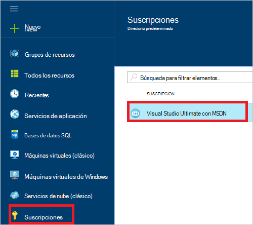
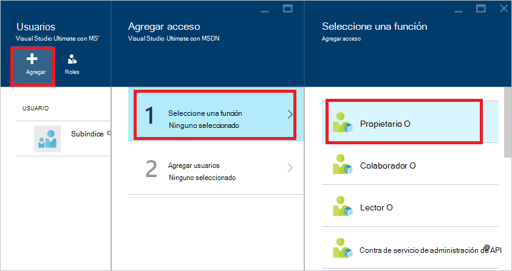
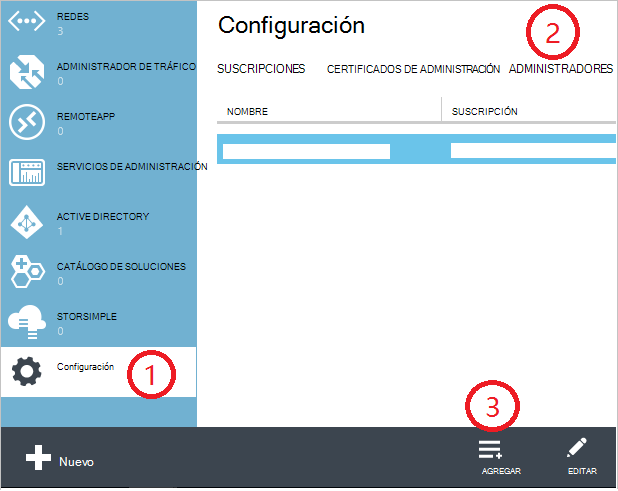
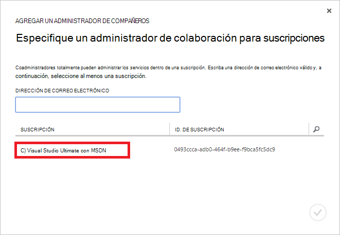
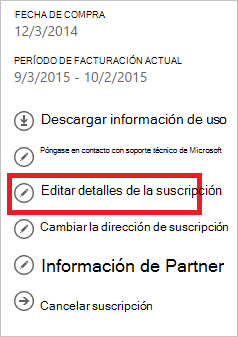
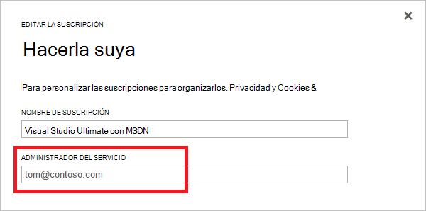

<properties
    pageTitle="Cómo agregar o cambiar los roles de administrador de Azure | Microsoft Azure"
    description="Describe cómo agregar o cambiar el Administrador de compañeros de Azure, administrador y Administrador de la cuenta"
    services=""
    documentationCenter=""
    authors="genlin"
    manager="mbaldwin"
    editor=""
    tags="billing"/>

<tags
    ms.service="billing"
    ms.workload="na"
    ms.tgt_pltfrm="na"
    ms.devlang="na"
    ms.topic="article"
    ms.date="08/17/2016"
    ms.author="genli"/>

# Cómo agregar o cambiar los roles de administrador de Azure

Existen tres tipos de funciones de administrador de Microsoft Azure:

| Función administrativa   | Límite  | Descripción
| ------------- | ------------- |---------------|
|Administrador de la cuenta (g)  | 1 por cuenta de Azure  |Esta es la persona que ha suscrito o comprar suscripciones Azure y está autorizada para tener acceso al [Centro de la cuenta](https://account.windowsazure.com/Home/Index) y realizar diversas tareas de administración. Incluyen la posibilidad de crear suscripciones, cancelar las suscripciones, cambiar la facturación para una suscripción y cambiar el Administrador de servicio.
| Servicio de administrador (SA) | 1 por suscripción de Azure  |Esta función está autorizada para administrar servicios en el [portal de Azure](https://portal.azure.com). De forma predeterminada, una nueva suscripción, el Administrador de la cuenta también es el administrador del servicio.|
|Administrador de compañeros (CA) en el [portal de clásico de Azure](https://manage.windowsazure.com)|200 por suscripción| Este rol tiene los mismos privilegios de acceso, como el administrador del servicio, pero no puede cambiar la asociación de suscripciones a directorios de Azure. |

> [AZURE.NOTE] Azure Control de acceso basado en roles de Active Directory (RBAC) permite a los usuarios que se agregarán a varias funciones. Para obtener más información, vea [Control de acceso basado en roles de Azure Active Directory](./active-directory/role-based-access-control-configure.md).

> [AZURE.NOTE] Si necesita más ayuda en cualquier punto de este artículo, póngase [en contacto con soporte técnico](https://portal.azure.com/?#blade/Microsoft_Azure_Support/HelpAndSupportBlade) para obtener el problema resuelto rápidamente.

## Cómo agregar un administrador de una suscripción

**Portal de Azure**

1. Inicie sesión en el [portal de Azure](https://portal.azure.com).

2. En el menú de concentrador, seleccione **suscripción** > *la suscripción que desea que el administrador para obtener acceso a*.

    

3. En el módulo de suscripción, seleccione **configuración**> **usuarios**.

    
4. En el módulo de usuarios, seleccione **Agregar**>**Seleccionar un rol** > **propietario**.

    

    **Nota**
    - La función de propietario tiene como administrador con los mismos privilegios de acceso. Esta función no tiene privilegios de acceso al [Centro de la cuenta de Azure](https://account.windowsazure.com/subscriptions).
    - Los propietarios agregado a través del [portal de Azure](https://portal.azure.com) no pueden administrar servicios en el [portal de clásico de Azure](https://manage.windowsazure.com).  

5. Escriba la dirección de correo electrónico del usuario al que desea agregar como propietario, haga clic en el usuario y, a continuación, haga clic en **Seleccionar**.

    

**Portal de clásico de Azure**

1. Inicie sesión en el [portal de clásico de Azure](https://manage.windowsazure.com/).

2. En el panel de navegación, seleccione **configuración**> **administradores**> **Agregar**.  

    

3. Escriba la dirección de correo electrónico de la persona que desea agregar como compañero administrador y, a continuación, seleccione la suscripción que desea que el administrador para obtener acceso a compañeros. 

     

La siguiente dirección de correo electrónico puede agregarse como administrador de colaboración:

* **Cuenta de Microsoft** (anteriormente, Windows Live ID)  
 Puede usar una Account de Microsoft para iniciar sesión todos los productos de Microsoft orientados al consumidor y servicios, como Outlook (Hotmail), Skype (MSN), OneDrive, Windows Phone y Xbox LIVE en la nube.
* **Cuenta profesional** 
 Una cuenta es una cuenta que se crea en Azure Active Directory. La dirección de la cuenta de la organización similar al siguiente: user@ &lt;el dominio&gt;. onmicrosoft.com

### Restricciones y limitaciones

 * Cada suscripción está asociada con un directorio de Azure AD (también conocido como el directorio predeterminado). Para buscar el directorio predeterminado está asociada con la suscripción, vaya al [portal clásica Azure](https://manage.windowsazure.com/), seleccione **configuración** > **suscripciones**. Compruebe el identificador de suscripción para buscar el directorio predeterminado.

 * Si ha iniciado sesión con una Account de Microsoft, solo puede agregar otros Accounts de Microsoft o los usuarios dentro del directorio predeterminado como administrador de compañeros.

 * Si ha iniciado sesión con una cuenta de la organización, puede agregar otras cuentas de la organización de su organización como administrador de compañeros. Por ejemplo, abby@contoso.com puede agregar bob@contoso.com como administrador del servicio o compañeros, pero no puede agregar john@notcontoso.com a menos que john@noncontoso.com es el usuario en el directorio predeterminado. Inicia sesión con cuentas de la organización de usuarios pueden seguir agregar usuarios de Microsoft Account como administrador de servicio o compañeros.

 * Ahora que es posible que inicie sesión en Azure con una cuenta profesional, estos son los cambios en los requisitos de la cuenta de administrador de servicio y compañeros:

    Método de inicio de sesión| ¿Agregar Account de Microsoft o los usuarios dentro del directorio predeterminado como entidad emisora de certificados o SA?  |¿Agregar la cuenta de la organización en la misma organización como entidad emisora de certificados o SA? |¿Agregar cuenta de la organización en organización diferente como entidad emisora de certificados o SA?
    ------------- | ------------- |---------------|---------------
    Cuenta de Microsoft |Sí|No|No
    Cuenta profesional|Sí|Sí|No

## Cómo cambiar el administrador del servicio para una suscripción

El Administrador de la cuenta puede cambiar el Administrador de una suscripción.

1. Iniciar sesión en el [Centro de la cuenta de Azure](https://account.windowsazure.com/subscriptions) mediante el Administrador de la cuenta.

2. Seleccione la suscripción que desea cambiar.

3. En el lado derecho, haga clic en **Editar suscripción** detalles.  

    

4. En el cuadro **Administrador del servicio** , escriba la dirección de correo electrónico del Administrador de servicio de nuevo.  

    

## Cómo cambiar el Administrador de la cuenta

Para transferir la propiedad de la cuenta de Azure a otra cuenta, consulte [Transferir la propiedad de una suscripción de Azure](billing-subscription-transfer.md).

## Pasos siguientes

* Para obtener más información sobre cómo se controla el acceso a los recursos en Microsoft Azure, consulte [acceso a los recursos descripción en Azure](./active-directory/active-directory-understanding-resource-access.md)

* Para obtener más información sobre cómo Azure Active Directory se relaciona con su suscripción de Azure, vea [cómo Azure suscripciones están asociadas a Azure Active Directory](./active-directory/active-directory-how-subscriptions-associated-directory.md)

* Para obtener más información sobre cómo Azure Active Directory se relaciona con su suscripción de Azure, vea [asignación de roles de administrador de Azure Active Directory](./active-directory/active-directory-assign-admin-roles.md)

> [AZURE.NOTE] Si aún tiene más preguntas, póngase [en contacto con soporte técnico](https://portal.azure.com/?#blade/Microsoft_Azure_Support/HelpAndSupportBlade) para obtener el problema resuelto rápidamente.
