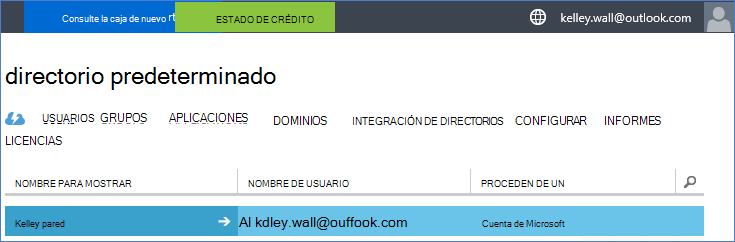
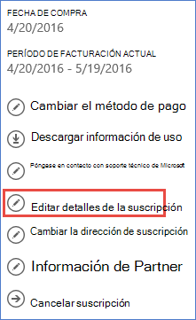
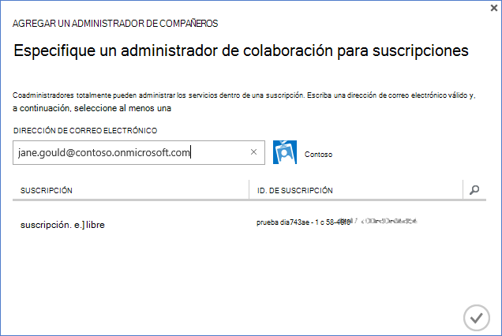

<properties
    pageTitle="Usar un inquilino de Office 365 con una suscripción de Azure | Microsoft Azure"
    description="Obtenga información sobre cómo agregar un directorio de Office 365 (inquilino) a una suscripción de Azure para realizar la asociación."
    services=""
    documentationCenter=""
    authors="JiangChen79"
    manager="mbaldwin"
    editor=""
    tags="billing,top-support-issue"/>

<tags
    ms.service="billing"
    ms.workload="na"
    ms.tgt_pltfrm="ibiza"
    ms.devlang="na"
    ms.topic="article"
    ms.date="09/16/2016"
    ms.author="cjiang"/>

# Asociar a un inquilino de Office 365 con una suscripción de Azure
Si ha adquirido suscripciones de Azure y Office 365 por separado en el pasado y ahora desea tener acceso a los inquilinos de Office 365 de la suscripción de Azure, es fácil hacerlo. Este artículo le muestra cómo.

> [AZURE.NOTE] En este artículo no se aplica a los clientes del contrato Enterprise (EA).

## Guía rápida
Para asociar al inquilino de Office 365 con su suscripción de Azure, utilice su cuenta de Azure para agregar al inquilino de Office 365 y asociar la suscripción Azure el inquilino de Office 365.

## Pasos detallados
En este escenario, Kelley Wall es un usuario que tiene una suscripción de Azure en la cuenta kelley.wall@outlook.com. Kelley también tiene una suscripción de Office 365 con la cuenta kelley.wall@contoso.onmicrosoft.com. Ahora Kelley desea acceder al inquilino de Office 365 con la suscripción de Azure.

### Requisitos previos
Para que la asociación funcione correctamente, son necesarios los siguientes requisitos previos:

- Debe tener las credenciales del administrador del servicio de suscripción de Azure. Coadministradores no pueden ejecutar un subconjunto de los pasos.
- Debe tener las credenciales de administrador global del inquilino de Office 365.
- La dirección de correo electrónico del administrador del servicio no debe incluirse en el inquilino de Office 365.
- La dirección de correo electrónico del administrador del servicio no coinciden con de cualquier administrador global del inquilino de Office 365.
- Si actualmente usa una dirección de correo electrónico que es una cuenta de Microsoft y una cuenta profesional, cambiar temporalmente el Administrador de su suscripción de Azure para usar otra cuenta de Microsoft. Puede crear una nueva cuenta de Microsoft en la [página de registro de cuenta de Microsoft](https://signup.live.com/).

Para cambiar el administrador del servicio, siga estos pasos:

1. Inicie sesión en el [portal de administración de cuenta](https://account.windowsazure.com/subscriptions).
2. Seleccione la suscripción que desea cambiar.
3. Seleccione **Editar detalles de la suscripción**.

    

4. En el cuadro **Administrador del servicio** , escriba la dirección de correo electrónico del administrador del servicio de nuevo.

    

### Asociar al inquilino de Office 365 con la suscripción de Azure
Para asociar al inquilino de Office 365 con la suscripción de Azure, siga estos pasos:

1.  Inicie sesión en el [portal de administración de cuentas](https://account.windowsazure.com/subscriptions) con las credenciales de administrador de servicio.
2.  En el panel izquierdo, seleccione **ACTIVE DIRECTORY**.

    

    > [AZURE.NOTE] No verá al inquilino de Office 365. Si ve, omita el paso siguiente.

    

3. Agregar al inquilino de Office 365 a su suscripción de Azure.

    una. Seleccione **nuevo** > **directorio** > **Crear personalizado**.

    

    b. En la página **Agregar directorio** , bajo **directorio**, seleccione **Usar directorio existente**. A continuación, seleccione **estoy listo para la sesión ahora**y seleccione **completado** .

    

    c. Después de que ha cerrado sesión, inicie sesión con credenciales de administrador global de su inquilino de Office 365.

    

    d. Seleccione **continuar**.

    

    e. Seleccione **Cerrar sesión ahora**.

    

    f. Inicie sesión en el [portal de administración de cuentas](https://account.windowsazure.com/subscriptions) con las credenciales de administrador de servicio.

    

    g. Verá a su inquilino de Office 365 en el panel.

    

4. Cambie el directorio asociado con la suscripción de Azure.

    una. Seleccione **configuración**.

    

    b. Seleccione la suscripción de Azure y, a continuación, seleccione **Editar directorio**.
    

    c. Seleccione **siguiente** .

    

    > [AZURE.WARNING] Recibirá una advertencia que se eliminarán todos los coadministradores.

    

    >[AZURE.WARNING] Además, también se quitará todos los usuarios de [Control de acceso basado en roles (RBAC)](./active-directory/role-based-access-control-configure.md) con acceso asignadas en los grupos de recursos existentes. Sin embargo, la advertencia que reciba menciones solo la eliminación de coadministradores.

    

    d. Seleccione **completa** .

5. Ahora puede agregar sus cuentas de organización de Office 365 como coadministradores al inquilino de Azure Active Directory.

    una. Seleccione la pestaña **administradores** y, a continuación, seleccione **Agregar**.

    

    b. Escriba una cuenta de su inquilino de Office 365, seleccione la suscripción de Azure y luego seleccione **completado** .

    

    c. Vuelva a la pestaña **administradores** . Debería ver mostrando como administrador con la cuenta organizativa.

    

6. A continuación puede probar el acceso con el Administrador de compañeros.

    una. Cerrar sesión en el portal de administración de cuenta.

    b. Abra el [portal de administración de cuenta](https://account.windowsazure.com/subscriptions) o el [portal de Azure](https://portal.azure.com/).

    c. Si la página de inicio de sesión de Azure tiene un vínculo de **iniciar sesión con su cuenta de la organización**, seleccione el vínculo. En caso contrario, omita este paso.

    

    d. Escriba las credenciales del Administrador con y, a continuación, seleccione **iniciar sesión**.

    

## Pasos siguientes
Escenarios relacionados incluyen:

- Ya tiene una suscripción a Office 365 y está listo para una suscripción de Azure, pero desea utilizar las cuentas de usuario de Office 365 existentes para la suscripción de Azure.
- Está suscrito a Azure y desea obtener una suscripción de Office 365 para los usuarios de la instancia de Azure Active Directory existente.

Para obtener información sobre cómo realizar estas tareas, consulte [usar la versión existente de Office 365 cuenta con su suscripción de Azure, o viceversa](billing-use-existing-office-365-account-azure-subscription.md).
