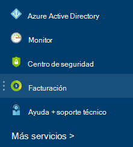

<properties
    pageTitle="Cómo descargar los datos de uso de factura y diaria de facturación de Azure | Microsoft Azure"
    description="Describe cómo descargar su factura de facturación de Azure y los datos de uso diaria"
    services=""
    documentationCenter=""
    authors="genlin"
    manager="mbaldwin"
    editor=""
    tags="billing"
    />

<tags
    ms.service="billing"
    ms.workload="na"
    ms.tgt_pltfrm="na"
    ms.devlang="na"
    ms.topic="article"
    ms.date="10/10/2016"
    ms.author="genli"/>

# Cómo descargar los datos de uso de factura y diaria de facturación de Azure

> [AZURE.NOTE] Si necesita más ayuda en cualquier punto de este artículo, póngase [en contacto con soporte técnico](https://portal.azure.com/?#blade/Microsoft_Azure_Support/HelpAndSupportBlade) para obtener el problema resuelto rápidamente.

Como administrador de la cuenta de Azure, puede ver la factura de facturación y los datos de uso diarias en el [portal de Azure](https://portal.azure.com) o en el [Centro de la cuenta de Azure](https://account.windowsazure.com/subscriptions). Le mostramos cómo:

## Portal de Azure

1. Inicie sesión como administrador de la cuenta en el [portal de Azure](https://portal.azure.com) .

    >[AZURE.NOTE] Solo el Administrador de cuenta tiene permiso para acceder a los datos de facturación. Para obtener más información acerca de cómo averiguar quién es el Administrador de la cuenta de la suscripción, consulte las [preguntas más frecuentes](billing-subscription-transfer.md#faq).

2. En el menú de concentrador, seleccione **facturación**. En el módulo **de facturación** , puede encontrar información útil, como la próxima fecha de facturación.

    
3. En la sección de **costos de suscripción** , seleccione la suscripción que desea ver.

    
4. Haga clic en **facturación y uso**.

    

5. En el módulo **el historial de facturación** , haga clic en **Descargar factura** para ver una copia de la factura. Haga clic en un período de facturación para ver los datos de uso diario.

    

## Centro de la cuenta de Azure

1. Inicie sesión en el [Centro de la cuenta de Azure](https://account.windowsazure.com/subscriptions) como administrador de la cuenta.
2. Seleccione la suscripción para la que desea que la información de factura y el uso.
3. Seleccione **el historial de facturación**.  
4. También puede consultar las instrucciones de la última seis períodos de facturación y el período actual no facturado.   
5. Seleccione la **Instrucción de la vista actual** para ver una estimación de sus cargos en el momento en que se ha generado la estimación. Esta información solo se actualiza diariamente y no puede incluir todo su uso. La factura mensual puede diferir de esta estimación.   
6. Seleccione **Descargar factura** para ver una copia de la última factura.  
7. Seleccione **Uso descargar** para descargar los datos de uso diarias como un archivo CSV. 

> [AZURE.NOTE] Si aún tiene más preguntas, póngase [en contacto con soporte técnico](https://portal.azure.com/?#blade/Microsoft_Azure_Support/HelpAndSupportBlade) para obtener el problema resuelto rápidamente.
