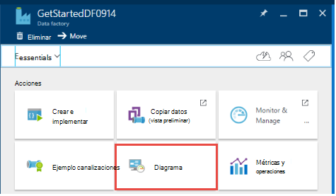

<properties
    pageTitle="Crear su primer generador de datos (portal de Azure) | Microsoft Azure"
    description="En este tutorial, se crea una canalización de generador de datos de Azure de ejemplo con el Editor de fábrica de datos en el portal de Azure."
    services="data-factory"
    documentationCenter=""
    authors="spelluru"
    manager="jhubbard"
    editor="monicar"/>

<tags
    ms.service="data-factory"
    ms.workload="data-services"
    ms.tgt_pltfrm="na"
    ms.devlang="na"
    ms.topic="hero-article" 
    ms.date="09/14/2016"
    ms.author="spelluru"/>

# Tutorial: Crear su primer generador de datos de Azure con Azure portal
> [AZURE.SELECTOR]
- [Información general y los requisitos previos](data-factory-build-your-first-pipeline.md)
- [Portal de Azure](data-factory-build-your-first-pipeline-using-editor.md)
- [Visual Studio](data-factory-build-your-first-pipeline-using-vs.md)
- [PowerShell](data-factory-build-your-first-pipeline-using-powershell.md)
- [Plantilla de administrador de recursos](data-factory-build-your-first-pipeline-using-arm.md)
- [API DE REST](data-factory-build-your-first-pipeline-using-rest-api.md)

En este artículo, aprenda a usar el [portal de Azure](https://portal.azure.com/) para crear su primer generador de datos de Azure. 

## Requisitos previos        
1. Lea el artículo de [Visión general de Tutorial](data-factory-build-your-first-pipeline.md) y complete los pasos de **requisito previo** .
2. En este artículo no proporciona una introducción conceptual de servicio del generador de datos de Azure. Le recomendamos que atraviesan [Introducción al generador de datos de Azure](data-factory-introduction.md) artículo para obtener información detallada del servicio.  

## Crear el generador de datos
Un generador de datos puede tener una o varias tuberías. Una canalización puede tener una o varias actividades. Por ejemplo, una actividad de copiar para copiar los datos de un origen de un almacén de datos de destino y una actividad de subárbol HDInsight ejecuten secuencias de sección para transformar datos de entrada con el producto salida de datos. Comencemos con la creación del generador de datos en este paso. 

1.  Inicie sesión en el [portal de Azure](https://portal.azure.com/).
2.  Haga clic en **nuevo** en el menú de la izquierda, haga clic en **datos + análisis**y haga clic en **Generador de datos**.
        
    

2.  En el módulo de **Generador de datos nueva** , escriba **GetStartedDF** para el nombre.

    

    > [AZURE.IMPORTANT] 
    > El nombre del generador de datos de Azure debe ser **único global**. Si recibe el error: **el nombre del generador de datos "GetStartedDF" no está disponible**. Cambiar el nombre de la fábrica de datos (por ejemplo, yournameGetStartedDF) e intente crear de nuevo. Vea el tema de la [Fábrica de datos - las reglas de nombres](data-factory-naming-rules.md) para las reglas de nomenclatura para artefactos del generador de datos.
    > 
    > El nombre de la fábrica de datos puede estar registrado como un nombre **DNS** en el futuro y por tanto se hacen visible públicamente.

3.  Seleccione la **suscripción Azure** donde desea que el generador de datos que se cree. 
4.  Seleccione **el grupo de recursos** o crear un grupo de recursos. Para el tutorial, cree un grupo de recursos denominado: **ADFGetStartedRG**. 
5.  En el módulo de **nuevo el generador de datos** , haga clic en **crear** .

    > [AZURE.IMPORTANT] Para crear instancias del generador de datos, debe ser miembro del rol de [Colaborador del generador de datos](../active-directory/role-based-access-built-in-roles.md/#data-factory-contributor) en el nivel de grupo de suscripción o recurso. 
6.  Consulte el generador de datos que se creen en el **Startboard** del portal de Azure como sigue:   

    
7. ¡Felicidades! Ha creado correctamente el primer generador de datos. Después de que el generador de datos se ha creado correctamente, verá la página de fábrica de datos, que muestra el contenido del generador de datos.   

    

Antes de crear una canalización en el generador de datos, debe crear algunas entidades de datos fábrica en primer lugar. Crear servicios vinculados para vincular datos almacena y calcula el almacén de datos, defina la entrada y salida de conjuntos de datos para representar datos de entrada y salida de almacena datos vinculados y, a continuación, cree la canalización con una actividad que utiliza estos conjuntos de datos. 

## Crear servicios vinculados
En este paso, vincular su cuenta de almacenamiento de Azure y un clúster de Azure HDInsight a petición en el generador de datos. La cuenta de almacenamiento de Azure contiene los datos de entrada y salidos para la canalización de este ejemplo. El servicio HDInsight vinculado se usa para ejecutar la secuencia de comandos de sección especificada en la actividad de la canalización de este ejemplo. Identificar qué [datos almacenan](data-factory-data-movement-activities.md)/[calcular servicios](data-factory-compute-linked-services.md) se usan en su situación y vincular estos servicios el generador de datos mediante la creación de servicios vinculados.  

### Crear el servicio de almacenamiento de Azure vinculado
En este paso, puede vincular su cuenta de Azure almacenamiento a su generador de datos. En este tutorial, se utiliza la misma cuenta de almacenamiento de Azure para almacenar los datos de entrada y salida y el archivo de comandos HQL. 

1.  Haga clic en **autor e implementar** en el módulo de **Generador de datos** para **GetStartedDF**. Verá el Editor del generador de datos. 
     
    
2.  Haga clic en **almacén de datos nuevos** y elija el **almacenamiento de Azure**.

    

3.  Debe ver la secuencia de comandos JSON para crear un servicio de almacenamiento de Azure vinculado en el editor. 
    
    
     
4. Reemplace el **nombre de la cuenta** con el nombre de su cuenta de almacenamiento de Azure y la **clave de cuenta** con la tecla de acceso de la cuenta de almacenamiento de Azure. Para obtener información sobre cómo obtener la clave de acceso de almacenamiento, consulte [Ver, copiar y las teclas de acceso de almacenamiento regenerar](../storage/storage-create-storage-account.md#view-copy-and-regenerate-storage-access-keys)
5. En la barra de comandos para implementar el servicio vinculado, haga clic en **implementar** .

    

   Después de que el servicio vinculado se implementa correctamente, debería desaparecer la ventana **borrador 1** y vea **AzureStorageLinkedService** en la vista de árbol de la izquierda. 
       

 
### Crear servicio HDInsight de Azure vinculado
En este paso, puede vincular un clúster de HDInsight a petición a su generador de datos. El clúster HDInsight es creado en tiempo de ejecución automáticamente y se eliminan después de terminar procesamiento e inactivo durante el período de tiempo especificado. 

1. En el **Editor del generador de datos**, haga clic en **... Más**, haga clic en **calcular de nuevo**y seleccione **clúster a petición HDInsight**.

    
2. Copie y pegue el fragmento de código siguiente a la ventana de **borrador-1** . El fragmento de código JSON describe las propiedades que se usan para crear el clúster HDInsight a petición. 

        {
          "name": "HDInsightOnDemandLinkedService",
          "properties": {
            "type": "HDInsightOnDemand",
            "typeProperties": {
              "version": "3.2",
              "clusterSize": 1,
              "timeToLive": "00:30:00",
              "linkedServiceName": "AzureStorageLinkedService"
            }
          }
        }
    
    La tabla siguiente proporciona descripciones de las propiedades JSON utilizadas en el fragmento de código:
    
  	| (Propiedad) | Descripción |
  	| :------- | :---------- |
  	| Versión | Especifica que la versión de la HDInsight creado para que sea 3.2. | 
  	| ClusterSize | Especifica el tamaño del clúster HDInsight. | 
  	| Período de vida | Especifica el tiempo de inactividad para el clúster HDInsight, antes de que se elimine. |
  	| linkedServiceName | Especifica la cuenta de almacenamiento que se utiliza para almacenar los registros generados por HDInsight. |

    Tenga en cuenta los siguientes puntos: 
    
    - El generador de datos crea un clúster de HDInsight **basado en Windows** con la JSON. También puede hacer que cree un clúster de HDInsight **basado en Linux** . Para obtener más información, vea [Servicios de vinculados a petición HDInsight](data-factory-compute-linked-services.md#azure-hdinsight-on-demand-linked-service) . 
    - Puede usar **su propio clúster de HDInsight** en lugar de usar un clúster de HDInsight a petición. Para obtener más información, vea [Servicios vinculados de HDInsight](data-factory-compute-linked-services.md#azure-hdinsight-linked-service) .
    - El clúster HDInsight crea un **contenedor predeterminado** en el almacenamiento de blobs especificada en el JSON (**linkedServiceName**). HDInsight no eliminar este contenedor cuando se elimina el clúster. Este comportamiento es por diseño. Con el servicio de HDInsight vinculado a petición, se crea un clúster de HDInsight cada vez que se procesa un sector a menos que haya un clúster directo existente (**período de Vida**). El clúster se elimina automáticamente cuando se realiza el procesamiento.
    
        Mientras se procesan más sectores, verá muchos contenedores en el almacenamiento de blobs de Windows Azure. Si no es necesario para solucionar problemas de los trabajos, desea eliminarlos para reducir el costo de almacenamiento. Los nombres de los contenedores siguen un patrón: "adf**yourdatafactoryname**-**linkedservicename**- datetimestamp". Use herramientas como el [Explorador de almacenamiento de Microsoft](http://storageexplorer.com/) para eliminar contenedores en el almacenamiento de blobs de Windows Azure.

    Para obtener más información, vea [Servicios de vinculados a petición HDInsight](data-factory-compute-linked-services.md#azure-hdinsight-on-demand-linked-service) .
3. En la barra de comandos para implementar el servicio vinculado, haga clic en **implementar** . 

    

4. Confirme que ve **AzureStorageLinkedService** y **HDInsightOnDemandLinkedService** en el árbol de la vista de la izquierda.

    

## Crear conjuntos de datos
En este paso, creará los conjuntos de datos para representar la entrada y salida de datos para el procesamiento de la sección. Estos conjuntos de datos, consulte la **AzureStorageLinkedService** que ha creado anteriormente en este tutorial. Los puntos de servicio vinculado a una cuenta de almacenamiento de Azure y conjuntos de datos especifican contenedor, carpeta, nombre de archivo en el almacenamiento de información que contiene la entrada y salida de datos.   

### Crear conjunto de datos de entrada

1. En el **Editor del generador de datos**, haga clic en **... Más** en la barra de comandos, haga clic en **nuevo conjunto de datos**y a continuación, seleccione **almacenamiento de blobs de Windows Azure**.

    
2. Copie y pegue el fragmento de código siguiente a la ventana de borrador-1. En el fragmento JSON, se crea un conjunto de datos denominado **AzureBlobInput** que representa datos de una actividad de la canalización de entrada. Además, especificar que los datos de entrada se encuentran en el contenedor de blob llamado **adfgetstarted** y la carpeta denominada **inputdata**.
        
        {
            "name": "AzureBlobInput",
            "properties": {
                "type": "AzureBlob",
                "linkedServiceName": "AzureStorageLinkedService",
                "typeProperties": {
                    "fileName": "input.log",
                    "folderPath": "adfgetstarted/inputdata",
                    "format": {
                        "type": "TextFormat",
                        "columnDelimiter": ","
                    }
                },
                "availability": {
                    "frequency": "Month",
                    "interval": 1
                },
                "external": true,
                "policy": {}
            }
        } 

    La tabla siguiente proporciona descripciones de las propiedades JSON utilizadas en el fragmento de código:

  	| (Propiedad) | Descripción |
  	| :------- | :---------- |
  	| tipo | La propiedad tipo se establece en AzureBlob porque los datos residen en el almacenamiento de blobs de Windows Azure. |  
  	| linkedServiceName | se refiere a la AzureStorageLinkedService que creó anteriormente. |
  	| nombre de archivo | Esta propiedad es opcional. Si se omite esta propiedad, se seleccionan todos los archivos desde el folderPath. En este caso, se procesa solo la input.log. |
  	| tipo | Los archivos de registro están en formato de texto, por lo que usamos TextFormat. | 
  	| columnDelimiter | columnas en los archivos de registro están delimitadas por el carácter de coma () |
  	| frecuencia/intervalo | frecuencia en mes y el intervalo es 1, lo que significa que están disponibles los sectores entrados mensualmente. | 
  	| externos | Esta propiedad se establece en true si el servicio de generador de datos no genera los datos de entrada. | 
        
3. En la barra de comandos para implementar el conjunto de datos recién creado, haga clic en **implementar** . Verá el conjunto de datos en la vista de árbol de la izquierda. 

### Crear conjunto de datos de salida
Ahora, cree el conjunto de datos de salida para representar los datos de salida que se almacenan en el almacenamiento de blobs de Windows Azure. 

1. En el **Editor del generador de datos**, haga clic en **... Más** en la barra de comandos, haga clic en **nuevo conjunto de datos**y a continuación, seleccione **almacenamiento de blobs de Windows Azure**.  
2. Copie y pegue el fragmento de código siguiente a la ventana de borrador-1. En el fragmento JSON, se crea un conjunto de datos denominado **AzureBlobOutput**y que especifica la estructura de los datos que se produce la secuencia de comandos de la sección. Además, especificar que los resultados se almacenan en el contenedor de blob llamado **adfgetstarted** y la carpeta denominada **partitioneddata**. La sección **disponibilidad** especifica que el conjunto de datos de salida se genera mensualmente.
    
        {
          "name": "AzureBlobOutput",
          "properties": {
            "type": "AzureBlob",
            "linkedServiceName": "AzureStorageLinkedService",
            "typeProperties": {
              "folderPath": "adfgetstarted/partitioneddata",
              "format": {
                "type": "TextFormat",
                "columnDelimiter": ","
              }
            },
            "availability": {
              "frequency": "Month",
              "interval": 1
            }
          }
        }

    Vea la sección **crear el conjunto de datos de entrada** para obtener una descripción de estas propiedades. No establezca la propiedad externa en un conjunto de datos de salida como el conjunto de datos generado por el servicio de generador de datos.
3. En la barra de comandos para implementar el conjunto de datos recién creado, haga clic en **implementar** .
4. Compruebe que el conjunto de datos se creó correctamente.

    

## Crear canalización
En este paso, creará el primer canalización con una actividad **HDInsightHive** . Entrada sector está disponible mensual (frecuencia: mes, intervalo: 1), sector de salida se produce mensual y también se establece la propiedad del programador para la actividad a mensual. Debe coincidir con la configuración para el conjunto de datos de salida y el programador de actividad. Actualmente, conjunto de datos de salida es qué unidades de la programación, así que debe crear un conjunto de datos de salida, incluso si la actividad produce ningún resultado. Si la actividad no realiza cualquier entrada, puede omitir la creación del conjunto de datos de entrada. Se explican las propiedades que se utilizan en el siguiente JSON al final de esta sección. 

1. En el **Editor del generador de datos**, haga clic en **puntos suspensivos (...) Más comandos** y, a continuación, haga clic en **nuevo canal**.
    
    
2. Copie y pegue el fragmento de código siguiente a la ventana de borrador-1.

    > [AZURE.IMPORTANT] Reemplace **storageaccountname** con el nombre de su cuenta de almacenamiento de la JSON.
        
        {
            "name": "MyFirstPipeline",
            "properties": {
                "description": "My first Azure Data Factory pipeline",
                "activities": [
                    {
                        "type": "HDInsightHive",
                        "typeProperties": {
                            "scriptPath": "adfgetstarted/script/partitionweblogs.hql",
                            "scriptLinkedService": "AzureStorageLinkedService",
                            "defines": {
                                "inputtable": "wasb://adfgetstarted@<storageaccountname>.blob.core.windows.net/inputdata",
                                "partitionedtable": "wasb://adfgetstarted@<storageaccountname>.blob.core.windows.net/partitioneddata"
                            }
                        },
                        "inputs": [
                            {
                                "name": "AzureBlobInput"
                            }
                        ],
                        "outputs": [
                            {
                                "name": "AzureBlobOutput"
                            }
                        ],
                        "policy": {
                            "concurrency": 1,
                            "retry": 3
                        },
                        "scheduler": {
                            "frequency": "Month",
                            "interval": 1
                        },
                        "name": "RunSampleHiveActivity",
                        "linkedServiceName": "HDInsightOnDemandLinkedService"
                    }
                ],
                "start": "2016-04-01T00:00:00Z",
                "end": "2016-04-02T00:00:00Z",
                "isPaused": false
            }
        }
 
    En el fragmento JSON, se crea una canalización que consta de una sola actividad que usa subárbol para procesar los datos en un clúster de HDInsight.
    
    El archivo de comandos de la sección, **partitionweblogs.hql**, se almacena en la cuenta de almacenamiento de Azure (especificado por el scriptLinkedService, denominado **AzureStorageLinkedService**) y en la carpeta de **script** en el contenedor **adfgetstarted**.

    La sección **define** se utiliza para especificar la configuración de tiempo de ejecución que se pasa a la secuencia de comandos de la sección como valores de configuración de la sección (por ejemplo ${hiveconf: inputtable}, ${hiveconf:partitionedtable}).

    Las propiedades de **Inicio** y **final** de la canalización especifica el período activo de la canalización.

    En la actividad JSON, puede especificar que se ejecuta la secuencia de comandos de la sección en el cálculo especificado por el **linkedServiceName** : **HDInsightOnDemandLinkedService**.

    > [AZURE.NOTE] Para obtener más información sobre las propiedades JSON que se usan en el ejemplo, vea [Anatomía de una canalización](data-factory-create-pipelines.md#anatomy-of-a-pipeline) . 

3. Confirme lo siguiente: 
    1. archivo de **Input.log** existe en la carpeta **inputdata** del contenedor **adfgetstarted** en el almacenamiento de blobs de Windows Azure
    2. archivo de **partitionweblogs.hql** existe en la carpeta de **script** del contenedor **adfgetstarted** en el almacenamiento de blobs de Windows Azure. Completar el requisito previo pasos en el [Tutorial Introducción](data-factory-build-your-first-pipeline.md) si no ve estos archivos. 
    3. Confirme que reemplazó **storageaccountname** con el nombre de su cuenta de almacenamiento de la canalización de JSON. 
2. En la barra de comandos para implementar la canalización, haga clic en **implementar** . Dado que las horas de **Inicio** y **finalización** se establecen en el pasado y **isPaused** está establecida en false, se ejecuta la canalización (actividad de la canalización) inmediatamente después de implementar. 
4. Confirme que ve la canalización de la vista de árbol.

    
5. Enhorabuena, ha creado correctamente el primer canalización.

## Canalización de Monitor

### Mediante la vista Diagrama de canalización de Monitor

6. Haga clic en **X** para cerrar aspas Editor del generador de datos y volver a la hoja de datos fábrica y haga clic en **diagrama**.
  
    
7. En la vista de diagrama, consulte información general sobre los conjuntos de datos usados en este tutorial y canalizaciones.
    
     
8. Para ver todas las actividades de la canalización, secundario canalización en el diagrama y haga clic en abrir canalización. 

    
9. Confirme que ve la actividad HDInsightHive en la canalización. 
  
    

    Para volver a la vista anterior, haga clic en **Generador de datos** en el menú de navegación en la parte superior. 
10. En la **Vista de diagrama**, haga doble clic en el conjunto de datos **AzureBlobInput**. Confirme que la segmentación de datos se encuentra en estado **Listo** . Puede tardar unos minutos para el sector en mostrarse en estado listo. Si no ocurre después de que espera en algún momento, compruebe si tiene el archivo de entrada (input.log) que se coloca en el contenedor de la derecha (adfgetstarted) y la carpeta (inputdata).

    
11. Haga clic en **X** para cerrar el módulo **AzureBlobInput** . 
12. En la **Vista de diagrama**, haga doble clic en el conjunto de datos **AzureBlobOutput**. Verá que la segmentación de datos que se está procesando.

    
9. Cuando haya finalizado el proceso, vea la segmentación de datos en estado **Listo** .
    
>[AZURE.IMPORTANT] Creación de un clúster de HDInsight a petición suele algún tiempo (aproximadamente 20 minutos). Por lo tanto, espere la canalización de pasar **unos 30 minutos** para procesar la segmentación de datos.    

     
    
10. Cuando la segmentación de datos está **preparada** , compruebe la carpeta de **partitioneddata** en el contenedor de **adfgetstarted** en el almacenamiento de blobs para los datos de salida.  
 
    
11. Haga clic en la segmentación de datos para ver los detalles acerca de él en un módulo de **sectores de datos** .

      
12. Haga clic en una actividad de ejecutar en la **lista de ejecuciones de actividad** para ver los detalles sobre una actividad ejecutar (subárbol actividad en nuestra situación) en una ventana de la **actividad de los detalles de ejecución** .   

      
    
    En los archivos de registro, puede ver la información de estado y consulta de sección que se ha ejecutado. Estos registros son útiles para solucionar problemas.
Consulte [Monitor y administrar canalizaciones con Azure aspas portal](data-factory-monitor-manage-pipelines.md) artículo para obtener más detalles. 

> [AZURE.IMPORTANT] Cuando la segmentación de datos se procesa correctamente, se elimina el archivo de entrada. Por lo tanto, si desea volver a ejecutar la segmentación de datos o realizar de nuevo el tutorial, cargue el archivo de entrada (input.log) a la carpeta inputdata del contenedor adfgetstarted.

### Supervisar canalización utilizando Monitor y administrar aplicaciones
También puede utilizar el Monitor y administrar la aplicación para supervisar su canalizaciones. Para obtener información detallada sobre el uso de esta aplicación, vea [Monitor y administrar canalizaciones generador de datos de Azure con supervisión y aplicación de administración de](data-factory-monitor-manage-app.md).

1. Haga clic en el icono de **Monitor y administrar** en la página principal para el generador de datos.

     
2. Debería ver **supervisar y administrar aplicaciones**. Cambiar la **hora de inicio** y **hora de finalización para que coincidan con inicio** (04-01-2016 12:00 A.M.) y fin (04-02-2016 12:00 A.M.) de la canalización y haga clic en **Aplicar**.

     
3. Seleccione una ventana de la actividad de la lista de **Actividad de Windows** para ver detalles sobre ella. 
    

## Resumen 
En este tutorial, ha creado un generador de datos de Azure para procesar datos ejecutando el script de sección en un clúster de hadoop HDInsight. Utiliza el Editor del generador de datos en el portal de Azure para realizar los siguientes pasos:  

1.  Crea un **Generador de datos**de Azure.
2.  Crear dos **servicios vinculados**:
    1.  Servicio de **Almacenamiento de azure** vinculado al que vincular el almacenamiento de blobs de Windows Azure que contiene los archivos de entrada y salida para el generador de datos.
    2.  **HDInsight de Azure** a petición vinculado servicio vincular un clúster de HDInsight Hadoop a petición en el generador de datos. Generador de datos de Azure crea una HDInsight Hadoop clúster just-in-time para procesar datos de entrada y producir datos de salida. 
3.  Crea dos **conjuntos de datos**, que describen los datos de entrada y salidos de actividad de sección HDInsight de la canalización. 
4.  Crea una **canalización** con una actividad de **Subárbol HDInsight** . 

## Pasos siguientes
En este artículo, ha creado una canalización con una actividad de transformación (HDInsight actividad) que se ejecuta una secuencia de comandos de la sección en un clúster de HDInsight a petición. Para ver cómo utilizar una actividad de copiar para copiar datos de un blobs de Windows Azure en SQL Azure, vea [Tutorial: copiar datos de un Azure blob a SQL Azure](data-factory-copy-data-from-azure-blob-storage-to-sql-database.md).

## Vea también
| Tema | Descripción |
| :---- | :---- |
| [Actividades de transformación de datos](data-factory-data-transformation-activities.md) | Este artículo proporciona una lista de las actividades de transformación de datos (como HDInsight sección transformación utilizados en este tutorial) compatibles con el generador de datos de Azure. | 
| [Programación y ejecución](data-factory-scheduling-and-execution.md) | En este artículo se explica los aspectos de programación y ejecución del generador de datos de Azure del modelo de aplicación. |
| [Canalizaciones](data-factory-create-pipelines.md) | Este artículo le ayudará a comprender canalizaciones y actividades en el generador de datos de Azure y cómo usarlas para llevar a cabo controlados por datos flujos de trabajo para su situación o empresa. |
| [Conjuntos de datos](data-factory-create-datasets.md) | Este artículo le ayudará a comprender los conjuntos de datos en el generador de datos de Azure.
| [Supervisar y administrar tuberías mediante la aplicación de supervisión](data-factory-monitor-manage-app.md) | En este artículo se describe cómo supervisar, administrar y depurar tuberías mediante la supervisión y la aplicación de administración. 

  

