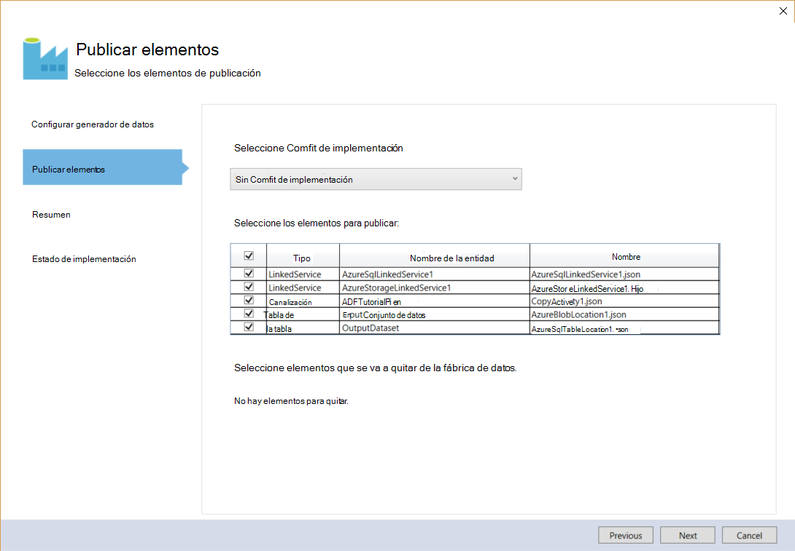

<properties 
    pageTitle="Tutorial: Crear una canalización con la actividad de copia con Visual Studio | Microsoft Azure" 
    description="En este tutorial, creará una canalización del generador de datos de Azure con una actividad de copia mediante Visual Studio." 
    services="data-factory" 
    documentationCenter="" 
    authors="spelluru" 
    manager="jhubbard" 
    editor="monicar"/>

<tags 
    ms.service="data-factory" 
    ms.workload="data-services" 
    ms.tgt_pltfrm="na" 
    ms.devlang="na" 
    ms.topic="get-started-article" 
    ms.date="10/17/2016" 
    ms.author="spelluru"/>

# Tutorial: Crear una canalización con la actividad de copia con Visual Studio
> [AZURE.SELECTOR]
- [Información general y los requisitos previos](data-factory-copy-data-from-azure-blob-storage-to-sql-database.md)
- [Asistente para copiar](data-factory-copy-data-wizard-tutorial.md)
- [Portal de Azure](data-factory-copy-activity-tutorial-using-azure-portal.md)
- [Visual Studio](data-factory-copy-activity-tutorial-using-visual-studio.md)
- [PowerShell](data-factory-copy-activity-tutorial-using-powershell.md)
- [Azure plantilla de administrador de recursos](data-factory-copy-activity-tutorial-using-azure-resource-manager-template.md)
- [API DE REST](data-factory-copy-activity-tutorial-using-rest-api.md)
- [API DE .NET](data-factory-copy-activity-tutorial-using-dotnet-api.md)

En este tutorial se muestra cómo crear y supervisar un generador de datos de Azure con Visual Studio. La canalización en el generador de datos utiliza una actividad de copiar para copiar los datos desde el almacenamiento de blobs de Windows Azure a base de datos de SQL Azure.

Estos son los pasos que se realizan como parte de este tutorial:

1. Crear dos servicios vinculados: **AzureStorageLinkedService1** y **AzureSqlinkedService1**. 

    La AzureStorageLinkedService1 se vincula un almacenamiento de Azure y AzureSqlLinkedService1 vincula una base de datos de SQL Azure con el generador de datos: **ADFTutorialDataFactoryVS**. Los datos de entrada para la canalización residen en un contenedor de blob en el almacenamiento de blobs de Windows Azure y datos de salida se almacenan en una tabla en la base de datos de SQL Azure. Por lo tanto, agregue estos almacena dos datos como servicios vinculados en el generador de datos.
2. Crear dos conjuntos de datos: **InputDataset** y **OutputDataset**, que representan los datos de entrada y salida que se almacenan en la almacena datos. 

    Para el InputDataset, especifique el contenedor de blob que contiene un objeto binario con el origen de datos. Para el OutputDataset, especifique la tabla SQL que almacena los datos de salida. También especificar otras propiedades, como la estructura, la disponibilidad y la directiva.
3. Crear una canalización denominada **ADFTutorialPipeline** en la ADFTutorialDataFactoryVS. 

    La canalización tiene una **Actividad de copia** de copia de entrada de datos de la Azure blob a la tabla SQL Azure de salida. La actividad de copia realiza el movimiento de datos en el generador de datos de Azure. La actividad funciona con un servicio disponible globalmente que puede copiar datos entre varias almacena datos de forma segura, confiable y scalable. Consulte el artículo de [Actividades de movimiento de datos](data-factory-data-movement-activities.md) para obtener más información acerca de la actividad de copia. 
4. Crear un generador de datos denominado **VSTutorialFactory**. Implemente el generador de datos y todas las entidades de datos fábrica (servicios vinculados, tablas y la canalización).    

## Requisitos previos

1. Lea el artículo de [Visión general de Tutorial](data-factory-copy-data-from-azure-blob-storage-to-sql-database.md) y complete los pasos de **requisito previo** . 
2. Debe ser un **Administrador de la suscripción de Azure** para poder publicar entidades de fábrica de datos en el generador de datos de Azure.  
3. Debe tener instalado en su equipo: 
    - 2013 de Visual Studio o Visual Studio de 2015
    - Descargar Azure SDK para 2013 de Visual Studio o Visual Studio de 2015. Vaya a la [Página de descarga de Azure](https://azure.microsoft.com/downloads/) y haga clic en **VS 2013** o **VS 2015** en la sección **.NET** .
    - Descargar el complemento del generador de datos de Azure más reciente para Visual Studio: [VS 2013](https://visualstudiogallery.msdn.microsoft.com/754d998c-8f92-4aa7-835b-e89c8c954aa5) o [VS 2015](https://visualstudiogallery.msdn.microsoft.com/371a4cf9-0093-40fa-b7dd-be3c74f49005). También puede actualizar el complemento siguiendo estos pasos: en el menú, haga clic en **Herramientas** -> **extensiones y actualizaciones** -> **Online** -> **Galería de Visual Studio** -> **Generador de datos de Microsoft Azure Tools para Visual Studio** -> **Actualizar**.

## Crear el proyecto de Visual Studio 
1. Inicie **Visual Studio de 2013**. Haga clic en **archivo**, elija **nuevo**y haga clic en **proyecto**. Verá el cuadro de diálogo **Nuevo proyecto** .  
2. En el cuadro de diálogo **Nuevo proyecto** , seleccione la plantilla de **DataFactory** y haga clic en **Proyecto de fábrica de datos vacía**. Si no ve la plantilla DataFactory, cierre Visual Studio, instalar Azure SDK de 2013 de Visual Studio y vuelva a abrir Visual Studio.  

    

3. Escriba un **nombre** para el proyecto, **ubicación**y un nombre para la **solución**y haga clic en **Aceptar**.

     

## Crear servicios vinculados
Servicios vinculados vincular almacena datos o calculan servicios a un generador de datos de Azure. Consulte [almacena datos compatibles](data-factory-data-movement-activities.md##supported-data-stores-and-formats) para todos los orígenes y receptores compatibles con la actividad de copia. Vea [calcular servicios vinculados](data-factory-compute-linked-services.md) de la lista de servicios de cálculo compatibles con el generador de datos. En este tutorial, no utilizar cualquier servicio de cálculo. 

En este paso, creará dos servicios vinculados: **AzureStorageLinkedService1** y **AzureSqlLinkedService1**. AzureStorageLinkedService1 vinculadas vínculos de servicio una cuenta de almacenamiento de Azure y AzureSqlLinkedService vincula una base de datos de SQL Azure con el generador de datos: **ADFTutorialDataFactory**. 

### Crear el servicio de almacenamiento de Azure vinculado

4. Haga clic con el botón **Servicios vinculados** en el Explorador de soluciones, elija **Agregar**y haga clic en **Nuevo elemento**.      
5. En el cuadro de diálogo **Agregar nuevo elemento** , seleccione **Servicios vinculados de Azure almacenamiento** de la lista y haga clic en **Agregar**. 

    
 
3. Reemplazar `<accountname>` y `<accountkey>`* con el nombre de su cuenta de almacenamiento de Azure y su clave. 

    

4. Guarde el archivo **AzureStorageLinkedService1.json** .

> Para obtener más información sobre las propiedades JSON, vea [mover datos desde y hacia blobs de Windows Azure](data-factory-azure-blob-connector.md#azure-storage-linked-service) .

### Crear el servicio SQL Azure vinculado

5. Haga clic derecho en el nodo de **Servicios vinculados** en el **Explorador de soluciones** de nuevo, elija **Agregar**y haga clic en **Nuevo elemento**. 
6. En este momento, seleccione **Servicios vinculados de SQL Azure**y haga clic en **Agregar**. 
7. En el **archivo AzureSqlLinkedService1.json**, reemplace `<servername>`, `<databasename>`, `<username@servername>`, y `<password>` con nombres de su servidor SQL Azure, la base de datos, la cuenta de usuario y la contraseña.    
8.  Guarde el archivo **AzureSqlLinkedService1.json** . 

> [AZURE.NOTE]
> Para obtener más información sobre las propiedades JSON, vea [mover datos desde y hacia la base de datos de SQL Azure](data-factory-azure-sql-connector.md#azure-sql-linked-service-properties) .

## Crear conjuntos de datos
En el paso anterior, creado vinculados servicios **AzureStorageLinkedService1** y **AzureSqlLinkedService1** para vincular una cuenta de almacenamiento de Azure y la base de datos de SQL Azure en el generador de datos: **ADFTutorialDataFactory**. En este paso, se definen dos conjuntos de datos, **InputDataset** y **OutputDataset** , que representan los datos de entrada y salida se almacenan en la almacena datos referencia AzureStorageLinkedService1 y AzureSqlLinkedService1 respectivamente. Para InputDataset, especifique el contenedor de blob que contiene un objeto binario con el origen de datos. Para OutputDataset, especifique la tabla SQL que almacena los datos de salida.

### Crear conjunto de datos de entrada
En este paso, creará un conjunto de datos denominado **InputDataset** que apunta a un contenedor de blob en el almacenamiento de Azure representada por el servicio de **AzureStorageLinkedService1** vinculado. Una tabla es un conjunto de datos rectangular y es el único tipo de conjunto de datos admitido ahora mismo. 

9. Haga clic en **tablas** en el **Explorador de soluciones**, elija **Agregar**y haga clic en **Nuevo elemento**.
10. En el cuadro de diálogo **Agregar nuevo elemento** , seleccione **Blobs de Windows Azure**y haga clic en **Agregar**.   
10. Reemplazar el texto JSON con el texto siguiente y guarde el archivo **AzureBlobLocation1.json** . 

        {
          "name": "InputDataset",
          "properties": {
            "structure": [
              {
                "name": "FirstName",
                "type": "String"
              },
              {
                "name": "LastName",
                "type": "String"
              }
            ],
            "type": "AzureBlob",
            "linkedServiceName": "AzureStorageLinkedService1",
            "typeProperties": {
              "folderPath": "adftutorial/",
              "format": {
                "type": "TextFormat",
                "columnDelimiter": ","
              }
            },
            "external": true,
            "availability": {
              "frequency": "Hour",
              "interval": 1
            }
          }
        }

     Tenga en cuenta los siguientes puntos: 
    
    - **tipo** de conjunto de datos se establece en **AzureBlob**.
    - **linkedServiceName** se establece en **AzureStorageLinkedService**. Este servicio vinculada que creado en el paso 2.
    - **folderPath** se establece en el contenedor **adftutorial** . También puede especificar el nombre de un blob dentro de la carpeta mediante la propiedad del **nombre de archivo** . Puesto que no se especifica el nombre del objeto binario, datos de todos los blobs en el contenedor se consideran como una entrada de datos.  
    - **tipo** de formato se establece en **TextFormat**
    - Hay dos campos en el archivo de texto: **nombre** y **apellido** , separado por un carácter de coma (**columnDelimiter**) 
    - La **disponibilidad** se establece en **cada hora** (**frecuencia** se establece en **horas** y el **intervalo** está establecido en **1**). Por lo tanto, el generador de datos busca datos de entrada cada hora en la carpeta raíz del contenedor de blob (**adftutorial**) especificado. 
    
    Si no especifica un **nombre de archivo** para un conjunto de datos de **entrada** , todos los archivos o blobs de la carpeta de entrada (**folderPath**) se consideran como entradas. Si especifica un nombre de archivo en el JSON, solo el especificado archivo/blob se considera asn entrada.
 
    Si no especifica un **nombre de archivo** para una **tabla de resultados**, los archivos generados en el **folderPath** se denominan en el siguiente formato: datos. &lt;Guid\&gt;. txt (ejemplo: Data.0a405f8a 93ff 4c6f b3be f69616f1df7a.txt.).

    Para establecer **folderPath** y **nombre de archivo** dinámicamente en función del tiempo de **SliceStart** , use la propiedad **partitionedBy** . En el ejemplo siguiente, folderPath usa el año, mes y día de la SliceStart (hora de inicio de la segmentación de datos que se está procesando) y nombre de archivo usa horas desde el SliceStart. Por ejemplo, si se produce un sector para 2016-09-20T08:00:00, el nombre de carpeta se establece en wikidatagateway, wikisampledataout, 2016, 09/20 y el nombre de archivo se establece en 08.csv. 

            "folderPath": "wikidatagateway/wikisampledataout/{Year}/{Month}/{Day}",
            "fileName": "{Hour}.csv",
            "partitionedBy": 
            [
                { "name": "Year", "value": { "type": "DateTime", "date": "SliceStart", "format": "yyyy" } },
                { "name": "Month", "value": { "type": "DateTime", "date": "SliceStart", "format": "MM" } }, 
                { "name": "Day", "value": { "type": "DateTime", "date": "SliceStart", "format": "dd" } }, 
                { "name": "Hour", "value": { "type": "DateTime", "date": "SliceStart", "format": "hh" } } 

> [AZURE.NOTE]
> Para obtener más información sobre las propiedades JSON, vea [mover datos desde y hacia blobs de Windows Azure](data-factory-azure-blob-connector.md#azure-blob-dataset-type-properties) .

### Crear conjunto de datos de salida
En este paso, creará un conjunto de datos de salida denominada **OutputDataset**. Puntos de este conjunto de datos a una tabla SQL en la base de datos de SQL Azure representada por **AzureSqlLinkedService1**. 

11. Haga clic con el botón de **tablas** en el **Explorador de soluciones** de nuevo, elija **Agregar**y haga clic en **Nuevo elemento**.
12. En el cuadro de diálogo **Agregar nuevo elemento** , seleccione **SQL Azure**y haga clic en **Agregar**. 
13. Reemplazar el texto JSON con el siguiente JSON y guarde el archivo **AzureSqlTableLocation1.json** .

        {
          "name": "OutputDataset",
          "properties": {
            "structure": [
              {
                "name": "FirstName",
                "type": "String"
              },
              {
                "name": "LastName",
                "type": "String"
              }
            ],
            "type": "AzureSqlTable",
            "linkedServiceName": "AzureSqlLinkedService1",
            "typeProperties": {
              "tableName": "emp"
            },
            "availability": {
              "frequency": "Hour",
              "interval": 1
            }
          }
        }

     Tenga en cuenta los siguientes puntos: 
    
    - **tipo** de conjunto de datos se establece en **AzureSQLTable**.
    - **linkedServiceName** se establece en **AzureSqlLinkedService** (este servicio vinculada que creó en el paso 2).
    - **nombre de tabla** se establece en **emp**.
    - Hay tres columnas: **ID**, **nombre**y **apellido** : en la tabla de emp en la base de datos. ID es una columna de identidad, por lo que debe especificar solo **nombre** y **Apellidos** aquí.
    - La **disponibilidad** se establece en **cada hora** (**frecuencia** establecido en **hora** e **intervalo** establecido en **1**).  El servicio de generador de datos genera un segmento de datos de salida cada hora en la tabla de **emp** en la base de datos de SQL Azure.

> [AZURE.NOTE]
> Para obtener más información sobre las propiedades JSON, vea [mover datos desde y hacia la base de datos de SQL Azure](data-factory-azure-sql-connector.md#azure-sql-linked-service-properties) .

## Crear canalización 
Ha creado tablas y servicios de entrada y salida vinculados hasta ese momento. Ahora, cree una canalización con una **Actividad de copiar** para copiar datos de la Azure blob a base de datos de SQL Azure. 

1. Haga **canalizaciones** en el **Explorador de soluciones**, elija **Agregar**y haga clic en **Nuevo elemento**.  
15. Seleccione la **Canalización de datos de copia** en el cuadro de diálogo **Agregar nuevo elemento** y haga clic en **Agregar**. 
16. Reemplazar el JSON con el siguiente JSON y guarde el archivo **CopyActivity1.json** .
            
        {
          "name": "ADFTutorialPipeline",
          "properties": {
            "description": "Copy data from a blob to Azure SQL table",
            "activities": [
              {
                "name": "CopyFromBlobToSQL",
                "type": "Copy",
                "inputs": [
                  {
                    "name": "InputDataset"
                  }
                ],
                "outputs": [
                  {
                    "name": "OutputDataset"
                  }
                ],
                "typeProperties": {
                  "source": {
                    "type": "BlobSource"
                  },
                  "sink": {
                    "type": "SqlSink",
                    "writeBatchSize": 10000,
                    "writeBatchTimeout": "60:00:00"
                  }
                },
                "Policy": {
                  "concurrency": 1,
                  "executionPriorityOrder": "NewestFirst",
                  "style": "StartOfInterval",
                  "retry": 0,
                  "timeout": "01:00:00"
                }
              }
            ],
            "start": "2015-07-12T00:00:00Z",
            "end": "2015-07-13T00:00:00Z",
            "isPaused": false
          }
        }

    Tenga en cuenta los siguientes puntos:

    - En la sección actividades, hay sólo una actividad cuyo **tipo** se establece en **Copiar**.
    - Entrada de la actividad se establece en **InputDataset** y salida de la actividad está establecida en **OutputDataset**.
    - En la sección **typeProperties** , **BlobSource** se especifica como el tipo de origen y **SqlSink** se especifica como el tipo de receptor.

    Reemplace el valor de la propiedad **empezar** con el valor de día y de **finalización** actual con el día siguiente. Puede especificar la parte de la fecha y omitir la parte de hora de la fecha hora. Por ejemplo, "2016-02-03", que es equivalente a "2016-02-03T00:00:00Z"
    
    Ambas inicio y final fechas y horas deben estar en [formato ISO](http://en.wikipedia.org/wiki/ISO_8601). Por ejemplo: 2016-10-14T16:32:41Z. La hora de **finalización** es opcional, pero se usa en este tutorial. 
    
    Si no especifica el valor de la propiedad **final** , se calcula como "**Inicio + 48 horas**". Para ejecutar la canalización de forma indefinida, especifique **9999-09-09** como el valor de la propiedad **end** .
    
    En el ejemplo anterior, hay 24 segmentaciones de datos como cada segmento de datos se produce cada hora.

## Publicar o implementar entidades del generador de datos
En este paso, publicar entidades de datos fábrica (servicios vinculados, los conjuntos de datos y canalización) que creó anteriormente. También especificar el nombre de la nueva generador de datos que se creen para mantener estas entidades.  

18. Haga clic en proyecto en el Explorador de soluciones y haga clic en **Publicar**. 
19. Si ve el cuadro de diálogo **iniciar sesión en su cuenta de Microsoft** , escriba sus credenciales para la cuenta que tiene la suscripción de Azure y haga clic en **iniciar sesión**.
20. Verá el cuadro de diálogo siguiente:

    
21. En la página de fábrica configurar datos, siga los pasos siguientes: 
    1. Seleccione la opción **Crear nuevo generador de datos** .
    2. Para **nombre**, escriba **VSTutorialFactory** .  
    
        > [AZURE.IMPORTANT]  
        > El nombre del generador de datos de Azure debe ser único global. Si recibe un error sobre el nombre del generador de datos al publicar, cambiar el nombre de la fábrica de datos (por ejemplo, yournameVSTutorialFactory) e inténtelo de nuevo de publicación. Vea el tema de la [Fábrica de datos - las reglas de nombres](data-factory-naming-rules.md) para las reglas de nomenclatura para artefactos del generador de datos.     
    3. Seleccione la suscripción Azure para el campo de la **suscripción** .
     
        > [AZURE.IMPORTANT]Si no ve ninguna suscripción, asegúrese de que ha iniciado sesión con una cuenta que sea un administrador o co-administración de la suscripción.  
    4. Seleccione el **grupo de recursos** para el generador de datos que se cree. 5. Seleccione la **región** de la fábrica de datos. Solo las regiones que admite el servicio de generador de datos se muestran en la lista desplegable.
6. Haga clic en **siguiente** para pasar a la página **Publicar elementos** .
    
           
23. En la página **Publicar elementos** , asegúrese de que las fábricas datos entidades están seleccionadas y haga clic en **siguiente** para pasar a la página de **Resumen** .
    
         
24. Revise el resumen y haga clic en **siguiente** para iniciar el proceso de implementación y ver el **Estado de implementación**.

    
25. En la página de **Estado de la implementación** , debe ver el estado del proceso de implementación. Cuando haya terminado la implementación, haga clic en Finalizar. 
     tenga en cuenta los siguientes puntos: 

- Si recibe el error: "**esta suscripción no está registrada para usar el espacio de nombres Microsoft.DataFactory**", siga uno de los siguientes e intente publicar de nuevo: 

    - En Azure PowerShell, ejecute el comando siguiente para registrar el proveedor de datos fábrica. 
        
            Register-AzureRmResourceProvider -ProviderNamespace Microsoft.DataFactory
    
        Puede ejecutar el comando siguiente para confirmar el generador de datos proveedor está registrado. 
    
            Get-AzureRmResourceProvider
    - Inicie sesión con la suscripción de Azure en el [portal de Azure](https://portal.azure.com) y navegue a un módulo de generador de datos (o) crear un generador de datos en el portal de Azure. Esta acción registra automáticamente el proveedor por usted.
-   El nombre de la fábrica de datos puede estar registrado como un nombre DNS en el futuro y por tanto se hacen visible públicamente.

> [AZURE.IMPORTANT] Para crear instancias del generador de datos, debe ser administrador o co-Administrador de la suscripción de Azure

## Resumen
En este tutorial, ha creado un generador de datos de Azure para copiar datos de un Azure blob a una base de datos de SQL Azure. Utilizar Visual Studio para crear el generador de datos, servicios vinculados, los conjuntos de datos y una canalización. Estos son los pasos que realizó en este tutorial:  

1.  Crea un **Generador de datos**de Azure.
2.  Crear **servicios vinculados**:
    1. Un servicio de **Almacenamiento de Azure** vinculado vincular tu cuenta de almacenamiento de Azure que contiene los datos de entrada.    
    2. Un servicio de **SQL Azure** vinculadas para vincular la base de datos de SQL Azure que contiene los datos de salida. 
3.  Crear **conjuntos de datos**, que describen los datos de entrada y salida para canalizaciones.
4.  Crea una **canalización** con una **Actividad de copia** con **BlobSource** como origen y **SqlSink** como receptor. 

## Usar el Explorador de servidores para ver generadores de datos

1. En **Visual Studio**, haga clic en **Ver** en el menú y haga clic en **Explorador de servidores**.
2. En la ventana Explorador de servidores, expanda **Azure** y **Generador de datos**. Si ve que **inicie sesión en Visual Studio**, escriba la **cuenta** asociada a su suscripción de Azure y haga clic en **continuar**. Escriba la **contraseña**y haga clic en **iniciar sesión**. Visual Studio intenta obtener información acerca de todas las fábricas de datos de Azure en la suscripción. Ver el estado de esta operación en la ventana de la **Lista de tareas del generador de datos** .
    
3. Puede haga clic en un generador de datos y seleccione Exportar el generador de datos a un proyecto nuevo para crear un proyecto de Visual Studio basado en un generador de datos existente.
      

## Actualizar herramientas de generador de datos para Visual Studio
Para actualizar las herramientas de generador de datos de Azure para Visual Studio, realice los pasos siguientes:

1. Haga clic en **Herramientas** en el menú y seleccione **extensiones y actualizaciones**. 
2. Seleccione **las actualizaciones** en el panel izquierdo y, a continuación, seleccione la **Galería de Visual Studio**.
4. Seleccione el **Generador de datos de Azure tools para Visual Studio** y haga clic en **Actualizar**. Si no ve esta entrada, ya tiene la versión más reciente de las herramientas. 

Para obtener instrucciones sobre cómo usar el portal de Azure para supervisar la canalización y conjuntos de datos que haya creado en este tutorial, vea [canalización y conjuntos de datos de Monitor](data-factory-copy-activity-tutorial-using-azure-portal.md#monitor-pipeline) .

## Vea también
| Tema | Descripción |
| :---- | :---- |
| [Actividades de movimiento de datos](data-factory-data-movement-activities.md) | En este artículo se proporciona información detallada sobre la actividad de copia que usó en el tutorial. |
| [Programación y ejecución](data-factory-scheduling-and-execution.md) | En este artículo se explica los aspectos de programación y ejecución del generador de datos de Azure del modelo de aplicación. |
| [Canalizaciones](data-factory-create-pipelines.md) | Este artículo le ayudará a comprender canalizaciones y actividades en el generador de datos de Azure |
| [Conjuntos de datos](data-factory-create-datasets.md) | Este artículo le ayudará a comprender los conjuntos de datos en el generador de datos de Azure.
| [Supervisar y administrar tuberías mediante la aplicación de supervisión](data-factory-monitor-manage-app.md) | En este artículo se describe cómo supervisar, administrar y depurar tuberías mediante la supervisión y la aplicación de administración. 
