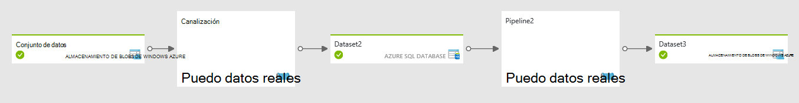
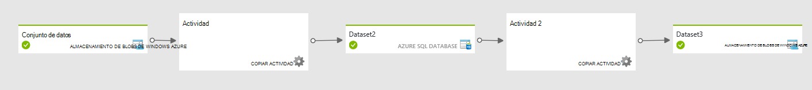

<properties 
    pageTitle="Crear o programación canalizaciones, las actividades en el generador de datos de la cadena | Microsoft Azure" 
    description="Aprenda a crear una canalización de datos en el generador de datos de Azure para mover y transformar datos. Crear un flujo de trabajo controlados por datos para generar listos para usar la información." 
    keywords="canalización de datos, datos condicionada por el flujo de trabajo"
    services="data-factory" 
    documentationCenter="" 
    authors="sharonlo101" 
    manager="jhubbard" 
    editor="monicar"/>

<tags 
    ms.service="data-factory" 
    ms.workload="data-services" 
    ms.tgt_pltfrm="na" 
    ms.devlang="na" 
    ms.topic="article"
    ms.date="09/12/2016" 
    ms.author="shlo"/>

# Canalizaciones y actividades en el generador de datos de Azure
Este artículo le ayudará a comprender canalizaciones y actividades en el generador de datos de Azure y usarlos para llevar a cabo flujos de trabajo controlados por datos para el movimiento de datos y escenarios de procesamiento de datos.  

> [AZURE.NOTE] En este artículo se supone que han pasado a través de [Introducción al generador de datos de Azure](data-factory-introduction.md). Si no tiene laboratorio-de experiencia con la creación de datos fábricas, atravesando tutorial [crear su primer generador de datos](data-factory-build-your-first-pipeline.md) puede ayudar a comprender este artículo mejor.  

## ¿Qué es una canalización de datos?
**Canalización** es una agrupación de relacionados lógicamente **actividades**. Se utiliza para las actividades de grupo en una unidad que realiza una tarea. Para entender mejor canalizaciones, necesitará saber una actividad en primer lugar. 

## ¿Qué es una actividad?
Actividades definan las acciones que puede realizar en los datos. Cada actividad tiene cero o más [conjuntos de datos](data-factory-create-datasets.md) como entradas y genera uno o varios conjuntos de datos como resultado. 

Por ejemplo, puede usar una actividad de copia para coordinar copiar datos del almacén de datos de uno a otro almacén de datos. Asimismo, puede utilizar una actividad de subárbol HDInsight para ejecutar una consulta de sección en un clúster de Azure HDInsight para transformar los datos. Generador de datos de Azure proporciona una amplia gama de [transformación de datos](data-factory-data-transformation-activities.md)y las actividades de [movimiento de datos](data-factory-data-movement-activities.md) . También puede crear una actividad de .NET personalizada para ejecutar su propio código. 

## Canalización de copia de ejemplo
En la canalización de ejemplo siguiente, hay una actividad del tipo de **copia** de la sección de **actividades** . En este ejemplo, la [actividad de copiar](data-factory-data-movement-activities.md) copia los datos de un almacenamiento de blobs de Windows Azure a una base de datos de SQL Azure. 

    {
      "name": "CopyPipeline",
      "properties": {
        "description": "Copy data from a blob to Azure SQL table",
        "activities": [
          {
            "name": "CopyFromBlobToSQL",
            "type": "Copy",
            "inputs": [
              {
                "name": "InputDataset"
              }
            ],
            "outputs": [
              {
                "name": "OutputDataset"
              }
            ],
            "typeProperties": {
              "source": {
                "type": "BlobSource"
              },
              "sink": {
                "type": "SqlSink",
                "writeBatchSize": 10000,
                "writeBatchTimeout": "60:00:00"
              }
            },
            "Policy": {
              "concurrency": 1,
              "executionPriorityOrder": "NewestFirst",
              "retry": 0,
              "timeout": "01:00:00"
            }
          }
        ],
        "start": "2016-07-12T00:00:00Z",
        "end": "2016-07-13T00:00:00Z"
      }
    } 

Tenga en cuenta los siguientes puntos:

- En la sección actividades, hay sólo una actividad cuyo **tipo** se establece en **Copiar**.
- Entrada de la actividad se establece en **InputDataset** y salida de la actividad está establecida en **OutputDataset**.
- En la sección **typeProperties** , **BlobSource** se especifica como el tipo de origen y **SqlSink** se especifica como el tipo de receptor.

Para obtener un tutorial completo de creación de esta canalización, consulte [Tutorial: copiar datos de almacenamiento de blobs de base de datos de SQL](data-factory-copy-data-from-azure-blob-storage-to-sql-database.md). 

## Canalización de la transformación de ejemplo
En la canalización de ejemplo siguiente, hay una actividad de tipo **HDInsightHive** en la sección de **actividades** . En este ejemplo, la [actividad de la sección HDInsight](data-factory-hive-activity.md) transforma los datos de un almacenamiento de blobs de Windows Azure ejecutando un archivo de script de sección en un clúster de Azure HDInsight Hadoop. 

    {
        "name": "TransformPipeline",
        "properties": {
            "description": "My first Azure Data Factory pipeline",
            "activities": [
                {
                    "type": "HDInsightHive",
                    "typeProperties": {
                        "scriptPath": "adfgetstarted/script/partitionweblogs.hql",
                        "scriptLinkedService": "AzureStorageLinkedService",
                        "defines": {
                            "inputtable": "wasb://adfgetstarted@<storageaccountname>.blob.core.windows.net/inputdata",
                            "partitionedtable": "wasb://adfgetstarted@<storageaccountname>.blob.core.windows.net/partitioneddata"
                        }
                    },
                    "inputs": [
                        {
                            "name": "AzureBlobInput"
                        }
                    ],
                    "outputs": [
                        {
                            "name": "AzureBlobOutput"
                        }
                    ],
                    "policy": {
                        "concurrency": 1,
                        "retry": 3
                    },
                    "scheduler": {
                        "frequency": "Month",
                        "interval": 1
                    },
                    "name": "RunSampleHiveActivity",
                    "linkedServiceName": "HDInsightOnDemandLinkedService"
                }
            ],
            "start": "2016-04-01T00:00:00Z",
            "end": "2016-04-02T00:00:00Z",
            "isPaused": false
        }
    }

Tenga en cuenta los siguientes puntos: 

- En la sección actividades, hay sólo una actividad cuyo **tipo** se establece en **HDInsightHive**.
- El archivo de comandos de la sección, **partitionweblogs.hql**, se almacena en la cuenta de almacenamiento de Azure (especificado por el scriptLinkedService, denominado **AzureStorageLinkedService**) y en la carpeta de **script** en el contenedor **adfgetstarted**.
- La sección **define** se utiliza para especificar la configuración de tiempo de ejecución que se pasa a la secuencia de comandos de la sección como valores de configuración de la sección (por ejemplo ${hiveconf: inputtable}, ${hiveconf:partitionedtable}).

Para obtener un tutorial completo de creación de esta canalización, consulte [Tutorial: crear su primer canalización para procesar datos mediante clúster de Hadoop](data-factory-build-your-first-pipeline.md). 

## Encadenar actividades
Si tiene varias actividades en una canalización y salida de una actividad no es una entrada de otra actividad, las actividades pueden ejecutar en paralelo si están listos segmentaciones de datos de entrada para las actividades. 

Puede encadenar dos actividades haciendo que el conjunto de datos de salida de la actividad de un conjunto de datos de entrada de la actividad de otra. Las actividades pueden estar en la misma tubería o en canalizaciones diferentes. La segunda actividad ejecuta solo cuando primero se completa correctamente. 

Por ejemplo, tenga en cuenta lo siguiente:
 
1.  Canalización P1 tiene A1 actividad que requiere el conjunto de datos de entrada externo D1 y producir el conjunto de datos de **salida** **D2**.
2.  Canalización P2 tiene A2 de actividad que requiere una **entrada** de conjunto de datos **D2**y genera el conjunto de datos de salida D3.
 
En este escenario, la actividad A1 se ejecuta cuando los datos externos están disponibles y se alcanza la frecuencia de disponibilidad programada.  La actividad A2 se ejecuta cuando los sectores programados de D2 no estarán disponibles y se alcanza la frecuencia de disponibilidad programada. Si hay un error en uno de los sectores del conjunto de datos D2, A2 no se ejecuta para ese sector hasta que esté disponible.

Vista de diagrama:

Vista de diagrama con dos actividades en la misma canalización: 

Para obtener más información, vea [programación y ejecución](#chaining-activities). 

## Programación y ejecución
Hasta ahora ha comprendido cuáles son canalizaciones y actividades. Una vez vistos también son cómo definido y un alto nivel ver las actividades de fábrica de datos de Azure. Ahora veamos cómo se ejecutan. 

Una canalización está activa únicamente entre su hora de inicio y hora de finalización. No se ejecuta antes de la hora de inicio o después de la hora de finalización. Si la canalización está en pausa, no se ejecutan con independencia de la hora de inicio y finalización. Para que una canalización ejecutar, no se debe pausar. De hecho, no es la canalización que se ejecute. Es las actividades de la canalización que se ejecutan. No obstante lo hacen en el contexto general de la canalización. 

Vea [programación y ejecución comprender cómo funciona la programación y ejecución en el generador de datos de Azure.](data-factory-scheduling-and-execution.md)

## Crear canalizaciones
Generador de datos de Azure proporciona varios mecanismos para crear e implementar canalizaciones (que a su vez contienen una o varias actividades en él). 

### Usar el portal de Azure
Puede usar el editor del generador de datos en el portal de Azure para crear una canalización. Para obtener un tutorial to-end, vea [Introducción a Azure datos fábrica (Editor de fábrica de datos)](data-factory-build-your-first-pipeline-using-editor.md) . 

### Uso de Visual Studio 
Puede usar Visual Studio para crear e implementar canalizaciones en el generador de datos de Azure. Para obtener un tutorial to-end, vea [Introducción a Azure datos fábrica (Visual Studio)](data-factory-build-your-first-pipeline-using-vs.md) . 

### Uso de PowerShell de Azure
Puede usar Azure PowerShell para crear canalizaciones en el generador de datos de Azure. Supongamos, por ejemplo, ha definido la canalización de JSON en un archivo en c:\DPWikisample.json. Puede cargarlo en la instancia del generador de datos de Azure, tal como se muestra en el ejemplo siguiente:

    New-AzureRmDataFactoryPipeline -ResourceGroupName ADF -Name DPWikisample -DataFactoryName wikiADF -File c:\DPWikisample.json

Para obtener un tutorial llevar a cabo para crear un generador de datos con una canalización, vea [Introducción a Azure datos fábrica (Azure PowerShell)](data-factory-build-your-first-pipeline-using-powershell.md) . 

### Mediante el SDK de .NET
Puede crear e implementar canalización a través de .NET SDK demasiado. Este mecanismo puede utilizarse para crear canalizaciones mediante programación. Para obtener más información, vea [crear, administrar y supervisar fábricas de datos mediante programación](data-factory-create-data-factories-programmatically.md). 

### Con el Administrador de recursos de Azure plantilla
Puede crear e implementar canalización mediante una plantilla de administrador de recursos de Azure. Para obtener más información, vea [Introducción a Azure datos fábrica (Administrador de recursos de Azure)](data-factory-build-your-first-pipeline-using-arm.md). 

### Uso de la API de REST
Puede crear e implementar canalización utilizando las API de REST demasiado. Este mecanismo puede utilizarse para crear canalizaciones mediante programación. Para obtener más información, vea [crear o actualizar una canalización](https://msdn.microsoft.com/library/azure/dn906741.aspx). 

## Supervisar y administrar canalizaciones  
Una vez que se implementa una canalización, puede administrar y supervisar su canalizaciones, sectores y se ejecuta. Obtenga más información sobre él aquí: [supervisar y administrar canalizaciones](data-factory-monitor-manage-pipelines.md).

## Canalización JSON   
Deje que nosotros, estudie detenidamente en cómo se define una canalización en formato JSON. La estructura genérica para una canalización tiene el siguiente aspecto:

    {
        "name": "PipelineName",
        "properties": 
        {
            "description" : "pipeline description",
            "activities":
            [
    
            ],
            "start": "<start date-time>",
            "end": "<end date-time>"
        }
    }

La sección **actividades** puede tener una o varias actividades definidas en él. Cada actividad tiene la estructura de nivel superior siguiente:

    {
        "name": "ActivityName",
        "description": "description", 
        "type": "<ActivityType>",
        "inputs":  "[]",
        "outputs":  "[]",
        "linkedServiceName": "MyLinkedService",
        "typeProperties":
        {
    
        },
        "policy":
        {
        }
        "scheduler":
        {
        }
    }

Tabla siguiente se describen las propiedades dentro de las definiciones de actividad y canalización JSON:

Etiqueta | Descripción | Obligatorio
--- | ----------- | --------
nombre | Nombre de la actividad o la canalización. Especifique un nombre que representa la acción que la actividad o canalización está configurada para hacer <ul><li>Número máximo de caracteres: 260</li><li>Debe comenzar con un número de letra o un carácter de subrayado (_)</li><li>Tras los caracteres no permitidos: ".", "+", "?", "/", "<",">", "*", "%", "&", ":","\\"</li></ul> | Sí
Descripción | Texto que describe qué se utiliza la actividad o la canalización de | Sí
tipo | Especifica el tipo de la actividad. Consulte los artículos de [Actividades de movimiento de datos](data-factory-data-movement-activities.md) y [Las actividades de transformación de datos](data-factory-data-transformation-activities.md) para diferentes tipos de actividades. | Sí
entradas | Tablas de entrada usados por la actividad  una tabla de entrada "entradas": [{"nombre": "inputtable1"}],  dos tablas de entrada  "entradas": [{"nombre": "inputtable1"}, {"nombre": "inputtable2"}], | Sí
resultados | Tablas de salida que utiliza el activity.// una tabla de resultados "envía": [{"nombre": "outputtable1"}],  dos tablas de salida "envía": [{"nombre": "outputtable1"}, {"nombre": "outputtable2"}], | Sí
linkedServiceName | Nombre del servicio vinculado usado por la actividad.   Una actividad puede requerir que especifique el servicio vinculado que lleve en el entorno de cálculo necesarios. | Sí para HDInsight actividad y Azure lote puntuación actividad de aprendizaje   No para todos los demás
typeProperties | Propiedades de la sección typeProperties dependen del tipo de actividad. | No
Directiva | Directivas que afectan al comportamiento de tiempo de ejecución de la actividad. Si no se especifica, se usan las directivas predeterminadas. | No
Inicio | Fecha y hora de inicio para la canalización. Debe estar en [formato ISO](http://en.wikipedia.org/wiki/ISO_8601). Por ejemplo: 2014-10-14T16:32:41Z.   Es posible especificar una hora local, por ejemplo un tiempo estimado. Aquí tenemos un ejemplo: "2016-02-27T06:00:00**-05:00**", que es 6 AM EST.  Las propiedades de inicio y finalización juntos especifican período activo para la canalización. Sectores de salida solo se fabrican con en este período activo. | No  Si especifica un valor para la propiedad end, debe especificar el valor de la propiedad de inicio.  Las horas de inicio y finalización pueden estar vacías para crear un proceso a la vez. Debe especificar los valores para establecer un período activo para la canalización de ejecución. Si no especifica horas de inicio y finalización al crear una canalización, se pueden configurar mediante el cmdlet Set-AzureRmDataFactoryPipelineActivePeriod más adelante.
final | Fecha y hora de finalización para la canalización. Si especifica debe estar en formato ISO. Por ejemplo: 2014-10-14T17:32:41Z   Es posible especificar una hora local, por ejemplo un tiempo estimado. Aquí tenemos un ejemplo: "2016-02-27T06:00:00**-05:00**", que es 6 AM EST.  Para ejecutar la canalización de forma indefinida, especifique 9999-09-09 como el valor de la propiedad end. | No   Si especifica un valor de la propiedad de inicio, debe especificar el valor de la propiedad final.  Consulte las notas de la propiedad de **Inicio** .
isPaused | Si no se ejecutan establecida en true la canalización. Valor predeterminado = false. Puede usar esta propiedad para habilitar o deshabilitar. | No 
programador | propiedad "programador" se utiliza para definir la programación que desee para la actividad. Sus subpropiedades son los mismos que los de la [propiedad de disponibilidad en un conjunto de datos](data-factory-create-datasets.md#Availability). | No |   
| pipelineMode | Se ejecuta el método de programación para la canalización. Valores permitidos son: programado (predeterminado), tendrá que repetir.  'Programada' indica que la canalización se ejecuta en un intervalo de tiempo especificado según su período activo (hora de inicio y finalización). 'Tendrá que repetir' indica que la canalización se ejecuta una sola vez. Tendrá que repetir canalizaciones una vez creadas no pueden ser modificado o actualizado actualmente. Vea [Onetime canalización](data-factory-scheduling-and-execution.md#onetime-pipeline) para obtener más información acerca de la configuración tendrá que repetir. | No | 
| expirationTime | Duración de tiempo después de que la canalización es válida y debe permanecer preparación de creación. Si no tiene ningún activo, el error o pendiente se ejecute la canalización se elimina automáticamente cuando llegue la hora de expiración. | No | 
| conjuntos de datos | Lista de conjuntos de datos para usarlo con las actividades definidas en la canalización. Esta propiedad puede utilizarse para definir los conjuntos de datos que son específicos de esta canalización y no definido en el generador de datos. Conjuntos de datos definidos en esta canalización sólo pueden ser usada por esta canalización y no se puede compartir. Para obtener más información, vea [conjuntos de datos en el ámbito](data-factory-create-datasets.md#scoped-datasets) .| No |  
 

### Directivas de
Las directivas afectan al comportamiento de tiempo de ejecución de una actividad, específicamente cuando se procesa la segmentación de datos de una tabla. En la tabla siguiente proporciona los detalles.

(Propiedad) | Valores permitidos | Valor predeterminado | Descripción
-------- | ----------- | -------------- | ---------------
simultaneidad | Entero   Valor máximo: 10 | 1 | Número de ejecuciones simultáneas de la actividad.  Determina el número de actividades paralelas que puede ocurrir en distintos segmentos. Por ejemplo, si una actividad tiene que ir a través de un amplio conjunto de datos disponibles, que tiene un valor mayor de simultaneidad acelera el procesamiento de datos. 
executionPriorityOrder | NewestFirst  OldestFirst | OldestFirst | Determina el orden de las segmentaciones de datos que se está procesando.  Por ejemplo, si tiene 2 sectores (uno ocurra a 4 p.m. y otro a 5 p.m.), y ambas están pendientes de ejecución. Si establece la executionPriorityOrder ser NewestFirst, primero se procesa la segmentación de datos a las 5 P.M.. De forma similar si establece la executionPriorityORder sea OldestFIrst, se procesa la segmentación de datos a las 4 PM. 
Vuelva a intentar | Entero  Valor máximo puede ser 10 | 3 | Número de reintentos antes de que el procesamiento de datos de la segmentación de datos se marcará como error. Se vuelve a intentar la ejecución de la actividad de un sector de datos hasta el número de reintentos especificado. El reintento se realiza tan pronto como sea posible después del error.
tiempo de espera | Intervalo de tiempo | 00:00:00 | Tiempo de espera de la actividad. Ejemplo: 00:10:00 (implica el tiempo de espera 10 minutos)  Si un valor no se especifica o es 0, el tiempo de espera es infinito.  Si el tiempo de procesamiento de datos en una segmentación de datos supera el valor de tiempo de espera, se cancela y el sistema intenta volver a intentar el procesamiento. El número de reintentos depende de la propiedad de reintento. Cuando se produce el tiempo de espera, el estado se establece en tiempo de espera agotado.
retraso | Intervalo de tiempo | 00:00:00 | Especificar el retraso antes de procesamiento de datos del inicio de la división.  La ejecución de la actividad de un segmento de datos se inicia tras la demora es más allá del tiempo de ejecución esperado.  Ejemplo: 00:10:00 (implica retraso de 10 minutos)
longRetry | Entero  Valor máximo: 10 | 1 | El número de reintentos largo antes de la ejecución del sector es error.  el espaciado de los intentos de longRetry están por longRetryInterval. Así que si necesita especificar un tiempo entre reintentos, use longRetry. Si se especifican los intentos y longRetry, cada intento longRetry incluye reintentos y el número máximo de intentos es reintento * longRetry.  Por ejemplo, si tenemos la siguiente configuración en la directiva de actividad: Vuelva a intentar: 3 longRetry: 2 longRetryInterval: 01:00:00  Supongamos que existe únicamente un sector para ejecutar (estado está en espera) y se produce un error en la ejecución de la actividad cada vez. Inicialmente sería 3 intentos de ejecución consecutivos. Después de cada intento, el estado del sector sería reintento. Después de intentos de 3 primeras sobre, el estado del sector sería LongRetry.  Después de una hora (es decir, el valor de longRetryInteval), sería otro conjunto de 3 intentos de ejecución consecutivos. Después de eso, el estado de la segmentación de datos ' d error y no debería realizarse más intentos. Por lo tanto, en general se realizaron intentos de 6.  Si cualquier ejecución se realiza correctamente, el estado del sector sería listo y no hay más reintentos se producen.  longRetry puede utilizarse en situaciones donde datos dependientes llegan a veces no determinista o entorno general es raro en el procesamiento de datos que se produce. En estos casos, hacerlo reintentos consecutiva pueden ayudar no y hacerlo después de un intervalo de tiempo de resultados en los resultados deseados.  Advertencia: no ha establecido valores altos de longRetry o longRetryInterval. Normalmente, los valores más altos implican otros problemas sistemáticas. 
longRetryInterval | Intervalo de tiempo | 00:00:00 | El tiempo de retraso entre reintentos larga 

## Pasos siguientes

- Comprender la [programación y ejecución en el generador de datos de Azure](data-factory-scheduling-and-execution.md).  
- Obtenga información sobre el [movimiento de datos](data-factory-data-movement-activities.md) y [capacidades de transformación de datos](data-factory-data-transformation-activities.md) en el generador de datos de Azure
- Comprender la [administración y supervisión en el generador de datos de Azure](data-factory-monitor-manage-pipelines.md).
- [Compile e implemente la canalización de la primera](data-factory-build-your-first-pipeline.md). 
