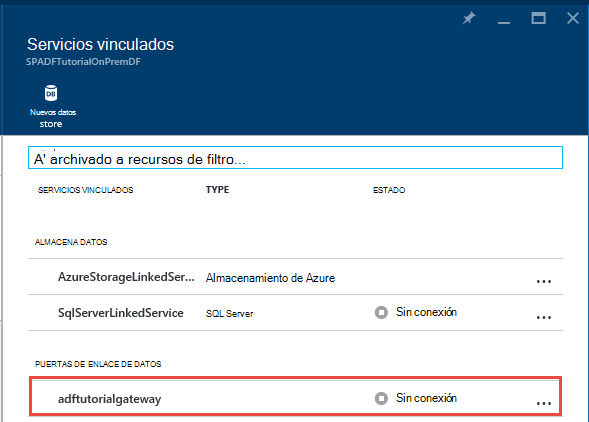

<properties 
    pageTitle="Data Management Gateway para datos Factory | Microsoft Azure"
    description="Configurar una puerta de enlace de datos para mover datos entre local y la nube. Utilice Data Management Gateway en el generador de datos de Azure para mover los datos." 
    services="data-factory" 
    documentationCenter="" 
    authors="linda33wj" 
    manager="jhubbard" 
    editor="monicar"/>

<tags 
    ms.service="data-factory" 
    ms.workload="data-services" 
    ms.tgt_pltfrm="na" 
    ms.devlang="na" 
    ms.topic="article" 
    ms.date="10/11/2016" 
    ms.author="jingwang"/>

# Data Management Gateway
Data Management Gateway es un agente de cliente que debe instalar en su entorno local para copiar datos entre la nube y local almacena datos. La almacena de datos local compatible con el generador de datos se muestran en la sección de [orígenes de datos compatibles](data-factory-data-movement-activities.md##supported-data-stores) . 

> [AZURE.NOTE] Actualmente, puerta de enlace admite solo la copia actividad y procedimiento almacenado en el generador de datos. No es posible usar la puerta de enlace de una actividad personalizada para tener acceso a orígenes de datos locales. 

En este artículo complementa el tutorial de la [mover datos entre local y la nube almacena datos](data-factory-move-data-between-onprem-and-cloud.md) artículo. En el tutorial, se crea una canalización que utiliza la puerta de enlace para mover datos de una base de datos de SQL Server local a un blobs de Windows Azure. Este artículo proporciona información detallada sobre detallada acerca de la puerta de enlace de administración de datos.   

## Información general

### Capacidades de puerta de enlace de administración de datos
Data Management Gateway proporciona las siguientes capacidades:

- Orígenes de datos locales del modelo y orígenes de datos dentro de la misma fábrica de datos en la nube y mover los datos.
- Tener un lugar único para la supervisión y administración de visibilidad del estado de la puerta de enlace desde el módulo de generador de datos.
- Administrar el acceso a orígenes de datos locales de forma segura.
    - Sin cambios necesarios para un firewall. Puerta de enlace sólo tiene conexiones salientes basado en HTTP a abrir internet.
    - Cifrar las credenciales de su almacena de datos locales con el certificado.
- Mover eficazmente datos: los datos se transfieren en paralelo, problemas de red y son resistentes a intermitentes con auto lógica de reintento.

### Comando flujo y flujo de datos
Cuando se utiliza una actividad de copiar para copiar datos entre local y la nube, la actividad utiliza una puerta de enlace para transferir datos de origen de datos local a la nube y viceversa.

Datos de alto nivel aquí flujo y resumen de los pasos para copiar con la puerta de enlace de datos: 

1.  Programador de datos, crea una puerta de enlace para un generador de datos de Azure mediante el [portal de Azure](https://portal.azure.com) o el [Cmdlet de PowerShell](https://msdn.microsoft.com/library/dn820234.aspx). 
2.  Programador de datos, crea un servicio vinculado para un almacén de datos local especificando la puerta de enlace. Como parte de la configuración de los servicios vinculados, programador de datos utiliza la aplicación de establecer credenciales para especificar las credenciales y tipos de autenticación.  El cuadro de diálogo Establecer credenciales aplicación se comunica con el almacén de datos para probar la conexión y la puerta de enlace para guardar las credenciales.
3. Puerta de enlace cifra las credenciales con el certificado asociado a la puerta de enlace (proporcionada por el programador de datos), antes de guardar las credenciales en la nube.
4. Servicio de generador de datos se comunica con la puerta de enlace para la programación y administración de tareas a través de un canal de control que utiliza una cola de bus de servicios compartidos de Azure. Cuando una tarea de la actividad de copia debe ser dio, el generador de datos en cola la solicitud junto con la información de credenciales. Puerta de enlace a partir de la tarea después de sondear la cola.
5.  La puerta de enlace descifra las credenciales con el mismo certificado y luego se conecta al almacén de datos local con el tipo de autenticación y las credenciales.
6.  La puerta de enlace copia datos de un almacén local a un almacenamiento de nube (o viceversa) según la configuración de la actividad de copia de la canalización de datos. En este paso, la puerta de enlace se comunica directamente con los servicios de almacenamiento basada en nube como el almacenamiento de blobs de Windows Azure en un canal seguro de (HTTPS).

### Consideraciones sobre el uso de la puerta de enlace
- Una sola instancia de Data Management Gateway puede utilizarse para varios orígenes de datos local. Sin embargo, **una instancia de sola puerta de enlace está ligada a solo un generador de datos de Azure** y no se puede compartir con otro generador de datos.
- Puede tener **solo una instancia de Data Management Gateway** instalado en un único equipo. Supongamos que tiene dos generadores de datos que necesitan tener acceso a orígenes de datos local, debe instalar puertas de enlace en dos equipos locales. En otras palabras, una puerta de enlace está vinculado a un generador de datos específicos
- La **puerta de enlace no es necesario estar en el mismo equipo que el origen de datos**. Sin embargo, reduce el tiempo de la puerta de enlace para conectarse al origen de datos con la puerta de enlace más cerca del origen de datos. Le recomendamos que instale la puerta de enlace en un equipo que es diferente del que hospeda el origen de datos local. Cuando la puerta de enlace y origen de datos en equipos diferentes, la puerta de enlace no competir por los recursos con el origen de datos.
- Puede tener **varias puertas de enlace en distintos equipos conectarse al mismo origen de datos local**. Por ejemplo, puede tener dos puertas de enlace servir dos generadores de datos, pero el mismo origen de datos local está registrado con los generadores de datos.
- Si ya tiene una puerta de enlace instalado en el equipo que sirve un escenario de **Power BI** , instale una **puerta de enlace independiente para el generador de datos de Azure** en otro equipo.
- Puerta de enlace debe usarse incluso cuando utilice **ExpressRoute**.
- Considerar el origen de datos como un origen de datos local (es decir, detrás de un firewall) incluso si usa **ExpressRoute**. Usar la puerta de enlace para establecer la conexión entre el servicio y el origen de datos.
- Aunque el almacén de datos está en la nube en una **Máquina virtual de IaaS de Azure**, debe **usar la puerta de enlace** . 

## Instalación

### Requisitos previos
- Las versiones de **sistemas operativos** compatibles son Windows 7, Windows 8 o 8.1, Windows 10, Windows Server 2008 R2, Windows Server 2012, Windows Server 2012 R2. Instalación de Data Management Gateway en un controlador de dominio no es compatible actualmente.
- .NET framework 4.5.1 o superior es necesario. Si está instalando la puerta de enlace en un equipo con Windows 7, instale .NET Framework 4.5 o posterior. Para obtener más información, consulte [Requisitos del sistema de .NET Framework](https://msdn.microsoft.com/library/8z6watww.aspx) . 
- La **configuración** recomendada para el equipo de puerta de enlace es 2 GHz mínimo, 4 núcleos, 8 GB de RAM y disco de 80 GB.
- Si el equipo host hibernación, la puerta de enlace no responde a las solicitudes de datos. Por lo tanto, configure un **plan de energía** de apropiado en el equipo antes de instalar la puerta de enlace. Si el equipo está configurado para hibernación, la instalación de puerta de enlace solicita un mensaje.
- Debe ser un administrador en el equipo para instalar y configurar Data Management Gateway correctamente. Puede agregar más usuarios al grupo local de **Usuarios de puerta de enlace de administración de datos** de Windows. Los miembros de este grupo son puedos usar la herramienta de administrador de configuración de Data Management Gateway para configurar la puerta de enlace. 

Copiar actividad ejecuciones se realizan en una frecuencia determinada, el uso de recursos (CPU, memoria) en el equipo también sigue el mismo patrón con pico y tiempos de inactividad. Uso de recursos también depende en gran medida la cantidad de datos que se mueve. Cuando varios trabajos de copia en curso, vea Uso de recursos Subir durante las horas. 

### Opciones de instalación
Data Management Gateway se puede instalar de las siguientes maneras: 

- Descargar un archivo MSI de instalación paquete desde el [Centro de descarga de Microsoft](https://www.microsoft.com/download/details.aspx?id=39717).  El archivo MSI también puede usarse para actualizar Data Management Gateway existentes a la versión más reciente, con todas las opciones que se conservan.
- Haciendo clic en vínculo **descargar e instalar la puerta de enlace de datos** en configuración MANUAL o **instalar directamente en este equipo** en el programa de instalación EXPRESS. Consulte el artículo de [mover datos entre local y la nube](data-factory-move-data-between-onprem-and-cloud.md) para obtener instrucciones detalladas sobre el uso de programa de instalación express. El paso manual le lleva al centro de descarga.  Son las instrucciones para descargar e instalar la puerta de enlace del centro de descarga en la siguiente sección. 

### Procedimientos recomendados de instalación:
1.  Configurar el plan de energía en el equipo host de la puerta de enlace para que el equipo no hibernación. Si el equipo host hibernación, la puerta de enlace no responde a las solicitudes de datos.
2.  Copia de seguridad el certificado asociado a la puerta de enlace.

### Instalar la puerta de enlace del centro de descarga
1. Vaya a la [página de descarga de Microsoft Data Management Gateway](https://www.microsoft.com/download/details.aspx?id=39717). 
2. Haga clic en **Descargar**, seleccione la versión apropiada (**32 bits** o **64 bits**) y haga clic en **siguiente**. 
3. Ejecutar el **MSI** directamente o guardar en el disco duro y ejecutar.
4. En la página **principal** , seleccione un **idioma** , haga clic en **siguiente**.
5. **Aceptar** el contrato de licencia de usuario final y haga clic en **siguiente**. 
6. Seleccione la **carpeta** para instalar la puerta de enlace y haga clic en **siguiente**. 
7. En la página **preparado para instalar** , haga clic en **instalar**. 
8. Haga clic en **Finalizar** para completar la instalación.
9. Obtener la clave desde el portal de Azure. Vea la siguiente sección para obtener instrucciones paso a paso. 
10. En la página **registrar la puerta de enlace** del **Administrador de configuración de Data Management Gateway** se ejecuta en el equipo, siga los pasos siguientes: 
    1. Pegue la clave en el texto.
    2. Si lo desea, haga clic en **Mostrar clave de puerta de enlace** para ver el texto de la tecla.
    3. Haga clic en **registrarse**. 

### Registrar con clave de puerta de enlace

#### Si aún no ha creado una puerta de enlace lógico en el portal
Para crear una puerta de enlace en el portal y obtener la clave del módulo de **Configurar** , siga los pasos de tutorial en el artículo [mover datos entre local y la nube](data-factory-move-data-between-onprem-and-cloud.md) .    

#### Si ya ha creado la puerta de enlace lógico en el portal
1. En el portal de Azure, desplácese hasta el módulo de **Generador de datos** y haga clic en el mosaico de **Servicios vinculados** .

    
2. En el módulo de **Servicios vinculadas** , seleccione la lógica **puerta de enlace** que creó en el portal. 

      
2. En el módulo de **Puerta de enlace de datos** , haga clic en **descargar e instalar la puerta de enlace de datos**.

       
3. En el módulo de **Configurar** , haga clic en **volver a crear clave**. Haga clic en Sí en el mensaje de advertencia después de leerlo detenidamente.

    
4. Haga clic en el botón Copiar junto a la tecla. La clave se copia en el Portapapeles.
    
     

### Iconos de la Bandeja de sistema y notificaciones
La imagen siguiente muestra algunos de los iconos de la bandeja que aparece. 

Si mueve el cursor sobre el mensaje de notificación de icono o de la Bandeja de sistema, consulte los detalles sobre el estado de la operación de actualización de la puerta de enlace o en una ventana emergente.

### Puertos y protocolos de firewall
Hay dos servidores de seguridad que debe tener en cuenta: **un firewall** que se ejecute en el enrutador central de la organización y el **firewall de Windows** está configurado como un demonio en el equipo local donde está instalado la puerta de enlace.  

En el nivel de un firewall, debe configurar los siguientes dominios y puertos de salida:

| Nombres de dominio | Puertos | Descripción |
| ------ | --------- | ------------ |
| *. servicebus.windows.net | 443, 80 | Escucha en servicio de retransmisión de Bus sobre TCP (requiere 443 para adquisición de token de Control de acceso) | 
| *. servicebus.windows.net | 9350-9354, 5671 | Retransmisión de bus de servicio opcional sobre TCP | 
| *. Core.Windows.NET. | 443 | HTTPS | 
| *. clouddatahub.net | 443 | HTTPS | 
| Graph.Windows.NET | 443 | HTTPS |
| Login.Windows.NET | 443 | HTTPS | 

En el nivel de firewall de windows, normalmente se habilitan estos puertos de salida. Si no es así, puede configurar los puertos y dominios según corresponda en el equipo de puerta de enlace.

#### Copiar datos de un almacén de datos de origen a un almacén de datos de lavabo

Asegúrese de que las reglas de firewall están habilitadas correctamente en el firewall corporativo, firewall de Windows en el equipo de puerta de enlace, y el almacén de datos independiente. Estas reglas se habilita la puerta de enlace para conectarse al origen de ambos y receptor correctamente. Habilitar reglas para cada almacén de datos implicados en la operación de copia.

Por ejemplo, para copiar de **receptor de un almacén de datos local a un receptor de la base de datos de SQL Azure o un almacén de datos de SQL Azure**, siga los pasos siguientes: 

- Permitir las comunicaciones salientes de **TCP** en el puerto **1433** para firewall de Windows y el firewall corporativo
- Configurar el firewall del servidor de SQL Azure para agregar la dirección IP del equipo de puerta de enlace a la lista de direcciones IP permitidas. 

### Consideraciones acerca del servidor proxy
Si su entorno de red corporativa, usa un servidor proxy para tener acceso a internet, configure Data Management Gateway para usar configuración de proxy apropiada. Puede configurar al servidor proxy durante la fase de registro inicial. 

Puerta de enlace utiliza el servidor proxy para conectarse al servicio de nube. Haga clic en **cambiar** vínculo durante la instalación inicial. Verá el cuadro de diálogo **configuración de proxy** .

Hay tres opciones de configuración: 

- **No utilizar proxy**: puerta de enlace no utiliza explícitamente cualquier proxy para conectarse a servicios en la nube.
- **Usar proxy del sistema**: puerta de enlace usa la configuración de proxy que está configurado en diahost.exe.config.  Si no hay ningún proxy está configurado en diahost.exe.config, puerta de enlace se conecta al servicio de nube directamente sin pasar a través de proxy.
- **Usar proxy personalizado**: configurar el proxy HTTP para la puerta de enlace, en lugar de utilizar configuraciones diahost.exe.config.  Dirección y puerto son necesarios.  Nombre de usuario y la contraseña son opcionales según la configuración de autenticación de su servidor proxy.  Toda la configuración está cifrada con el certificado de credenciales de la puerta de enlace y se almacenan localmente en el equipo del host de puerta de enlace.

El servicio de Host de puerta de enlace de administración de datos se reinicia automáticamente después de guardar la configuración de proxy actualizada. 

Después de puerta de enlace se ha registrado correctamente, si desea ver o actualizar la configuración de proxy, use el Administrador de configuración de Data Management Gateway. 

1. Inicie el Administrador de configuración de Data Management Gateway.
2. Cambie a la pestaña **configuración** .
3. Haga clic en **cambiar** vínculo en la sección **HTTP Proxy** para iniciar el cuadro de diálogo **Establecer Proxy de HTTP** .  
4. Después de hacer clic en el botón **siguiente** , verá un cuadro de diálogo de advertencia que se solicita permiso para guardar la configuración de proxy y reinicie el servicio de Host de puerta de enlace.

Puede ver y actualizar a proxy HTTP mediante la herramienta Administrador de configuración. 

> [AZURE.NOTE] Si configura un servidor proxy con la autenticación NTLM, se ejecuta el servicio de Host de puerta de enlace en la cuenta de dominio. Si cambia la contraseña de la cuenta de dominio más adelante, no olvide actualizar la configuración del servicio y reinícielo según corresponda. Debido a este requisito, le recomendamos que use una cuenta de dominio dedicada para tener acceso al servidor proxy que requieren que actualice la contraseña con frecuencia.

### Configurar el servidor proxy en diahost.exe.config
Si selecciona **utilizar proxy de sistema** configuración del proxy HTTP, puerta de enlace usa la configuración del proxy de diahost.exe.config.  Si no se especifica ningún proxy en diahost.exe.config, puerta de enlace se conecta al servicio de nube directamente sin pasar a través de proxy. El procedimiento siguiente proporciona instrucciones para actualizar el archivo de configuración. 

1.  En el Explorador de archivos, hacer una copia segura de administración de datos de C:\Program Files\Microsoft Gateway\2.0\Shared\diahost.exe.config para realizar copias de seguridad del archivo original.
2.  Iniciar Notepad.exe como administrador y abra el archivo de texto "C:\Program Files\Microsoft datos Management Gateway\2.0\Shared\diahost.exe.config. Buscar la etiqueta predeterminada para system.net tal como se muestra en el siguiente código:

            <system.net>
                <defaultProxy useDefaultCredentials="true" />
            </system.net>   

    A continuación, puede agregar detalles del servidor proxy tal como se muestra en el ejemplo siguiente:

            <system.net>
                  <defaultProxy enabled="true">
                        <proxy bypassonlocal="true" proxyaddress="http://proxy.domain.org:8888/" />
                  </defaultProxy>
            </system.net>

    Especifique la configuración necesaria como scriptLocation pueden propiedades adicionales dentro de la etiqueta de proxy. Consulte [proxy Element (Network Settings)](https://msdn.microsoft.com/library/sa91de1e.aspx) en sintaxis.

            <proxy autoDetect="true|false|unspecified" bypassonlocal="true|false|unspecified" proxyaddress="uriString" scriptLocation="uriString" usesystemdefault="true|false|unspecified "/>

3. Guardar el archivo de configuración en la ubicación original y reinicie el servicio de Host de puerta de enlace de administración de datos, que toma los cambios. Para reiniciar el servicio: use el subprograma de servicios desde el panel de control o desde el **Administrador de configuración de Data Management Gateway** > haga clic en el botón **Detener el servicio** , haga clic en el **Servicio de inicio**. Si no se inicia, es probable que se ha agregado una sintaxis incorrecta de etiqueta XML en el archivo de configuración de aplicación que se ha modificado.     

Además de estos puntos, también debe asegurarse de que Microsoft Azure se encuentra en la lista blanca de su empresa. La lista de direcciones IP de Microsoft Azure puede descargarse desde el [Centro de descarga de Microsoft](https://www.microsoft.com/download/details.aspx?id=41653).

#### Síntomas posibles problemas relacionados con el servidor proxy y firewall
Si se producen errores similares a los siguientes, es probable debido a la configuración incorrecta del servidor proxy o firewall, que bloquea la puerta de enlace de la conexión con el generador de datos para autenticarse. Consulte la sección anterior para garantizar el firewall y servidor proxy están configurados correctamente.

1.  Cuando intenta registrar la puerta de enlace, recibe el siguiente error: "no se pudo registrar la clave de puerta de enlace. Antes de tratar de registrar la clave de puerta de enlace de nuevo, confirme que la puerta de enlace de administración de datos está en un estado de conexión y se inicia el servicio de Host de puerta de enlace de administración de datos".
2.  Al abrir el Administrador de configuración, puede ver el estado como "Desconectado" o "Conectar". Al ver los registros de eventos de Windows, bajo "Visor de eventos" > "Registros de aplicaciones y servicios" > "Data Management Gateway", verá los mensajes de error como el siguiente error:`Unable to connect to the remote server` 
    `A component of Data Management Gateway has become unresponsive and restarts automatically. Component name: Gateway.`

### Abrir el puerto 8050 para el cifrado de credenciales 
La aplicación **Establecer credenciales** utiliza el puerto de entrada **8050** para retransmisión de credenciales de la puerta de enlace al configurar en local vinculada servicio en el portal de Azure. Durante la instalación de puerta de enlace, de forma predeterminada, la instalación de Data Management Gateway lo abre en el equipo de puerta de enlace.
 
Si está utilizando un firewall de terceros, puede abrir manualmente el puerto 8050. Si tiene firewall problema durante la instalación de puerta de enlace, puede intentar usar el comando siguiente para instalar la puerta de enlace sin configurar el firewall.

    msiexec /q /i DataManagementGateway.msi NOFIREWALL=1

Si decide no abrir el puerto 8050 en el equipo de puerta de enlace, use mecanismos que no sea utilizando la aplicación de **Establecer credenciales** para configurar las credenciales de almacenamiento de datos. Por ejemplo, podría usar el cmdlet de PowerShell [AzureRmDataFactoryEncryptValue de nuevo](https://msdn.microsoft.com/library/mt603802.aspx) . Vea la sección [seguridad y establecer credenciales](#set-credentials-and-securityy) en cómo datos almacenan credenciales se puede establecer.

## Actualización 
De forma predeterminada, Data Management Gateway se actualiza automáticamente cuando esté disponible una versión más reciente de la puerta de enlace. La puerta de enlace no se actualiza hasta que haya terminado todas las tareas programadas. No hay más tareas se procesan la puerta de enlace hasta que se complete la operación de actualización. Si se produce un error en la actualización, puerta de enlace vuelve a la versión anterior. 

Ver la hora de actualización programada de las siguientes ubicaciones:

- Hoja de propiedades de puerta de enlace en el portal de Azure.
- Página principal del Administrador de configuración de Data Management Gateway
- Mensaje de notificación de la Bandeja de sistema. 

La pestaña Inicio del Administrador de configuración de Data Management Gateway muestra la programación de actualización y la puerta de enlace de la última vez que ha instalado o actualizado. 

Puede instalar la actualización de inmediato o espere a que la puerta de enlace se actualicen automáticamente en el tiempo programado. Por ejemplo, la imagen siguiente muestra el mensaje de notificación que se muestra en el Administrador de configuración de puerta de enlace, junto con el botón de actualización que puede hacer clic para instalarlo inmediatamente. 

El mensaje de notificación en la bandeja del sistema tendría un aspecto como se muestra en la imagen siguiente: 

Ver el estado de la operación de actualización (manual o automática) en la bandeja del sistema. Inicie el Administrador de configuración de puerta de enlace próxima vez, verá un mensaje en la barra de notificación que la puerta de enlace se ha actualizado junto con un vínculo a [lo que es el nuevo tema](data-factory-gateway-release-notes.md).

### Para habilitar o deshabilitar la característica de actualización automática
Se puede habilitar o deshabilitar la característica de actualización automática realizando los siguientes pasos: 

1. Inicie Windows PowerShell en el equipo de puerta de enlace. 
2. Cambiar a la carpeta C:\Program Files\Microsoft datos Management Gateway\2.0\PowerShellScript.
3. Ejecutar el comando siguiente para activar la actualización automática de características desactivar (deshabilitar).   

        .\GatewayAutoUpdateToggle.ps1  -off

4. Al activar: 
    
        .\GatewayAutoUpdateToggle.ps1  -on  

## Administrador de configuración 
Una vez que instale la puerta de enlace, puede iniciar el Administrador de configuración de Data Management Gateway en una de las siguientes maneras: 

- En la ventana de **búsqueda** , escriba **Data Management Gateway** para obtener acceso a esta utilidad. 
- Ejecute el ejecutable **ConfigManager.exe** en la carpeta: **C:\Program Files\Microsoft datos administración Gateway\2.0\Shared** 
 
### Página principal
La página de inicio le permite realizar las siguientes acciones: 

- Ver el estado de la puerta de enlace (conectado al servicio de nube etcetera.). 
- **Registrar** mediante una clave desde el portal.
- **Detenga** e iniciar el **servicio de Host de puerta de enlace de administración de datos** en el equipo de puerta de enlace.
- **Programar actualizaciones** en un momento determinado de los días.
- Ver la fecha cuando la puerta de enlace se **actualizó por última vez**. 

### Página de configuración
La página de configuración le permite realizar las siguientes acciones:

- Ver, modificar y exportar **certificado** usado por la puerta de enlace. Este certificado se usa para cifrar las credenciales de origen de datos.
- Cambiar el **puerto HTTPS** del extremo. La puerta de enlace abre un puerto para establecer las credenciales de origen de datos. 
- **Estado** del extremo
- Ver **certificado SSL** se usa para la comunicación SSL entre portal y la puerta de enlace para establecer credenciales para orígenes de datos.  

### Página de diagnóstico
La página de diagnósticos le permite realizar las siguientes acciones:

- Habilitar el **registro**de detallado, ver registros en el Visor de sucesos y enviar registros a Microsoft si se ha producido un error.
- **Probar conexión** a un origen de datos.  

### Página de ayuda
La página de Ayuda muestra la siguiente información:  

- Breve descripción de la puerta de enlace
- Número de versión
- Vínculos a la Ayuda en línea, la declaración de privacidad y el contrato de licencia.  

## Solución de problemas

- Puede encontrar información detallada de la puerta de enlace se registra en los registros de eventos de Windows. Puede encontrar mediante el **Visor de eventos** de Windows en **registros de los servicios de aplicación y** > **Data Management Gateway**. Para solucionar problemas relacionados con la puerta de enlace, busque eventos de nivel de error en el evento Visor.
- Si la puerta de enlace deja de funcionar después de **cambiar el certificado**, reinicie el **Servicio de puerta de enlace de administración de datos** con la herramienta de administrador de configuración de Microsoft Data Management Gateway o el subprograma Servicios del panel de control. Si todavía ve un error, debe otorgar permisos explícitos para el usuario de servicio Data Management Gateway obtener acceso al certificado en el Administrador de certificados (certmgr.msc).  La cuenta de usuario predeterminada para el servicio es: **NT Service\DIAHostService**. 
- Si la aplicación de **Administrador de credenciales** no **cifrar** credenciales al hacer clic en el botón cifrar en el Editor del generador de datos, compruebe que está ejecutando esta aplicación en el **equipo de puerta de enlace**. Si no es así, ejecute la aplicación en el equipo de puerta de enlace e intenta cifrar las credenciales.  
- Si ve datos almacenar conexión o errores relacionados con el controlador, siga los pasos siguientes: 
    - Inicie el **Administrador de configuración de Data Management Gateway** en el equipo de puerta de enlace.
    - Cambie a la pestaña de **diagnóstico**
    - Seleccione o escriba los valores apropiados para los campos en el grupo de **probar la conexión a un origen de datos local con esta puerta de enlace**
    - Haga clic en **Probar conexión** para ver si puede conectarse al origen de datos local desde el equipo de puerta de enlace con la información de conexión y credenciales. Si la conexión de prueba sigue sin funciona después de instalar a un controlador, reinicie la puerta de enlace a recoger al último cambio.  

    

### Enviar registros de puerta de enlace a Microsoft
Cuando se comunique con Microsoft Support para obtener ayuda para solucionar problemas de la puerta de enlace, se le pedirá que lo comparta sus registros de puerta de enlace. La versión de la puerta de enlace le permite compartir fácilmente los registros necesarios de la puerta de enlace a través de dos clics del mouse en el Administrador de configuración de puerta de enlace.   

1. Cambiar a la ficha de **diagnóstico** del Administrador de configuración de puerta de enlace.
 
    
2. Haga clic en **Enviar registros de** vínculo para ver el cuadro de diálogo siguiente: 

    
3. (opcional) Haga clic en **Ver los registros** para revisar los registros en el Visor de eventos.
4. (opcional) Haga clic en **privacidad** para revisar la declaración de privacidad de Microsoft online services. 
3. Cuando esté satisfecho con lo va a cargar, haga clic en **Enviar registros** para realmente enviar registros de los siete últimos días a Microsoft para solucionar este problema. Debe ver el estado de la operación de registros de envío, tal como se muestra en la siguiente imagen:

    
4. Una vez completada la operación, verá un cuadro de diálogo tal como se muestra en la siguiente imagen:
    
    
5. Anote el **identificador del informe** y compartirlo con Microsoft Support. El identificador del informe se utiliza para buscar los registros de la puerta de enlace que ha cargado para solucionar este problema.  También se guarda el identificador de informe en el Visor de eventos de referencia.  Puede encontrar consultando el ID "25" y compruebe la fecha y hora.
    
        

### Registros de puerta de enlace del archivo en el equipo del host de puerta de enlace
Hay algunos escenarios que tenga problemas de puerta de enlace y no pueden compartir los registros de la puerta de enlace directamente: 

- Instalar la puerta de enlace y registrar la puerta de enlace; manualmente
- Intenta registrar la puerta de enlace con una clave de regeneración en Administrador de configuración. 
- Intenta enviar registros y no se puede conectar el servicio de host de puerta de enlace;

En estos casos, puede guardar registros de puerta de enlace como un archivo zip y compartirlo cuando ponerse en contacto con el soporte técnico de Microsoft más adelante. Por ejemplo, si recibe un error al registrar la puerta de enlace como se muestra en la siguiente imagen:   

Haga clic en el vínculo de registros de **puerta de enlace de archivar** para archivar y guardar los registros y, a continuación, compartir el archivo zip con el soporte técnico de Microsoft. 

### Puerta de enlace está en línea con una funcionalidad limitada 
Ver estado de la puerta de enlace como **en línea con una funcionalidad limitada** para uno de los motivos siguientes.

- Puerta de enlace no puede conectarse al servicio de nube mediante bus de servicio.
- Servicio de nube no puede conectarse a la puerta de enlace a través de bus de servicio.

Cuando la puerta de enlace está en línea con una funcionalidad limitada, es podrán que no pueda usar al Asistente para la copia del generador de datos para crear canalizaciones de datos para copiar datos de comercios de datos local.

Resolución o solución para este problema (en línea con una funcionalidad limitada) se basa en si puerta de enlace no puede conectarse al servicio de nube o la otra forma. Las siguientes secciones proporcionan estas soluciones. 

#### Puerta de enlace no puede conectarse al servicio de nube mediante bus de servicio
Siga estos pasos para obtener la puerta de enlace en línea: 

1. Habilitar puertos de salida 9350 9354 en el Firewall de Windows en el equipo de puerta de enlace y el Firewall corporativo. Consulte la sección de [puertos y protocolos de firewall](#ports-and-firewall) para obtener información detallada.
2. Configurar la configuración de proxy de la puerta de enlace. Para obtener información detallada, vea la sección [Consideraciones acerca del servidor Proxy](#proxy-server-considerations) . 

Como solución alternativa, utilizarlo datos fábrica en Azure portal (o) Visual Studio (o) Azure PowerShell.

#### Error: El servicio de nube no puede conectarse a la puerta de enlace a través de bus de servicio.
Siga estos pasos para obtener la puerta de enlace en línea:
 
1. Habilitar puertos de salida 5671 y 9350 9354 en el Firewall de Windows en el equipo de puerta de enlace y el Firewall corporativo. Consulte la sección de [puertos y protocolos de firewall](#ports-and-firewall) para obtener información detallada.
2. Configurar la configuración de proxy de la puerta de enlace. Para obtener información detallada, vea la sección [Consideraciones acerca del servidor Proxy](#proxy-server-considerations) .
3. Quitar la limitación de IP estática en el servidor proxy. 

Como solución alternativa, puede usar el Editor del generador de datos en Azure portal (o) Visual Studio (o) Azure PowerShell.
 
## Mover la puerta de enlace desde un equipo a otro
Esta sección proporciona los pasos para mover puerta de enlace cliente desde un equipo a otro equipo. 

2. En el portal, vaya a la **página de inicio del generador de datos**y haga clic en el mosaico de **Servicios vinculados** . 

     
3. Seleccione la puerta de enlace en la sección de **Puertas de enlace de datos** del módulo de **Servicios vinculados** .
    
    
4. En el módulo de **puerta de enlace de datos** , haga clic en **descargar e instalar la puerta de enlace de datos**.
    
     
5. En el módulo de **Configurar** , haga clic en **descargar e instalar la puerta de enlace de datos**y siga las instrucciones de instalación de la puerta de enlace de datos en el equipo. 

    
6. Mantener abierto el **Administrador de configuración de Microsoft Data Management Gateway** . 
 
     
7. En el módulo de **Configurar** en el portal, haga clic en **volver a crear clave** en la barra de comandos y haga clic en **Sí** para el mensaje de advertencia. Haga clic en el **botón Copiar** junto al texto de la tecla que se copia de la clave en el Portapapeles. La puerta de enlace en el equipo anterior deja de funcionar como antes de volver a crear la clave.  
    
    
     
8. Pegue la **clave** en el cuadro de texto en la página **Registrar la puerta de enlace** del **Administrador de configuración de Data Management Gateway** en su equipo. (opcional) Haga clic en la casilla de verificación **Mostrar clave de puerta de enlace** para ver el texto de la tecla. 
 
    
9. Haga clic en **registrar** para registrar la puerta de enlace con el servicio de nube.
10. En la pestaña **configuración** , haga clic en **cambiar** para seleccionar el mismo certificado que se utilizó con la puerta de enlace anterior, escriba la **contraseña**y haga clic en **Finalizar**. 
 
    

    Puede exportar un certificado de la puerta de enlace antiguo siguiendo los pasos siguientes: iniciar el Administrador de configuración de Data Management Gateway en el equipo anterior, cambie a la pestaña de **certificado** , haga clic en el botón **Exportar** y siga las instrucciones. 
10. Después de registrarse correctamente de la puerta de enlace, vea Configurar el **registro** **registrado** y **estado** se establece en **iniciado** en la página de inicio del Administrador de configuración de puerta de enlace. 

## Cifrado de credenciales 
Para cifrar las credenciales en el Editor del generador de datos, siga los pasos siguientes:

1. Iniciar el explorador web en el **equipo de puerta de enlace**, vaya al [portal de Azure](http://portal.azure.com). Buscar el generador de datos si es necesario, generador de datos abierta en el módulo de **Generador de datos** y, a continuación, haga clic en **autor & implementar** para iniciar el Editor del generador de datos.   
1. Haga clic en un **servicio vinculado** existente en la vista de árbol para ver su definición JSON o crear un servicio vinculado que requiere una Data Management Gateway (por ejemplo: SQL Server u Oracle). 
2. En el editor de JSON para la propiedad **gatewayName** , escriba el nombre de la puerta de enlace. 
3. Escriba el nombre de servidor para la propiedad de **Origen de datos** en la **cadena de conexión**.
4. Escriba el nombre de la base de datos para la propiedad de **Catálogo inicial** en la **cadena de conexión**.    
5. Haga clic en la barra de comandos que inicia el haga clic en el botón de **cifrar** -aplicación de **Administrador de credenciales** de una vez. Verá el cuadro de diálogo **Establecer credenciales** . 
    
6. En el cuadro de diálogo **Establecer credenciales** , siga los pasos siguientes:  
    1.  Seleccione **autenticación** que desea que el servicio de generador de datos para usar para conectarse a la base de datos. 
    2.  Escriba el nombre del usuario que tiene acceso a la base de datos para el valor de **nombre de usuario** . 
    3.  Escriba la contraseña para el usuario de la **contraseña** .  
    4.  Haga clic en **Aceptar** para cifrar las credenciales y cerrar el cuadro de diálogo. 
5.  Ahora debe ver una propiedad **encryptedCredential** en la **cadena de conexión** .      
        
            {
                "name": "SqlServerLinkedService",
                "properties": {
                    "type": "OnPremisesSqlServer",
                    "description": "",
                    "typeProperties": {
                        "connectionString": "data source=myserver;initial catalog=mydatabase;Integrated Security=False;EncryptedCredential=eyJDb25uZWN0aW9uU3R",
                        "gatewayName": "adftutorialgateway"
                    }
                }
            }

Si tiene acceso al portal desde un equipo diferente desde el equipo de puerta de enlace, debe asegurarse de que la aplicación de administrador de credenciales puede conectarse con el equipo de puerta de enlace. Si la aplicación no puede conectar con el equipo de puerta de enlace, no permite establecer credenciales del origen de datos y probar la conexión al origen de datos.  

Al usar la aplicación de **Configuración de credenciales** , el portal cifra las credenciales con el certificado especificado en la ficha **certificado** del **Administrador de configuración de puerta de enlace** en el equipo de puerta de enlace. 

Si está buscando un enfoque basado en la API para cifrar las credenciales, puede usar el cmdlet de PowerShell de [Nuevo AzureRmDataFactoryEncryptValue](https://msdn.microsoft.com/library/mt603802.aspx) para cifrar las credenciales. El cmdlet utiliza el certificado de dicha puerta de enlace está configurado para usar para cifrar las credenciales. Agregar credenciales cifradas en el elemento **EncryptedCredential** de la **cadena de conexión** en el JSON. Use el JSON con el cmdlet [New-AzureRmDataFactoryLinkedService](https://msdn.microsoft.com/library/mt603647.aspx) o en el Editor del generador de datos. 

    "connectionString": "Data Source=<servername>;Initial Catalog=<databasename>;Integrated Security=True;EncryptedCredential=<encrypted credential>",

Hay un enfoque más para establecer las credenciales con el Editor del generador de datos. Si crea un servicio de SQL Server vinculado mediante el editor y escriba las credenciales en texto sin formato, las credenciales se cifran mediante el certificado que posee el servicio del generador de datos. No utilice el certificado de dicha puerta de enlace está configurado para usar. Aunque este enfoque puede ser un poco más rápido en algunos casos, es menos seguro. Por lo tanto, le recomendamos que siga este método solo para desarrollo o pruebas. 

## Cmdlets de PowerShell 
Esta sección describe cómo crear y registrar una puerta de enlace con los cmdlets de PowerShell de Azure. 

1. Inicie **Azure PowerShell** en modo de administrador. 
2. Inicie sesión en su cuenta de Azure, ejecute el siguiente comando y escribir sus credenciales de Azure. 

    Inicio de sesión AzureRmAccount
2. Usar el cmdlet **AzureRmDataFactoryGateway de nuevo** para crear una puerta de enlace lógico como sigue:

        $MyDMG = New-AzureRmDataFactoryGateway -Name <gatewayName> -DataFactoryName <dataFactoryName> -ResourceGroupName ADF –Description <desc>

    **Comando de ejemplo y de salida**:

        PS C:\> $MyDMG = New-AzureRmDataFactoryGateway -Name MyGateway -DataFactoryName $df -ResourceGroupName ADF –Description “gateway for walkthrough”

        Name              : MyGateway
        Description       : gateway for walkthrough
        Version           :
        Status            : NeedRegistration
        VersionStatus     : None
        CreateTime        : 9/28/2014 10:58:22
        RegisterTime      :
        LastConnectTime   :
        ExpiryTime        :
        ProvisioningState : Succeeded
        Key               : ADF#00000000-0000-4fb8-a867-947877aef6cb@fda06d87-f446-43b1-9485-78af26b8bab0@4707262b-dc25-4fe5-881c-c8a7c3c569fe@wu#nfU4aBlq/heRyYFZ2Xt/CD+7i73PEO521Sj2AFOCmiI

    
4. En Azure PowerShell, cambie a la carpeta: * *C:\Program Files\Microsoft datos administración Gateway\2.0\PowerShellScript\**. Ejecutar * *RegisterGateway.ps1* * asociada con la variable local * *$Key** tal como se muestra en el siguiente comando. Esta secuencia de comandos registra al agente de cliente instalado en su equipo con la puerta de enlace lógico que crear una versión anterior.

        PS C:\> .\RegisterGateway.ps1 $MyDMG.Key
        
        Agent registration is successful!

    Puede registrar la puerta de enlace en un equipo remoto, con el parámetro IsRegisterOnRemoteMachine. Ejemplo:
        
        .\RegisterGateway.ps1 $MyDMG.Key -IsRegisterOnRemoteMachine true

5. Puede usar el cmdlet **Get-AzureRmDataFactoryGateway** para obtener la lista de puertas de enlace en el generador de datos. Cuando muestra el **estado** **en línea**, significa que la puerta de enlace está listo para usar.

        Get-AzureRmDataFactoryGateway -DataFactoryName <dataFactoryName> -ResourceGroupName ADF

Puede quitar una puerta de enlace con el cmdlet **AzureRmDataFactoryGateway quitar** y actualizar la descripción de una puerta de enlace con los cmdlets **Set-AzureRmDataFactoryGateway** . Para la sintaxis y otros detalles acerca de estos cmdlets, vea Referencia de Cmdlet del generador de datos.  

### Lista puertas de enlace con PowerShell

    Get-AzureRmDataFactoryGateway -DataFactoryName jasoncopyusingstoredprocedure -ResourceGroupName ADF_ResourceGroup

### Quitar la puerta de enlace con PowerShell
    
    Remove-AzureRmDataFactoryGateway -Name JasonHDMG_byPSRemote -ResourceGroupName ADF_ResourceGroup -DataFactoryName jasoncopyusingstoredprocedure -Force 

## Pasos siguientes
- Consulte [mover datos entre local y la nube almacena datos](data-factory-move-data-between-onprem-and-cloud.md) artículo. En el tutorial, se crea una canalización que utiliza la puerta de enlace para mover datos de una base de datos de SQL Server local a un blobs de Windows Azure.  
