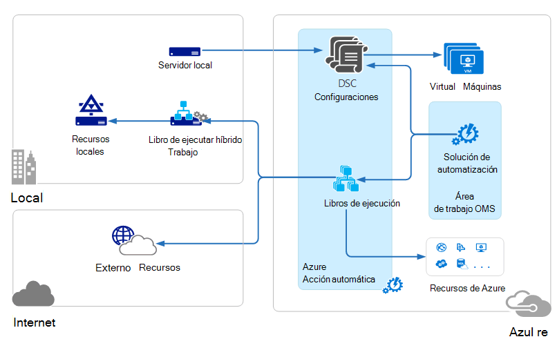

<properties 
   pageTitle="Arquitectura de conjunto de aplicaciones de administración (OMS) operaciones | Microsoft Azure"
   description="Suite de administración de operaciones de Microsoft (OMS) es basado en la nube administración solución de Microsoft que le ayuda a administrar y proteger su local y la infraestructura de nube.  En este artículo se identifica los distintos servicios que se incluyen en OMS y se proporciona vínculos a su contenido detallada."
   services="operations-management-suite"
   documentationCenter=""
   authors="bwren"
   manager="jwhit"
   editor="tysonn" />
<tags 
   ms.service="operations-management-suite"
   ms.devlang="na"
   ms.topic="get-started-article"
   ms.tgt_pltfrm="na"
   ms.workload="infrastructure-services"
   ms.date="10/27/2016"
   ms.author="bwren" />

# Arquitectura OMS

[Conjunto de aplicaciones de administración de operaciones (OMS)](https://azure.microsoft.com/documentation/services/operations-management-suite/) es una colección de servicios basados en la nube para administrar su local y la nube entornos.  Este artículo describe los componentes de nube de OMS y su arquitectura informática en nube de nivel alto y local diferente.  Puede consultar la documentación para cada servicio para obtener más detalles.

## Análisis de registro

Todos los datos recopilados por [El análisis de registro](https://azure.microsoft.com/documentation/services/log-analytics/) se almacena en el repositorio OMS que se hospeda en Azure.  Orígenes conectados generan los datos recopilados en el repositorio OMS.  Hay tres tipos de orígenes conectados compatibles.

- Un agente instalado en un equipo [Windows](../log-analytics/log-analytics-windows-agents.md) o [Linux](../log-analytics/log-analytics-linux-agents.md) conectado directamente a OMS.
- Un sistema Center Operations Manager (SCOM) administración grupo [conectado al análisis de registro](../log-analytics/log-analytics-om-agents.md) .  Agentes SCOM continuarán para comunicarse con los servidores de administración que reenvían eventos y datos de rendimiento para el análisis de registro.
- Una [cuenta de almacenamiento de Azure](../log-analytics/log-analytics-azure-storage.md) que recopila datos de [Azure diagnósticos](../cloud-services/cloud-services-dotnet-diagnostics.md) de una función de trabajador, función web o máquina virtual en Azure.

Orígenes de datos definen los datos que recopila de análisis de registro de orígenes conectados, incluidos los registros de eventos y contadores de rendimiento.  Agregan funcionalidad a OMS y fácilmente se pueden agregar al área de trabajo desde la [Galería de soluciones de OMS](../log-analytics/log-analytics-add-solutions.md)soluciones.  Algunas soluciones pueden requerir una conexión directa a análisis de registro de agentes SCOM mientras otros puede que requieran un agente adicional para instalarse.

Análisis de registro tiene un portal basada en web que puede usar para administrar los recursos OMS, agregar y configurar soluciones OMS y ver y analizar datos en el repositorio OMS.

## Automatización de Azure

[Automatización de Azure runbooks](http://azure.microsoft.com/documentation/services/automation) se ejecutan en la nube de Azure y puede tener acceso a los recursos que se encuentran en Azure en otros servicios de nube o accesible desde Internet.  También puede designar equipos locales en el centro de datos locales con [Híbrido Runbook trabajo](../automation/automation-hybrid-runbook-worker.md) para que runbooks puede tener acceso a los recursos locales.

[Configuraciones de DSC](../automation/automation-dsc-overview.md) almacenados en Azure automatización se puede aplicar directamente a máquinas virtuales de Windows Azure.  Otros físicos y máquinas virtuales puede solicitar configuraciones desde el servidor de extracción DSC de automatización de Azure.

Automatización de Azure tiene una solución OMS que muestra las estadísticas y vínculos para iniciar el portal de Azure en todas las operaciones.

## Copia de seguridad de Azure

Datos protegidos en [Copia de seguridad de Azure](http://azure.microsoft.com/documentation/services/backup) se almacenan en un depósito copia de seguridad que se encuentra en una región geográfica en particular.  Los datos se duplica en la misma región y, según el tipo de cámara, pueden también se pueden replicar en otra región más redundancia.

Copia de seguridad de Azure tiene tres escenarios fundamentales.

- Equipo de Windows con el agente de copia de seguridad de Azure.  Esto le permite copiar archivos y carpetas desde cualquier Windows server o cliente directamente a su cámara de copia de seguridad de Azure.  
- Administrador de protección de datos de System Center (DPM) o servidor de copia de seguridad de Microsoft Azure. Esto le permite aprovechar DPM o servidor de copia de seguridad de Microsoft Azure para copia de seguridad de archivos y carpetas, además de cargas de trabajo de aplicaciones, como SQL y SharePoint al almacenamiento local y, a continuación, replicar a su depósito de copia de seguridad de Azure.
- Extensiones de Azure Máquina Virtual.  Esto le permite hacer copia de seguridad de Azure máquinas virtuales a su depósito de copia de seguridad de Azure.

Copia de seguridad de Azure tiene una solución OMS que muestra las estadísticas y vínculos para iniciar el portal de Azure en todas las operaciones.

## Recuperación de sitio de Azure

[Recuperación de sitio de Azure](http://azure.microsoft.com/documentation/services/site-recovery) organiza replicación, migración tras error y recuperación de máquinas virtuales y servidores físicos. Datos de replicación se ha intercambiado entre hosts Hyper-V, hipervisores de VMware y servidores físicos en centros de datos principales y secundarias, o entre el centro de datos y el almacenamiento de Azure.  Recuperación de sitios almacena los metadatos en depósitos que se encuentra en una región geográfica en Azure especial. No hay datos duplicados se almacenan en el servicio de recuperación de sitios.

Recuperación de sitio de Azure tiene tres escenarios de replicación fundamentales.

**Replicación de máquinas virtuales Hyper-V**
- Si administra máquinas virtuales Hyper-V en nubes VMM, puede replicar a un centro de datos secundario o para el almacenamiento de Azure.  Replicación a Azure es mediante una conexión de internet segura.  Replicación a un centro de datos secundario es sobre la LAN.
- Si no se administra máquinas virtuales Hyper-V VMM, puede replicar en solo almacenamiento de Azure.  Replicación a Azure es mediante una conexión de internet segura.
 
**Replicación de máquinas virtuales VMWare**
- Puede replicar máquinas virtuales VMware a un centro de datos secundario ejecuta VMware o con el almacenamiento de Azure.  Replicación de Azure puede ocurrir por una VPN de sitio a sitio o de Azure ExpressRoute o a través de una conexión de Internet segura. Se produce la replicación a un centro de datos secundario sobre el canal de datos de InMage Scout.
 
**Replicación de los servidores de Windows y Linux físicos** 
- Puede replicar servidores físicos a un centro de datos secundario o para el almacenamiento de Azure. Replicación de Azure puede ocurrir por una VPN de sitio a sitio o de Azure ExpressRoute o a través de una conexión de Internet segura. Se produce la replicación a un centro de datos secundario sobre el canal de datos de InMage Scout.  Recuperación de sitio de Azure tiene una solución OMS que muestra algunas estadísticas, pero debe usar el portal de Azure en todas las operaciones.

## Pasos siguientes

- Obtenga información sobre [el análisis de registro](http://azure.microsoft.com/documentation/services/log-analytics).
- Obtenga información sobre la [automatización de Azure](https://azure.microsoft.com/documentation/services/automation).
- Obtenga información sobre la [copia de seguridad de Azure](http://azure.microsoft.com/documentation/services/backup).
- Obtenga información sobre la [recuperación de sitio de Azure](http://azure.microsoft.com/documentation/services/site-recovery).
